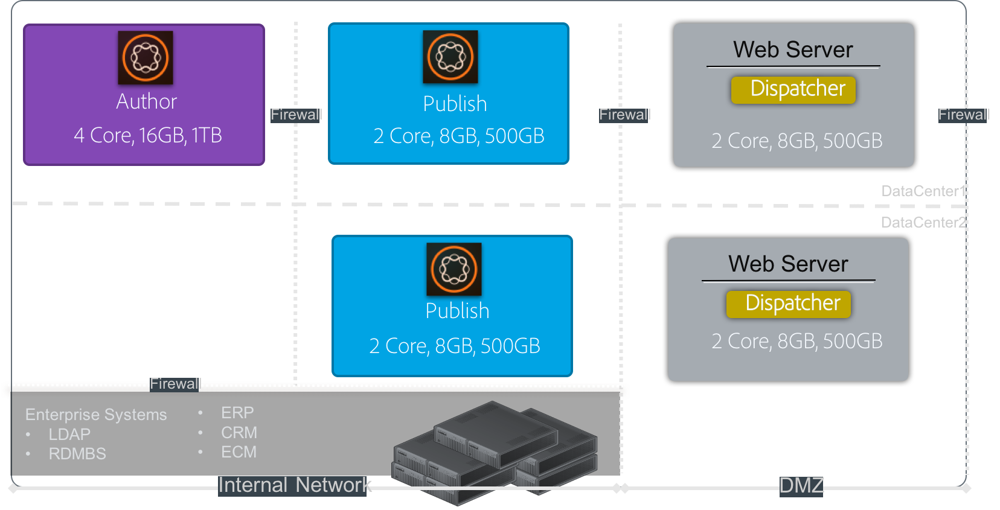
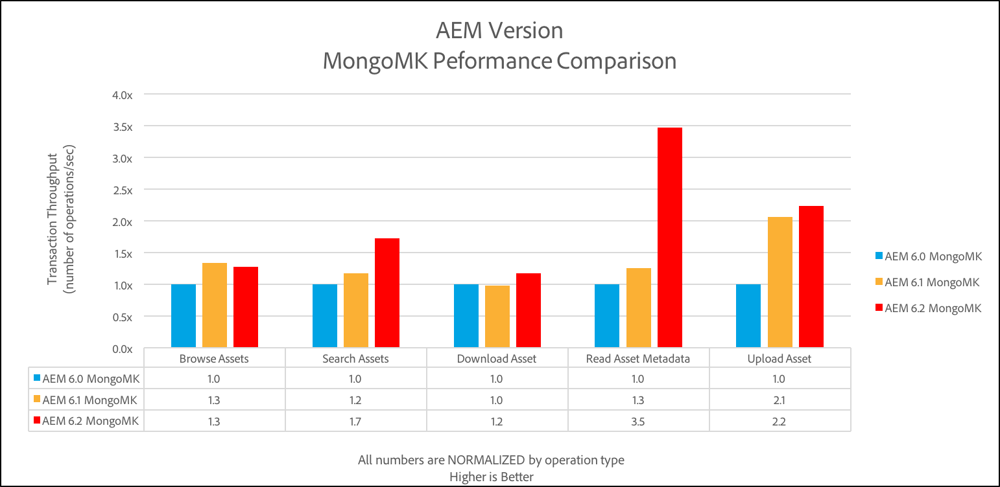
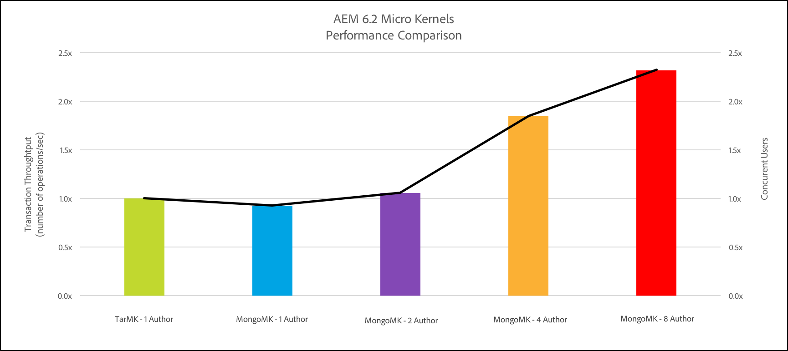

# 效能准則{#performance-guidelines}

此頁面提供如何最佳化AEM部署效能的一般准則。 如果您是AEM的新手，請先檢閱下列頁面，再開始閱讀效能准則：

* [AEM基本概念](/help/sites-deploying/deploy.md#basic-concepts)
* [AEM儲存空間概覽](/help/sites-deploying/storage-elements-in-aem-6.md#overview-of-storage-in-aem)
* [建議的部署](/help/sites-deploying/recommended-deploys.md)
* [技術需求](/help/sites-deploying/technical-requirements.md)

下圖說明適用於AEM的部署選項（捲動以檢視所有選項）：

<table>
 <tbody>
  <tr>
   <td>
<strong>AEM</strong>
 
<strong>產品</strong>
 </td>
   <td>
<strong>拓撲</strong>
 </td>
   <td>
<strong>作業系統</strong>
 </td>
   <td>
<strong>應用程式伺服器</strong>
 </td>
   <td>
<strong>JRE</strong>
 </td>
   <td>
<strong>安全性</strong>
 </td>
   <td>
<strong>微核心</strong>
 </td>
   <td>
<strong>資料存放區</strong>
 </td>
   <td>
<strong>建立索引</strong>
 </td>
   <td>
<strong>網頁伺服器</strong>
 </td>
   <td>
<strong>瀏覽器</strong>
 </td>
   <td>
<strong>Experience Cloud</strong>
 </td>
  </tr>
  <tr>
   <td>
Sites
 </td>
   <td>
非HA
 </td>
   <td>
Windows
 </td>
   <td>
CQSE
 </td>
   <td>
oracle
 </td>
   <td>
LDAP
 </td>
   <td>
Tar
 </td>
   <td>
區段
 </td>
   <td>
屬性
 </td>
   <td>
Apache
 </td>
   <td>
Edge
 </td>
   <td>
目標
 </td>
  </tr>
  <tr>
   <td>
Assets
 </td>
   <td>
Publish-HA
 </td>
   <td>
Solaris™
 </td>
   <td>
WebLogic
 </td>
   <td>
IBM®
 </td>
   <td>
SAML
 </td>
   <td>
MongoDB
 </td>
   <td>
檔案
 </td>
   <td>
Lucene
 </td>
   <td>
IIS
 </td>
   <td>
IE
 </td>
   <td>
分析
 </td>
  </tr>
  <tr>
   <td>
社群
 </td>
   <td>
Author-CS
 </td>
   <td>
Red Hat®
 </td>
   <td>
WebSphere®
 </td>
   <td>
HP
 </td>
   <td>
Oauth
 </td>
   <td>
RDB/Oracle
 </td>
   <td>
S3/Azure
 </td>
   <td>
Solr
 </td>
   <td>
iPlanet
 </td>
   <td>
FireFox
 </td>
   <td>
行銷活動
 </td>
  </tr>
  <tr>
   <td>
表單
 </td>
   <td>
Author-Offload
 </td>
   <td>
HP-UX
 </td>
   <td>
Tomcat
 </td>
   <td>
 
 </td>
   <td>
 
 </td>
   <td>
RDB/DB2
 </td>
   <td>
MongoDB
 </td>
   <td>
 
 </td>
   <td>
 
 </td>
   <td>
鉻黃
 </td>
   <td>
Social
 </td>
  </tr>
  <tr>
   <td>
行動
 </td>
   <td>
作者 — 叢集
 </td>
   <td>
IBM® AIX®
 </td>
   <td>
JBoss®
 </td>
   <td>
 
 </td>
   <td>
 
 </td>
   <td>
RDB/MySQL
 </td>
   <td>
RDBMS
 </td>
   <td>
 
 </td>
   <td>
 
 </td>
   <td>
Safari
 </td>
   <td>
對象
 </td>
  </tr>
  <tr>
   <td>
多網站
 </td>
   <td>
ASRP
 </td>
   <td>
SUSE®
 </td>
   <td>
 
 </td>
   <td>
 
 </td>
   <td>
 
 </td>
   <td>
RDB/SQLServer
 </td>
   <td>
 
 </td>
   <td>
 
 </td>
   <td>
 
 </td>
   <td>
 
 </td>
   <td>
Assets
 </td>
  </tr>
  <tr>
   <td>
商務
 </td>
   <td>
MSRP
 </td>
   <td>
Apple作業系統
 </td>
   <td>
 
 </td>
   <td>
 
 </td>
   <td>
 
 </td>
   <td>
 
 </td>
   <td>
 
 </td>
   <td>
 
 </td>
   <td>
 
 </td>
   <td>
 
 </td>
   <td>
啟用
 </td>
  </tr>
  <tr>
   <td>
Dynamic Media
 </td>
   <td>
JSRP
 </td>
   <td>
 
 </td>
   <td>
 
 </td>
   <td>
 
 </td>
   <td>
 
 </td>
   <td>
 
 </td>
   <td>
 
 </td>
   <td>
 
 </td>
   <td>
 
 </td>
   <td>
 
 </td>
   <td>
行動
 </td>
  </tr>
  <tr>
   <td>
Brand Portal
 </td>
   <td>
J2E
 </td>
   <td>
 
 </td>
   <td>
 
 </td>
   <td>
 
 </td>
   <td>
 
 </td>
   <td>
 
 </td>
   <td>
 
 </td>
   <td>
 
 </td>
   <td>
 
 </td>
   <td>
 
 </td>
   <td>
 
 </td>
  </tr>
  <tr>
   <td>
AoD
 </td>
   <td>
 
 </td>
   <td>
 
 </td>
   <td>
 
 </td>
   <td>
 
 </td>
   <td>
 
 </td>
   <td>
 
 </td>
   <td>
 
 </td>
   <td>
 
 </td>
   <td>
 
 </td>
   <td>
 
 </td>
   <td>
 
 </td>
  </tr>
  <tr>
   <td>
LiveFyre
 </td>
   <td>
 
 </td>
   <td>
 
 </td>
   <td>
 
 </td>
   <td>
 
 </td>
   <td>
 
 </td>
   <td>
 
 </td>
   <td>
 
 </td>
   <td>
 
 </td>
   <td>
 
 </td>
   <td>
 
 </td>
   <td>
 
 </td>
  </tr>
  <tr>
   <td>
Screens
 </td>
   <td>
 
 </td>
   <td>
 
 </td>
   <td>
 
 </td>
   <td>
 
 </td>
   <td>
 
 </td>
   <td>
 
 </td>
   <td>
 
 </td>
   <td>
 
 </td>
   <td>
 
 </td>
   <td>
 
 </td>
   <td>
 
 </td>
  </tr>
  <tr>
   <td>
檔案安全性
 </td>
   <td>
 
 </td>
   <td>
 
 </td>
   <td>
 
 </td>
   <td>
 
 </td>
   <td>
 
 </td>
   <td>
 
 </td>
   <td>
 
 </td>
   <td>
 
 </td>
   <td>
 
 </td>
   <td>
 
 </td>
   <td>
 
 </td>
  </tr>
  <tr>
   <td>
程式管理
 </td>
   <td>
 
 </td>
   <td>
 
 </td>
   <td>
 
 </td>
   <td>
 
 </td>
   <td>
 
 </td>
   <td>
 
 </td>
   <td>
 
 </td>
   <td>
 
 </td>
   <td>
 
 </td>
   <td>
 
 </td>
   <td>
 
 </td>
  </tr>
  <tr>
   <td>
案頭應用程式
 </td>
   <td>
 
 </td>
   <td>
 
 </td>
   <td>
 
 </td>
   <td>
 
 </td>
   <td>
 
 </td>
   <td>
 
 </td>
   <td>
 
 </td>
   <td>
 
 </td>
   <td>
 
 </td>
   <td>
 
 </td>
   <td>
 
 </td>
  </tr>
 </tbody>
</table>

>[!NOTE]
>
>效能指引主要適用於AEM Sites。

## 何時使用效能指南 {#when-to-use-the-performance-guidelines}

請在下列情況下使用效能准則：

* **首次部署**：在計畫首次部署AEM Sites或Assets時，請務必瞭解可用的選項。 尤其是在設定Micro Kernel、Node Store和Data Store時（與預設設定相比）。 例如，將TarMK的「資料存放區」預設設定變更為「檔案資料存放區」。
* **升級至新版本**：升級至新版本時，請務必瞭解相較於執行中環境的效能差異。 例如，從AEM 6.1升級至6.2，或從AEM 6.0 CRX2升級至6.2 OAK。
* **回應時間緩慢**：當選取的節點存放區架構不符合您的需求時，請務必瞭解與其他拓撲選項相比的效能差異。 例如，部署TarMK而非MongoMK，或使用檔案資料存放區而非Amazon S3或Microsoft® Azure資料存放區。
* **新增更多作者**：當建議的TarMK拓撲不符合效能需求，且放大製作節點的大小已達到可用的最大容量時，請瞭解效能差異。 請和使用MongoMK搭配三個或更多作者節點比較。 例如，部署MongoMK而非TarMK。
* **新增更多內容**：當建議的資料存放區架構不符合您的需求時，請務必瞭解與其他資料存放區選項相比的效能差異。 範例：使用Amazon S3或Microsoft® Azure資料存放區，而非檔案資料存放區。

## 簡介 {#introduction}

本章概述AEM架構及其最重要的元件。 它還提供開發准則，並說明TarMK和MongoMK基準測試中使用的測試情境。

### AEM平台 {#the-aem-platform}

AEM平台包含下列元件：

如需AEM平台的詳細資訊，請參閱 [什麼是AEM](/help/sites-deploying/deploy.md#what-is-aem).

### AEM架構 {#the-aem-architecture}

AEM部署有三個重要的建置組塊。 此 **作者例項** 內容作者、編輯者和核准者用來建立和檢閱內容。 內容獲得核准後，會發佈至名為的第二個例項型別。 **發佈執行個體** 一般使用者從何處存取它。 第三個建置區塊是 **Dispatcher** 此模組會處理快取和URL篩選，並安裝在網頁伺服器上。 如需AEM架構的其他資訊，請參閱 [典型部署案例](/help/sites-deploying/deploy.md#typical-deployment-scenarios).

### 微核心 {#micro-kernels}

微核心在AEM中作為持續性管理員。 AEM使用的微核心有三種型別：TarMK、MongoDB和關聯式資料庫（受限制支援）。 選擇適合您需求的部署型別，取決於執行個體的用途以及您考慮的部署型別。 如需關於微核心的其他資訊，請參閱 [建議的部署](/help/sites-deploying/recommended-deploys.md) 頁面。

### 節點存放區 {#nodestore}

在AEM中，二進位資料可與內容節點分開儲存。 儲存二進位資料的位置稱為 **資料存放區**，而內容節點和屬性的位置稱為 **節點存放區**.

>[!NOTE]
>
>Adobe建議TarMK是客戶用於AEM作者和發佈執行個體的預設持續性技術。

>[!CAUTION]
>
>關聯式資料庫微核心受到限制支援。 連絡人 [Adobe客戶服務](https://experienceleague.adobe.com/?support-solution=General&amp;support-tab=home#support) 使用這種型別的微核心之前。

### 資料存放區 {#data-store}

在處理大量二進位檔時，建議您使用外部資料存放區，而非預設節點存放區，以發揮最大效能。 例如，如果您的專案需要許多媒體資產，將它們儲存在File或Azure/S3 Data Store底下，可讓您以比直接儲存在MongoDB中更快的速度存取它們。

如需有關可用組態選項的詳細資訊，請參閱 [設定節點和資料存放區](/help/sites-deploying/data-store-config.md).

>[!NOTE]
>
>Adobe建議您選擇使用AdobeManaged Services在Azure或Amazon Web Services (AWS)上部署AEM的選項。 客戶受益於擁有在這些雲端運算環境中部署和操作AEM的經驗和技能的團隊。 另請參閱 [有關AdobeManaged Services的其他檔案](https://business.adobe.com/products/experience-manager/managed-services.html?aemClk=t).
>
>如需如何在AdobeManaged Services以外的Azure或AWS上部署AEM的建議，Adobe建議直接與雲端提供者合作。 或者，您也可以與支援在您所選雲端環境中部署AEM的Adobe合作夥伴合作。 選取的雲端服務供應商或合作夥伴負責其支援的架構調整規格、設計和實作，以符合您的特定效能、負載、擴充性和安全性需求。
>
>>另請參閱 [技術需求](/help/sites-deploying/technical-requirements.md#supported-platforms) 頁面。

### 搜尋 {#search-features}

本節所列為搭配AEM使用的自訂索引提供者。 若要進一步瞭解索引，請參閱 [Oak查詢和索引](/help/sites-deploying/queries-and-indexing.md).

>[!NOTE]
>
>對於大多數部署，Adobe建議使用Lucene索引。 在專業且複雜的部署中，僅使用Solr進行擴充性。

### 開發指導方針 {#development-guidelines}

針對AEM目標開發 **效能與擴充性**. 以下是您可以遵循的最佳實務：

**DO**

* 套用簡報、邏輯和內容的分離
* 使用現有的AEM API （例如：Sling）和工具（例如：復寫）
* 在實際內容的內容中開發
* 為最佳快取能力而開發
* 將儲存次數減至最少（例如：使用暫時性工作流程）
* 請確定所有HTTP端點均為RESTful
* 限制JCR觀察的範圍
* 留意非同步執行緒

**不要**

* 如果可以，請勿直接使用JCR API
* 請勿變更/libs，而是使用覆蓋
* 儘量不要使用查詢
* 請勿使用Sling Bindings來取得Java™程式碼中的OSGi服務，而是使用：

   * DS元件中的@Reference
   * 在Sling模型中@Inject立
   * Sightly Use類別中的sling.getService()
   * JSP中的sling.getService()
   * ServiceTracker
   * 直接存取OSGi服務登入

如需有關在AEM上開發的詳細資訊，請閱讀 [開發 — 基本知識](/help/sites-developing/the-basics.md). 如需其他最佳實務，請參閱 [開發最佳實務](/help/sites-developing/best-practices.md).

### 基準案例 {#benchmark-scenarios}

>[!NOTE]
>
>此頁面上顯示的所有基準測試已在實驗室設定中執行。

以下詳述的測試場景用於TarMK、MongoMk和TarMK與MongoMk章節的基準區段。 若要檢視特定基準測試使用了哪個案例，請從以下位置閱讀案例欄位： [技術規格](/help/sites-deploying/performance-guidelines.md#tarmk-performance-benchmark) 表格。

**單一產品情境**

AEM Assets：

* 使用者互動：瀏覽資產/搜尋資產/下載資產/讀取資產中繼資料/更新資產中繼資料/上傳資產/執行上傳資產工作流程
* 執行模式：同時存在的使用者，每個使用者的單一互動

**混合產品案例**

AEM Sites +資產：

* 網站使用者互動：讀取文章頁面/讀取頁面/建立段落/編輯段落/建立內容頁面/啟動內容頁面/作者搜尋
* 資產使用者互動：瀏覽資產/搜尋資產/下載資產/讀取資產中繼資料/更新資產中繼資料/上傳資產/執行上傳資產工作流程
* 執行模式：並行使用者，每個使用者的混合互動

**垂直使用案例情境**

媒體：

* `Read Article Page (27.4%), Read Page (10.9%), Create Session (2.6%), Activate Content Page (1.7%), Create Content Page (0.4%), Create Paragraph (4.3%), Edit Paragraph (0.9%), Image Component (0.9%), Browse Assets (20%), Read Asset Metadata (8.5%), Download Asset (4.2%), Search Asset (0.2%), Update Asset Metadata (2.4%), Upload Asset (1.2%), Browse Project (4.9%), Read Project (6.6%), Project Add Asset (1.2%), Project Add Site (1.2%), Create Project (0.1%), Author Search (0.4%)`
* 執行模式：並行使用者，每個使用者的混合互動

## tarmk {#tarmk}

本章提供TarMK的一般效能准則，指定最低架構需求和設定組態。 此外，也提供基準測試，以進一步釐清事實。

Adobe建議將TarMK設為客戶在所有部署案例中使用的預設持續性技術，適用於AEM製作和發佈執行個體。

如需TarMK的詳細資訊，請參閱 [部署案例](/help/sites-deploying/recommended-deploys.md#deployment-scenarios) 和 [Tar儲存](/help/sites-deploying/storage-elements-in-aem-6.md#tar-storage).

### TarMK最低架構指導方針 {#tarmk-minimum-architecture-guidelines}

>[!NOTE]
>
>以下是最低架構指引，適用於生產環境和高流量網站。 這些准則為 **非** 此 [最低規格](/help/sites-deploying/technical-requirements.md#prerequisites) 以執行AEM。

若要在使用TarMK時建立良好的效能，您應該從下列架構開始：

* 一個作者執行個體
* 兩個發佈執行個體
* 兩個Dispatcher

以下說明AEM sites和AEM Assets的架構指導方針。

>[!NOTE]
>
>應該開啟無二進位檔的復寫 **開啟** 如果檔案資料存放區已共用。

**AEM Sites的Tar架構指導方針**

**AEM Assets的Tar架構指導方針**

### TarMK設定指引 {#tarmk-settings-guideline}

為了獲得良好的效能，您應該遵循以下提供的設定准則。 如需如何變更設定的說明， [請參閱此頁面](https://experienceleague.adobe.com/docs/experience-manager-65/deploying/configuring/configuring-performance.html).

<table>
 <tbody>
  <tr>
   <td><strong>設定</strong></td>
   <td><strong>參數</strong></td>
   <td><strong>值</strong></td>
   <td><strong>說明</strong></td>
  </tr>
  <tr>
   <td>Sling工作佇列</td>
   <td><code>queue.maxparallel</code></td>
   <td>將值設定為CPU核心數目的一半。 </td>
   <td>依預設，每個工作佇列的並行執行緒數目等於CPU核心數目。</td>
  </tr>
  <tr>
   <td>Granite暫時工作流程佇列</td>
   <td><code>Max Parallel</code></td>
   <td>將值設定為CPU核心數目的一半</td>
   <td> </td>
  </tr>
  <tr>
   <td>JVM引數</td>
   <td>
<code>Doak.queryLimitInMemory</code>
 
<code>Doak.queryLimitReads</code>
 
<code>Dupdate.limit</code>
 
<code>Doak.fastQuerySize</code>
 </td>
   <td>
500000
 
100000
 
250000
 
真
 </td>
   <td>若要防止擴充查詢讓系統過載，請在AEM啟動指令碼中新增這些JVM引數。</td>
  </tr>
  <tr>
   <td>Lucene索引設定</td>
   <td>
<code>CopyOnRead</code>
 
<code>CopyOnWrite</code>
 
<code>Prefetch Index Files</code>
 </td>
   <td>
已啟用
 
已啟用
 
已啟用
 </td>
   <td>如需可用引數的詳細資訊，請參閱 <a href="https://jackrabbit.apache.org/oak/docs/query/lucene.html">此頁面</a>.</td>
  </tr>
  <tr>
   <td>資料存放區= S3資料存放區</td>
   <td>
<code>maxCachedBinarySize</code>
 
<code>cacheSizeInMB</code>
 </td>
   <td>
1048576 (1 MB)或以下
 
最大棧積大小的2-10%
 </td>
   <td>另請參閱 <a href="/help/sites-deploying/data-store-config.md#data-store-configurations">資料存放區設定</a>.</td>
  </tr>
  <tr>
   <td>DAM更新資產工作流程</td>
   <td><code>Transient Workflow</code></td>
   <td>已核取</td>
   <td>此工作流程管理資產的更新。</td>
  </tr>
  <tr>
   <td>DAM中繼資料回寫</td>
   <td><code>Transient Workflow</code></td>
   <td>已核取</td>
   <td>此工作流程會管理XMP對原始二進位的回寫，並設定JCR中的上次修改日期。</td>
  </tr>
 </tbody>
</table>

### TarMK效能基準 {#tarmk-performance-benchmark}

#### 技術規格 {#technical-specifications}

效能標竿測試是依據下列規格執行：

| | **作者節點** |
|---|---|
| 伺服器 | 裸機硬體(HP) |
| 作業系統 | Red Hat® Linux® |
| CPU /核心 | Intel(R) Xeon(R) CPU E5-2407 @2.40GHz，8核心 |
| RAM | 32 GB |
| 磁碟 | 磁性 |
| Java™ | oracleJRE版本8 |
| JVM棧積 | 16 GB |
| 產品 | AEM 6.2 |
| 節點存放區 | tarmk |
| 資料存放區 | 檔案DS |
| 情境 | 單一產品：資產/ 30個同時執行緒 |

#### 效能標竿結果 {#performance-benchmark-results}

>[!NOTE]
>
>以下顯示的數字已標準化為1作為基準，並非實際輸送量數字。

 

## MongoMk {#mongomk}

選擇MongoMK持續性後端而非TarMK的主要原因是要水平縮放執行個體。 這項能力表示擁有兩個或多個始終執行中的作用中製作執行個體，並使用MongoDB做為持續性儲存系統。 通常需要執行多個製作執行個體，是因為單一伺服器的CPU和記憶體容量（支援所有並行製作活動）已無法持續。

如需TarMK的詳細資訊，請參閱 [部署案例](/help/sites-deploying/recommended-deploys.md#deployment-scenarios) 和 [Mongo儲存](/help/sites-deploying/storage-elements-in-aem-6.md#mongo-storage).

### MongoMK最低架構指導方針 {#mongomk-minimum-architecture-guidelines}

若要在使用MongoMK時建立良好的效能，您應該從下列架構開始：

* 三個作者執行個體
* 兩個發佈執行個體
* 三個MongoDB執行個體
* 兩個Dispatcher

>[!NOTE]
>
>在生產環境中，MongoDB一律會作為具有主要和兩個次要的復本集使用。 讀取和寫入會移至主要位置，而讀取會移至次要位置。 如果無法使用儲存體，可以使用仲裁器來取代其中一個次要的，但MongoDB復本集必須一律由奇數例項組成。

>[!NOTE]
>
>應該開啟無二進位檔的復寫 **開啟** 如果檔案資料存放區已共用。

### MongoMK設定指南 {#mongomk-settings-guidelines}

為了獲得良好的效能，您應該遵循以下提供的設定准則。 如需如何變更設定的說明， [請參閱此頁面](https://experienceleague.adobe.com/docs/experience-manager-65/deploying/configuring/configuring-performance.html).

<table>
 <tbody>
  <tr>
   <td><strong>設定</strong></td>
   <td><strong>參數</strong></td>
   <td><strong>值（預設）</strong></td>
   <td><strong>說明</strong></td>
  </tr>
  <tr>
   <td>Sling工作佇列</td>
   <td><code>queue.maxparallel</code></td>
   <td>將值設定為CPU核心數目的一半。 </td>
   <td>依預設，每個工作佇列的並行執行緒數目等於CPU核心數目。</td>
  </tr>
  <tr>
   <td>Granite暫時工作流程佇列</td>
   <td><code>Max Parallel</code></td>
   <td>將值設定為CPU核心數目的一半。</td>
   <td> </td>
  </tr>
  <tr>
   <td>JVM引數</td>
   <td>
<code>Doak.queryLimitInMemory</code>
 
<code>Doak.queryLimitReads</code>
 
<code>Dupdate.limit</code>
 
<code>Doak.fastQuerySize</code>
 
<code>Doak.mongo.maxQueryTimeMS</code>
 </td>
   <td>
500000
 
100000
 
250000
 
真
 
60000
 </td>
   <td>若要防止擴充查詢讓系統過載，請在AEM啟動指令碼中新增這些JVM引數。</td>
  </tr>
  <tr>
   <td>Lucene索引設定</td>
   <td>
<code>CopyOnRead</code>
 
<code>CopyOnWrite</code>
 
<code>Prefetch Index Files</code>
 </td>
   <td>
已啟用
 
已啟用
 
已啟用
 </td>
   <td>如需可用引數的詳細資訊，請參閱 <a href="https://jackrabbit.apache.org/oak/docs/query/lucene.html">此頁面</a>.</td>
  </tr>
  <tr>
   <td>資料存放區= S3資料存放區</td>
   <td>
<code>maxCachedBinarySize</code>
 
<code>cacheSizeInMB</code>
 </td>
   <td>
1048576 (1 MB)或以下
 
最大棧積大小的2-10%
 </td>
   <td>另請參閱 <a href="/help/sites-deploying/data-store-config.md#data-store-configurations">資料存放區設定</a>.</td>
  </tr>
  <tr>
   <td>DocumentNodeStoreService</td>
   <td>
<code>cache</code>
 
<code>nodeCachePercentage</code>
 
<code>childrenCachePercentage</code>
 
<code>diffCachePercentage</code>
 
<code>docChildrenCachePercentage</code>
 
<code>prevDocCachePercentage</code>
 
<code>persistentCache</code>
 </td>
   <td>
2048
 
35 (25)
 
20 (10)
 
30 (5)
 
10 (3)
 
4 (4)
 
./cache，size=2048，二進位=0，-compact，-compress
 </td>
   <td>
快取的預設大小設定為256 MB。
 
會影響執行快取失效所需的時間。
 </td>
  </tr>
  <tr>
   <td>oak-observation</td>
   <td>
<code>thread pool</code>
 
<code>length</code>
 </td>
   <td>
最小與最大= 20
 
50000
 </td>
   <td> </td>
  </tr>
 </tbody>
</table>

### MongoMK效能基準 {#mongomk-performance-benchmark}

### 技術規格 {#technical-specifications-1}

效能標竿測試是依據下列規格執行：

| | **作者節點** | **MongoDB節點** |
|---|---|---|
| 伺服器 | 裸機硬體(HP) | 裸機硬體(HP) |
| 作業系統 | Red Hat® Linux® | Red Hat® Linux® |
| CPU /核心 | Intel(R) Xeon(R) CPU E5-2407 @2.40GHz，8核心 | Intel(R) Xeon(R) CPU E5-2407 @2.40GHz，8核心 |
| RAM | 32 GB | 32 GB |
| 磁碟 | 磁性 — >1k IOPS | 磁性 — >1k IOPS |
| Java™ | oracleJRE版本8 | 不適用 |
| JVM棧積 | 16 GB | 不適用 |
| 產品 | AEM 6.2 | MongoDB 3.2 WiredTiger |
| 節點存放區 | MongoMk | 不適用 |
| 資料存放區 | 檔案DS | 不適用 |
| 情境 | 單一產品：資產/ 30個同時執行緒 | 單一產品：資產/ 30個同時執行緒 |

### 效能標竿結果 {#performance-benchmark-results-1}

>[!NOTE]
>
>以下顯示的數字已標準化為1作為基準，並非實際輸送量數字。

 

## TarMK與MongoMK {#tarmk-vs-mongomk}

在兩者之間進行選擇時，要考慮的基本規則是，TarMK是針對效能而設計，而MongoMK則是用於擴充性。 Adobe建議將TarMK設為客戶在所有部署案例中使用的預設持續性技術，適用於AEM製作和發佈執行個體。

選擇MongoMK持續性後端而非TarMK的主要原因是要水平縮放執行個體。 此功能表示需永遠執行兩個或多個作用中的製作執行個體，並使用MongoDB做為持續性儲存系統。 通常需要執行多個製作執行個體，是因為單一伺服器的CPU和記憶體容量（支援所有並行製作活動）已無法持續。

如需TarMK與MongoMK的詳細資訊，請參閱 [建議的部署](/help/sites-deploying/recommended-deploys.md#microkernels-which-one-to-use).

### TarMK與MongoMk指南 {#tarmk-vs-mongomk-guidelines}

**TarMK的優點**

* 專門為內容管理應用程式建置
* 檔案始終保持一致，可以使用任何檔案式備份工具進行備份
* 提供容錯移轉機制 — 請參閱 [冷待命](/help/sites-deploying/tarmk-cold-standby.md) 以取得更多詳細資料
* 以最低的營運開銷提供高效能和可靠的資料儲存
* 降低總體擁有成本（總體擁有成本）

**選擇MongoMK的條件**

* 一天內連線的已命名使用者數目（以千或以上為單位）
* 同時使用者人數：以數百或更多計
* 每日資產擷取量：數十萬或以上
* 每日頁面編輯量：數十萬或以上
* 每日搜尋量：以萬或以上為單位

### TarMK與MongoMK效能標竿 {#tarmk-vs-mongomk-benchmarks}

>[!NOTE]
>
>以下顯示的數字已標準化為1作為基準，並非實際的輸送量數字。

### 案例1技術規格 {#scenario-technical-specifications}

<table>
 <tbody>
  <tr>
   <td><strong> </strong></td>
   <td><strong>作者OAK節點</strong></td>
   <td><strong>MongoDB節點</strong></td>
   <td> </td>
  </tr>
  <tr>
   <td>伺服器</td>
   <td>裸機硬體(HP)</td>
   <td>裸機硬體(HP)</td>
   <td> </td>
  </tr>
  <tr>
   <td>作業系統</td>
   <td>Red Hat® Linux®</td>
   <td>Red Hat® Linux®</td>
   <td> </td>
  </tr>
  <tr>
   <td>CPU /核心</td>
   <td>Intel(R) Xeon(R) CPU E5-2407 @2.40GHz，8核心</td>
   <td>Intel(R) Xeon(R) CPU E5-2407 @2.40GHz，8核心</td>
   <td> </td>
  </tr>
  <tr>
   <td>RAM</td>
   <td>32 GB</td>
   <td>32 GB</td>
   <td> </td>
  </tr>
  <tr>
   <td>磁碟</td>
   <td>磁性 — &gt;1k IOPS</td>
   <td>磁性 — &gt;1k IOPS</td>
   <td> </td>
  </tr>
  <tr>
   <td>Java™</td>
   <td>oracleJRE版本8</td>
   <td>不適用</td>
   <td> </td>
  </tr>
  <tr>
   <td>JVM棧積16GB</td>
   <td>16 GB</td>
   <td>不適用</td>
   <td> </td>
  </tr>
  <tr>
   <td>產品 </td>
   <td>AEM 6.2</td>
   <td>MongoDB 3.2 WiredTiger</td>
   <td> </td>
  </tr>
  <tr>
   <td>節點存放區</td>
   <td>tarmk或MongoMK</td>
   <td>不適用</td>
   <td> </td>
  </tr>
  <tr>
   <td>資料存放區</td>
   <td>檔案DS </td>
   <td>不適用</td>
   <td> </td>
  </tr>
  <tr>
   <td>情境</td>
   <td>
  單一產品：資產/每次執行30個並行執行緒
 </td>
   <td> </td>
   <td> </td>
  </tr>
 </tbody>
</table>

### 案例1效能基準結果 {#scenario-performance-benchmark-results}

### 案例2技術規格 {#scenario-technical-specifications-1}

>[!NOTE]
>
>若要啟用與使用一個TarMK系統相同數量的MongoDB作者，您需要具有兩個AEM節點的叢集。 四個節點的MongoDB叢集可以處理一個TarMK執行個體數的1.8倍。 八個節點的MongoDB叢集可以處理一個TarMK執行個體數的2.3倍。

<table>
 <tbody>
  <tr>
   <td><strong> </strong></td>
   <td><strong>作者TarMK節點</strong></td>
   <td><strong>作者MongoMK節點</strong></td>
   <td><strong>MongoDB節點</strong></td>
  </tr>
  <tr>
   <td>伺服器</td>
   <td>AWS c3.8xlarge</td>
   <td>AWS c3.8xlarge</td>
   <td>AWS c3.8xlarge</td>
  </tr>
  <tr>
   <td>作業系統</td>
   <td>Red Hat® Linux®</td>
   <td>Red Hat® Linux®</td>
   <td>Red Hat® Linux®</td>
  </tr>
  <tr>
   <td>CPU /核心</td>
   <td>32</td>
   <td>32</td>
   <td>32</td>
  </tr>
  <tr>
   <td>RAM</td>
   <td>60 GB</td>
   <td>60 GB</td>
   <td>60 GB</td>
  </tr>
  <tr>
   <td>磁碟</td>
   <td>SSD - 10,000IOPS</td>
   <td>SSD - 10,000IOPS</td>
   <td>SSD - 10,000IOPS</td>
  </tr>
  <tr>
   <td>Java™</td>
   <td>oracleJRE版本8</td>
   <td>  oracleJRE版本8</td>
   <td>不適用</td>
  </tr>
  <tr>
   <td>JVM棧積16GB</td>
   <td>30 GB</td>
   <td>30 GB</td>
   <td>不適用</td>
  </tr>
  <tr>
   <td>產品 </td>
   <td>AEM 6.2</td>
   <td>AEM 6.2</td>
   <td>  MongoDB 3.2 WiredTiger</td>
  </tr>
  <tr>
   <td>節點存放區</td>
   <td>tarmk </td>
   <td>MongoMk</td>
   <td>  不適用</td>
  </tr>
  <tr>
   <td>資料存放區</td>
   <td>檔案DS </td>
   <td>  檔案DS</td>
   <td>  不適用</td>
  </tr>
  <tr>
   <td>情境</td>
   <td>
    垂直使用案例：媒體/ 2000個同時執行緒
 </td>
   <td></td>
   <td></td>
  </tr>
 </tbody>
</table>

### 案例2效能基準結果 {#scenario-performance-benchmark-results-1}

### AEM Sites和資產的架構擴充性方針 {#architecture-scalability-guidelines-for-aem-sites-and-assets}

## 效能准則摘要  {#summary-of-performance-guidelines}

此頁面上呈現的准則可歸納如下：

* **含有檔案資料存放區的TarMK**  — 建議大部分客戶使用的架構：

   * 最小拓撲：一個製作執行個體、兩個發佈執行個體、兩個Dispatcher
   * 如果檔案資料存放區已共用，會開啟無二進位檔復寫

* **具有檔案資料存放區的MongoMK**  — 建議用於製作層級水準擴充性的架構：

   * 最小拓撲：三個作者執行個體、三個MongoDB執行個體、兩個發佈執行個體、兩個Dispatcher
   * 如果檔案資料存放區已共用，會開啟無二進位檔復寫

* **節點存放區**  — 儲存在本機磁碟上，而非網路附加儲存裝置(NAS)
* 使用時 **Amazon S3**：

   * Amazon S3資料存放區會在製作和發佈層級之間共用
   * 必須開啟無二進位檔復寫
   * 資料存放區記憶體回收需要先在所有Author和Publish節點上執行，然後在作者上執行第二次

* **除了現成可用的索引之外，也應建立自訂索引**  — 根據最常見的搜尋

   * Lucene索引應用於自訂索引

* **自訂工作流程可大幅改善效能**  — 移除「更新資產」工作流程中的視訊步驟、停用未使用的接聽程式等。

如需詳細資訊，請閱讀 [建議的部署](/help/sites-deploying/recommended-deploys.md) 頁面。
