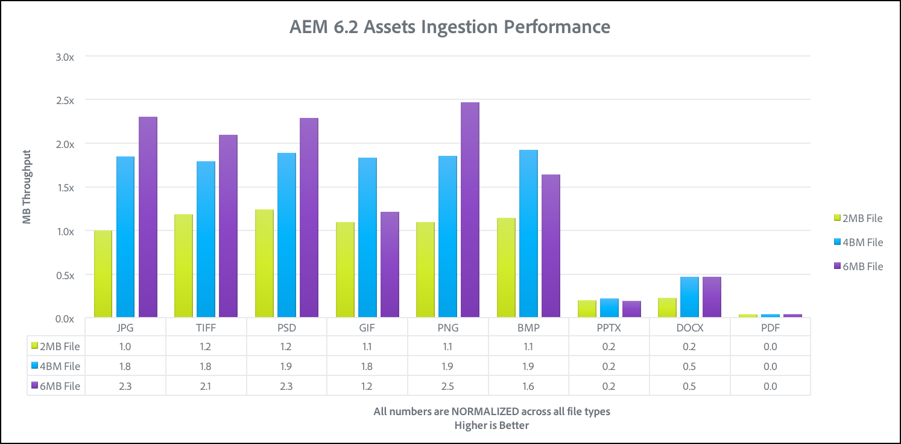
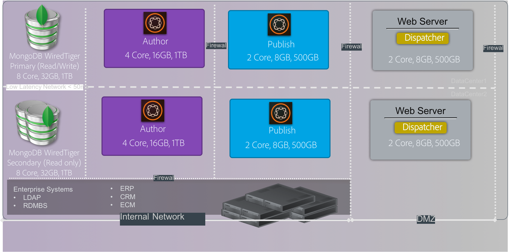

# 效能准則{#performance-guidelines}

本頁提供如何最佳化AEM部署效能的一般准則。 如果您是初次使用AEM，請先檢閱下列頁面，再開始閱讀效能准則：

* [AEM基本概念](/help/sites-deploying/deploy.md#basic-concepts)
* [AEM中的儲存概觀](/help/sites-deploying/storage-elements-in-aem-6.md#overview-of-storage-in-aem)
* [建議的部署](/help/sites-deploying/recommended-deploys.md)
* [技術需求](/help/sites-deploying/technical-requirements.md)

下圖是AEM可用的部署選項（捲動以檢視所有選項）:

<table>
 <tbody>
  <tr>
   <td>
<strong>AEM</strong>
 
<strong>產品</strong>
 </td>
   <td>
<strong>拓撲</strong>
 </td>
   <td>
<strong>作業系統</strong>
 </td>
   <td>
<strong>應用程式伺服器</strong>
 </td>
   <td>
<strong>JRE</strong>
 </td>
   <td>
<strong>安全性</strong>
 </td>
   <td>
<strong>微內核</strong>
 </td>
   <td>
<strong>資料存放區</strong>
 </td>
   <td>
<strong>索引</strong>
 </td>
   <td>
<strong>網頁伺服器</strong>
 </td>
   <td>
<strong>瀏覽器</strong>
 </td>
   <td>
<strong>Experience Cloud</strong>
 </td>
  </tr>
  <tr>
   <td>
Sites
 </td>
   <td>
非HA
 </td>
   <td>
Windows
 </td>
   <td>
CQSE
 </td>
   <td>
Oracle
 </td>
   <td>
LDAP
 </td>
   <td>
Tar
 </td>
   <td>
區段
 </td>
   <td>
屬性
 </td>
   <td>
Apache
 </td>
   <td>
Edge
 </td>
   <td>
目標
 </td>
  </tr>
  <tr>
   <td>
資產
 </td>
   <td>
Publish-HA
 </td>
   <td>
Solaris™
 </td>
   <td>
WebLogic
 </td>
   <td>
IBM®
 </td>
   <td>
SAML
 </td>
   <td>
MongoDB
 </td>
   <td>
檔案
 </td>
   <td>
Lucene
 </td>
   <td>
IIS
 </td>
   <td>
IE
 </td>
   <td>
分析
 </td>
  </tr>
  <tr>
   <td>
社群
 </td>
   <td>
Author-CS
 </td>
   <td>
紅帽®
 </td>
   <td>
WebSphere®
 </td>
   <td>
HP
 </td>
   <td>
Oauth
 </td>
   <td>
RDB/Oracle
 </td>
   <td>
S3/Azure
 </td>
   <td>
Solr
 </td>
   <td>
iPlanet
 </td>
   <td>
FireFox
 </td>
   <td>
行銷活動
 </td>
  </tr>
  <tr>
   <td>
Forms
 </td>
   <td>
作者卸載
 </td>
   <td>
HP-UX
 </td>
   <td>
Tomcat
 </td>
   <td>
 
 </td>
   <td>
 
 </td>
   <td>
RDB/DB2
 </td>
   <td>
MongoDB
 </td>
   <td>
 
 </td>
   <td>
 
 </td>
   <td>
鉻黃
 </td>
   <td>
Social
 </td>
  </tr>
  <tr>
   <td>
行動
 </td>
   <td>
作者叢集
 </td>
   <td>
IBM® AIX®
 </td>
   <td>
JBoss®
 </td>
   <td>
 
 </td>
   <td>
 
 </td>
   <td>
RDB/MySQL
 </td>
   <td>
RDBMS
 </td>
   <td>
 
 </td>
   <td>
 
 </td>
   <td>
Safari
 </td>
   <td>
對象
 </td>
  </tr>
  <tr>
   <td>
多網站
 </td>
   <td>
ASRP
 </td>
   <td>
SUSE®
 </td>
   <td>
 
 </td>
   <td>
 
 </td>
   <td>
 
 </td>
   <td>
RDB/SQLServer
 </td>
   <td>
 
 </td>
   <td>
 
 </td>
   <td>
 
 </td>
   <td>
 
 </td>
   <td>
資產
 </td>
  </tr>
  <tr>
   <td>
商務
 </td>
   <td>
MSRP
 </td>
   <td>
Apple OS
 </td>
   <td>
 
 </td>
   <td>
 
 </td>
   <td>
 
 </td>
   <td>
 
 </td>
   <td>
 
 </td>
   <td>
 
 </td>
   <td>
 
 </td>
   <td>
 
 </td>
   <td>
啟用
 </td>
  </tr>
  <tr>
   <td>
Dynamic Media
 </td>
   <td>
JSRP
 </td>
   <td>
 
 </td>
   <td>
 
 </td>
   <td>
 
 </td>
   <td>
 
 </td>
   <td>
 
 </td>
   <td>
 
 </td>
   <td>
 
 </td>
   <td>
 
 </td>
   <td>
 
 </td>
   <td>
行動
 </td>
  </tr>
  <tr>
   <td>
Brand Portal
 </td>
   <td>
J2E
 </td>
   <td>
 
 </td>
   <td>
 
 </td>
   <td>
 
 </td>
   <td>
 
 </td>
   <td>
 
 </td>
   <td>
 
 </td>
   <td>
 
 </td>
   <td>
 
 </td>
   <td>
 
 </td>
   <td>
 
 </td>
  </tr>
  <tr>
   <td>
AoD
 </td>
   <td>
 
 </td>
   <td>
 
 </td>
   <td>
 
 </td>
   <td>
 
 </td>
   <td>
 
 </td>
   <td>
 
 </td>
   <td>
 
 </td>
   <td>
 
 </td>
   <td>
 
 </td>
   <td>
 
 </td>
   <td>
 
 </td>
  </tr>
  <tr>
   <td>
LiveFyre
 </td>
   <td>
 
 </td>
   <td>
 
 </td>
   <td>
 
 </td>
   <td>
 
 </td>
   <td>
 
 </td>
   <td>
 
 </td>
   <td>
 
 </td>
   <td>
 
 </td>
   <td>
 
 </td>
   <td>
 
 </td>
   <td>
 
 </td>
  </tr>
  <tr>
   <td>
畫面
 </td>
   <td>
 
 </td>
   <td>
 
 </td>
   <td>
 
 </td>
   <td>
 
 </td>
   <td>
 
 </td>
   <td>
 
 </td>
   <td>
 
 </td>
   <td>
 
 </td>
   <td>
 
 </td>
   <td>
 
 </td>
   <td>
 
 </td>
  </tr>
  <tr>
   <td>
Doc安全性
 </td>
   <td>
 
 </td>
   <td>
 
 </td>
   <td>
 
 </td>
   <td>
 
 </td>
   <td>
 
 </td>
   <td>
 
 </td>
   <td>
 
 </td>
   <td>
 
 </td>
   <td>
 
 </td>
   <td>
 
 </td>
   <td>
 
 </td>
  </tr>
  <tr>
   <td>
程式管理
 </td>
   <td>
 
 </td>
   <td>
 
 </td>
   <td>
 
 </td>
   <td>
 
 </td>
   <td>
 
 </td>
   <td>
 
 </td>
   <td>
 
 </td>
   <td>
 
 </td>
   <td>
 
 </td>
   <td>
 
 </td>
   <td>
 
 </td>
  </tr>
  <tr>
   <td>
桌面應用程式
 </td>
   <td>
 
 </td>
   <td>
 
 </td>
   <td>
 
 </td>
   <td>
 
 </td>
   <td>
 
 </td>
   <td>
 
 </td>
   <td>
 
 </td>
   <td>
 
 </td>
   <td>
 
 </td>
   <td>
 
 </td>
   <td>
 
 </td>
  </tr>
 </tbody>
</table>

>[!NOTE]
>
>效能指引主要適用於AEM Sites。

## 何時使用效能准則 {#when-to-use-the-performance-guidelines}

在下列情況下使用效能指南：

* **首次部署**:規劃首次部署AEM Sites或Assets時，請務必了解可用的選項。 尤其是配置微內核、節點儲存和資料儲存時（與預設設定相比）。 例如，將TarMK的資料存放區預設設定變更為檔案資料存放區。
* **升級至新版本**:升級至新版本時，請務必了解與執行中環境相較的效能差異。 例如，從AEM 6.1升級至6.2，或從AEM 6.0 CRX2升級至6.2 OAK。
* **回應時間緩慢**:當選定的Nodestore體系結構不滿足您的要求時，必須了解與其他拓撲選項相比的效能差異。 例如，部署TarMK而非MongoMK，或使用檔案資料存放區而非Amazon S3或Microsoft® Azure資料存放區。
* **新增更多作者**:當建議的TarMK拓撲不符合效能要求，且將製作節點上調到可用的最大容量時，請了解效能差異。 與搭配使用MongoMK與三個或更多製作節點比較。 例如，部署MongoMK而非TarMK。
* **新增更多內容**:當建議的資料儲存體系結構不符合您的要求時，請務必了解與其他資料儲存選項相比的效能差異。 範例：使用Amazon S3或Microsoft® Azure資料存放區，而非檔案資料存放區。

## 簡介 {#introduction}

本章提供AEM架構及其最重要元件的一般概述。 此外，也提供開發准則，並說明TarMK和MongoMK基準測試中使用的測試案例。

### AEM平台 {#the-aem-platform}

AEM平台包含下列元件：

如需AEM平台的詳細資訊，請參閱 [什麼是AEM](/help/sites-deploying/deploy.md#what-is-aem).

### AEM架構 {#the-aem-architecture}

AEM部署有三個重要的組成要素。 此 **製作例項** 內容作者、編輯者和批准者用來建立和審閱內容。 內容獲核准後，就會發佈至名為的第二個執行個體類型 **發佈例項** 從最終用戶訪問的位置。 第三個建築塊是 **Dispatcher** 此模組可處理快取和URL篩選，並安裝在web伺服器上。 如需AEM架構的其他資訊，請參閱 [典型部署方案](/help/sites-deploying/deploy.md#typical-deployment-scenarios).

### 微核 {#micro-kernels}

微內核在AEM中充當持續性管理器。 與AEM一起使用的微內核有三種類型：TarMK、MongoDB和關係資料庫（受限制支援）。 根據執行個體的用途和您考慮的部署類型，選擇符合您需求的部署。 有關微核的其他資訊，請參見 [建議的部署](/help/sites-deploying/recommended-deploys.md) 頁面。

### Nodestore {#nodestore}

在AEM中，二進位資料可與內容節點分開儲存。 儲存二進位資料的位置稱為 **資料儲存**，而內容節點和屬性的位置則稱為 **節點儲存**.

>[!NOTE]
>
>Adobe建議將TarMK設為客戶用於AEM製作和發佈執行個體的預設持續性技術。

>[!CAUTION]
>
>關係資料庫微內核受限制支援。 連絡人 [Adobe客戶服務](https://experienceleague.adobe.com/?support-solution=General&amp;support-tab=home#support) 使用此類型的微內核之前。

### 資料儲存 {#data-store}

處理大量二進位檔時，建議您使用外部資料存放區，而非預設節點存放區，以發揮最大效能。 例如，如果您的專案需要許多媒體資產，則將其儲存在檔案或Azure/S3資料存放區下，比直接儲存在MongoDB中，可讓存取這些資產的速度更快。

如需可用設定選項的詳細資訊，請參閱 [配置節點和資料儲存](/help/sites-deploying/data-store-config.md).

>[!NOTE]
>
>Adobe建議您選擇使用Adobe Managed Services在Azure或Amazon Web Services(AWS)上部署AEM的選項。 如果團隊具備在這些雲端運算環境中部署和操作AEM的經驗和技能，客戶便能從中獲益。 請參閱 [Adobe Managed Services的其他檔案](https://business.adobe.com/products/experience-manager/managed-services.html?aemClk=t).
>
>如需有關如何在Azure或AWS上部署AEM的建議，請在Adobe Managed Services外部，建議您直接與雲端提供者合作。 或者，與Adobe的其中一個合作夥伴合作，支援在您所選擇的雲端環境中部署AEM。 選定的雲提供商或合作夥伴負責規模規格、設計和實施他們支援的體系結構，以滿足您的特定效能、負載、可擴充性和安全要求。
>另請參閱 [技術要求](/help/sites-deploying/technical-requirements.md#supported-platforms) 頁面。
>
>
>
### 搜尋 {#search-features}

本節中列出的是與AEM搭配使用的自訂索引提供者。 要了解有關索引的更多資訊，請參閱 [Oak查詢和索引](/help/sites-deploying/queries-and-indexing.md).

>[!NOTE]
對於大部分部署，Adobe建議使用Lucene索引。 僅在專門和複雜的部署中使用Solr進行可擴充性。

### 開發指導方針 {#development-guidelines}

針對AEM的開發 **效能和可擴充性**. 以下是您可以遵循的最佳實務：

**DO**

* 分離呈現、邏輯和內容
* 使用現有AEM API(例如：Sling)和工具(例如：復寫)
* 根據實際內容進行開發
* 優化快取性
* 將保存次數最小化(例如：使用暫時性工作流程
* 請確定所有HTTP端點均為RESTful
* 限制JCR觀測範圍
* 注意非同步線程

**不要**

* 如果您可以，請勿直接使用JCR API
* 請勿變更/libs，而是使用覆蓋
* 盡可能不要使用查詢
* 請勿使用Sling系結來取得Java™程式碼中的OSGi服務，而應使用：

   * @Reference在DS元件中
   * @Inject在Sling模型中
   * sling.getService()（在Sightly使用類別中）
   * JSP中的sling.getService()
   * 服務追蹤器
   * 直接存取OSGi服務註冊表

如需有關在AEM上開發的詳細資訊，請參閱 [開發 — 基本](/help/sites-developing/the-basics.md). 如需其他最佳實務，請參閱 [開發最佳實務](/help/sites-developing/best-practices.md).

### 基準方案 {#benchmark-scenarios}

>[!NOTE]
此頁面上顯示的所有基準測試都已在實驗室設定中執行。

以下詳述的測試案例會用於TarMK、MongoMk和TarMK與MongoMk章節的基準區段。 若要查看特定基準測試使用哪個藍本，請閱讀 [技術規格](/help/sites-deploying/performance-guidelines.md#tarmk-performance-benchmark) 表格。

**單一產品案例**

AEM Assets:

* 使用者互動：瀏覽資產/搜尋資產/下載資產/讀取資產中繼資料/更新資產中繼資料/上傳資產/執行上傳資產工作流程
* 執行模式：同時使用者，每位使用者進行單次互動

**混合產品案例**

AEM Sites +資產：

* 網站使用者互動：閱讀文章頁面/閱讀頁面/建立段落/編輯段落/建立內容頁面/啟用內容頁面/作者搜尋
* Assets使用者互動：瀏覽資產/搜尋資產/下載資產/讀取資產中繼資料/更新資產中繼資料/上傳資產/執行上傳資產工作流程
* 執行模式：同時使用者，每位使用者的混合互動

**垂直使用案例情境**

媒體:

* `Read Article Page (27.4%), Read Page (10.9%), Create Session (2.6%), Activate Content Page (1.7%), Create Content Page (0.4%), Create Paragraph (4.3%), Edit Paragraph (0.9%), Image Component (0.9%), Browse Assets (20%), Read Asset Metadata (8.5%), Download Asset (4.2%), Search Asset (0.2%), Update Asset Metadata (2.4%), Upload Asset (1.2%), Browse Project (4.9%), Read Project (6.6%), Project Add Asset (1.2%), Project Add Site (1.2%), Create Project (0.1%), Author Search (0.4%)`
* 執行模式：同時使用者，每位使用者的混合互動

## TarMK {#tarmk}

本章介紹TarMK的一般效能指南，指定最低架構需求和設定配置。 也提供了基準測試，以進一步說明。

Adobe建議將TarMK設為客戶在所有部署案例（針對AEM製作和發佈例項）中使用的預設持續性技術。

如需TarMK的詳細資訊，請參閱 [部署方案](/help/sites-deploying/recommended-deploys.md#deployment-scenarios) 和 [Tar儲存](/help/sites-deploying/storage-elements-in-aem-6.md#tar-storage).

### TarMK最低架構指引 {#tarmk-minimum-architecture-guidelines}

>[!NOTE]
以下提供的最低架構指引適用於生產環境和高流量網站。 這些准則包括 **not** the [最小規格](/help/sites-deploying/technical-requirements.md#prerequisites) 執行AEM。

若要在使用TarMK時建立良好的效能，您應從下列架構開始：

* 一個Author例項
* 兩個發佈例項
* 兩個Dispatcher

下圖是AEM網站和AEM Assets的架構指引。

>[!NOTE]
應轉換無二進位複製 **開啟** 檔案資料存放區。

**AEM Sites的Tar架構指引**

**AEM Assets的Tar架構指引**

### TarMK設定指引 {#tarmk-settings-guideline}

為獲得良好效能，您應遵循下列設定准則。 如需如何變更設定的指示， [請參閱本頁](https://experienceleague.adobe.com/docs/experience-manager-65/deploying/configuring/configuring-performance.html?lang=zh-Hant).

<table>
 <tbody>
  <tr>
   <td><strong>設定</strong></td>
   <td><strong>參數</strong></td>
   <td><strong>值</strong></td>
   <td><strong>說明</strong></td>
  </tr>
  <tr>
   <td>Sling作業佇列</td>
   <td><code>queue.maxparallel</code></td>
   <td>將值設定為CPU內核數的一半。 </td>
   <td>預設情況下，每個作業隊列的併發線程數等於CPU核心數。</td>
  </tr>
  <tr>
   <td>Granite暫時工作流程佇列</td>
   <td><code>Max Parallel</code></td>
   <td>將值設定為CPU內核數的一半</td>
   <td> </td>
  </tr>
  <tr>
   <td>JVM參數</td>
   <td>
<code>Doak.queryLimitInMemory</code>
 
<code>Doak.queryLimitReads</code>
 
<code>Dupdate.limit</code>
 
<code>Doak.fastQuerySize</code>
 </td>
   <td>
500000
 
100000
 
250000
 
True
 </td>
   <td>要防止擴展查詢超出系統負載，請在AEM啟動指令碼中添加這些JVM參數。</td>
  </tr>
  <tr>
   <td>Lucene索引配置</td>
   <td>
<code>CopyOnRead</code>
 
<code>CopyOnWrite</code>
 
<code>Prefetch Index Files</code>
 </td>
   <td>
已啟用
 
已啟用
 
已啟用
 </td>
   <td>如需可用參數的詳細資訊，請參閱 <a href="https://jackrabbit.apache.org/oak/docs/query/lucene.html">本頁</a>.</td>
  </tr>
  <tr>
   <td>資料存放區= S3資料存放區</td>
   <td>
<code>maxCachedBinarySize</code>
 
<code>cacheSizeInMB</code>
 </td>
   <td>
1048576(1 MB)或更小
 
最大堆大小的2-10%
 </td>
   <td>另請參閱 <a href="/help/sites-deploying/data-store-config.md#data-store-configurations">資料儲存配置</a>.</td>
  </tr>
  <tr>
   <td>DAM更新資產工作流程</td>
   <td><code>Transient Workflow</code></td>
   <td>已勾選</td>
   <td>此工作流程會管理資產的更新。</td>
  </tr>
  <tr>
   <td>DAM中繼資料回寫</td>
   <td><code>Transient Workflow</code></td>
   <td>已勾選</td>
   <td>此工作流程會管理XMP回寫至原始二進位檔，並在JCR中設定上次修改的日期。</td>
  </tr>
 </tbody>
</table>

### TarMK效能基準 {#tarmk-performance-benchmark}

#### 技術規格 {#technical-specifications}

基準測試是按以下規格執行的：

|  | **製作節點** |
|---|---|
| 伺服器 | 裸機硬體(HP) |
| 作業系統 | Red Hat® Linux® |
| CPU/內核 | 英特爾(R)至強(R)CPU E5-2407 @2.40GHz,8核 |
| RAM | 32 GB |
| 磁碟 | 磁性 |
| Java™ | OracleJRE第8版 |
| JVM堆 | 16 GB |
| 產品 | AEM 6.2 |
| Nodestore | TarMK |
| 資料存放區 | 檔案DS |
| 藍本 | 單一產品：資產/ 30個並行執行緒 |

#### 效能基準結果 {#performance-benchmark-results}

>[!NOTE]
以下數字已標準化為1作為基準，而不是實際吞吐量數字。

 

## MongoMK {#mongomk}

選擇MongoMK永續性後端而不選擇TarMK的主要原因是橫向縮放執行個體。 此功能意味著始終運行兩個或多個活動的作者實例，並使用MongoDB作為持久性儲存系統。 執行多個製作執行個體的需求，一般是因為單一伺服器的CPU和記憶體容量（支援所有同時編寫活動）已無法持續。

如需TarMK的詳細資訊，請參閱 [部署方案](/help/sites-deploying/recommended-deploys.md#deployment-scenarios) 和 [Mongo儲存](/help/sites-deploying/storage-elements-in-aem-6.md#mongo-storage).

### MongoMK最低架構准則 {#mongomk-minimum-architecture-guidelines}

若要在使用MongoMK時建立良好的效能，您應從下列架構開始：

* 三個製作例項
* 兩個發佈例項
* 三個MongoDB實例
* 兩個Dispatcher

>[!NOTE]
在生產環境中， MongoDB始終用作具有主節點和兩個輔助節點的複製副本集。 讀取和寫入會轉到主節點，而讀取會轉到輔助節點。 如果儲存不可用，則可以用仲裁程式替換其中一個輔助程式，但MongoDB副本集必須始終由奇數個實例組成。

>[!NOTE]
應轉換無二進位複製 **開啟** 檔案資料存放區。

### MongoMK設定准則 {#mongomk-settings-guidelines}

為獲得良好效能，您應遵循下列設定准則。 如需如何變更設定的指示， [請參閱本頁](https://experienceleague.adobe.com/docs/experience-manager-65/deploying/configuring/configuring-performance.html?lang=zh-Hant).

<table>
 <tbody>
  <tr>
   <td><strong>設定</strong></td>
   <td><strong>參數</strong></td>
   <td><strong>值（預設值）</strong></td>
   <td><strong>說明</strong></td>
  </tr>
  <tr>
   <td>Sling作業佇列</td>
   <td><code>queue.maxparallel</code></td>
   <td>將值設定為CPU內核數的一半。 </td>
   <td>預設情況下，每個作業隊列的併發線程數等於CPU核心數。</td>
  </tr>
  <tr>
   <td>Granite暫時工作流程佇列</td>
   <td><code>Max Parallel</code></td>
   <td>將值設定為CPU內核數的一半。</td>
   <td> </td>
  </tr>
  <tr>
   <td>JVM參數</td>
   <td>
<code>Doak.queryLimitInMemory</code>
 
<code>Doak.queryLimitReads</code>
 
<code>Dupdate.limit</code>
 
<code>Doak.fastQuerySize</code>
 
<code>Doak.mongo.maxQueryTimeMS</code>
 </td>
   <td>
500000
 
100000
 
250000
 
True
 
60000
 </td>
   <td>要防止擴展查詢超出系統負載，請在AEM啟動指令碼中添加這些JVM參數。</td>
  </tr>
  <tr>
   <td>Lucene索引配置</td>
   <td>
<code>CopyOnRead</code>
 
<code>CopyOnWrite</code>
 
<code>Prefetch Index Files</code>
 </td>
   <td>
已啟用
 
已啟用
 
已啟用
 </td>
   <td>如需可用參數的詳細資訊，請參閱 <a href="https://jackrabbit.apache.org/oak/docs/query/lucene.html">本頁</a>.</td>
  </tr>
  <tr>
   <td>資料存放區= S3資料存放區</td>
   <td>
<code>maxCachedBinarySize</code>
 
<code>cacheSizeInMB</code>
 </td>
   <td>
1048576(1 MB)或更小
 
最大堆大小的2-10%
 </td>
   <td>另請參閱 <a href="/help/sites-deploying/data-store-config.md#data-store-configurations">資料儲存配置</a>.</td>
  </tr>
  <tr>
   <td>DocumentNodeStoreService</td>
   <td>
<code>cache</code>
 
<code>nodeCachePercentage</code>
 
<code>childrenCachePercentage</code>
 
<code>diffCachePercentage</code>
 
<code>docChildrenCachePercentage</code>
 
<code>prevDocCachePercentage</code>
 
<code>persistentCache</code>
 </td>
   <td>
2048
 
35 (25)
 
20 (10)
 
30 (5)
 
10 (3)
 
4 (4)
 
./cache,size=2048，二進位=0,-compact,-compress
 </td>
   <td>
快取的預設大小設定為256 MB。
 
會影響執行快取失效所花費的時間。
 </td>
  </tr>
  <tr>
   <td>oak-overation</td>
   <td>
<code>thread pool</code>
 
<code>length</code>
 </td>
   <td>
最小值和最大值= 20
 
50000
 </td>
   <td> </td>
  </tr>
 </tbody>
</table>

### MongoMK效能基準 {#mongomk-performance-benchmark}

### 技術規格 {#technical-specifications-1}

基準測試是按以下規格執行的：

|  | **製作節點** | **MongoDB節點** |
|---|---|---|
| 伺服器 | 裸機硬體(HP) | 裸機硬體(HP) |
| 作業系統 | Red Hat® Linux® | Red Hat® Linux® |
| CPU/內核 | 英特爾(R)至強(R)CPU E5-2407 @2.40GHz,8核 | 英特爾(R)至強(R)CPU E5-2407 @2.40GHz,8核 |
| RAM | 32 GB | 32 GB |
| 磁碟 | 磁性 — 超過1k IOPS | 磁性 — 超過1k IOPS |
| Java™ | OracleJRE第8版 | N/A |
| JVM堆 | 16 GB | N/A |
| 產品 | AEM 6.2 | MongoDB 3.2 WiredTiger |
| Nodestore | MongoMK | N/A |
| 資料存放區 | 檔案DS | N/A |
| 藍本 | 單一產品：資產/ 30個並行執行緒 | 單一產品：資產/ 30個並行執行緒 |

### 效能基準結果 {#performance-benchmark-results-1}

>[!NOTE]
以下數字已標準化為1作為基準，而不是實際吞吐量數字。

 

## TarMK與MongoMK {#tarmk-vs-mongomk}

在兩者之間選擇時，考量的基本規則是TarMK是為效能而設計，而MongoMK是為可擴充性而設計。 Adobe建議將TarMK設為客戶在所有部署案例（針對AEM製作和發佈例項）中使用的預設持續性技術。

選擇MongoMK永續性後端而不選擇TarMK的主要原因是橫向縮放執行個體。 此功能表示有兩個或多個活動的製作實例始終運行，並使用MongoDB作為持久性儲存系統。 需要執行多個製作執行個體通常是因為單一伺服器的CPU和記憶體容量（支援所有同時編寫活動）已無法持續。

如需TarMK與MongoMK的詳細資訊，請參閱 [建議的部署](/help/sites-deploying/recommended-deploys.md#microkernels-which-one-to-use).

### TarMK與MongoMk准則 {#tarmk-vs-mongomk-guidelines}

**TarMK的優點**

* 專為內容管理應用程式而構建
* 檔案始終一致，可以使用任何基於檔案的備份工具進行備份
* 提供故障轉移機制 — 請參見 [冷待機](/help/sites-deploying/tarmk-cold-standby.md) 如需詳細資訊
* 提供高效能和可靠的資料儲存，並且操作開銷最小
* 降低TCO（總擁有成本）

**選擇MongoMK的條件**

* 一天內連接的指定用戶數：以千計甚至更多
* 同時使用者人數：數百個以上
* 每日資產擷取量：幾十萬甚至更多
* 每天編輯頁面的數量：幾十萬甚至更多
* 每天的搜索量：幾萬甚至更多

### TarMK與MongoMK基準 {#tarmk-vs-mongomk-benchmarks}

>[!NOTE]
以下數字已標準化為1作為基準，而不是實際吞吐量數字。

### 方案1技術規範 {#scenario-technical-specifications}

<table>
 <tbody>
  <tr>
   <td><strong> </strong></td>
   <td><strong>製作OAK節點</strong></td>
   <td><strong>MongoDB節點</strong></td>
   <td> </td>
  </tr>
  <tr>
   <td>伺服器</td>
   <td>裸機硬體(HP)</td>
   <td>裸機硬體(HP)</td>
   <td> </td>
  </tr>
  <tr>
   <td>作業系統</td>
   <td>Red Hat® Linux®</td>
   <td>Red Hat® Linux®</td>
   <td> </td>
  </tr>
  <tr>
   <td>CPU/內核</td>
   <td>英特爾(R)至強(R)CPU E5-2407 @2.40GHz,8核</td>
   <td>英特爾(R)至強(R)CPU E5-2407 @2.40GHz,8核</td>
   <td> </td>
  </tr>
  <tr>
   <td>RAM</td>
   <td>32 GB</td>
   <td>32 GB</td>
   <td> </td>
  </tr>
  <tr>
   <td>磁碟</td>
   <td>磁性 — 超過1k IOPS</td>
   <td>磁性 — 超過1k IOPS</td>
   <td> </td>
  </tr>
  <tr>
   <td>Java™</td>
   <td>OracleJRE第8版</td>
   <td>N/A</td>
   <td> </td>
  </tr>
  <tr>
   <td>JVM堆16GB</td>
   <td>16 GB</td>
   <td>N/A</td>
   <td> </td>
  </tr>
  <tr>
   <td>產品 </td>
   <td>AEM 6.2</td>
   <td>MongoDB 3.2 WiredTiger</td>
   <td> </td>
  </tr>
  <tr>
   <td>Nodestore</td>
   <td>TarMK或MongoMK</td>
   <td>N/A</td>
   <td> </td>
  </tr>
  <tr>
   <td>資料存放區</td>
   <td>檔案DS </td>
   <td>N/A</td>
   <td> </td>
  </tr>
  <tr>
   <td>藍本</td>
   <td>
  單一產品：資產/每次執行30個同時執行緒
 </td>
   <td> </td>
   <td> </td>
  </tr>
 </tbody>
</table>

### 方案1效能基準結果 {#scenario-performance-benchmark-results}

### 方案2技術規範 {#scenario-technical-specifications-1}

>[!NOTE]
若要啟用與單一TarMK系統相同數量的MongoDB作者，您需要具有兩個AEM節點的叢集。 四個節點的MongoDB群集可處理1.8倍於一個TarMK實例的作者數。 八個節點的MongoDB群集可處理的作者數是一個TarMK實例的2.3倍。

<table>
 <tbody>
  <tr>
   <td><strong> </strong></td>
   <td><strong>製作TarMK節點</strong></td>
   <td><strong>製作MongoMK節點</strong></td>
   <td><strong>MongoDB節點</strong></td>
  </tr>
  <tr>
   <td>伺服器</td>
   <td>AWS c3.8xlarge</td>
   <td>AWS c3.8xlarge</td>
   <td>AWS c3.8xlarge</td>
  </tr>
  <tr>
   <td>作業系統</td>
   <td>Red Hat® Linux®</td>
   <td>Red Hat® Linux®</td>
   <td>Red Hat® Linux®</td>
  </tr>
  <tr>
   <td>CPU/內核</td>
   <td>32</td>
   <td>32</td>
   <td>32</td>
  </tr>
  <tr>
   <td>RAM</td>
   <td>60 GB</td>
   <td>60 GB</td>
   <td>60 GB</td>
  </tr>
  <tr>
   <td>磁碟</td>
   <td>固態硬碟 — 10k IOPS</td>
   <td>固態硬碟 — 10k IOPS</td>
   <td>固態硬碟 — 10k IOPS</td>
  </tr>
  <tr>
   <td>Java™</td>
   <td>OracleJRE第8版</td>
   <td>  OracleJRE第8版</td>
   <td>N/A</td>
  </tr>
  <tr>
   <td>JVM堆16GB</td>
   <td>30 GB</td>
   <td>30 GB</td>
   <td>N/A</td>
  </tr>
  <tr>
   <td>產品 </td>
   <td>AEM 6.2</td>
   <td>AEM 6.2</td>
   <td>  MongoDB 3.2 WiredTiger</td>
  </tr>
  <tr>
   <td>Nodestore</td>
   <td>TarMK </td>
   <td>MongoMK</td>
   <td>  N/A</td>
  </tr>
  <tr>
   <td>資料存放區</td>
   <td>檔案DS </td>
   <td>  檔案DS</td>
   <td>  N/A</td>
  </tr>
  <tr>
   <td>藍本</td>
   <td>
    垂直使用案例：媒體/ 2000個併發線程
 </td>
   <td></td>
   <td></td>
  </tr>
 </tbody>
</table>

### 方案2效能基準結果 {#scenario-performance-benchmark-results-1}

### 適用於AEM Sites和Assets的架構可擴充性指引 {#architecture-scalability-guidelines-for-aem-sites-and-assets}

## 效能指南摘要  {#summary-of-performance-guidelines}

本頁所列准則概述如下：

* **TarMK與檔案資料存放區**  — 適用於大部分客戶的建議架構：

   * 最小拓撲：一個製作例項、兩個發佈例項、兩個Dispatcher
   * 如果共用檔案資料儲存，則開啟無二進位複製

* **MongoMK與檔案資料存放區**  — 針對作者階層的橫向可擴充性建議的架構：

   * 最小拓撲：三個製作例項、三個MongoDB例項、兩個發佈例項、兩個Dispatcher
   * 如果共用檔案資料儲存，則開啟無二進位複製

* **Nodestore**  — 儲存在本地磁碟上，而不是網路連接儲存(NAS)上
* 使用時 **Amazon S3**:

   * Amazon S3資料存放區在製作和發佈層級之間共用
   * 必須開啟無二進位複製
   * 「資料存放區垃圾收集」需要先在所有「製作」和「發佈」節點上執行，然後在「製作」上執行第二次

* **除了現成可用的索引外，還應建立自訂索引**  — 根據最常見的搜尋

   * Lucene索引應用於自訂索引

* **定制工作流可以顯著提高效能**  — 在「更新資產」工作流程中移除視訊步驟，停用未使用的接聽程式，以此類推。

如需詳細資訊，請一併閱讀 [建議的部署](/help/sites-deploying/recommended-deploys.md) 頁面。
