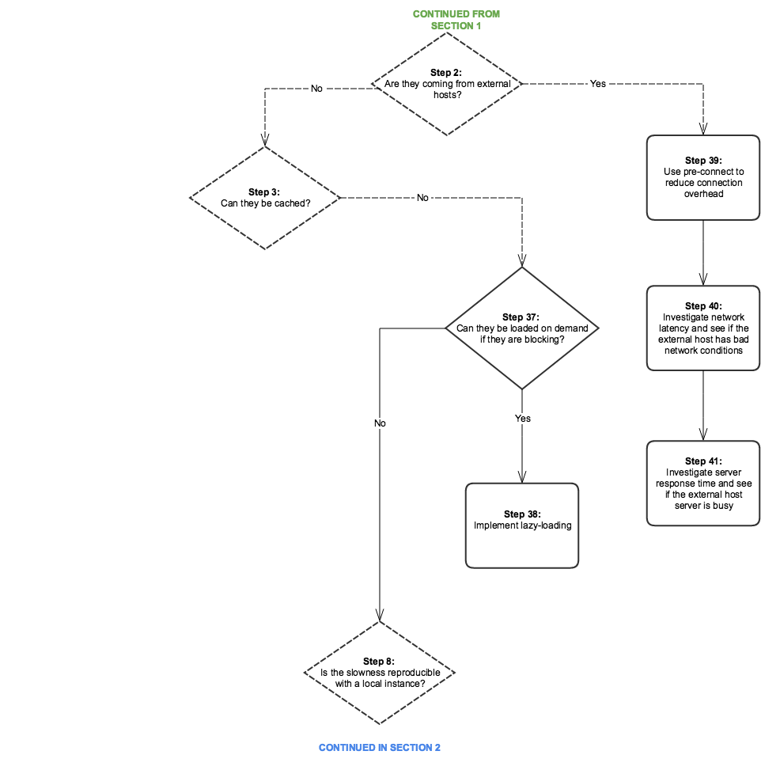

# 效能樹狀結構{#performance-tree}

## 範圍 {#scope}

下圖旨在提供疑難排解效能問題所需步驟的指引。 為了方便閱讀，它分為五個區段。

圖表中的每個步驟都連結至檔案資源或建議。

## 必要條件和假設 {#prerequisites-and-assumptions}

假設在指定頁面(AEM主控台或網頁)上發現效能問題，且可一致地重現。 在開始調查之前，必須先有測試或監控效能的方法。

分析從步驟0開始。 目標是要判斷哪個實體(Dispatcher、外部主機或AEM)應該對效能問題負責，然後判斷應該調查哪個區域（伺服器或網路）。

### 區段 1 {#section}

### 區段 2 {#section-1}

### 區段 3 {#section-2}

### 區段 4 {#section-3}

### 區段 5 {#section-4}

## 參考連結 {#reference-links}

<table>
 <tbody>
  <tr>
   <td><strong>步驟</strong></td>
   <td><strong>標題</strong></td>
   <td><strong>資源</strong></td>
  </tr>
  <tr>
   <td><strong>步驟 0</strong></td>
   <td>分析請求流程</td>
   <td>
您可以在瀏覽器中使用標準HTTP請求分析來分析請求流程。 如需如何在Chrome上執行此分析的詳細資訊，請參閱：  
 
<a href="https://developers.google.com/web/tools/chrome-devtools/profile/network-performance/resource-loading">https://developer.chrome.com/docs/devtools/</a>  
 </td>
  </tr>
  <tr>
   <td><strong>步驟 2</strong></td>
   <td>請求是否來自外部主機？</td>
   <td>您可以在瀏覽器中使用標準HTTP請求分析來分析請求流程。 請參閱上面的連結，瞭解如何在Chrome上執行此分析。  </td>
  </tr>
  <tr>
   <td><strong>步驟 3</strong></td>
   <td>是否可以快取請求？</td>
   <td>如需可快取要求的詳細資訊和一般Dispatcher效能最佳化建議，請參閱 <a href="/help/sites-deploying/configuring-performance.md#optimizing-performance-when-using-the-dispatcher">Dispatcher效能最佳化</a>.</td>
  </tr>
  <tr>
   <td><strong>步驟 4</strong></td>
   <td>是否來自Dispatcher的請求？</td>
   <td>
若要檢視請求是否正確快取，請檢查 <a href="https://experienceleague.adobe.com/docs/experience-manager-dispatcher/using/configuring/dispatcher-configuration.html?lang=en#debugging">Dispatcher偵錯檔案</a>.  
 </td>
  </tr>
  <tr>
   <td><strong>步驟 5</strong></td>
   <td>Dispatcher是否會嘗試透過AEM驗證每個請求？</td>
   <td>檢查Dispatcher是否傳送 <code>HEAD</code> 傳送快取的資源之前，會向AEM要求驗證。 尋找 <code>HEAD</code> AEM中的請求 <code>access.log</code>. 如需詳細資訊，請參閱 <a href="/help/sites-deploying/configure-logging.md">記錄</a>.  </td>
  </tr>
  <tr>
   <td><strong>步驟 6</strong></td>
   <td>Dispatcher的地理位置是否遠離使用者？</td>
   <td>將Dispatcher移到更接近使用者的位置。</td>
  </tr>
  <tr>
   <td><strong>步驟 7</strong></td>
   <td>Dispatcher的網路層可以嗎？</td>
   <td>  調查網路層的飽和度和延遲問題。
 
 </td>
  </tr>
  <tr>
   <td><strong>步驟 8</strong></td>
   <td>緩慢是否可在本機執行個體中重現？</td>
   <td>  
使用 <a href="/help/sites-developing/tough-day.md">艱苦的一天</a> 從生產執行個體中複製「真實」條件。 如果這種情況對您的開發空間不切實際，請務必在不同網路內容中測試生產執行個體（或相同的測試執行個體）。  
 </td>
  </tr>
  <tr>
   <td><strong>步驟 9</strong></td>
   <td>伺服器的地理位置是否遠離使用者？</td>
   <td>將伺服器移到離使用者更近的位置。</td>
  </tr>
  <tr>
   <td><strong>步驟10和29</strong></td>
   <td>調查網路層</td>
   <td>
調查網路層的飽和度和延遲問題。
 
對於製作階層，建議延遲不要超過100毫秒。
 
如需效能最佳化秘訣的詳細資訊，請參閱 <a href="https://helpx.adobe.com/customer-care-office-hours/aem/6x-performance-tuning-best-practices.html">此頁面</a>.
 </td>
  </tr>
  <tr>
   <td><strong>步驟 11</strong></td>
   <td>將伺服器移到更近的位置，或為每個區域新增一個伺服器</td>
   <td> </td>
  </tr>
  <tr>
   <td><strong>步驟 12</strong></td>
   <td>疑難排解AEM伺服器</td>
   <td>如需詳細資訊，請檢視圖表中的下列子步驟。</td>
  </tr>
  <tr>
   <td><strong>步驟 13</strong></td>
   <td>檢查硬體需求</td>
   <td>請檢視以下專案的檔案： <a href="/help/managing/hardware-sizing-guidelines.md">硬體大小調整准則</a>.  </td>
  </tr>
  <tr>
   <td><strong>步驟 14</strong></td>
   <td>檢查效能問題的常見原因</td>
   <td> </td>
  </tr>
  <tr>
   <td><strong>步驟 15</strong></td>
   <td>尋找緩慢請求</td>
   <td>
您可以透過分析 <code>request.log</code> 或透過使用 <code>rlog.jar</code>.
 
如需有關使用rlog.jar的詳細資訊，請參閱此頁面。
 
另請參閱 <a href="/help/sites-deploying/monitoring-and-maintaining.md#using-rlog-jar-to-find-requests-with-long-duration-times">使用rlog.jar尋找持續時間較長的請求</a>.  
 
 
 </td>
  </tr>
  <tr>
   <td><strong>步驟 16</strong></td>
   <td>設定檔伺服器</td>
   <td>
如需可搭配AEM使用的效能分析工具的相關資訊，請參閱 <a href="/help/sites-deploying/monitoring-and-maintaining.md#tools-for-monitoring-and-analyzing-performance">監控及分析效能的工具</a>.  
 </td>
  </tr>
  <tr>
   <td><strong>步驟 17</strong></td>
   <td>在設定檔中尋找慢速方法</td>
   <td> </td>
  </tr>
  <tr>
   <td><strong>步驟 18</strong></td>
   <td>設定檔的常見案例</td>
   <td>另請參閱 <a href="/help/sites-deploying/monitoring-and-maintaining.md#analyzing-specific-scenarios">分析特定案例</a> 在效能最佳化區段中。  </td>
  </tr>
  <tr>
   <td><strong>步驟 19</strong></td>
   <td>100% CPU</td>
   <td><a href="/help/sites-deploying/monitoring-and-maintaining.md#monitoring-performance">https://experienceleague.adobe.com/docs/experience-manager-release-information/aem-release-updates/previous-updates/aem-previous-versions.html</a></td>
  </tr>
  <tr>
   <td><strong>步驟 20</strong></td>
   <td>記憶體不足</td>
   <td> 
    <ol>
     <li><a href="/help/sites-deploying/monitoring-and-maintaining.md#out-of-memory">記憶體不足</a></li>
     <li><a href="/help/sites-deploying/troubleshooting.md">我的應用程式擲回記憶體不足錯誤</a></li>
     <li><a href="https://experienceleague.adobe.com/docs/experience-cloud-kcs/kbarticles/KA-17482.html?lang=en">分析記憶體問題。</a>  </li>
    </ol> </td>
  </tr>
  <tr>
   <td><strong>步驟 21</strong></td>
   <td>磁碟I/O</td>
   <td>
請參閱 <a href="/help/sites-deploying/monitoring-and-maintaining.md#disk-i-o">磁碟I/O</a> 區段的內容進行詳細設定。
 </td>
  </tr>
  <tr>
   <td><strong>步驟22和22.1</strong></td>
   <td>快取比率</td>
   <td>另請參閱 <a href="/help/sites-deploying/configuring-performance.md#calculating-the-dispatcher-cache-ratio">計算Dispatcher快取比率</a>.    </td>
  </tr>
  <tr>
   <td><strong>步驟 23</strong></td>
   <td>緩慢查詢</td>
   <td><a href="/help/sites-deploying/best-practices-for-queries-and-indexing.md">查詢和建立索引的最佳實務</a></td>
  </tr>
  <tr>
   <td><strong>步驟 24</strong></td>
   <td>儲存區域調整</td>
   <td>
    <ul>
     <li><a href="https://helpx.adobe.com/customer-care-office-hours/aem/6x-performance-tuning-best-practices.html">效能調整秘訣</a></li>
     <li><a href="/help/sites-deploying/configuring-performance.md#configuring-for-performance">設定效能</a></li>
     <li><a href="https://www.slideshare.net/jukka/repository-performance-tuning">儲存區域效能調整</a></li>
    </ul> </td>
  </tr>
  <tr>
   <td><strong>步驟 25</strong></td>
   <td>正在執行的工作流程</td>
   <td>
    <ul>
     <li><a href="/help/sites-deploying/configuring-performance.md#concurrent-workflow-processing">並行工作流程處理</a></li>
     <li><a href="/help/sites-deploying/configuring-performance.md#configure-the-queue-for-a-specific-workflow">設定特定工作流程的佇列</a></li>
     <li><a href="/help/sites-administering/workflows-administering.md#regular-purging-of-workflow-instances">定期清除工作流程執行個體</a></li>
     <li><a href="/help/sites-developing/workflows.md#transient-workflows">暫時性工作流程</a>  </li>
    </ul> 
 
 </td>
  </tr>
  <tr>
   <td><strong>步驟 26</strong></td>
   <td>MSM基礎結構</td>
   <td>
<a href="/help/sites-administering/msm-best-practices.md">多站台管理員最佳作法</a>  
 </td>
  </tr>
  <tr>
   <td><strong>步驟 27</strong></td>
   <td>資產調整</td>
   <td>
    <ol>
     <li><a href="/help/sites-deploying/configuring-performance.md#cq-dam-asset-synchronization-service">資產同步處理服務</a></li>
     <li><a href="/help/sites-deploying/configuring-performance.md#multiple-dam-instances">多個DAM例項</a></li>
     <li>效能調整提示文章 <a href="https://helpx.adobe.com/customer-care-office-hours/aem/6x-performance-tuning-best-practices.html">此處</a>.  </li>
    </ol> </td>
  </tr>
  <tr>
   <td><strong>步驟 28</strong></td>
   <td>未關閉的工作階段</td>
   <td>
 
 
<a href="/help/sites-administering/troubleshoot.md#checking-for-unclosed-jcr-sessions">檢查未關閉的JCR工作階段</a>
 
 
 </td>
  </tr>
  <tr>
   <td><strong>步驟 30</strong></td>
   <td>讓Dispatcher靠近（針對每個「地區」新增一個？）</td>
   <td> </td>
  </tr>
  <tr>
   <td><strong>步驟 31</strong></td>
   <td>在Dispatcher之前使用CDN</td>
   <td><a href="https://experienceleague.adobe.com/docs/experience-manager-dispatcher/using/dispatcher.html?lang=zh-Hant#using-dispatcher-with-a-cdn">搭配CDN使用Dispatcher</a>  </td>
  </tr>
  <tr>
   <td><strong>步驟 32</strong></td>
   <td>若要解除安裝AEM伺服器，請使用Dispatcher層級的工作階段管理</td>
   <td>
<a href="https://experienceleague.adobe.com/docs/experience-manager-dispatcher/using/configuring/dispatcher-configuration.html?lang=en#enabling-secure-sessions-sessionmanagement">啟用安全工作階段</a>
 </td>
  </tr>
  <tr>
   <td><strong>步驟 33</strong></td>
   <td>讓請求可快取</td>
   <td>
    <ol>
     <li><a href="https://experienceleague.adobe.com/docs/experience-manager-dispatcher/using/dispatcher.html?lang=en">一般Dispatcher設定</a></li>
     <li><a href="https://experienceleague.adobe.com/docs/experience-manager-dispatcher/using/configuring/dispatcher-configuration.html?lang=en#configuring-the-dispatcher-cache-cache">設定Dispatcher快取</a></li>
    </ol> 
如何改善快取比率；讓請求支援快取（Dispatcher最佳實務）
 
此外，請考慮以下設定以最佳化您的快取設定  

    <ol>
     <li>為非GET的HTTP要求設定無快取規則</li>
     <li>設定查詢字串為不可快取</li>
     <li>不要快取缺少副檔名的URL</li>
     <li>快取驗證標頭（自Dispatcher版本4.1.10之後可能提供）</li>
    </ol> </td>
  </tr>
  <tr>
   <td><strong>步驟 34</strong></td>
   <td>升級Dispatcher版本</td>
   <td>
您可以在此位置下載最新的Dispatcher版本：
 
<a href="https://experienceleague.adobe.com/docs/experience-manager-dispatcher/using/getting-started/release-notes.html?lang=en">關注連結</a>
 </td>
  </tr>
  <tr>
   <td><strong>步驟 35</strong></td>
   <td>設定Dispatcher</td>
   <td><a href="https://experienceleague.adobe.com/docs/experience-manager-dispatcher/using/configuring/dispatcher-configuration.html?lang=zh-Hant">設定Dispatcher</a>  </td>
  </tr>
  <tr>
   <td><strong>步驟 36</strong></td>
   <td>檢查快取失效</td>
   <td> 
    <ul>
     <li><a href="https://experienceleague.adobe.com/docs/experience-manager-dispatcher/using/configuring/page-invalidate.html?lang=en#invalidating-dispatcher-cache-from-the-authoring-environment">製作層的快取失效；</a></li>
     <li><a href="https://experienceleague.adobe.com/docs/experience-manager-dispatcher/using/configuring/page-invalidate.html?lang=en#invalidating-dispatcher-cache-from-a-publishing-instance">發佈層的快取失效。</a></li>
    </ul> </td>
  </tr>
  <tr>
   <td><strong>步驟37和38</strong></td>
   <td>延遲載入</td>
   <td><a href="https://experienceleague.adobe.com/docs/experience-manager-gems-events/gems/gems2016/aem-web-performance.html?lang=en">請參閱AEM Web效能的Gem研討會。</a>  </td>
  </tr>
  <tr>
   <td><strong>步驟 39</strong></td>
   <td>使用預先連線來減少連線額外負荷</td>
   <td>請參閱上述的Gem課程。 此外，W3c上的其他預先連線說明檔案：<a href="https://html.spec.whatwg.org/#linkTypes"> https://html.spec.whatwg.org/#linkTypes</a></td>
  </tr>
  <tr>
   <td><strong>步驟40和41</strong>  </td>
   <td>外部主機延遲和回應時間</td>
   <td>調查外部主機的延遲和回應時間。</td>
  </tr>
  <tr>
   <td><strong>步驟45  和47</strong>  </td>
   <td>使用HTTP/2</td>
   <td>如需步驟37、38和39，請參閱Gem研討會。 另外，出庫 <a href="https://help-forums.adobe.com/content/adobeforums/en/experience-manager-forum/adobe-experience-manager.topic.html/forum__kdzc-does_anyoneknowwhe.html">此</a> 支援HTTP/2的論壇貼文。  </td>
  </tr>
  <tr>
   <td><strong>步驟 49</strong></td>
   <td>縮小裝載大小</td>
   <td><a href="/help/sites-deploying/osgi-configuration-settings.md">啟用Gzip</a> 和 <a href="https://experienceleague.adobe.com/docs/experience-manager-gems-events/gems/gems2016/aem-web-performance.html?lang=en">縮小影像大小</a>.  </td>
  </tr>
  <tr>
   <td><strong>步驟42和43</strong></td>
   <td>保持連線</td>
   <td>
是 <code>Keep-Alive</code> 標頭出現在重複使用連線的不同請求中？ 否則，這表示每個請求都會導致另一個連線建立，從而造成不必要的額外負荷。 （瀏覽器中的標準HTTP請求分析）
 
您可以檢查 <a href="/help/sites-administering/proxy-jar.md">Proxy伺服器工具</a> 以檢查保持連線連線。  
 </td>
  </tr>
  <tr>
   <td><strong>步驟 44</strong></td>
   <td>提出多少要求？</td>
   <td>在瀏覽器中執行標準HTTP要求分析。</td>
  </tr>
  <tr>
   <td><strong>步驟 46</strong></td>
   <td>減少請求數量</td>
   <td>
    <ol>
     <li>串連資源（影像、CSS拼寫、JSON）  </li>
     <li>Clientlibs內嵌：
      <ol>
       <li><a href="/help/sites-developing/clientlibs.md#creating-client-library-folders">建立使用者端資源庫資料夾</a>  — 請參閱標題使用內嵌將請求最小化</li>
      </ol> </li>
    </ol> </td>
  </tr>
  <tr>
   <td><strong>步驟 48</strong></td>
   <td>承載的大小為何？</td>
   <td>瀏覽器中的標準HTTP請求分析</td>
  </tr>
  <tr>
   <td><strong>步驟50和51</strong></td>
   <td>JS程式碼封鎖</td>
   <td><a href="https://experienceleague.adobe.com/docs/experience-manager-gems-events/gems/gems2016/aem-web-performance.html?lang=en">https://experienceleague.adobe.com/docs/experience-manager-gems-events/gems/gems2016/aem-web-performance.html?lang=en</a></td>
  </tr>
 </tbody>
</table>
