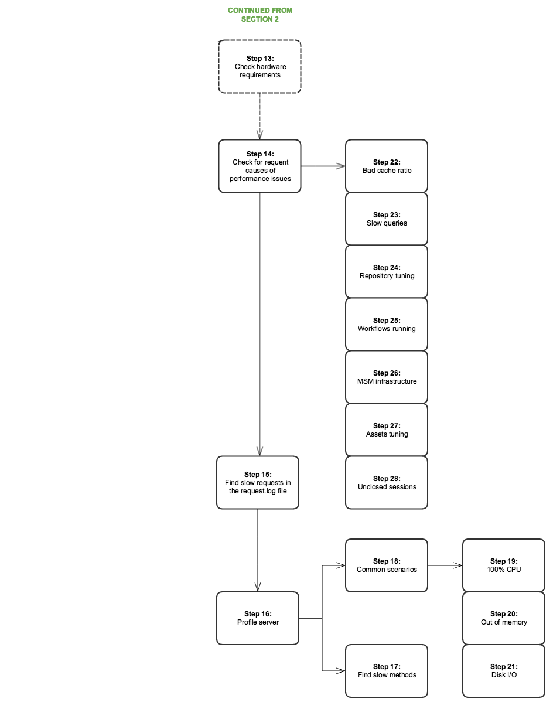

# 效能樹{#performance-tree}

## 範圍 {#scope}

下圖旨在提供疑難排解效能問題所需採取步驟的指引。 分成5個區段，方便閱讀。

圖表中的每個步驟都會連結至檔案資源或建議。

## 先決條件和假設 {#prerequisites-and-assumptions}

假設是在指定頁面(AEM主控台或網頁)上觀察到效能問題，且可一致地重新產生。 在開始調查之前，必須具備測試或監控效能的方法。

分析從步驟0開始。 目標是要判斷哪個實體(Dispatcher、外部主機或AEM)要負責效能問題，然後判斷應該調查哪個區域（伺服器或網路）。

### 區段 1 {#section}

### 區段 2 {#section-1}

### 區段 3 {#section-2}

### 區段 4 {#section-3}

### 區段 5 {#section-4}

## 參考連結 {#reference-links}

<table>
 <tbody>
  <tr>
   <td><strong>步驟</strong></td>
   <td><strong>標題</strong></td>
   <td><strong>資源</strong></td>
  </tr>
  <tr>
   <td><strong>步驟 0</strong></td>
   <td>分析請求流程</td>
   <td>
您可以在瀏覽器中使用標準HTTP請求分析來分析請求流程。 如需如何在Chrome上執行此動作的詳細資訊，請參閱：  
 
<a href="https://developers.google.com/web/tools/chrome-devtools/profile/network-performance/resource-loading">https://developers.google.com/web/tools/chrome-devtools/profile/network-performance/resource-loading</a><a href="https://developers.google.com/web/tools/chrome-devtools/profile/network-performance/understanding-resource-timing">  https://developers.google.com/web/tools/chrome-devtools/profile/network-performance/understanding-resource-timing</a>  
 </td>
  </tr>
  <tr>
   <td><strong>步驟 2</strong></td>
   <td>請求是否來自外部主機？</td>
   <td>您可以在瀏覽器中使用標準HTTP請求分析來分析請求流程。 請參閱上述連結，了解如何在Chrome上執行此作業。  </td>
  </tr>
  <tr>
   <td><strong>步驟 3</strong></td>
   <td>是否可快取請求？</td>
   <td>如需可快取請求和一般Dispatcher效能最佳化建議的詳細資訊，請參閱 <a href="/help/sites-deploying/configuring-performance.md#optimizing-performance-when-using-the-dispatcher">Dispatcher效能最佳化</a>.</td>
  </tr>
  <tr>
   <td><strong>步驟 4</strong></td>
   <td>是否來自Dispatcher的請求？</td>
   <td>
檢查 <a href="https://helpx.adobe.com/experience-manager/dispatcher/using/dispatcher-configuration.html#debugging">Dispatcher除錯檔案</a> 來查看請求是否已正確快取。  
 </td>
  </tr>
  <tr>
   <td><strong>步驟 5</strong></td>
   <td>Dispatcher是否嘗試透過AEM驗證每個請求？</td>
   <td>檢查Dispatcher是否傳送 <code>HEAD</code> 傳送快取資源前，向AEM要求驗證。 您可以尋找 <code>HEAD</code> AEM中的請求 <code>access.log</code>. 如需詳細資訊，請參閱 <a href="/help/sites-deploying/configure-logging.md">記錄</a>.  </td>
  </tr>
  <tr>
   <td><strong>步驟 6</strong></td>
   <td>Dispatcher的地理位置是否與使用者相距較遠？</td>
   <td>將Dispatcher移近使用者。</td>
  </tr>
  <tr>
   <td><strong>步驟 7</strong></td>
   <td>Dispatcher的網路層是否正常？</td>
   <td>  調查網路層的飽和和延遲問題。
 
 </td>
  </tr>
  <tr>
   <td><strong>步驟 8</strong></td>
   <td>慢速可透過本機執行個體重現嗎？</td>
   <td>  
使用 <a href="/help/sites-developing/tough-day.md">艱難的一天</a> 從生產實例中複製「真實世界」條件。 如果對於您的開發環境而言，這並不現實，請務必在不同網路內容中測試生產執行個體（或相同的預備執行個體）。  
 </td>
  </tr>
  <tr>
   <td><strong>步驟 9</strong></td>
   <td>伺服器的地理位置是否與用戶相距甚遠？</td>
   <td>將伺服器移近使用者。</td>
  </tr>
  <tr>
   <td><strong>步驟10和29</strong></td>
   <td>調查網路層</td>
   <td>
調查網路層的飽和和延遲問題。
 
若為製作層級，建議不要超過100毫秒。
 
如需效能最佳化提示的詳細資訊，請參閱 <a href="https://helpx.adobe.com/experience-manager/kb/performance-tuning-tips.html">本頁</a>.
 </td>
  </tr>
  <tr>
   <td><strong>步驟 11</strong></td>
   <td>將伺服器移得更近，或為每個區域添加一個</td>
   <td> </td>
  </tr>
  <tr>
   <td><strong>步驟 12</strong></td>
   <td>疑難排解AEM伺服器</td>
   <td>如需詳細資訊，請查看圖表中的下列子步驟。</td>
  </tr>
  <tr>
   <td><strong>步驟 13</strong></td>
   <td>檢查硬體需求</td>
   <td>查看 <a href="/help/managing/hardware-sizing-guidelines.md">硬體調整指南</a>.  </td>
  </tr>
  <tr>
   <td><strong>步驟 14</strong></td>
   <td>檢查效能問題的常見原因</td>
   <td> </td>
  </tr>
  <tr>
   <td><strong>步驟 15</strong></td>
   <td>尋找慢速請求</td>
   <td>
您可以分析 <code>request.log</code> 或 <code>rlog.jar</code>.
 
有關使用rlog.jar的詳細資訊，請參見本頁。
 
請參閱 <a href="/help/sites-deploying/monitoring-and-maintaining.md#using-rlog-jar-to-find-requests-with-long-duration-times">使用rlog.jar尋找持續時間較長的請求</a>.  
 
 
 </td>
  </tr>
  <tr>
   <td><strong>步驟 16</strong></td>
   <td>設定檔伺服器</td>
   <td>
如需可搭配AEM使用之分析工具的相關資訊，請參閱 <a href="/help/sites-deploying/monitoring-and-maintaining.md#tools-for-monitoring-and-analyzing-performance">監控和分析效能的工具</a>.  
 </td>
  </tr>
  <tr>
   <td><strong>步驟 17</strong></td>
   <td>在分析中查找慢速方法</td>
   <td> </td>
  </tr>
  <tr>
   <td><strong>步驟 18</strong></td>
   <td>分析的常見情況</td>
   <td>請參閱 <a href="/help/sites-deploying/monitoring-and-maintaining.md#analyzing-specific-scenarios">分析特定方案</a> 在「效能最佳化」區段中。  </td>
  </tr>
  <tr>
   <td><strong>步驟 19</strong></td>
   <td>100% CPU</td>
   <td><a href="/help/sites-deploying/monitoring-and-maintaining.md#monitoring-performance">https://helpx.adobe.com/experience-manager/6-3/sites-deploying/monitoring-and-maintaining.html#MonitoringPerformance</a></td>
  </tr>
  <tr>
   <td><strong>步驟 20</strong></td>
   <td>記憶體不足</td>
   <td> 
    <ol>
     <li><a href="/help/sites-deploying/monitoring-and-maintaining.md#out-of-memory">記憶體不足</a></li>
     <li><a href="/help/sites-deploying/troubleshooting.md">我的應用程式擲回記憶體不足錯誤</a></li>
     <li><a href="https://helpx.adobe.com/experience-manager/kb/AnalyzeMemoryProblems.html">在Helpx上分析記憶體問題。</a>  </li>
    </ol> </td>
  </tr>
  <tr>
   <td><strong>步驟 21</strong></td>
   <td>磁碟I/O</td>
   <td>
請參閱 <a href="/help/sites-deploying/monitoring-and-maintaining.md#disk-i-o">磁碟I/O</a> 一節。
 </td>
  </tr>
  <tr>
   <td><strong>步驟22和22.1</strong></td>
   <td>快取比</td>
   <td>請參閱 <a href="/help/sites-deploying/configuring-performance.md#calculating-the-dispatcher-cache-ratio">計算Dispatcher快取比率</a>.    </td>
  </tr>
  <tr>
   <td><strong>步驟 23</strong></td>
   <td>慢速查詢</td>
   <td><a href="/help/sites-deploying/best-practices-for-queries-and-indexing.md">查詢和建立索引的最佳實務</a></td>
  </tr>
  <tr>
   <td><strong>步驟 24</strong></td>
   <td>存放庫調整</td>
   <td>
    <ul>
     <li><a href="https://helpx.adobe.com/experience-manager/kb/performance-tuning-tips.html">效能調整提示</a></li>
     <li><a href="/help/sites-deploying/configuring-performance.md#configuring-for-performance">效能配置</a></li>
     <li><a href="https://www.slideshare.net/jukka/repository-performance-tuning">儲存庫效能調整</a></li>
    </ul> </td>
  </tr>
  <tr>
   <td><strong>步驟 25</strong></td>
   <td>執行中的工作流程</td>
   <td>
    <ul>
     <li><a href="/help/sites-deploying/configuring-performance.md#concurrent-workflow-processing">同時處理工作流程</a></li>
     <li><a href="/help/sites-deploying/configuring-performance.md#configure-the-queue-for-a-specific-workflow">配置特定工作流的隊列</a></li>
     <li><a href="/help/sites-administering/workflows-administering.md#regular-purging-of-workflow-instances">定期清除工作流實例</a></li>
     <li><a href="/help/sites-developing/workflows.md#transient-workflows">暫時性工作流程</a>  </li>
    </ul> 
 
 </td>
  </tr>
  <tr>
   <td><strong>步驟 26</strong></td>
   <td>MSM基礎架構</td>
   <td>
<a href="/help/sites-administering/msm-best-practices.md">多網站管理員最佳作法</a>  
 </td>
  </tr>
  <tr>
   <td><strong>步驟 27</strong></td>
   <td>資產調整</td>
   <td>
    <ol>
     <li><a href="/help/sites-deploying/configuring-performance.md#cq-dam-asset-synchronization-service">Assets同步服務</a></li>
     <li><a href="/help/sites-deploying/configuring-performance.md#multiple-dam-instances">多個DAM例項</a></li>
     <li>效能調整提示文章 <a href="https://helpx.adobe.com/experience-manager/kb/performance-tuning-tips.html">此處</a> 和 <a href="https://helpx.adobe.com/experience-manager/kb/performance-tuning-tips.html">此處</a>.  </li>
    </ol> </td>
  </tr>
  <tr>
   <td><strong>步驟 28</strong></td>
   <td>非結案工作階段</td>
   <td>
 
 
<a href="/help/sites-administering/troubleshoot.md#checking-for-unclosed-jcr-sessions">檢查未關閉的JCR會話</a>
 
 
 </td>
  </tr>
  <tr>
   <td><strong>步驟 30</strong></td>
   <td>將Dispatcher移得更近（每個「地區」新增一個？）</td>
   <td> </td>
  </tr>
  <tr>
   <td><strong>步驟 31</strong></td>
   <td>在Dispatcher前面使用CDN</td>
   <td><a href="https://helpx.adobe.com/experience-manager/dispatcher/using/dispatcher.html#using-dispatcher-with-a-cdn">搭配 CDN 使用 Dispatcher</a>  </td>
  </tr>
  <tr>
   <td><strong>步驟 32</strong></td>
   <td>使用Dispatcher層級的工作階段管理來卸載AEM伺服器</td>
   <td>
<a href="https://helpx.adobe.com/experience-manager/dispatcher/using/dispatcher-configuration.html#enabling-secure-sessions-sessionmanagement">啟用安全會話</a>
 </td>
  </tr>
  <tr>
   <td><strong>步驟 33</strong></td>
   <td>讓請求可快取</td>
   <td>
    <ol>
     <li><a href="https://helpx.adobe.com/experience-manager/dispatcher/using/dispatcher.html">一般Dispatcher設定</a></li>
     <li><a href="https://helpx.adobe.com/experience-manager/dispatcher/using/dispatcher-configuration.html#configuring-the-dispatcher-cache-cache">設定Dispatcher快取</a></li>
    </ol> 
如何提高快取率；讓請求可快取（Dispatcher最佳作法）
 
此外，請考量下列設定，以最佳化快取設定  

    <ol>
     <li>為非GET的HTTP請求設定無快取規則</li>
     <li>將查詢字串設定為不可快取</li>
     <li>請勿快取副檔名遺失的URL</li>
     <li>快取驗證標題（自Dispatcher 4.1.10版起可能）</li>
    </ol> </td>
  </tr>
  <tr>
   <td><strong>步驟 34</strong></td>
   <td>升級Dispatcher版本</td>
   <td>
您可以在以下位置下載最新的Dispatcher版本：
 
<a href="https://helpx.adobe.com/experience-manager/dispatcher/release-notes.html">追蹤連結</a>
 </td>
  </tr>
  <tr>
   <td><strong>步驟 35</strong></td>
   <td>設定Dispatcher</td>
   <td><a href="https://helpx.adobe.com/experience-manager/dispatcher/using/dispatcher-configuration.html">設定Dispatcher</a>  </td>
  </tr>
  <tr>
   <td><strong>步驟 36</strong></td>
   <td>檢查快取失效</td>
   <td> 
    <ul>
     <li><a href="https://helpx.adobe.com/experience-manager/dispatcher/using/page-invalidate.html#invalidating-dispatcher-cache-from-the-authoring-environment">製作層級的快取失效；</a></li>
     <li><a href="https://helpx.adobe.com/experience-manager/dispatcher/using/page-invalidate.html#invalidating-dispatcher-cache-from-a-publishing-instance">發佈層級的快取失效。</a></li>
    </ul> </td>
  </tr>
  <tr>
   <td><strong>步驟37和38</strong></td>
   <td>延遲載入</td>
   <td><a href="https://experienceleague.adobe.com/docs/experience-manager-gems-events/gems/gems2016/aem-web-performance.html?lang=en">請參閱AEM Web效能的Gem課程。</a>  </td>
  </tr>
  <tr>
   <td><strong>步驟 39</strong></td>
   <td>使用預連接以減少連接開銷</td>
   <td>見上文所述的Gem會議。 此外，W3c上的其他檔案也會預先連線：<a href="https://www.w3.org/TR/resource-hints/#dfn-preconnect"> https://www.w3.org/TR/resource-hints/#dfn-preconnect</a></td>
  </tr>
  <tr>
   <td><strong>步驟40和41</strong>  </td>
   <td>外部主機延遲和回應時間</td>
   <td>調查外部主機的延遲和回應時間。</td>
  </tr>
  <tr>
   <td><strong>步驟45  和47</strong>  </td>
   <td>使用HTTP/2</td>
   <td>有關步驟37、38和39，請參見Gem會議。 此外，請查看 <a href="https://help-forums.adobe.com/content/adobeforums/en/experience-manager-forum/adobe-experience-manager.topic.html/forum__kdzc-does_anyoneknowwhe.html">此</a> 關於HTTP/2支援的論壇文章。  </td>
  </tr>
  <tr>
   <td><strong>步驟 49</strong></td>
   <td>縮減裝載大小</td>
   <td><a href="/help/sites-deploying/osgi-configuration-settings.md">啟用Gzip</a> 和 <a href="https://experienceleague.adobe.com/docs/experience-manager-gems-events/gems/gems2016/aem-web-performance.html?lang=en">縮小影像大小</a>.  </td>
  </tr>
  <tr>
   <td><strong>步驟42和43</strong></td>
   <td>保存</td>
   <td>
是 <code>Keep-Alive</code> 標題是否存在於重新使用連接的不同請求中？ 否則，這表示每個請求都會導致另一個連接建立，這會帶來不必要的開銷。 （瀏覽器中的標準HTTP要求分析）
 
您可以檢查 <a href="/help/sites-administering/proxy-jar.md">代理伺服器工具</a> 來檢查「保持活動」的連接。  
 </td>
  </tr>
  <tr>
   <td><strong>步驟 44</strong></td>
   <td>提出了多少個請求？</td>
   <td>在瀏覽器中執行標準HTTP要求分析。</td>
  </tr>
  <tr>
   <td><strong>步驟 46</strong></td>
   <td>減少請求數</td>
   <td>
    <ol>
     <li>串連資源（影像、CSS精靈、JSON等）  </li>
     <li>Clientlibs內嵌：
      <ol>
       <li><a href="/help/sites-developing/clientlibs.md#creating-client-library-folders">建立客戶端庫資料夾</a>  — 請參閱使用內嵌來將請求減至最少標題</li>
      </ol> </li>
    </ol> </td>
  </tr>
  <tr>
   <td><strong>步驟 48</strong></td>
   <td>有效負載的大小是多少？</td>
   <td>瀏覽器中的標準HTTP要求分析</td>
  </tr>
  <tr>
   <td><strong>步驟50和51</strong></td>
   <td>JS程式碼封鎖</td>
   <td><a href="https://experienceleague.adobe.com/docs/experience-manager-gems-events/gems/gems2016/aem-web-performance.html?lang=en">https://experienceleague.adobe.com/docs/experience-manager-gems-events/gems/gems2016/aem-web-performance.html?lang=en</a></td>
  </tr>
 </tbody>
</table>
