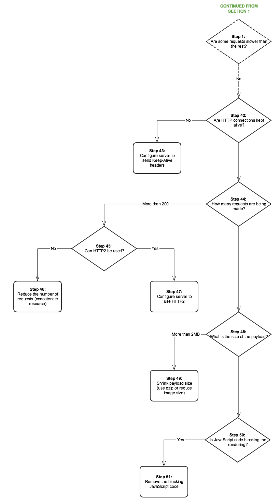

# 效能樹{#performance-tree}

## 範圍 {#scope}

下圖旨在提供關於為解決效能問題而採取的步驟的指導。 它分為五個部分，以便於閱讀。

圖中的每個步驟都連結到文檔資源或建議。

## 先決條件和假設 {#prerequisites-and-assumptions}

假設在給定頁面（控制台或網頁）上觀察到效能問AEM題，並且可以一致地再現。 在開始調查之前，必須具備test或監控效能的方法。

分析從步驟0開始。 目標是確定哪個實體(Dispatcher、外部主機或AEM)負責效能問題，然後確定應調查哪個區域（伺服器或網路）。

### 區段 1 {#section}

### 區段 2 {#section-1}

### 區段 3 {#section-2}

### 區段 4 {#section-3}

### 區段 5 {#section-4}

## 引用連結 {#reference-links}

<table>
 <tbody>
  <tr>
   <td><strong>步驟</strong></td>
   <td><strong>標題</strong></td>
   <td><strong>資源</strong></td>
  </tr>
  <tr>
   <td><strong>步驟 0</strong></td>
   <td>分析請求流</td>
   <td>
可以在瀏覽器中使用標準HTTP請求分析來分析請求流。 有關如何在Chrome上進行此分析的詳細資訊，請參閱：  
 
<a href="https://developers.google.com/web/tools/chrome-devtools/profile/network-performance/resource-loading">https://developer.chrome.com/docs/devtools/</a>  
 </td>
  </tr>
  <tr>
   <td><strong>步驟 2</strong></td>
   <td>是否來自外部主機的請求？</td>
   <td>可以在瀏覽器中使用標準HTTP請求分析來分析請求流。 請參閱上述有關如何在Chrome上進行此分析的連結。  </td>
  </tr>
  <tr>
   <td><strong>步驟 3</strong></td>
   <td>是否可以快取請求？</td>
   <td>有關可快取請求和一般Dispatcher效能優化建議的詳細資訊，請參見 <a href="/help/sites-deploying/configuring-performance.md#optimizing-performance-when-using-the-dispatcher">Dispatcher效能優化</a>。</td>
  </tr>
  <tr>
   <td><strong>步驟 4</strong></td>
   <td>是否來自Dispatcher的請求？</td>
   <td>
要查看請求是否正確快取，請檢查 <a href="https://experienceleague.adobe.com/docs/experience-manager-dispatcher/using/configuring/dispatcher-configuration.html?lang=en#debugging">調度程式調試文檔</a>。  
 </td>
  </tr>
  <tr>
   <td><strong>步驟 5</strong></td>
   <td>調度程式是否嘗試通過驗證每個請求AEM?</td>
   <td>檢查調度程式是否發送 <code>HEAD</code> 請求進行AEM身份驗證，然後再傳送快取資源。 查找 <code>HEAD</code> 請求AEM <code>access.log</code>。 有關詳細資訊，請參見 <a href="/help/sites-deploying/configure-logging.md">記錄</a>。  </td>
  </tr>
  <tr>
   <td><strong>步驟 6</strong></td>
   <td>Dispatcher的地理位置與用戶是否相距遙遠？</td>
   <td>將Dispatcher移近用戶。</td>
  </tr>
  <tr>
   <td><strong>步驟 7</strong></td>
   <td>Dispatcher的網路層是否正常？</td>
   <td>  調查網路層的飽和和延遲問題。
 
 </td>
  </tr>
  <tr>
   <td><strong>步驟 8</strong></td>
   <td>速度慢是否可通過本地實例複製？</td>
   <td>  
使用 <a href="/help/sites-developing/tough-day.md">艱難的一天</a> 從生產實例中複製「真實世界」條件。 如果此方案對於您的開發空間不現實，請確保在不同的網路上下文中test生產實例（或相同的分段實例）。  
 </td>
  </tr>
  <tr>
   <td><strong>步驟 9</strong></td>
   <td>伺服器的地理位置是否遠離用戶？</td>
   <td>將伺服器移近用戶。</td>
  </tr>
  <tr>
   <td><strong>步驟10和29</strong></td>
   <td>調查網路層</td>
   <td>
調查網路層的飽和和延遲問題。
 
對於作者層，建議延遲不超過100毫秒。
 
有關效能優化提示的詳細資訊，請參見 <a href="https://helpx.adobe.com/customer-care-office-hours/aem/6x-performance-tuning-best-practices.html">此頁</a>。
 </td>
  </tr>
  <tr>
   <td><strong>步驟 11</strong></td>
   <td>更近或為每個區域添加一個伺服器</td>
   <td> </td>
  </tr>
  <tr>
   <td><strong>步驟 12</strong></td>
   <td>伺服器故AEM障排除</td>
   <td>有關詳細資訊，請檢查圖中的以下子步驟。</td>
  </tr>
  <tr>
   <td><strong>步驟 13</strong></td>
   <td>檢查硬體要求</td>
   <td>查看文檔 <a href="/help/managing/hardware-sizing-guidelines.md">硬體調整指南</a>。  </td>
  </tr>
  <tr>
   <td><strong>步驟 14</strong></td>
   <td>檢查效能問題的常見原因</td>
   <td> </td>
  </tr>
  <tr>
   <td><strong>步驟 15</strong></td>
   <td>查找慢速請求</td>
   <td>
您可以通過分析 <code>request.log</code> 或 <code>rlog.jar</code>。
 
有關使用rlog.jar的詳細資訊，請參見此頁。
 
請參閱 <a href="/help/sites-deploying/monitoring-and-maintaining.md#using-rlog-jar-to-find-requests-with-long-duration-times">使用rlog.jar查找持續時間較長的請求</a>。  
 
 
 </td>
  </tr>
  <tr>
   <td><strong>步驟 16</strong></td>
   <td>配置檔案伺服器</td>
   <td>
有關可與一起使用的效能分析工具的AEM資訊，請參見 <a href="/help/sites-deploying/monitoring-and-maintaining.md#tools-for-monitoring-and-analyzing-performance">用於監控和分析效能的工具</a>。  
 </td>
  </tr>
  <tr>
   <td><strong>步驟 17</strong></td>
   <td>查找分析中的慢速方法</td>
   <td> </td>
  </tr>
  <tr>
   <td><strong>步驟 18</strong></td>
   <td>分析的常見情形</td>
   <td>請參閱 <a href="/help/sites-deploying/monitoring-and-maintaining.md#analyzing-specific-scenarios">分析特定方案</a> 在效能優化部分。  </td>
  </tr>
  <tr>
   <td><strong>步驟 19</strong></td>
   <td>100% CPU</td>
   <td><a href="/help/sites-deploying/monitoring-and-maintaining.md#monitoring-performance">https://experienceleague.adobe.com/docs/experience-manager-release-information/aem-release-updates/previous-updates/aem-previous-versions.html</a></td>
  </tr>
  <tr>
   <td><strong>步驟 20</strong></td>
   <td>記憶體不足</td>
   <td> 
    <ol>
     <li><a href="/help/sites-deploying/monitoring-and-maintaining.md#out-of-memory">記憶體不足</a></li>
     <li><a href="/help/sites-deploying/troubleshooting.md">我的應用程式拋出記憶體不足錯誤</a></li>
     <li><a href="https://experienceleague.adobe.com/docs/experience-cloud-kcs/kbarticles/KA-17482.html?lang=en">分析記憶體問題。</a>  </li>
    </ol> </td>
  </tr>
  <tr>
   <td><strong>步驟 21</strong></td>
   <td>磁碟I/O</td>
   <td>
查看 <a href="/help/sites-deploying/monitoring-and-maintaining.md#disk-i-o">磁碟I/O</a> 中的「監視和維護」。
 </td>
  </tr>
  <tr>
   <td><strong>步驟22和22.1</strong></td>
   <td>快取比率</td>
   <td>請參閱 <a href="/help/sites-deploying/configuring-performance.md#calculating-the-dispatcher-cache-ratio">計算Dispatcher快取比率</a>。    </td>
  </tr>
  <tr>
   <td><strong>步驟 23</strong></td>
   <td>慢速查詢</td>
   <td><a href="/help/sites-deploying/best-practices-for-queries-and-indexing.md">查詢和索引的最佳做法</a></td>
  </tr>
  <tr>
   <td><strong>步驟 24</strong></td>
   <td>儲存庫優化</td>
   <td>
    <ul>
     <li><a href="https://helpx.adobe.com/customer-care-office-hours/aem/6x-performance-tuning-best-practices.html">效能調整提示</a></li>
     <li><a href="/help/sites-deploying/configuring-performance.md#configuring-for-performance">配置效能</a></li>
     <li><a href="https://www.slideshare.net/jukka/repository-performance-tuning">儲存庫效能優化</a></li>
    </ul> </td>
  </tr>
  <tr>
   <td><strong>步驟 25</strong></td>
   <td>運行的工作流</td>
   <td>
    <ul>
     <li><a href="/help/sites-deploying/configuring-performance.md#concurrent-workflow-processing">併發工作流處理</a></li>
     <li><a href="/help/sites-deploying/configuring-performance.md#configure-the-queue-for-a-specific-workflow">配置特定工作流的隊列</a></li>
     <li><a href="/help/sites-administering/workflows-administering.md#regular-purging-of-workflow-instances">定期清除工作流實例</a></li>
     <li><a href="/help/sites-developing/workflows.md#transient-workflows">暫時性工作流程</a>  </li>
    </ul> 
 
 </td>
  </tr>
  <tr>
   <td><strong>步驟 26</strong></td>
   <td>MSM基礎架構</td>
   <td>
<a href="/help/sites-administering/msm-best-practices.md">多站點管理器最佳做法</a>  
 </td>
  </tr>
  <tr>
   <td><strong>步驟 27</strong></td>
   <td>資產調整</td>
   <td>
    <ol>
     <li><a href="/help/sites-deploying/configuring-performance.md#cq-dam-asset-synchronization-service">資產同步服務</a></li>
     <li><a href="/help/sites-deploying/configuring-performance.md#multiple-dam-instances">多個DAM實例</a></li>
     <li>效能調整提示文章 <a href="https://helpx.adobe.com/customer-care-office-hours/aem/6x-performance-tuning-best-practices.html">這裡</a>。  </li>
    </ol> </td>
  </tr>
  <tr>
   <td><strong>步驟 28</strong></td>
   <td>未關閉的會話</td>
   <td>
 
 
<a href="/help/sites-administering/troubleshoot.md#checking-for-unclosed-jcr-sessions">檢查未關閉的JCR會話</a>
 
 
 </td>
  </tr>
  <tr>
   <td><strong>步驟 30</strong></td>
   <td>更近地移動Dispatcher（每「區域」添加一個？）</td>
   <td> </td>
  </tr>
  <tr>
   <td><strong>步驟 31</strong></td>
   <td>在Dispatcher前面使用CDN</td>
   <td><a href="https://experienceleague.adobe.com/docs/experience-manager-dispatcher/using/dispatcher.html?lang=zh-Hant#using-dispatcher-with-a-cdn">搭配 CDN 使用 Dispatcher</a>  </td>
  </tr>
  <tr>
   <td><strong>步驟 32</strong></td>
   <td>要卸載服AEM務器，請在Dispatcher級別使用會話管理</td>
   <td>
<a href="https://experienceleague.adobe.com/docs/experience-manager-dispatcher/using/configuring/dispatcher-configuration.html?lang=en#enabling-secure-sessions-sessionmanagement">啟用安全會話</a>
 </td>
  </tr>
  <tr>
   <td><strong>步驟 33</strong></td>
   <td>使請求可快取</td>
   <td>
    <ol>
     <li><a href="https://experienceleague.adobe.com/docs/experience-manager-dispatcher/using/dispatcher.html?lang=zh-Hant">常規調度程式配置</a></li>
     <li><a href="https://experienceleague.adobe.com/docs/experience-manager-dispatcher/using/configuring/dispatcher-configuration.html?lang=en#configuring-the-dispatcher-cache-cache">配置Dispatcher快取</a></li>
    </ol> 
如何提高快取率；使請求可快取（Dispatcher最佳做法）
 
另外，請考慮以下設定以優化快取配置  

    <ol>
     <li>為非GET的HTTP請求設定無快取規則</li>
     <li>將查詢字串配置為不可快取</li>
     <li>不快取副檔名缺失的URL</li>
     <li>快取身份驗證標頭(自Dispatcher 4.1.10版以來可能)</li>
    </ol> </td>
  </tr>
  <tr>
   <td><strong>步驟 34</strong></td>
   <td>升級Dispatcher版本</td>
   <td>
您可以在以下位置下載最新的Dispatcher版本：
 
<a href="https://experienceleague.adobe.com/docs/experience-manager-dispatcher/using/getting-started/release-notes.html?lang=en">跟蹤連結</a>
 </td>
  </tr>
  <tr>
   <td><strong>步驟 35</strong></td>
   <td>設定 Dispatcher</td>
   <td><a href="https://experienceleague.adobe.com/docs/experience-manager-dispatcher/using/configuring/dispatcher-configuration.html?lang=zh-Hant">配置Dispatcher</a>  </td>
  </tr>
  <tr>
   <td><strong>步驟 36</strong></td>
   <td>檢查快取無效</td>
   <td> 
    <ul>
     <li><a href="https://experienceleague.adobe.com/docs/experience-manager-dispatcher/using/configuring/page-invalidate.html?lang=en#invalidating-dispatcher-cache-from-the-authoring-environment">作者層的快取無效；</a></li>
     <li><a href="https://experienceleague.adobe.com/docs/experience-manager-dispatcher/using/configuring/page-invalidate.html?lang=en#invalidating-dispatcher-cache-from-a-publishing-instance">發佈層的快取無效。</a></li>
    </ul> </td>
  </tr>
  <tr>
   <td><strong>步驟37和38</strong></td>
   <td>懶散載入</td>
   <td><a href="https://experienceleague.adobe.com/docs/experience-manager-gems-events/gems/gems2016/aem-web-performance.html?lang=en">請參閱Web效能上AEM的Gem會話。</a>  </td>
  </tr>
  <tr>
   <td><strong>步驟 39</strong></td>
   <td>使用預連接以減少連接開銷</td>
   <td>請參閱上面的Gem會話。 此外，W3c上的其他預連接文檔：<a href="https://html.spec.whatwg.org/#linkTypes"> https://html.spec.whatwg.org/#linkTypes</a></td>
  </tr>
  <tr>
   <td><strong>步驟40和41</strong>  </td>
   <td>外部主機延遲和響應時間</td>
   <td>調查外部主機的延遲和響應時間。</td>
  </tr>
  <tr>
   <td><strong>步驟45  和47</strong>  </td>
   <td>使用HTTP/2</td>
   <td>步驟37、38和39見創業板會議。 另外，請查看 <a href="https://help-forums.adobe.com/content/adobeforums/en/experience-manager-forum/adobe-experience-manager.topic.html/forum__kdzc-does_anyoneknowwhe.html">這個</a> 論壇發文介紹HTTP/2支援。  </td>
  </tr>
  <tr>
   <td><strong>步驟 49</strong></td>
   <td>收縮負載大小</td>
   <td><a href="/help/sites-deploying/osgi-configuration-settings.md">啟用Gzip</a> 和 <a href="https://experienceleague.adobe.com/docs/experience-manager-gems-events/gems/gems2016/aem-web-performance.html?lang=en">縮小影像大小</a>。  </td>
  </tr>
  <tr>
   <td><strong>步驟42和43</strong></td>
   <td>保持活動</td>
   <td>
是 <code>Keep-Alive</code> 不同請求中存在的重用連接的標頭？ 否則，這意味著每個請求都會導致另一個連接建立，這會帶來不必要的開銷。 （瀏覽器中的標準HTTP請求分析）
 
您可以檢查 <a href="/help/sites-administering/proxy-jar.md">代理伺服器工具</a> 檢查「保持活動」連接。  
 </td>
  </tr>
  <tr>
   <td><strong>步驟 44</strong></td>
   <td>請求數？</td>
   <td>在瀏覽器中執行標準HTTP請求分析。</td>
  </tr>
  <tr>
   <td><strong>步驟 46</strong></td>
   <td>減少請求數</td>
   <td>
    <ol>
     <li>連接資源（影像、CSS浮點、JSON）  </li>
     <li>客戶端嵌入：
      <ol>
       <li><a href="/help/sites-developing/clientlibs.md#creating-client-library-folders">建立客戶端庫資料夾</a>  — 請參閱標題使用嵌入最小化請求</li>
      </ol> </li>
    </ol> </td>
  </tr>
  <tr>
   <td><strong>步驟 48</strong></td>
   <td>負載的大小是多少？</td>
   <td>瀏覽器中的標準HTTP請求分析</td>
  </tr>
  <tr>
   <td><strong>步驟50和51</strong></td>
   <td>JS代碼阻止</td>
   <td><a href="https://experienceleague.adobe.com/docs/experience-manager-gems-events/gems/gems2016/aem-web-performance.html?lang=en">https://experienceleague.adobe.com/docs/experience-manager-gems-events/gems/gems2016/aem-web-performance.html?lang=en</a></td>
  </tr>
 </tbody>
</table>
