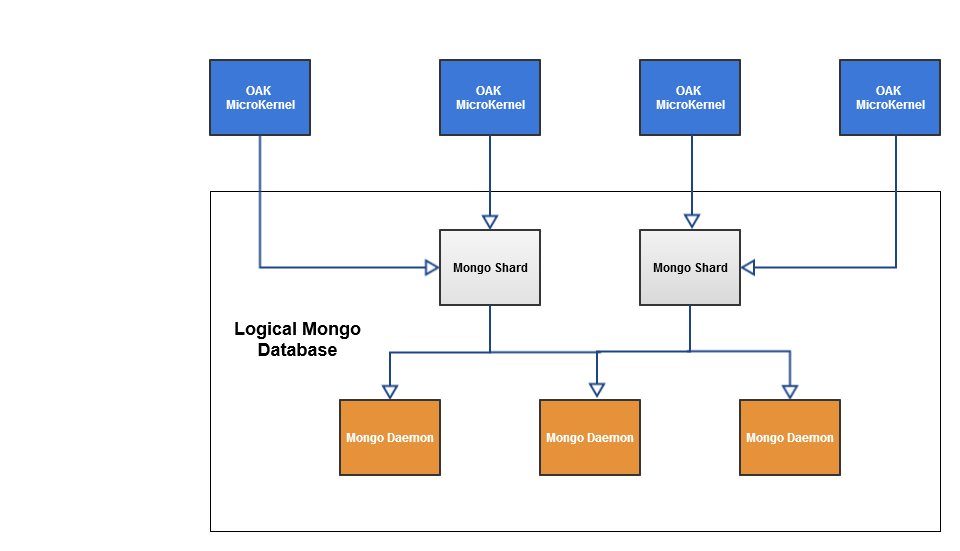

# 平台簡AEM介{#introduction-to-the-aem-platform}

6AEM號平台AEM基於Apache Jackrabbit Oak。

Apache Jackrabbit Oak致力於實施可擴展且效能優異的分層內容儲存庫，以作為現代世界級網站和其他要求苛刻的內容應用程式的基礎。

它是Jackrabbit 2的後繼版本，被AEM6用作其內容儲存庫CRX的預設後端。

## 設計原則和目標 {#design-principles-and-goals}

橡木器 [JSR-283](https://jcp.org/en/jsr/detail?id=283) (JCR 2.0)規格 其主要設計目標是：

* 更好地支援大型儲存庫
* 多個分佈式群集節點以實現高可用性
* 效能更好
* 支援許多子節點和訪問控制級別

## 體系結構概念 {#architecture-concept}

### 儲存空間 {#storage}

儲存層的目的是：

* 實現樹模型
* 使儲存可插拔
* 提供群集機制

### 橡樹 {#oak-core}

Oak Core為儲存層添加了幾層：

* 訪問級別控制
* 搜索和索引
* 觀察

### 橡木JCR {#oak-jcr}

Oak JCR的主要目的是將JCR語義轉化為樹操作。 它還負責：

* 實現JCR API
* 包含實現JCR約束的提交掛接

此外，非Java實現現在成為可能，也是Oak JCR概念的一部分。

## 儲存概述 {#storage-overview}

Oak儲存層為內容的實際儲存提供抽象層。

目前，在AEM6中有兩種儲存實現： **焦油儲存** 和 **MongoDB儲存**。

### 焦油儲存 {#tar-storage}

Tar儲存使用tar檔案。 它將內容儲存為較大段內的各種記錄類型。 日記帳用於跟蹤儲存庫的最新狀態。

它圍繞以下幾個關鍵設計原則而構建：

* **不可變段**

內容儲存在最高可達256 KB的資料段中。 它們是不可變的，因此可以輕鬆快取頻繁訪問的段並減少可能損壞儲存庫的系統錯誤。

每個段由唯一標識符(UUID)標識，並包含內容樹的連續子集。 此外，段可以引用其他內容。 每個段都保留其他引用段的UUID清單。

* **地區**

節點及其直接子項等相關記錄儲存在同一段中。 這樣，可以快速搜索儲存庫，並避免對於每個會話訪問多個相關節點的典型客戶端，大多數快取未命中。

* **緊湊**

記錄的格式設定已針對大小進行優化，以降低IO成本並盡可能地在快取中容納更多內容。

### Mongo儲存 {#mongo-storage}

MongoDB儲存使用MongoDB進行共用和群集。 儲存庫樹保留在一個MongoDB資料庫中，其中每個節點都是單獨的文檔。

它有幾個特點：

* 修訂

對於內容的每次更新（提交），都會建立新修訂。 修訂版本基本上是由三個元素組成的字串：

1. 從其上生成的電腦的系統時間派生的時間戳
1. 用於區分使用相同時間戳建立的修訂的計數器
1. 建立修訂版的群集節點ID

* 分支

支援分支，這允許客戶端存放多個更改，並通過單個合併調用使這些更改可見。

* 以前的文檔

MongoDB儲存將每次修改的資料添加到文檔。 但是，只有在顯式觸發清理時，才會刪除資料。 當滿足某個閾值時，將移動舊資料。 以前的文檔只包含不可變的資料，這意味著它們只包含已提交和合併的修訂。

* 群集節點元資料

有關活動和非活動群集節點的資料保存在資料庫中，以便於群集操作。

具有MongoDB存AEM儲的典型群集設定：

## 跟Jackrabbit 2有什麼不同？ {#what-is-different-from-jackrabbit}

由於Oak向後相容JCR 1.0標準，因此用戶級別幾乎沒有變化。 但是，在設定基於Oak的安裝時，您必須考慮一些明顯的差AEM異：

* Oak不會自動建立索引。 因此，必要時必須建立自定義索引。
* 與Jackrabbit 2不同，會話始終反映儲存庫的最新狀態，而Oak會話反映從獲取會話時儲存庫的穩定視圖。 原因是Oak所基於的MVCC模型。
* Oak中不支援同名同級(SNS)。

## 其他平台相關文檔 {#other-platform-related-documentation}

有關平台的詳細信AEM息，請查看以下文章：

* [在6中配置節點儲存和資料AEM儲存](/help/sites-deploying/data-store-config.md)
* [Oak查詢和索引](/help/sites-deploying/queries-and-indexing.md)
* [6中的儲存元AEM素](/help/sites-deploying/storage-elements-in-aem-6.md)
* [帶AEMMongoDB](/help/sites-deploying/aem-with-mongodb.md)
