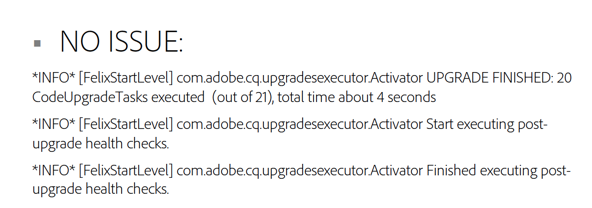

# 升級後檢查和故障排除{#post-upgrade-checks-and-troubleshooting}

## 升級後檢查 {#post-upgrade-checks}

遵循 [就地升級](/help/sites-deploying/in-place-upgrade.md) 應執行以下活動以完成升級。 假定已AEM在6.5 jar中啟動，並且已部署升級的代碼庫。

* [驗證日誌是否升級成功](#main-pars-header-290365562)

* [驗證OSGi捆綁包](#main-pars-header-1637350649)

* [驗證Oak版本](#main-pars-header-1293049773)

* [InspectPreUpgradeBackup資料夾](#main-pars-header-988995987)

* [頁面的初始驗證](#main-pars-header-20827371)
* [應用AEMService Pack](#main-pars-header-215142387)

* [遷移功AEM能](#main-pars-header-1434457709)

* [驗證計畫維護配置](#main-pars-header-1552730183)

* [啟用複製代理](#main-pars-header-823243751)

* [啟用自定義計畫作業](#main-pars-header-244535083)

* [執行Test計畫](#main-pars-header-1167972233)

### 驗證升級成功的日誌 {#verify-logs-for-upgrade-success}

**升級.log**

過去，檢查實例的升級後狀態需要仔細檢查各種日誌檔案、儲存庫的部分和啟動板。 生成升級後報告有助於在投入使用前檢測有缺陷的升級。

此功能的主要目的是減少需要手動解釋或跨多個端點的複雜分析邏輯，以驗證升級成功與否。 該解決方案旨在為外部自動化系統提供明確的資訊，以便對更新的成功或確定的失敗做出反應。

更具體地說，它確保：

* 升級框架檢測到的升級失敗可以集中在單個升級報告中；
* 升級報告包括有關必要手動干預的指標。

為了滿足此要求，已對中的日誌生成方式進行了更改 `upgrade.log` 的子菜單。

下面是一個示例報告，它顯示升級期間沒有錯誤：



下面是一個示例報告，它顯示了升級過程中未安裝的包：


**錯誤.log**

在使用目標版本jar的啟動過程中和之後，應仔細AEM檢查error.log。 應檢查任何警告或錯誤。 一般來說，最好在日誌開頭查找問題。 日誌中稍後發生的錯誤實際上可能是檔案中較早調用的根本原因的副作用。 如果出現重複錯誤和警告，請參閱下面 [分析升級中的問題](/help/sites-deploying/post-upgrade-checks-and-troubleshooting.md#analyzing-issues-with-the-upgrade)。

### 驗證OSGi捆綁包 {#verify-osgi-bundles}

導航到OSGi控制台 `/system/console/bundles` 並查看是否未啟動任何捆綁。 如果任何捆綁包處於已安裝狀態，請咨詢 `error.log` 確定根問題。

### 驗證Oak版本 {#verify-oak-version}

升級後，您應看到Oak版本已更新為 **1.10.2**。 要驗證Oak版本，請導航到OSGi控制台，並查看與Oak捆綁包關聯的版本：橡樹岩心，橡樹公地，橡樹林塔。

### InspectPreUpgradeBackup資料夾 {#inspect-preupgradebackup-folder}

在升級期間AEM，將嘗試備份自定義項並將其儲存在下面 `/var/upgrade/PreUpgradeBackup/<time-stamp-of-upgrade>`。 要查看CRXDE Lite中的此資料夾，您可能需要 [臨時啟用CRXDE Lite](/help/sites-administering/enabling-crxde-lite.md)。

帶有時間戳的資料夾應具有名為 `mergeStatus` 值為 `COMPLETED`。 的 **待處理** 資料夾應為空，並且 **覆蓋** 節點指示在升級期間覆蓋了哪些節點。 內容 **剩飯** 節點指示升級期間無法安全合併的內容。 如果您的實施依賴於任何子節點（升級的代碼包尚未安裝），則需要手動合併這些節點。

如果在階段或生產環境中，則禁用本練習後的CRXDE Lite。

### 頁面的初始驗證 {#initial-validation-of-pages}

對中的幾頁執行初始驗AEM證。 如果升級「作者」環境，請開啟「開始」頁和「歡迎」頁( `/aem/start.html`。 `/libs/cq/core/content/welcome.html`)。 在「作者」和「發佈」環境中，都會開啟幾個正確呈現的應用程式頁面和煙霧test。 如果出現任何問題，請咨詢 `error.log` 排除故障。

### 應用AEMService Pack {#apply-aem-service-packs}

如果已發AEM布任何相關的6.5 Service Pack，請應用它們。

### 遷移功AEM能 {#migrate-aem-features}

升級後，中AEM的幾項功能需要執行其他步驟。 這些功能和在6.5中遷移它們的步AEM驟的完整清單可在 [升級代碼和自定義](/help/sites-deploying/upgrading-code-and-customizations.md) 的子菜單。

### 驗證計畫維護配置 {#verify-scheduled-maintenance-configurations}

#### 啟用資料儲存垃圾收集 {#enable-data-store-garbage-collection}

如果使用檔案資料儲存，請確保已啟用資料儲存垃圾收集任務並將其添加到每週維護清單中。 說明已概述 [這裡](/help/sites-administering/data-store-garbage-collection.md)。

>[!NOTE]
>
>不建議在S3自定義資料儲存安裝或使用共用資料儲存時使用此選項。

#### 啟用聯機修訂版清除 {#enable-online-revision-cleanup}

如果使用MongoMK或新的TarMK段格式，請確保已啟用「修訂版清理」任務並將其添加到「每日維護」清單中。 說明 [這裡](/help/sites-deploying/revision-cleanup.md)。

### 執行Test計畫 {#execute-test-plan}

根據定義執行詳細test計畫 [升級代碼和自定義](/help/sites-deploying/upgrading-code-and-customizations.md) 下 **Test過程** 的子菜單。

### 啟用複製代理 {#enable-replication-agents}

在完全升級和驗證發佈環境後，在作者環境上啟用複製代理。 驗證代理是否能夠連接到相應的發佈實例。 參見U [升級過程](/help/sites-deploying/upgrade-procedure.md) 的子菜單。

### 啟用自定義計畫作業 {#enable-custom-scheduled-jobs}

此時可以啟用作為代碼庫一部分的任何計畫作業。

## 分析升級中的問題 {#analyzing-issues-with-upgrade}

本節包含升級到6.3時可能遇到的一些AEM問題方案。

這些方案應有助於跟蹤與升級相關問題的根本原因，並有助於確定項目或產品特定問題。

### 儲存庫遷移失敗  {#repository-migration-failing-}

從CRX2到Oak的資料遷移對於從基於CQ 5.4的源實例開始的任何情形都應是可行的。確保您完全遵循本文檔中的升級說明，其中包括 `repository.xml`，確保未通過JAAS啟動自定義驗證器，並且在啟動遷移之前已檢查實例是否不一致。

如果遷移仍然失敗，您可以通過檢查 `upgrade.log`。 如果問題尚未確定，請向客戶支援報告。

### 升級未運行 {#the-upgrade-did-not-run}

在開始準備步驟之前，請確保運行 **源** 實例，首先使用java -jar aem-quickstart.jar命令執行它。 為確保正確生成quickstart.properties檔案，需要執行此操作。 如果缺失，升級將無法工作。 或者，您可以通過查看下面來檢查檔案是否存在 `crx-quickstart/conf` 的子常式。 此外，在AEM開始升級時，必須使用java -jar aem-quickstart.jar命令執行。 從啟動指令碼啟動不會在升AEM級模式下啟動。

### 包和包無法更新  {#packages-and-bundles-fail-to-update-}

如果在升級期間無法安裝軟體包，則它們包含的軟體包也不會更新。 此類問題通常由資料儲存配置錯誤引起。 它們還將顯示為 **錯誤** 和 **警告** error.log中的消息。 由於在大多數情況下預設登錄可能無法工作，因此您可以直接使用CRXDE來檢查和查找配置問題。

### 某AEM些束未切換到活動狀態 {#some-aem-bundles-are-not-switching-to-the-active-state}

如果捆綁包未啟動，則應檢查是否存在任何未滿足的依賴關係。

如果存在此問題，但是它基於失敗的軟體包安裝，導致無法升級軟體包，這些軟體包將被視為與新版本不相容。 有關如何解決此問題的詳細資訊，請參見 **包和包無法更新** 上。

還建議將新6.5實例的捆綁包清單與已升級實例進行比較AEM，以檢測未升級的捆綁包。 這將提供更詳細的搜索範圍 `error.log`。

### 自定義捆綁包不切換到活動狀態 {#custom-bundles-not-switching-to-the-active-state}

如果您的自定義捆綁包未切換到活動狀態，則很可能有代碼未導入更改API。 這通常會導致不滿足的依賴關係。

刪除的API應在以前的某個版本中標籤為不建議使用。 您可能會在此棄用通知中找到有關直接遷移代碼的說明。 Adobe旨在盡可能地實現語義版本化，以便版本可以指示斷開的更改。

最好還檢查是否絕對需要導致問題的更改，如果不需要，則還原。 另外，在嚴格的語義版本化後，檢查是否超出必要時增加了包導出的版本增加。

### 故障平台UI {#malfunctioning-platform-ui}

如果某些UI功能在升級後無法正常工作，則應首先檢查介面的自定義覆蓋。 某些結構可能已更改，重疊可能需要更新或已過時。

接下來，檢查是否有任何Javascript錯誤，這些錯誤可以跟蹤到連接到客戶端庫的自定義添加的擴展。 同樣適用於可能導致佈局問題的自定義CSSAEM。

最後，檢查Javascript可能無法處理的配置錯誤。 通常情況下擴展失效不正確。

### 故障自定義元件、模板或UI擴展 {#malfunctioning-custom-components-templates-or-ui-extensions}

在大多數情況下，這些問題的根本原因與未啟動的捆綁包或未安裝的捆綁包的根本原因相同，而問題最初使用元件時開始出現的唯一差異。

處理錯誤自定義代碼的方法是首先執行煙霧test，以找出原因。 一旦找到它，請查看此中的建議 [連結] 關於修複方法的部分。

### /etc下缺少自定義項 {#missing-customizations-under-etc}

`/apps` 和 `/libs` 由升級處理，但更改 `/etc` 可能需要手動從 `/var/upgrade/PreUpgradeBackup` 升級後。 確保檢查此位置是否有需要手動合併的任何內容。

### 分析error.log和upgrade.log {#analyzing-the-error.log-and-upgrade.log}

在大多數情況下，需要查閱日誌以查找錯誤的原因。 但是，在升級時，也必須監視依賴關係問題，因為舊的捆綁包可能無法正確升級。

執行此操作的最佳方法是刪除錯誤.log，刪除所有與您所面對的問題無關的消息。 您可以通過如grep這樣的工具，使用：

```shell
grep -v UnrelatedErrorString
```

某些錯誤消息可能不會立即解釋。 在這種情況下，查看發生錯誤的上下文也有助於瞭解錯誤的建立位置。 您可以使用以下方法來分離錯誤：

* `grep -B` 在錯誤前添加行；

或

* `grep -A` 添加行。

在某些情況下，還可以找到WARN消息，因為可能存在導致此狀態的有效案例，並且應用程式並不總是能夠確定這是否是實際錯誤。 確保您也查閱這些消息。

### 連絡 Adobe 支援人員 {#contacting-adobe-support}

如果您已瀏覽了本頁上的建議，但仍在看到問題，請聯繫Adobe支援。 要向處理您的案例的支援工程師提供盡可能多的資訊，請確保從升級中包括upgrade.log檔案。
