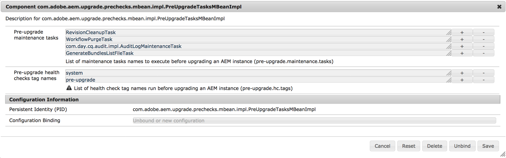

# 升級前維護任務{#pre-upgrade-maintenance-tasks}

在開始升級之前，請務必執行這些維護任務，以確保系統已就緒，並且如果出現以下問題，可以回滾：

* [確保有足夠的磁碟空間](/help/sites-deploying/pre-upgrade-maintenance-tasks.md#ensure-sufficient-disk-space)
* [完全備份AEM](/help/sites-deploying/pre-upgrade-maintenance-tasks.md#fully-back-up-aem)
* [備份/etc的更改](/help/sites-deploying/pre-upgrade-maintenance-tasks.md#backup-changes-etc)
* [生成quickstart.properties檔案](/help/sites-deploying/pre-upgrade-maintenance-tasks.md#generate-quickstart-properties)
* [配置工作流和審核日誌清除](/help/sites-deploying/pre-upgrade-maintenance-tasks.md#configure-wf-audit-purging)
* [安裝、配置和運行升級前任務](/help/sites-deploying/pre-upgrade-maintenance-tasks.md#install-configure-run-pre-upgrade-tasks)
* [禁用自定義登錄模組](/help/sites-deploying/pre-upgrade-maintenance-tasks.md#disable-custom-login-modules)
* [從/install目錄中刪除更新](/help/sites-deploying/pre-upgrade-maintenance-tasks.md#remove-updates-install-directory)
* [停止任何冷備用實例](/help/sites-deploying/pre-upgrade-maintenance-tasks.md#stop-tarmk-coldstandby-instance)
* [停用自訂排程工作](/help/sites-deploying/pre-upgrade-maintenance-tasks.md#disable-custom-scheduled-jobs)
* [執行離線修訂清除](/help/sites-deploying/pre-upgrade-maintenance-tasks.md#execute-offline-revision-cleanup)
* [執行資料儲存廢棄項目收集](/help/sites-deploying/pre-upgrade-maintenance-tasks.md#execute-datastore-garbage-collection)
* [視需要升級資料庫模式](/help/sites-deploying/pre-upgrade-maintenance-tasks.md#upgradethedatabaseschemaifneeded)
* [刪除可能妨礙升級的用戶](/help/sites-deploying/pre-upgrade-maintenance-tasks.md#delete-users-that-might-hinder-the-upgrade)

* [旋轉日誌檔案](/help/sites-deploying/pre-upgrade-maintenance-tasks.md#rotate-log-files)

## 確保有足夠的磁碟空間 {#ensure-sufficient-disk-space}

執行升級時，除了內容和代碼升級活動外，還需要執行儲存庫遷移。 遷移將以新的段Tar格式建立儲存庫的副本。 因此，您需要足夠的磁碟空間來保留第二個可能更大的儲存庫版本。

## 完全備份AEM {#fully-back-up-aem}

AEM應在開始升級之前完全備份。 請務必備份您的儲存庫、應用程式安裝、資料儲存和Mongo實例（如果適用）。 如需有關備份和還原AEM例項的詳細資訊，請參 [閱備份和還原](/help/sites-administering/backup-and-restore.md)。

## 備份/etc的更改 {#backup-changes-etc}

升級過程在維護和合併儲存庫中現有內容和配置方面做 `/apps` 得 `/libs` 很好。 對於路徑所做的 `/etc` 更改（包括上下文集線器配置），通常需要在升級後重新應用這些更改。 雖然升級將對任何無法合併的更改進行備份，但我們建議在開始升級之 `/var`前手動備份這些更改。

## 生成quickstart.properties檔案 {#generate-quickstart-properties}

從jar檔案啟動AEM時，會在 `quickstart.properties` 下產生檔案 `crx-quickstart/conf`。 如果AEM過去只是以start指令碼啟動，此檔案將不存在，而且升級將會失敗。 請務必檢查此檔案是否存在，並從jar檔案重新啟動AEM（若未存在）。

## 配置工作流和審核日誌清除 {#configure-wf-audit-purging}

這些 `WorkflowPurgeTask` 和任 `com.day.cq.audit.impl.AuditLogMaintenanceTask` 務需要單獨的OSGi配置，沒有它們將無法工作。 如果在升級前任務執行期間失敗，則最可能的原因是缺少配置。 因此，如果您不想運行這些任務，請務必為這些任務添加OSGi配置，或將它們從升級前優化任務清單中完全刪除。 如需設定工作流程清除工作的檔案，請參閱「管理工作流程例項 [」(](/help/sites-administering/workflows-administering.md) Administering Workflow Instances [)，而「稽核記錄維護」(audit log Maintenance in AEM 6](/help/sites-administering/operations-audit-log.md))則提供稽核記錄維護工作設定。

如需CQ 5.6上的工作流程和稽核記錄清除，以及AEM 6.0上的稽核記錄清除，請參閱「清 [除工作流程和稽核節點」](https://helpx.adobe.com/experience-manager/kb/howtopurgewf.html)。

## 安裝、配置和運行升級前任務 {#install-configure-run-pre-upgrade-tasks}

由於AEM所允許的自訂層級，環境通常無法遵循統一的升級方式。 因此，建立標準化的升級程式是個困難的程式。

在舊版中，AEM升級也很難停止或無法安全恢復。 這會導致需要重新啟動完整升級程式或執行有缺陷的升級而未觸發任何警告的情況。

為瞭解決這些問題，Adobe在升級程式中增加了數種增強功能，讓其更具彈性，而且更方便使用。 以前必須手動執行的升級前維護任務正在優化和自動化。 此外，已新增升級後報表，讓程式可以完全審查，以期更容易發現任何問題。

升級前維護任務目前分散在手動執行部分或全部的各種介面上。 AEM 6.3中引進的升級前維護最佳化功能，可讓您以統一的方式觸發這些工作，並可視需要檢查結果。

升級前最佳化步驟中包含的所有工作都與AEM 6.0以後的所有版本相容。

### 如何設定 {#how-to-set-it-up}

在AEM 6.3和更新版本中，快速啟動jar中包含升級前維護最佳化工作。 如果您是從舊版AEM 6升級，則可透過個別的套件取得，您可從「套件管理員」下載。

您可以在以下位置找到包：

* [從AEM 6.0升級](https://www.adobeaemcloud.com/content/marketplace/marketplaceProxy.html?packagePath=/content/companies/public/adobe/packages/cq600/product/pre-upgrade-tasks-content-cq60)

* [從AEM 6.1升級](https://www.adobeaemcloud.com/content/marketplace/marketplaceProxy.html?packagePath=/content/companies/public/adobe/packages/cq610/product/pre-upgrade-tasks-content-cq61)

* [從AEM 6.2升級](https://www.adobeaemcloud.com/content/marketplace/marketplaceProxy.html?packagePath=/content/companies/public/adobe/packages/cq620/product/pre-upgrade-tasks-content-cq62)

### How to Use It {#how-to-use-it}

OSGI `PreUpgradeTasksMBean` 元件已預先設定好升級前維護工作清單，可一次執行。 您可以按照以下過程配置任務：

1. 瀏覽至https://serveraddress:serverport/system/console/configMgr以前往Web Console(網頁控制 *台)*

1. 搜尋「預&#x200B;**升級任務**」，然後按一下第一個相符的元件。 元件的完整名稱為 `com.adobe.aem.upgrade.prechecks.mbean.impl.PreUpgradeTasksMBeanImpl`

1. 修改需要運行的維護任務清單，如下所示：

   

根據用於啟動實例的運行模式，任務清單會有所不同。 以下是每個維護任務的運行模式說明。

<table>
 <tbody>
  <tr>
   <td><strong>任務</strong></td>
   <td><strong>執行模式</strong></td>
   <td><strong>附註</strong></td>
  </tr>
  <tr>
   <td><code>TarIndexMergeTask</code></td>
   <td>crx2</td>
   <td> </td>
  </tr>
  <tr>
   <td><code>DataStoreGarbageCollectionTask</code></td>
   <td>crx2</td>
   <td>會進行標籤和掃描。 對於共用資料存放區，請移除此步驟<br /> ，然後在執行前手動或正確準備執行個體。</td>
  </tr>
  <tr>
   <td><code>ConsistencyCheckTask</code></td>
   <td>crx2</td>
   <td> </td>
  </tr>
  <tr>
   <td><code>WorkflowPurgeTask</code></td>
   <td>crx2/crx3</td>
   <td>必須先設定Adobe Granite Workflow Purge Configuration OSGi，才能執行。</td>
  </tr>
  <tr>
   <td><code>GenerateBundlesListFileTask</code></td>
   <td>crx2/crx3</td>
   <td> </td>
  </tr>
  <tr>
   <td><code>RevisionCleanupTask</code></td>
   <td>crx3</td>
   <td>對於AEM 6.0到6.2上的TarMK例項，請改為手動執行「離線修訂清除」。</td>
  </tr>
  <tr>
   <td><code>com.day.cq.audit.impl.AuditLogMaintenanceTask</code></td>
   <td>crx3</td>
   <td>必須在運行前配置Audit Log Purge Scheduler OSGi配置。</td>
  </tr>
 </tbody>
</table>

>[!CAUTION]
>
>`DataStoreGarbageCollectionTask` 正在調用帶有標籤和掃描階段的資料儲存廢棄項目收集操作（如果使用）。 對於使用共用資料儲存的部署，請確保重新配置或正確地準備實例，以避免刪除其他實例引用的項。 這可能需要在觸發此升級前任務之前，在所有實例上手動運行標籤階段。

### Pre-Upgrade Health Checks的預設配置 {#default-configuration-of-the-pre-upgrade-health-checks}

OSGI `PreUpgradeTasksMBeanImpl` 元件會預先設定升級前狀態檢查標籤清單，以便在呼叫方法時 `runAllPreUpgradeHealthChecks` 執行：

* **system** - granite維護健康檢查所使用的標籤

* **pre-upgrade** —— 這是自訂標籤，可新增至您可設定為在升級前執行的所有健康狀況檢查

可編輯清單。 您可以使用標 **簽以外的加號** (+)和減號 **** (-)按鈕來新增更多自訂標籤，或移除預設標籤。

**MBean方法**

可使用 [JMX控制台訪問受管理的Bean功能](/help/sites-administering/jmx-console.md)。

您可以通過以下方式訪問MBean:

1. 前往JMX主控台，網址為 *https://serveraddress:serverport/system/console/jmx*
1. 搜索 **PreUpgradeTasks** ，然後按一下結果

1. 從「操作」( **Operations** )部分選擇任何方法，並在以 **下窗口中選擇「調用** 」(Invoke)。

以下是所有可用方法的清單，這些方法會公 `PreUpgradeTasksMBeanImpl` 開：

<table>
 <tbody>
  <tr>
   <td><strong>方法名稱</strong></td>
   <td><strong>類型</strong></td>
   <td><strong>說明</strong></td>
  </tr>
  <tr>
   <td><code>getAvailablePreUpgradeTasksNames()</code></td>
   <td>資訊</td>
   <td>顯示可用的升級前維護任務名稱清單。</td>
  </tr>
  <tr>
   <td><code>getAvailablePreUpgradeHealthChecksTagNames()</code></td>
   <td>資訊</td>
   <td>顯示升級前運行狀況檢查標籤名稱的清單。</td>
  </tr>
  <tr>
   <td><code>runAllPreUpgradeTasks()</code></td>
   <td>動作</td>
   <td>運行清單中的所有升級前維護任務。</td>
  </tr>
  <tr>
   <td><code>runPreUpgradeTask(preUpgradeTaskName)</code></td>
   <td>動作</td>
   <td>以參數的名稱運行升級前維護任務。</td>
  </tr>
  <tr>
   <td><code>isRunAllPreUpgradeTaskRunning()</code></td>
   <td>ACTION_INFO</td>
   <td>檢查任務 <code>runAllPreUpgradeTasksmaintenance</code> 當前是否正在運行。</td>
  </tr>
  <tr>
   <td><code>getAnyPreUpgradeTaskRunning()</code></td>
   <td>ACTION_INFO</td>
   <td>檢查是否當前正在運行任何升級前維護任務<br /> ，並返回包含當前正在運行任務名稱的陣列。</td>
  </tr>
  <tr>
   <td><code>getPreUpgradeTaskLastRunTime(preUpgradeTaskName)</code></td>
   <td>動作</td>
   <td>顯示升級前維護任務的確切運行時間，其名稱為參數。</td>
  </tr>
  <tr>
   <td><code>getPreUpgradeTaskLastRunState(preUpgradeTaskName)</code></td>
   <td>動作</td>
   <td>顯示升級前維護任務的上次運行狀態，其名稱為參數。</td>
  </tr>
  <tr>
   <td><code>runAllPreUpgradeHealthChecks(shutDownOnSuccess)</code></td>
   <td>動作</td>
   <td><p>執行所有升級前的健康狀況檢查，並將其狀態儲存在位於sling <code>preUpgradeHCStatus.properties</code> home路徑中的名稱檔案中。 如果參 <code>shutDownOnSuccess</code> 數設為 <code>true</code>,AEM例項將會關閉，但前提是所有升級前的健康狀況檢查都有「正常」狀態。</p> <p>屬性檔案將用作將來任何升級的先決條件<br /> ，如果升級前運行狀況檢查執行失敗，升級過程將停止<br /> 。 如果您想忽略升級前運行狀況檢查的結果<br /> ，並且仍要啟動升級，則可以刪除該檔案。</p> </td>
  </tr>
  <tr>
   <td><code>detectUsageOfUnavailableAPI(aemVersion)</code></td>
   <td>動作</td>
   <td>列出在升級至指定的AEM版本時<br /> ，將不再符合的所有匯入封裝。 目標AEM版本必須以參數<br /> 形式提供。</td>
  </tr>
 </tbody>
</table>

>[!NOTE]
>
>MBean方法可以通過以下方式調用：
>
>* JMX主控台
>* 連線至JMX的任何外部應用程式
>* cURL
>


## 禁用自定義登錄模組 {#disable-custom-login-modules}

>[!NOTE]
>
>只有當您從AEM 5版本升級時，才需要此步驟。 您可完全略過它，以取得舊版AEM 6的升級。

在Apache Oak中， `LoginModules` 在資料庫層級設定自訂驗證的方式已發生根本改變。

在使用CRX2組態的AEM版本中，會將它放在檔案中，而從 `repository.xml` AEM 6開始，則會透過Web Console在Apache Felix JAAS Configuration Factory服務中完成。

因此，升級後，必須停用並重新建立Apache Oak的任何現有組態。

要禁用在的JAAS配置中定義的自定義模 `repository.xml`塊，您需要修改配置以使用預設 `LoginModule`值，如以下示例：

```xml
<Security >
             ....
          <!--
                 Use LoginModule authenticating against repository itself
                 -->
                 <LoginModule class = "com.day.crx.core.CRXLoginModule" >
                     <param name = "anonymousId" value = "anonymous" />
                     <param name = "adminId" value ="admin" />
                     <param name = "disableNTLMAuth" value = "true" />
                     <param name = "tokenExpiration" value = "43200000" />
                     <!-- param name="trust_credentials_attribute" value="d5b9167e95dad6e7d3b5d6fa8df48af8"/
                -->
                 </LoginModule >
         </ Security>
```

>[!NOTE]
>
>如需詳細資訊，請參 [閱使用外部登入模組進行驗證](https://jackrabbit.apache.org/oak/docs/security/authentication/externalloginmodule.html)。
>
>如需AEM 6中 `LoginModule` 的設定範例，請參 [閱「使用AEM 6設定LDAP](/help/sites-administering/ldap-config.md)」。

## 從/install目錄中刪除更新 {#remove-updates-install-directory}

>[!NOTE]
>
>只會在關閉AEM例項後，從crx-quickstart/install目錄移除套件。 這是開始就地升級程式之前的最後步驟之一。

刪除通過本地檔案系統上的目錄部署的所有服務包 `crx-quickstart/install` 、功能包或修補程式。 如此可避免在更新完成後，在新AEM版本之上意外安裝舊的修補程式和服務套件。

## 停止任何冷備用實例 {#stop-tarmk-coldstandby-instance}

如果使用TarMK冷備用，請停止任何冷備用實例。 這些功能可確保在升級時有效率地回到線上。 升級成功後，需要從升級的主實例重建冷備用實例。

## 停用自訂排程工作 {#disable-custom-scheduled-jobs}

停用應用程式程式碼中包含的任何OSGi排程工作。

## 執行離線修訂清除 {#execute-offline-revision-cleanup}

>[!NOTE]
>
>此步驟僅對於TarMK安裝是必要的

如果使用TarMK，您應在升級前執行離線修訂清除。 這將使儲存庫遷移步驟和後續升級任務的執行速度大大加快，並有助於確保線上修訂清除功能在升級完成後能夠成功執行。 有關運行離線修訂清除的資訊，請參 [閱執行離線修訂清除](/help/sites-deploying/storage-elements-in-aem-6.md#performing-offline-revision-cleanup)。

## 執行資料儲存廢棄項目收集 {#execute-datastore-garbage-collection}

>[!NOTE]
>
>只有執行crx3的例項才需要此步驟

對CRX3實例運行修訂清除後，您應運行資料儲存廢棄項目收集來刪除資料儲存中任何未引用的blob。 如需指示，請參閱 [Data Store Garbage Collection的檔案](/help/sites-administering/data-store-garbage-collection.md)。

## 視需要升級資料庫模式 {#upgrade-the-database-schema-if-needed}

通常，用於永續性的基礎Apache Oak stack AEM會視需要負責升級資料庫架構。

但是，當模式無法自動升級時，可能會發生這種情況。 這些環境大多是高安全性環境，資料庫在權限非常有限的用戶下運行。 如果發生此情況，AEM將繼續使用舊的架構。

為防止這種情況發生，您需要按照以下過程升級模式：

1. 關閉需要升級的AEM例項。
1. 升級資料庫模式。 請查閱您的資料庫類型檔案，以瞭解您要達到此目的，需要使用哪些工具。

   如需Oak如何處理架構升級的詳細資訊，請參 [閱Apache網站的本頁](https://jackrabbit.apache.org/oak/docs/nodestore/document/rdb-document-store.html#upgrade)。

1. 繼續升級AEM。

## 刪除可能妨礙升級的用戶 {#delete-users-that-might-hinder-the-upgrade}

>[!NOTE]
>
>只有在下列情況下，才需要執行此升級前維護任務：
>
>* 您是從AEM 6.3以前的AEM版本升級
>* 在升級期間，您會遇到下列任何錯誤。
>


有些例外的情況是，服務使用者可能會以舊版AEM錯誤地標籤為一般使用者。

如果發生此情況，升級將失敗，並出現如下訊息：

```
ERROR [Apache Sling Repository Startup Thread] com.adobe.granite.repository.impl.SlingRepositoryManager Exception in a SlingRepositoryInitializer, SlingRepository service registration aborted
java.lang.RuntimeException: Unable to create service user [communities-utility-reader]:java.lang.RuntimeException: Existing user communities-utility-reader is not a service user.
```

為瞭解決此問題，請確定您執行下列動作：

1. 將例項與生產流量分離
1. 建立導致問題的用戶的備份。 您可以通過「包管理器」執行此操作。 如需詳細資訊，請參 [閱如何使用套件。](/help/sites-administering/package-manager.md)
1. 刪除導致問題的用戶。 以下是可能屬於此類別的使用者清單：

   1. `dynamic-media-replication`
   1. `communities-ugc-writer`
   1. `communities-utility-reader`
   1. `communities-user-admin`
   1. `oauthservice`
   1. `sling-scripting`

## 旋轉日誌檔案 {#rotate-log-files}

建議您在開始升級之前，先封存您目前的記錄檔。 這樣，在升級期間和升級後監視和掃描日誌檔案將更加容易，以識別和解決可能發生的任何問題。
