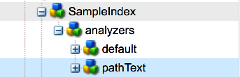

# Oak查詢和索引{#oak-queries-and-indexing}

>[!NOTE]
>
>本文的主題是在AEM 6中設定索引。 有關優化查詢和索引效能的最佳實踐，請參 [閱查詢和索引的最佳實踐](/help/sites-deploying/best-practices-for-queries-and-indexing.md)。

## 簡介 {#introduction}

與Jackrabbit 2不同，Oak預設不會為內容建立索引。 自訂索引需要在需要時建立，就像使用傳統的關聯式資料庫。 如果沒有特定查詢的索引，則可能會遍歷許多節點。 查詢可能仍然有效，但可能非常慢。

如果Oak遇到沒有索引的查詢，則會列印WARN級別的記錄訊息：

```xml
*WARN* Traversed 1000 nodes with filter Filter(query=select ...) consider creating an index or changing the query
```

## 支援的查詢語言 {#supported-query-languages}

Oak查詢引擎支援下列語言：

* XPath（建議）
* SQL-2
* SQL（不建議使用）
* JQOM

## 索引器類型和成本計算 {#indexer-types-and-cost-calculation}

基於Apache Oak的後端允許將不同的索引器插入儲存庫。

一個索引器是 **屬性索引**，其索引定義儲存在儲存庫本身中。

依預設， **Apache Lucene** 和 **Solr** 的實作也提供，兩者都支援全文索引。

如果 **沒有其他索引器** ，則使用遍歷索引。 這表示未對內容建立索引，並且會遍歷內容節點以查找與查詢的匹配項。

如果一個查詢有多個索引器，則每個可用索引器估計執行查詢的成本。 然後，Oak以最低的估計成本選擇索引器。


上圖是Apache Oak查詢執行機制的高級表示。

首先，將查詢解析為抽象語法樹。 然後，將查詢檢查並轉換為SQL-2,SQL-2是Oak查詢的原生語言。

接著，參考每個索引來估計查詢的成本。 一旦完成，就會擷取最便宜的指數結果。 最後，篩選結果，以確保當前用戶具有對結果的讀取訪問權，並確保結果與完整查詢匹配。

## 配置索引 {#configuring-the-indexes}

>[!NOTE]
>
>對於大型儲存庫，建立索引是一項耗時的操作。 對於索引的初始建立和重新編製索引（在更改定義後重建索引）都是如此。 另請參 [閱疑難排解Oak索引](/help/sites-deploying/troubleshooting-oak-indexes.md)[和防止慢速重新索引](/help/sites-deploying/troubleshooting-oak-indexes.md#preventing-slow-re-indexing)。

如果在非常大的儲存庫中需要重新編製索引，特別是在使用MongoDB和對全文索引時，請考慮文本預抽取，並使用oak-run構建初始索引和重新編製索引。

索引在 **oak:index節點下配置為儲存庫中的節點** 。

索引節點的類型必須是 **oak:QueryIndexDefinition。** 對於每個索引器，有幾個配置選項作為節點屬性。 如需詳細資訊，請參閱下方每個索引器類型的設定詳細資訊。

### 屬性索引 {#the-property-index}

屬性索引通常適用於具有屬性約束但非全文的查詢。 它可依下列程式進行設定：

1. 開啟CRXDE，方法是前往 `http://localhost:4502/crx/de/index.jsp`
1. 在 **oak:index下建立新節點**
1. 將節點命 **名為PropertyIndex**，並將節點類型設 **置為oak:QueryIndexDefinition**
1. 為新節點設定以下屬性：

   * **** 類型： `property` （字串類型）
   * **** propertyNames: `jcr:uuid` （名稱類型）
   此特定示例將為屬性 `jcr:uuid` 編製索引，其作業是公開其所連接節點的通用唯一標識符(UUID)。

1. 儲存變更。

屬性索引具有以下配置選項：

* type **屬性** 將指定索引的類型，在此例中，它必須設為屬 **性**

* propertyNames **** 屬性指示將儲存在索引中的屬性清單。 如果缺少，則節點名稱將用作屬性名稱引用值。 在此示例中， **jcr:uuid** 屬性將添加到索引中，其作業是公開其節點的唯一標識符(UUID)。

* 唯一 **標籤** ，如果設定為 **true** ，則會在屬性索引上添加唯一性約束。

* claing **NodeTypes** properties允許您指定索引將僅應用於的特定節點類型。
* 重新 **索引旗標** ，若設為 **true**，將觸發完整內容重新索引。

### 有序索引 {#the-ordered-index}

Ordered索引是屬性索引的擴展。 不過，它已過時。 需要用 [Lucene屬性索引替換此類型的索引](#the-lucene-property-index)。

### Lucene全文索引 {#the-lucene-full-text-index}

AEM 6中提供以Apache Lucene為基礎的全文索引器。

如果配置了全文索引，則所有具有全文條件的查詢都使用全文索引，無論是否有其他條件已編製索引，也無論是否存在路徑限制。

如果未配置全文索引，則具有全文條件的查詢將無法如預期般運作。

由於索引是透過不同步的背景執行緒來更新，因此在一小段時間內，部分全文搜尋將無法使用，直到背景處理完成為止。

您可以按照以下過程配置Lucene全文索引：

1. 開啟CRXDE並在 **oak:index下建立新節點**。
1. 將節點命 **名為LuceneIndex** ，並將節點類型設 **置為oak:QueryIndexDefinition**
1. 將以下屬性添加到節點：

   * **** 類型： `lucene` （字串類型）
   * **** 非同步： `async` （字串類型）

1. 儲存變更。

Lucene Index具有以下配置選項：

* 必須指定 **索引類型的type** 屬性必須設定為lucene ****
* 必須 **設為** async的async屬 **性**。 這會將索引更新程式發送到後台線程。
* includePropertyTypes **** 屬性，可定義索引中將包含哪些屬性類型子集。
* 將定 **義屬性名稱的黑名單的excludePropertyNames** 屬性——應從索引中排除的屬性。
* 重新 **索引** 旗標，若設為 **true**，則會觸發完整內容重新索引。

### Lucene屬性指數 {#the-lucene-property-index}

自 **Oak 1.0.8**&#x200B;起，Lucene可用來建立包含非全文屬性約束的索引。

為了實現Lucene屬性索引， **fulltextEnabled** 屬性必須始終設定為false。

以下列查詢為例：

```xml
select * from [nt:base] where [alias] = '/admin'
```

為了為上述查詢定義Lucene屬性索引，可以通過在 **oak:index下建立新節點來添加以下定義：**

* **** 名稱： `LucenePropertyIndex`
* **** 類型： `oak:QueryIndexDefinition`

建立節點後，添加以下屬性：

* **類型:**

   ```
   lucene (of type String)
   ```

* **非同步處理:**

   ```
   async (of type String)
   ```

* **fulltextEnabled:**

   ```
   false (of type Boolean)
   ```

* **** includePropertyNames: `["alias"] (of type String)`

>[!NOTE]
>
>與常規屬性索引相比，Lucene屬性索引始終以非同步模式配置。 因此，索引返回的結果不一定總是反映儲存庫的最新狀態。

>[!NOTE]
>
>如需Lucene屬性索引的詳細資訊，請參閱 [Apache Jackrabbit Oak Lucene檔案頁面](https://jackrabbit.apache.org/oak/docs/query/lucene.html)。

### Lucene Analyzers {#lucene-analyzers}

自1.2.0版起，Oak支援Lucene分析器。

分析器在建立檔案索引時和在查詢時都使用。 分析器會檢查欄位文字並產生代號串流。 Lucene分析器由一系列的Tokenizer和過濾器類組成。

分析器可以通過定義內 `analyzers` 部的節點(類 `nt:unstructured`型)進行 `oak:index` 配置。

索引的預設分析器配置在分析器 `default` 節點的子節點中。



>[!NOTE]
>
>如需可用分析器的清單，請參閱您所使用之Lucene版本的API檔案。

#### 直接指定Analyzer類 {#specifying-the-analyzer-class-directly}

如果希望使用任何現成可用的分析器，可以按照以下過程進行配置：

1. 在節點下找到要使用Analyzer的索 `oak:index` 引。

1. 在索引下，建立名為type的子 `default` 節點 `nt:unstructured`。

1. 使用以下屬性將屬性添加到預設節點：

   * **** 名稱： `class`
   * **** 類型： `String`
   * **** 值： `org.apache.lucene.analysis.standard.StandardAnalyzer`
   該值是您要使用的分析器類的名稱。

   您也可以使用可選字串屬性將分析器設定為與特定lucene版本 `luceneMatchVersion` 一起使用。 與Lucene 4.7搭配使用的有效合成產品為：

   * **** 名稱： `luceneMatchVersion`
   * **** 類型： `String`
   * **** 值： `LUCENE_47`
   如果 `luceneMatchVersion` 未提供，Oak將使用隨附的Lucene版本。

1. 如果要向Analyzer配置中添加stopwords檔案，可以在具有以下屬性的節點下 `default` 建立新節點：

   * **** 名稱： `stopwords`
   * **** 類型： `nt:file`

#### 透過構圖建立分析器 {#creating-analyzers-via-composition}

分析器也可以基於和 `Tokenizers`進 `TokenFilters` 行合 `CharFilters`成。 通過指定分析器並建立其可選令牌和篩選器的子節點（按清單順序應用），可以執行此操作。 另請參閱 [https://wiki.apache.org/solr/AnalyzersTokenizersTokenFilters#Specifying_an_Analyzer_in_the_schema](https://wiki.apache.org/solr/AnalyzersTokenizersTokenFilters#Specifying_an_Analyzer_in_the_schema)

以此節點結構為例：

* **** 名稱： `analyzers`

   * **** 名稱： `default`

      * **** 名稱： `charFilters`
      * **** 類型： `nt:unstructured`

         * **** 名稱： `HTMLStrip`
         * **** 名稱： `Mapping`
      * **** 名稱： `tokenizer`

         * **屬性名稱:** `name`

            * **** 類型： `String`
            * **** 值： `Standard`
      * **** 名稱： `filters`
      * **** 類型： `nt:unstructured`

         * **** 名稱： `LowerCase`
         * **** 名稱： `Stop`

            * **** 屬性名稱： `words`

               * **** 類型： `String`
               * **** 值： `stop1.txt, stop2.txt`
            * **** 名稱： `stop1.txt`

               * **** 類型： `nt:file`
            * **** 名稱： `stop2.txt`

               * **** 類型： `nt:file`


篩選器、charFilters和Tokenizers的名稱是透過移除工廠字尾來形成的。 因此：

* `org.apache.lucene.analysis.standard.StandardTokenizerFactory` becomes `standard`

* `org.apache.lucene.analysis.charfilter.MappingCharFilterFactory` becomes `Mapping`

* `org.apache.lucene.analysis.core.StopFilterFactory` becomes `Stop`

工廠所需的任何配置參數都指定為相關代碼的屬性。

例如，載入需要載入來自外部檔案的內容的停止字詞時，可為相關檔案建立類型的子 `nt:file` 節點來提供內容。

### 索爾指數 {#the-solr-index}

Solr索引的目的主要是全文搜索，但也可以用於按路徑、屬性限制和主要類型限制進行索引搜索。 這表示Oak中的Solr索引可用於任何類型的JCR查詢。

AEM中的整合會在儲存庫層級進行，因此Solr是可能的索引之一，可用於AEM隨附的新儲存庫實作Oak。

它可設定為使用AEM例項的內嵌伺服器，或當做遠端伺服器。

### 使用內嵌的Solr伺服器設定AEM {#configuring-aem-with-an-embedded-solr-server}

>[!CAUTION]
>
>請勿在生產環境中使用內嵌的Solr伺服器。 它只應用於開發環境。

AEM可與內嵌的Solr伺服器搭配使用，可透過Web Console進行設定。 在此情況下，Solr伺服器會在與其內嵌至的AEM例項相同的JVM中執行。

通過以下方式，可以配置嵌入式Solr伺服器：

1. 前往Web主控台，網址為 `https://serveraddress:4502/system/console/configMgr`
1. 搜尋「**Oak Solr伺服器提供者**」。
1. 按下編輯按鈕，然後在下列視窗中，將下拉式清單中的伺服器類型設 **定為「內嵌Solr** 」。

1. 接著，編輯「**Oak Solr內嵌伺服器組態**」並建立組態。 有關配置選項的更多資訊，請訪問 [Apache Solr網站](https://lucene.apache.org/solr/documentation.html)。

   >[!NOTE]
   >
   >Solr首頁目錄(solr.home.path)組態會在AEM安裝資料夾中尋找名稱相同的資料夾。

1. 開啟CRXDE並以管理員身分登入。
1. 在 **oak:index下新增名為** oak:QueryIndexDefinition類型之solrlndex **的節點，其****** 屬性如下：

   * **** 類型： `solr`（字串類型）
   * **** 非同步： `async`（字串類型）
   * **** 重新索引： `true`（布爾型）

1. 儲存變更。

### 使用單一遠端Solr伺服器來設定AEM {#configuring-aem-with-a-single-remote-solr-server}

AEM也可設定為與遠端Solr伺服器例項搭配使用：

1. 下載並摘取最新版Solr。 有關如何執行此操作的詳細資訊，請參閱 [Apache Solr安裝文檔](https://cwiki.apache.org/confluence/display/solr/Installing+Solr)。
1. 現在，建立兩個索爾碎片。 通過為Solr已備份的資料夾中的每個分片建立資料夾，可以執行此操作：

   * 對於第一個分片，請建立資料夾：
   `<solrunpackdirectory>\aemsolr1\node1`

   * 對於第二個分片，請建立資料夾：
   `<solrunpackdirectory>\aemsolr2\node2`

1. 在Solr包中找到示例實例。 它通常位於包根目錄中 `example`名為&quot;&quot;的資料夾中。
1. 將以下資料夾從示例實例複製到兩個共用資料夾( `aemsolr1\node1` 和 `aemsolr2\node2`):

   * `contexts`
   * `etc`
   * `lib`
   * `resources`
   * `scripts`
   * `solr-webapp`
   * `webapps`
   * `start.jar`

1. 在兩個分片資料夾中， `cfg`分別建立名為「」的新資料夾。
1. 將Solr和Zookeeper配置檔案放在新建的資料夾中 `cfg` 。

   >[!NOTE]
   >
   >有關Solr和ZooKeeper配置的更多資訊，請參閱 [Solr配置檔案和](https://wiki.apache.org/solr/ConfiguringSolr)[ZooKeeper快速入門手冊](https://zookeeper.apache.org/doc/r3.1.2/zookeeperStarted.html)。

1. 前往並執行下列命令，即可啟動第一個具有ZooKeeper支 `aemsolr1\node1` 援的分區：

   ```xml
   java -Xmx2g -Dbootstrap_confdir=./cfg/oak/conf -Dcollection.configName=myconf -DzkRun -DnumShards=2 -jar start.jar
   ```

1. 前往並執行下列命令， `aemsolr2\node2` 以啟動第二個分頁：

   ```xml
   java -Xmx2g -Djetty.port=7574 -DzkHost=localhost:9983 -jar start.jar
   ```

1. 在啟動兩個分片後，請連線至Solr介面，以測試一切是否已啟動並執行 `http://localhost:8983/solr/#/`
1. 啟動AEM並前往Web Console，網址為 `http://localhost:4502/system/console/configMgr`
1. 在 **Oak Solr遠端伺服器組態下設定下列組態**:

   * Solr HTTP URL: `http://localhost:8983/solr/`

1. 在「 **Oak Solr** server provider」（Oak Solr伺服器提供者）下方的下拉式清單中，選擇「 **Remote Solr** 」（遠端解決者）。

1. 前往CRXDE，以管理員身分登入。
1. 在 **oak:index下建立名** 為solrIndex **的新節點**，並設定下列屬性：

   * **** 類型：solr（字串類型）
   * **** 非同步：async（字串類型）
   * **** 重新索引：true（布爾型）

1. 儲存變更。

#### 建議的Solr配置 {#recommended-configuration-for-solr}

下面是基本配置的示例，可用於本文中描述的所有三種Solr部署。 它包含AEM中已存在且不應與其他應用程式搭配使用的專屬屬性索引。

為了正確使用它，您需要將存檔的內容直接放在Solr Home Directory中。 如果是多節點部署，則應直接位於每個節點的根資料夾下。

建議的Solr配置檔案

[取得檔案](assets/recommended-conf.zip)

### AEM Indexing Tools {#aem-indexing-tools}

AEM 6.1也整合了AEM 6.0中提供的兩種索引工具，做為Adobe Consulting Services Commons工具集的一部分：

1. **Explain Query**，這項工具旨在幫助管理員瞭解如何執行查詢；
1. **Oak Index Manager**，用於維護現有索引的Web用戶介面。

您現在可以從「AEM歡迎」畫面 **前往「工具——作業——儀表板——診斷** 」來接觸他們。

如需如何使用這些工具的詳細資訊，請參閱 [Operations Dashboard檔案](/help/sites-administering/operations-dashboard.md)。

#### 通過OSGi建立屬性索引 {#creating-property-indexes-via-osgi}

ACS Commons軟體包還公開了可用於建立屬性索引的OSGi配置。

您可以從Web主控台，透過搜尋「**Ensure Oak Property Index**」來存取它。


### 索引問題疑難排解 {#troubleshooting-indexing-issues}

出現查詢執行時間較長，且一般系統響應時間較慢的情況。

本節就需要採取哪些行動來追蹤這些問題的原因提出一組建議，並就如何解決這些問題提出建議。

#### 準備分析的除錯資訊 {#preparing-debugging-info-for-analysis}

要獲得正在執行的查詢所需資訊，最簡單的方法是通過「解 [釋查詢」工具](/help/sites-administering/operations-dashboard.md#explain-query)。 這可讓您收集需要的精確資訊，以除錯慢速查詢，而不需查詢記錄檔層級資訊。 如果您知道要除錯的查詢，這是可取的。

如果由於任何原因無法做到這一點，您可以在單一檔案中收集索引記錄檔，並使用它來疑難排解您的特定問題。

#### 啟用記錄 {#enable-logging}

若要啟用記錄，您必須為與Oak索引和查詢 **相關的類別啟用DEBUG** level logs。 這些類別包括：

* org.apache.jackrabbit.oak.plugins.index
* org.apache.jackrabbit.oak.query
* com.day.cq.search

com.day.cq.se **arch類別** ，只有在您使用AEM提供的QueryBuilder公用程式時才適用。

>[!NOTE]
>
>請務必在執行您要疑難排解的查詢期間，將記錄檔設為DEBUG，否則日誌中會隨著時間產生大量事件。 因此，在收集到所需記錄檔後，會切換回上述類別的INFO層級記錄檔。

您可以按照以下過程啟用記錄：

1. 將您的瀏覽器指向 `https://serveraddress:port/system/console/slinglog`
1. 按一下 **主控台下方的Add new Logger** button。
1. 在新建立的行中，添加上述類別。 您可以使用 **+** sign，將多個類別新增至單一記錄程式。
1. 從「 **記錄** 」層級下拉式 **清單中選擇** 「除錯」。
1. 將輸出檔案設定為 `logs/queryDebug.log`。 這會將所有DEBUG事件關聯至單一記錄檔。
1. 執行查詢或演算使用您要除錯之查詢的頁面。
1. 執行查詢後，返回記錄控制台，並將新建立的記錄器的日誌級別更改為 **INFO**。

#### 索引配置 {#index-configuration}

查詢的評估方式在很大程度上受索引配置的影響。 為了分析或發送給支援，必須獲取索引配置。 您可以以內容套件的形式取得設定，或取得JSON轉譯。

由於在大多數情況下，索引設定會儲存在CRXDE `/oak:index` 的節點下，因此您可以在以下網址取得JSON版本：

`https://serveraddress:port/oak:index.tidy.-1.json`

如果索引配置在不同的位置，請相應地更改路徑。

#### MBean輸出 {#mbean-output}

在某些情況下，提供索引相關MBean的輸出有助於調試。 您可以透過下列方式執行此動作：

1. 前往JMX主控台，網址為：
   `https://serveraddress:port/system/console/jmx`

1. 搜尋下列MBean:

   * Lucene指數統計
   * CopyOnRead支援統計資料
   * Oak查詢統計
   * IndexStats

1. 按一下每個MBean以獲取效能統計資訊。 建立螢幕擷取或記下畫面，以備需要提交支援時使用。

您也可以在下列URL取得這些統計資料的JSON變體：

* `https://serveraddress:port/system/sling/monitoring/mbeans/org/apache/jackrabbit/oak/%2522LuceneIndex%2522.tidy.-1.json`
* `https://serveraddress:port/system/sling/monitoring/mbeans/org/apache/jackrabbit/oak/%2522LuceneIndex%2522.tidy.-1.json`
* `https://serveraddress:port/system/sling/monitoring/mbeans/org/apache/jackrabbit/oak/%2522LuceneIndex%2522.tidy.-1.json`
* `https://serveraddress:port/system/sling/monitoring/mbeans/org/apache/jackrabbit/oak/%2522LuceneIndex%2522.tidy.-1.json`

您也可以透過以下方式提供整合的JMX輸 `https://serveraddress:port/system/sling/monitoring/mbeans/org/apache/jackrabbit/oak.tidy.3.json`出： 這將包含所有JSON格式的Oak相關MBean詳細資訊。

#### 其他詳細資訊 {#other-details}

您可以收集其他詳細資訊以協助疑難排解問題，例如：

1. 您的例項正在執行的Oak版本。 您可以開啟CRXDE並檢視歡迎頁面右下角的版本，或檢查套件的版本，以瞭解此 `org.apache.jackrabbit.oak-core` 點。
1. 麻煩查詢的QueryBuilder除錯器輸出。 除錯程式可從以下網址存取： `https://serveraddress:port/libs/cq/search/content/querydebug.html`

