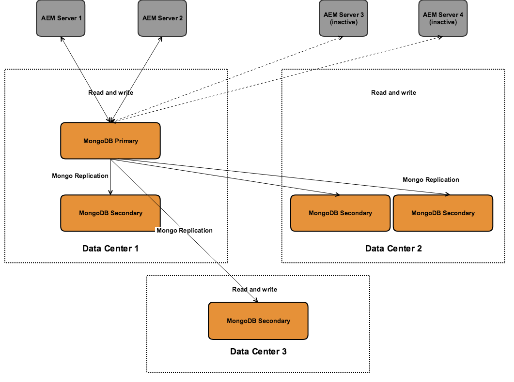

# 建議的部署{#recommended-deployments}

>[!NOTE]
>
>本頁面說明AEM的建議拓撲。 有關群集功能以及如何配置的詳細資訊，請參見 [Apache Sling Discovery API檔案](https://sling.apache.org/documentation/bundles/discovery-api-and-impl.html).

從AEM 6.2開始，MicroKernels充當永續性管理程式。選擇一個持久性管理程式來滿足您的需求取決於實例的用途和您考慮的部署類型。

以下範例旨在說明在最常見的AEM設定中其建議用途。

## 部署方案 {#deployment-scenarios}

### 單一TarMK例項 {#single-tarmk-instance}

在此案例中，單一TarMK執行個體會在單一伺服器上執行。

**這是製作例項的預設部署。**

優點：

* 簡單
* 輕鬆維護
* 效能良好

缺點是：

* 無法擴展到超出伺服器容量限制
* 無故障轉移容量

### TarMK冷備用 {#tarmk-cold-standby}

一個TarMK執行個體作為主要執行個體。 將主資料庫中的儲存庫複製到備用故障切換系統。

冷備用機制也可用作備份，因為完整的儲存庫會不斷複製到故障轉移伺服器。 故障轉移伺服器以冷待機模式運行，這意味著只運行實例的HttpReceiver。

優點：

* 簡單
* 可維護性
* 效能
* 故障轉移

缺點是：

* 無法擴展到超出伺服器容量限制
* 大部分時間，一個伺服器處於空閒狀態
* 故障轉移不是自動的。 必須在故障轉移系統開始提供請求之前從外部檢測到它。

>[!NOTE]
>
>如需如何使用TarMK冷待機設定AEM的詳細資訊，請參閱 [此](/help/sites-deploying/tarmk-cold-standby.md) 文章。

>[!NOTE]
>
>此TarMK示例中的冷備用部署要求主實例和備用實例都分別獲得許可，因為對故障轉移伺服器的複製是持續的。 如需授權的詳細資訊，請參閱 [Adobe一般授權條款](https://www.adobe.com/legal/terms/enterprise-licensing.html).

### TarMK農場 {#tarmk-farm}

各執行多個Oak例項，並搭配一個TarMK例項。 TarMK存放庫獨立，需保持同步。

讓存放庫保持同步，是因為製作伺服器會將相同內容發佈給每個伺服器陣列成員。 如需詳細資訊，請參閱 [復寫](/help/sites-deploying/replication.md).

若為AEM Communities，則不會復寫使用者產生的內容(UGC)。 如需在TarMK伺服器陣列上支援UGC，請參閱 [AEM Communities的考量事項](#considerations-for-aem-communities).

**這是發佈環境的預設部署。**

優點：

* 效能
* 讀取訪問的可擴充性
* 故障轉移

### 具有MongoMK故障切換的Oak群集，在單個資料中心實現高可用性 {#oak-cluster-with-mongomk-failover-for-high-availability-in-a-single-datacenter}

此方法表示有多個Oak執行個體會存取單一資料中心內的MongoDB復本集，實際上會為AEM製作環境建立作用中叢集。 MongoDB中的副本集用於在發生硬體或網路故障時提供高可用性和冗餘。

優點：

* 可使用新的AEM製作例項水準縮放
* 資料層的高可用性、冗餘和自動故障切換

缺點是：

* 某些情況下的效能可能低於TarMK

### 具有跨多個資料中心的MongoMK故障轉移的Oak群集 {#oak-cluster-with-mongomk-failover-across-multiple-datacenters}

此方法表示有多個Oak執行個體會存取跨多個資料中心的MongoDB復本集，實際上會為AEM製作環境建立作用中叢集。 MongoDB複製具有多個資料中心，可提供相同的高可用性和冗餘，但現在包括了處理資料中心中斷的能力。

優點：

* 可使用新的AEM製作例項水準縮放
* 資料層的高可用性、冗餘和自動故障切換（包括資料中心停機）

>[!NOTE]
>
>在上圖中，假設資料中心2的AEM伺服器與資料中心1的MongoDB主節點之間的網路延遲高於記錄的要求，AEM Server 3和AEM Server 4會呈現非作用中狀態 [此處](/help/sites-deploying/aem-with-mongodb.md#checklists). 如果最大延遲與要求相容（例如通過使用可用區），則資料中心2中的AEM伺服器也可以處於活動狀態，從而跨多個資料中心建立活動 — 活動的AEM群集。

>[!NOTE]
>
>有關本節中描述的MongoDB體系結構概念的其他資訊，請參見 [MongoDB複製](https://docs.mongodb.org/manual/replication/).

## 微內核：使用 {#microkernels-which-one-to-use}

在兩個可用的微內核之間進行選擇時需要考慮的基本規則是TarMK是為效能而設計，而MongoMK是為可擴充性而設計。

您可以使用這些決策矩陣來建立最適合您需求的部署類型。

Adobe強烈建議，除下列使用案例外，TarMK為客戶在所有部署案例（AEM製作和發佈執行個體）中使用的預設永續性技術。

### 在製作執行個體上選擇AEM MongoMK而非TarMK的例外 {#exceptions-for-choosing-aem-mongomk-over-tarmk-on-author-instances}

選擇MongoMK永續性後端而不選擇TarMK的主要原因是橫向縮放執行個體。 這表示有兩個或多個活動的作者實例始終運行，並使用MongoDB作為持久性儲存系統。 執行多個製作執行個體的需求，一般是因為單一伺服器的CPU和記憶體容量（支援所有同時編寫活動）已無法持續。

很難預測新網站上線後的確切並行模型。 因此，Adobe建議您在評估是否使用MongoMK和兩個或兩個以上製作作用中節點時，考慮下列條件：

1. 一天內連接的指定用戶數：數以千計。
1. 同時使用者人數：數以百計甚至更多。
1. 每日資產擷取量：數十萬甚至更多。
1. 每天編輯頁面的數量：數十萬或更多（包括透過多網站管理員或新聞摘要擷取的自動更新）。
1. 每天的搜索量：數以萬計甚至更多。

>[!NOTE]
>
>在部署的硬體配置中，可以使用艱苦的日子來評估客戶應用程式的效能。 有關此工具的詳細資訊，請參閱 [此處](/help/sites-developing/tough-day.md).

使用MongoDB的最低部署通常涉及以下拓撲：

* 一個MongoDB複製副本集，由一個主節點、兩個次節點組成，每個MongoDB實例在可用區中運行，每個節點的延遲不到15毫秒；
* 一個製作實例群集，其中一個領導節點、一個非領導節點，且兩者始終處於活動狀態，每個製作實例在每個資料中心中運行，其中MongoDB主實例和輔助實例正在運行。

此外，強烈建議您在共用檔案系統或Amazon S3上設定資料存放區，這樣資產或二進位檔就不會儲存在MongoDB中。 這將確保部署內的最佳效能。

部署具有兩個或多個製作實例的群集的MongoDB複製副本集的額外好處之一是，在製作實例、MongoDB複製副本或完全資料中心故障的情況下，具有自動恢複方案，停機時間最少。 儘管如此，選擇MongoMK而不是TarMK不應僅由恢復要求驅動，因為TarMK還可以通過受控故障切換機制提供最小的停機時間解決方案。

如果上述條件在部署後的頭18個月內未達成，建議您先使用TarMK部署AEM，然後在稍後適用上述條件時重新評估您的設定，最後決定是要保留在TarMK上，還是要移轉至MongoMK。

### 在發佈執行個體上選擇AEM MongoMK而不選擇TarMK的例外 {#exceptions-for-choosing-aem-mongomk-over-tarmk-on-publish-instances}

不建議為發佈執行個體部署MongoMK。 部署的發佈層級幾乎一律會部署為執行TarMK的完全獨立發佈例項群組，這些例項會透過從製作例項複製內容而保持同步。 此「無共用」架構適用於發佈例項，可讓發佈層級的部署以線性方式水準縮放。 伺服器陣列拓撲還可以以滾動方式應用任何更新或升級到發佈實例，這樣對發佈層的任何更改都不需要停機。

若發佈層級上有多個發佈者，則不適用於在MongoMK叢集上使用AEM Communities。 若選擇JSRP(請參閱 [社群內容儲存](/help/communities/working-with-srp.md))，則MongoMK叢集將適用，無論選取何種MK（例如MongoDB或RDB），任何發佈端叢集都適用。

### 使用MongoMK部署AEM時的必要條件和Recommendations {#prerequisites-and-recommendations-when-deploying-aem-with-mongomk}

如果您考慮為AEM部署MongoMK，則可使用一組必要條件和建議：

**MongoDB部署的必要條件：**

1. 在熟悉AEM的Adobe諮詢或MongoDB架構師的協助下，MongoDB部署架構和規模調整必須是專案實作的一部分；
1. MongoDB的專業知識必須存在於合作夥伴或客戶團隊中，以便有信心能夠維持和維護現有的或新的MongoDB環境；
1. 您可以選擇部署商業或開放原始碼版本的MongoDB(AEM支援兩者)，但必須直接從MongoDB公司購買MongoDB維護和支援合同；
1. 總的AEM和MongoDB體系結構和基礎架構應由AdobeAEM Architect進行明確定義和驗證；
1. 您必須檢閱包含MongoDB之AEM部署的支援模型。

**強大的MongoDB部署建議：**

* 請參閱Adobe Experience Manager適用的MongoDB [文章](https://www.mongodb.com/lp/contact/mongodb-adobe-experience-manager);
* 查看MongoDB生產 [清單](https://docs.mongodb.org/manual/administration/production-checklist/);
* 參加線上提供的MongoDB認證課程 [此處](https://university.mongodb.com/).

>[!NOTE]
>
>如需這些准則、必要條件和建議的其他所有問題，請聯絡 [Adobe客戶服務](https://helpx.adobe.com/tw/marketing-cloud/contact-support.html).

### AEM Communities考量事項 {#considerations-for-aem-communities}

針對計畫部署的站點 [AEM Communities](/help/communities/overview.md)，則建議 [選擇部署](/help/communities/working-with-srp.md#characteristicsofstorageoptions) 針對處理社群成員從發佈環境張貼的UGC而最佳化。

使用 [公用商店](/help/communities/working-with-srp.md)，就不需要在製作執行個體與其他發佈執行個體之間複製UGC，即可取得UGC的一致檢視。

以下是一組決策矩陣，可幫助您為部署選擇最佳類型的持久性：

#### 選擇製作例項的部署類型 {#choosing-the-deployment-type-for-author-instances}

#### 選擇發佈實例的部署類型 {#choosing-the-deployment-type-for-publish-instances}

>[!NOTE]
>
>MongoDB是協力廠商軟體，不包含在AEM授權套件中。 如需詳細資訊，請參閱 [MongoDB許可策略](https://www.mongodb.org/about/licensing/) 頁面。
>
>為了充分利用您的AEM部署，Adobe建議您授權MongoDB企業版本，以便從專業支援中受益。
>
>該許可證包括一個標準副本集，該集由一個主實例和兩個輔助實例組成，可用於製作或發佈部署。
>
>如果您想要在MongoDB上同時執行製作和發佈，則需要購買兩個不同的授權。
>
>如需詳細資訊，請參閱 [適用於Adobe Experience Manager的MongoDB頁](https://www.mongodb.com/lp/contact/mongodb-adobe-experience-manager).
