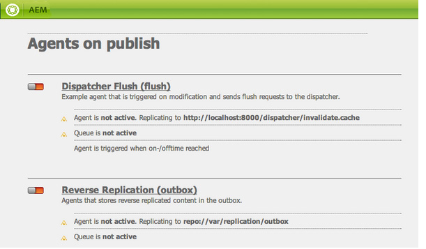

# 複寫{#replication}

複製代理是Adobe Experience Manager(AEM)的核心，是用於：

* [從作者發佈](/help/sites-authoring/publishing-pages.md#activatingcontent) （啟用）內容至發佈環境。
* 從Dispatcher快取明確清除內容。
* 將使用者輸入（例如，表格輸入）從發佈環境傳回作者環境（在作者環境的控制下）。

請求會 [排入](/help/sites-deploying/osgi-configuration-settings.md#apacheslingjobeventhandler) 適當代理的佇列以進行處理。

>[!NOTE]
>
>使用者資料（使用者、使用者群組和使用者設定檔）不會在作者與發佈例項之間複製。
>
>若是多個發佈例項，啟用「使用者同步」時，使 [用者資料會](/help/sites-administering/sync.md) 「Sling distributed」。

## 從作者複製到發佈 {#replicating-from-author-to-publish}

複製（複製到發佈實例或調度程式）需執行以下幾個步驟：

* 作者要求發佈（啟用）某些內容；這可以由手動請求或預先設定的自動觸發器啟動。
* 請求會傳遞給相應的預設複製代理；一個環境可以有多個預設代理，這些代理將始終為此類操作選擇。
* 複製代理將內容「打包」並將其放入複製隊列。
* 在「網站」索引標籤 [中，會針對個別頁面設定彩色狀態指標](/help/sites-authoring/publishing-pages.md#determiningpagepublicationstatus) 。
* 內容從隊列中提取，並使用配置的協定傳輸到發佈環境；通常為HTTP。
* 發佈環境中的servlet接收請求並發佈接收的內容；預設servlet為 `https://localhost:4503/bin/receive`。

* 可以設定多個作者和發佈環境。

### 從發佈複製到作者 {#replicating-from-publish-to-author}

有些功能可讓使用者在發佈例項上輸入資料。

在某些情況下，需要一種稱為反向複製的複製類型，才能將此資料從重新分發到其他發佈環境的作者環境。 基於安全性考量，必須嚴格控制發佈到作者環境的任何流量。

反向複製使用發佈環境中引用作者環境的代理。 此代理將資料放入外框。 此輸出框與作者環境中的複製偵聽程式匹配。 監聽程式會輪詢輸出方塊以收集所輸入的任何資料，然後視需要加以分發。 這可確保作者環境控制所有流量。

在其他情況下，例如社群功能（例如論壇、部落格、留言和評論），在發佈環境中輸入的使用者產生內容(UGC)量，很難透過複製在AEM例項間有效同步。

AEM [Communities](/help/communities/overview.md) 從未對UGC使用複製。 相反，社群的部署需要UGC的共用商店(請參閱社 [群內容儲存](/help/communities/working-with-srp.md))。

### 複製——立即可用 {#replication-out-of-the-box}

AEM標準安裝隨附的we-retail網站可用來說明複製。

若要遵循此範例，並使用您需要的預設複製代理，請將 [AEM安裝](/help/sites-deploying/deploy.md) :

* 埠上的作者環境 `4502`
* 埠上的發佈環境 `4503`

>[!NOTE]
>
>預設為啟用 :
>
>* 作者代理：預設代理（發佈）
>
>
依預設有效停用（自AEM 6.1起）:
>
>* 作者代理：反向複製代理(publish_reverse)
>* 發佈時的代理：反向複製（輸出盒）
>
>
要檢查代理或隊列的狀態，請使用「工具」 **控制台** 。
>請參 [閱監視複製代理](#monitoring-your-replication-agents)。

#### 複製（要發佈的作者） {#replication-author-to-publish}

1. 導覽至作者環境的支援頁面。
   **https://localhost:4502/content/we-retail/us/en/experience.html**`<pi>`
1. 編輯頁面以新增一些新文字。
1. **啟動頁面** ，以發佈變更。
1. 在發佈環境上開啟支援頁面：
   **https://localhost:4503/content/we-retail/us/en/experience.html**
1. 您現在可以看到您在作者上輸入的變更。

此複製由作者環境執行，其操作方式為：

* **預設代理（發佈）**此代理將內容複製到預設發佈例項。
有關此（配置和日誌）的詳細資訊，可從作者環境的「工具」控制台訪問；或：
   `https://localhost:4502/etc/replication/agents.author/publish.html`.

#### 複製代理——立即可用 {#replication-agents-out-of-the-box}

標準AEM安裝中提供下列代理：

* [預設代理](#replication-author-to-publish)用於從作者複製到發佈。

* Dispatcher Flush此用於管理Dispatcher快取。 如需詳 [細資訊，請參閱Authoring Environment中的Dispatcher Cache](https://helpx.adobe.com/experience-manager/dispatcher/using/page-invalidate.html#invalidating-dispatcher-cache-from-the-authoring-environment) , [以及Publishing Instance中的Dispatcher Cache](https://helpx.adobe.com/experience-manager/dispatcher/using/page-invalidate.html#invalidating-dispatcher-cache-from-a-publishing-instance) 。

* [反向複製](#reverse-replication-publish-to-author)：用於從發佈複製到作者。 反向複製不用於社群功能，如論壇、部落格和評論。 由於未啟用外框，因此會有效禁用它。 使用反向複製需要自定義配置。

* 靜態代理這是一個「將節點的靜態表示儲存到檔案系統中的代理」。
例如，使用預設設定時，內容頁面和dam資產會儲存在 `/tmp`HTML或適當的資產格式下。 請參閱 `Settings` 配置 `Rules` 的和頁籤。
這樣，當直接從應用程式伺服器要求頁面時，就可以看到內容。 這是專業代理，而且（可能）對於大多數實例都不是必需的。

## 複製代理——配置參數 {#replication-agents-configuration-parameters}

從「工具」控制台配置複製代理時，對話框中有四個頁籤：

### 設定 {#settings}

* **名稱**

   複製代理的唯一名稱。

* **說明**

   說明此複製代理將服務的目的。

* **已啟用**

   指示複製代理當前是否已啟用。

   啟用代理 **後** ，隊列將顯示為：

   * **處理項目** 時為作用中。
   * **當佇列** 為空時，為空閒狀態。
   * **當項目在佇列中** ，但無法處理時，就會封鎖；例如，當接收隊列被禁用時。

* **序列化類型**

   序列化類型：

   * **預設值**:設定是否要自動選擇代理。
   * **Dispatcher Flush**:如果代理用於刷新調度程式快取，請選擇此選項。

* **重試延遲**

   兩次重試之間的延遲（以毫秒為單位），如果遇到問題。

   預設: `60000`

* **代理使用者 ID**

   根據環境，代理將使用此用戶帳戶：

   * 從作者環境收集和封裝內容
   * 在發佈環境上建立和寫入內容
   將此欄位保留為空白，以使用系統使用者帳戶(sling中定義為管理員使用者的帳戶；預設為 `admin`)。

   >[!CAUTION]
   >
   >對於作者環境中的代理，此帳 *戶必須* 擁有對您要複製的所有路徑的讀取訪問權限。

   >[!CAUTION]
   >
   >對於發佈環境上的代理，此帳 *戶必須* 具有複製內容所需的建立／寫入權限。

   >[!NOTE]
   >
   >這可用作選擇複製特定內容的機制。

* **記錄層級**

   指定用於日誌消息的詳細程度。

   * `Error`:僅記錄錯誤
   * `Info`:將記錄錯誤、警告和其他資訊性消息
   * `Debug`:消息中將會使用高級別的詳細資訊，主要用於調試目的
   預設: `Info`

* **用於反向複寫**

   指示此代理是否用於反向複製；從發佈傳回使用者輸入至作者環境。

* **別名更新**

   選擇此選項可啟用對Dispatcher的別名或虛名路徑失效請求。 此外，請參 [閱配置Dispatcher Flush Agent](/help/sites-deploying/replication.md#configuring-a-dispatcher-flush-agent)。

#### 傳輸 {#transport}

* **URI**

   這會指定目標位置的接收servlet。 特別是，您可以在此處指定目標實例的主機名（或別名）和上下文路徑。

   例如：

   * 預設代理可以複製到 `https://localhost:4503/bin/receive`
   * Dispatcher Flush代理可以複製到 `https://localhost:8000/dispatcher/invalidate.cache`
   此處指定的協定（HTTP或HTTPS）將決定傳輸方法。

   對於Dispatcher Flush代理，只有在使用基於路徑的虛擬主機條目來區分場時，才使用URI屬性，您使用此欄位來定位要失效的場。 例如，場#1的虛擬主機為，場#2 `www.mysite.com/path1/*` 的虛擬主機為 `www.mysite.com/path2/*`。 您可以使用的URL來 `/path1/invalidate.cache` 定位第一個群體， `/path2/invalidate.cache` 以及定位第二個群體。

* **使用者**

   用於訪問目標的帳戶的用戶名。

* **密碼**

   用於訪問目標的帳戶的密碼。

* **NTLM 網域**

   NTML驗證的域。

* **NTLM 主機**

   NTML驗證的主機。

* **啟用寬鬆 SSL**

   如果您想要接受自認證的SSL憑證，請啟用。

* **允許過期的憑證**

   如果要接受過期的SSL憑證，請啟用。

#### Proxy {#proxy}

只有在需要代理時，才需要下列設定：

* **Proxy 主機**

   用於傳輸的代理的主機名。

* **Proxy 連接埠**

   代理的埠。

* **Proxy 使用者**

   要使用的帳戶的使用者名稱。

* **Proxy 密碼**

   要使用的帳戶密碼。

* **Proxy NTLM 網域**

   代理NTLM域。

* **Proxy NTLM 主機**

   代理NTLM域。

#### 延伸 {#extended}

* **介面**

   您可以在這裡定義要綁定到的套接字介面。

   這將設定建立連接時使用的本地地址。 如果未設定此值，則會使用預設位址。 這對於指定要在多宿主系統或群集系統上使用的介面非常有用。

* **HTTP 方法**

   要使用的HTTP方法。

   對於Dispatcher Flush代理，這幾乎總是GET，不應更改（POST可能是另一個值）。

* **HTTP 標頭**

   這些用於Dispatcher Flush代理，並指定必須刷新的元素。

   對於Dispatcher Flush代理，三個標準條目不需要更改：

   * `CQ-Action:{action}`
   * `CQ-Handle:{path}`
   * `CQ-Path:{path}`
   這些參數會在適當時用於指示刷新控制滑塊或路徑時要使用的操作。 子參數是動態的：

   * `{action}` 表示複製操作

   * `{path}` 指示路徑
   它們被與請求相關的路徑／動作所取代，因此不需要「硬式編碼」:

   >[!NOTE]
   >
   >如果您已將AEM安裝在建議的預設上下文以外的上下文中，則您必須在「HTTP標題」中註冊上下文。 例如：
   >`CQ-Handle:/<*yourContext*>{path}`

* **關閉連線**

   啟用以在每次請求後關閉連接。

* **連線逾時**

   嘗試建立連線時要套用的逾時（以毫秒為單位）。

* **通訊端逾時**

   在建立連線後等待流量時套用的逾時（毫秒）。

* **通訊協定版本**

   協定版本；例如 `1.0` HTTP/1.0。

#### 觸發器 {#triggers}

這些設定用於定義自動複製的觸發器：

* **忽略預設值**

   如果選中此選項，則將代理從預設複製中排除；這表示如果內容作者發出複製操作，則不會使用它。

* **於修改**

   在此，修改頁面時，將自動觸發此代理的複製。 這主要用於Dispatcher Flush代理，但也用於反向複製。

* **頁尾 (設計)**

   如果勾選此選項，代理將自動複製任何在修改時標籤為要分發的內容。

* **到達開／關時間**

   這會在為頁面定義的ontime或offtime發生時觸發自動複製（以視需要啟用或停用頁面）。 這主要用於Dispatcher Flush代理。

* **接收時**

   如果選中此選項，則每當收到複製事件時，代理都將鏈式複製。

* **無狀態更新**

   勾選後，代理將不強制更新複製狀態。

* **無版本設定**

   勾選後，代理將不強制對已激活的頁面進行版本修訂。

## 配置複製代理 {#configuring-your-replication-agents}

有關使用MSSL將複製代理連接到發佈實例的資訊，請參 [閱使用相互SSL複製](/help/sites-deploying/mssl-replication.md)。

### 從作者環境配置複製代理 {#configuring-your-replication-agents-from-the-author-environment}

在作者環境的「工具」頁籤中，您可以配置駐留在作者環境(作者上的&#x200B;**Agent**)或發佈環境(發佈上的&#x200B;**Agent**)中的複製代理。 以下過程說明了為作者環境配置代理的過程，但可用於兩者。

>[!NOTE]
>
>當調度程式處理作者或發佈實例的HTTP請求時，來自複製代理的HTTP請求必須包含PATH標頭。 除了以下過程外，還必須將PATH標頭添加到客戶端標頭的調度器清單中。 (請參 [閱／用戶端（用戶端標題）](https://helpx.adobe.com/experience-manager/dispatcher/using/dispatcher-configuration.html#specifying-the-http-headers-to-pass-through-clientheaders)。 

1. 存取AEM中 **的** 「工具」索引標籤。
1. 按一下 **複製** （左窗格開啟資料夾）。
1. 連按兩下 **作者上的Agent** （左窗格或右窗格）。
1. 按一下相應的代理名（即連結）以顯示有關該代理的詳細資訊。
1. 按一下 **編輯** ，開啟配置對話框：

   

1. 提供的值應足以用於預設安裝。 如果進行更改，請按一下「 **確定** 」保存這些更改(有關各參數的詳細資訊，請  參閱「複製代理——配置參數」)。

>[!NOTE]
>
>AEM的標準安裝會指定 `admin` 為預設複製代理中傳輸憑證的使用者。
>
>應將其更改為具有複製所需路徑權限的站點特定複製用戶帳戶。

### 配置反向複製 {#configuring-reverse-replication}

反向複製用於將發佈實例上生成的用戶內容返回到作者實例。 這通常用於調查和註冊表單等功能。

出於安全原因，大多數網路拓撲都不允許從 ** 「非軍事區」（一個子網路，將外部服務暴露給不受信任的網路，如Internet）進行連接。

由於發佈環境通常位於DMZ中，因此要將內容返回到作者環境，必須從作者實例啟動連接。 這是通過：

* 內 *容放置* 之發佈環境中的輸出方塊。
* 作者環境中的代理（發佈），會定期輪詢外框以找到新內容。

>[!NOTE]
>
>對於AEM [Communities](/help/communities/overview.md)，複製不會用於使用者在發佈例項上產生的內容。 請參 [閱社群內容儲存](/help/communities/working-with-srp.md)。

若要這麼做，您需要：

**作者環境中的反向複製代理** : This as as as active component from the outbox in the publish environment:

如果要使用反向複製，請確保激活此代理。

**發佈環境（外框）中的反向複製代理** 。這是作為「外框」的被動元素。 用戶輸入將放在此處，由作者環境中的代理從此處收集。

### 為多個發佈實例配置複製 {#configuring-replication-for-multiple-publish-instances}

>[!NOTE]
>
>僅複製內容——不複製用戶資料（用戶、用戶組和用戶配置檔案）。
>
>若要同步多個發佈例項的使用者資料，請啟用「使 [用者同步」](/help/sites-administering/sync.md)。

在安裝時，已配置預設代理，以便將內容複製到運行在localhost埠4503上的發佈實例。

要為需要建立和配置新複製代理的其他發佈實例配置內容複製，請執行以下操作：

1. 在AEM中 **開啟** 「工具」標籤。
1. 在左 **面板中**，依次選 **擇「複製** 」和「作者上的代理」。
1. **選擇**&#x200B;新建…….
1. 設定「 **標題** 」和「名 **稱」**，然後選 **擇「複製代理**」。
1. 按一下 **建立** ，建立新代理。
1. 連按兩下新代理項目以開啟設定面板。
1. 按一 **下「編輯** 」-「代理設定 **」對話方塊將會開啟-「序列化類型****** 」已定義為「預設」，但必須維持此狀態。

   * 在「設 **定** 」標籤：

      * 啟 **用**。
      * 輸入說 **明**。
      * 將「重試 **延遲** 」設定為 `60000`。

      * 將序列化 **類型保留** 為 `Default`。
   * 在「傳 **輸** 」標籤中：

      * 輸入新發佈實例所需的URI;例如，
         `https://localhost:4504/bin/receive`.

      * 輸入用於複製的站點特定用戶帳戶。
      * 您可以視需要設定其他參數。

1. 按一 **下「確定** 」以儲存設定。

然後，您可以在作者環境中更新並發佈頁面，以測試作業。

這些更新將顯示在所有已設定為上述的發佈例項上。

如果您遇到任何問題，可以檢查作者實例上的日誌。 根據所需的詳細程度，您也可以如上所示，將「日 **志級別** 」 `Debug` 設定為使 **用「代理設定** 」對話框。

>[!NOTE]
>
>這可結合使用代理用戶 [ID](#agentuserid) ，以選擇不同的內容，以複製到各個發佈環境。 針對每個發佈環境：
>
>1. 配置複製代理以複製到該發佈環境。
>1. 設定使用者帳戶；具有讀取將複製到該特定發佈環境的內容所需的訪問權限。
>1. 將用戶帳戶指 **定為複製代理的代理用戶Id** 。
>

### 配置Dispatcher Flush Agent {#configuring-a-dispatcher-flush-agent}

安裝中包含預設代理。 但是，如果要定義新代理，則仍需要某些配置：

1. 在AEM中 **開啟** 「工具」標籤。
1. 按一 **下部署**。
1. 選擇 **複製** ，然後 **選擇發佈代理**。
1. 連按兩下「 **Dispatcher Flush** 」項目以開啟概述。
1. 按一下 **編輯** -將打 **開「代理設定** 」對話框：

   * 在「設 **定** 」標籤：

      * 啟 **用**。
      * 輸入說 **明**。
      * 將序列 **化類型保留** , `Dispatcher Flush`或在建立新代理時將其設為。

      * （可選）選擇「 **別名更新** 」，以啟用對Dispatcher的別名或虛名路徑失效請求。
   * 在「傳 **輸** 」標籤中：

      * 輸入新發佈實例所需的URI;例如，
         `https://localhost:80/dispatcher/invalidate.cache`.

      * 輸入用於複製的站點特定用戶帳戶。
      * 您可以視需要設定其他參數。
   對於Dispatcher Flush代理，只有在使用基於路徑的虛擬主機條目來區分場時，才使用URI屬性，您使用此欄位來定位要失效的場。 例如，場#1的虛擬主機為，場#2 `www.mysite.com/path1/*` 的虛擬主機為 `www.mysite.com/path2/*`。 您可以使用的URL來 `/path1/invalidate.cache` 定位第一個群體， `/path2/invalidate.cache` 以及定位第二個群體。

   >[!NOTE]
   >
   >如果您已將AEM安裝在建議的預設上下文以外的上下文中，則需要在「延伸」索引標籤中設定 [HTTP](#extended)**標題** 。

1. 按一下 **確定** ，保存更改。
1. 返回到「工 **具** 」頁籤，您可以從此處激活 **** Dispatcher Flush **agent(****** Agent on publish Agent)。

Dispatcher Flush **複製代理** (Dispatcher Flush Replication Agent)在作者上不活動。 您可以使用相同的URI，在發佈環境中存取相同的頁面；例如， `https://localhost:4503/etc/replication/agents.publish/flush.html`。

### 控制對複製代理的訪問 {#controlling-access-to-replication-agents}

對用於配置複製代理的頁的訪問可以通過在節點上使用用戶和／或組頁權限來控 `etc/replication` 制。

>[!NOTE]
>
>設定此類權限不會影響複製內容的使用者（例如，從「網站」主控台或sidekick選項）。 複製框架不使用當前用戶的「用戶會話」在複製頁時訪問複製代理。

### 從CRXDE Lite配置複製代理 {#configuring-your-replication-agents-from-crxde-lite}

>[!NOTE]
>
>僅儲存庫位置支援建立複製 `/etc/replication` 代理。 這是正確處理相關ACL所必需的。 在樹的其他位置建立複製代理可能會導致未授權訪問。

可以使用CRXDE Lite配置複製代理的各種參數。

如果您導覽至 `/etc/replication` 以下三個節點：

* `agents.author`
* `agents.publish`
* `treeactivation`

這兩個保 `agents` 留有關相應環境的配置資訊，並且僅在該環境運行時處於活動狀態。 例如， `agents.publish` 將僅用於發佈環境。 下列螢幕擷取顯示作者環境中的發佈代理，如AEM WCM所附：

## 監視複製代理 {#monitoring-your-replication-agents}

要監視複製代理，請執行以下操作：

1. 存取AEM中 **的** 「工具」索引標籤。
1. 按一下 **複製**。
1. 連按兩下適當環境（左窗格或右窗格）的代理連結；例如， **作者上的代理**。

   生成的窗口顯示了作者環境的所有複製代理的概述，包括其目標和狀態。

1. 按一下相應的代理名（即連結）以顯示有關該代理的詳細資訊：

   

   您可以：

   * 查看是否啟用了代理。
   * 查看任何複製的目標。
   * 查看複製隊列當前是否處於活動狀態（已啟用）。
   * 瞭解佇列中是否有任何項目。
   * **刷新** 或 **清除** ，更新隊列條目的顯示；這可協助您查看項目進入並離開佇列。

   * **查看日誌** ，以訪問複製代理所執行的任何操作的日誌。
   * **測試與目標實例的連接** 。
   * **如有需要** ，請對任何佇列項目強制重試。
   >[!CAUTION]
   >
   >請勿在發佈實例的「反向複製輸出」框中使用「測試連接」連結。
   >
   >
   >如果對Outbox隊列執行複製測試，則所有早於測試複製的項目都將通過每個反向複製重新處理。

   >如果此類項目已存在於隊列中，則可使用以下XPath JCR查詢找到，並應將其刪除。
   >
   >
   >`/jcr:root/var/replication/outbox//*[@cq:repActionType='TEST']`

## 批複製 {#batch-replication}

批複製不會複製個別頁面或資產，但會等待根據時間或大小觸發兩個頁面的第一個臨界值。

然後，它將所有複製項目打包到一個包中，然後將該包作為單個檔案複製到發佈器。

出版業者會解壓縮所有項目、儲存並回報給作者。

### 配置批處理複製 {#configuring-batch-replication}

1. 前往 `http://serveraddress:serverport/siteadmin`
1. 按畫 **[!UICONTROL 面上方]** 的「工具」圖示
1. 從左側導覽邊欄，前往「複製——作者上的 **[!UICONTROL 代理」]** ，然後按兩 **[!UICONTROL 下「預設代理」]**。
   * 您也可以直接前往 `http://serveraddress:serverport/etc/replication/agents.author/publish.html`
1. 按復 **[!UICONTROL 制隊列上方]** 的編輯按鈕。
1. 在以下窗口中，轉至「批 **[!UICONTROL 次]** 」頁籤：
   
1. 配置代理。

### 參數 {#parameters}

* `[!UICONTROL Enable Batch Mode]` -啟用或禁用批處理複製模式
* `[!UICONTROL Max Wait Time]` -批次請求開始前的最長等待時間，以秒為單位。 預設值為2秒。
* `[!UICONTROL Trigger Size]` -在此大小限制時啟動批處理複製

## 其他資源 {#additional-resources}

有關故障排除的詳細資訊，請閱讀「複製故 [障排除](/help/sites-deploying/troubleshoot-rep.md) 」頁。

如需其他資訊，Adobe有一系列與複製相關的知識庫文章：

[https://helpx.adobe.com/experience-manager/kb/ReplicationSiblingReordering.html](https://helpx.adobe.com/experience-manager/kb/ReplicationSiblingReordering.html)https://helpx.adobe.com/experience-manager/kb/ReplicationFailureAfterNewIP.html[https://helpx.adobe.com/experience-manager/kb/LimitAccessToReplicationAgents.html](https://helpx.adobe.com/experience-manager/kb/LimitAccessToReplicationAgents.html)https://helpx.adobe.com/experience-manager/kb/PagePermissionsNotReplicatedWithUser.html[https://helpx.adobe.com/experience-manager/kb/HowToUseReverseReplication.htmlhttps://helpx.adobe.com/experience-manager/kb/CQ5ReplicateToSpecificAgents.htmlhttps://helpx.adobe.com/experience-manager/kb/ReplicationListener.htmlhttps://helpx.adobe.com/experience-manager/kb/replication-stuck.htmlhttps://helpx.adobe.com/experience-manager/kb/replication-privileges-missing-after-upgrade-to-cq-5-5.htmlhttps://helpx.adobe.com/experience-manager/kb/CQ53UnableToCreateJobQueueDueToMaxQueues.htmlhttps://helpx.adobe.com/experience-manager/kb/ACLReplication.htmlhttps://helpx.adobe.com/experience-manager/kb/content-grow-due-reverse-replication.htmlhttps://helpx.adobe.com/experience-manager/kb/ReplicationAgentUsingAnonUser.htmlDoDoDoDoDoDoDoDeProProPhotePhoterPhoterPhoterPhoterPhon](https://helpx.adobe.com/experience-manager/kb/PagePermissionsNotReplicatedWithUser.html)https://helpx.adobe.com/experience-manager/kb/ReplicationSiblingReordering.htmlhttps://helpx.adobe.com/experience-manager/kb/ReplicationFailureAfterNewIP.htmlhttps://helpx.adobe.com/experience-manager/kb/LimitAccessToReplicationAgents.html