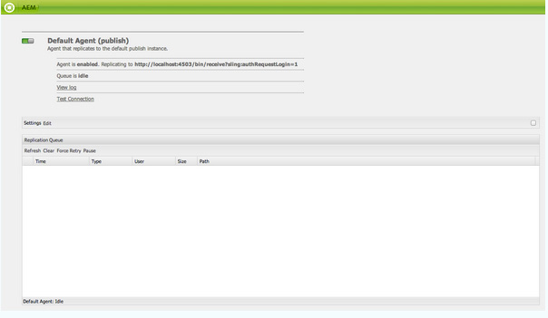

# 複製{#replication}

複製代理是Adobe Experience Manager(AEM)的中心，它用於：

* [發佈（激活）](/help/sites-authoring/publishing-pages.md#activatingcontent) 從作者到發佈環境的內容。
* 顯式刷新Dispatcher快取中的內容。
* 將用戶輸入（例如，表單輸入）從發佈環境返回給作者環境（在作者環境的控制下）。

請求為 [排隊](/help/sites-deploying/osgi-configuration-settings.md#apacheslingjobeventhandler) 到相應的代理進行處理。

>[!NOTE]
>
>用戶資料（用戶、用戶組和用戶配置檔案）不會在作者實例和發佈實例之間複製。
>
>對於多個發佈實例，在 [用戶同步](/help/sites-administering/sync.md) 的子菜單。

## 從作者複製到發佈 {#replicating-from-author-to-publish}

複製到發佈實例或調度程式的過程分幾個步驟進行：

* 作者要求發佈（激活）某些內容；可以通過手動請求或已預配置的自動觸發器啟動。
* 請求將傳遞給相應的預設複製代理；一個環境可以具有多個預設代理，這些代理將始終為此類操作選擇。
* 複製代理「打包」內容並將其置於複製隊列中。
* 在「網站」頁籤中 [彩色狀態指示](/help/sites-authoring/publishing-pages.md#determiningpagepublicationstatus) 為各個頁面設定。
* 內容從隊列中提取，使用配置的協定傳輸到發佈環境；通常是HTTP。
* 發佈環境中的servlet接收請求並發佈接收的內容；預設servlet為 `https://localhost:4503/bin/receive`。

* 可以配置多個作者和發佈環境。

### 從發佈複製到作者 {#replicating-from-publish-to-author}

某些功能允許用戶在發佈實例上輸入資料。

在某些情況下，需要一種稱為反向複製的複製類型來將此資料返回到作者環境，從該環境中將資料重新分發到其他發佈環境。 出於安全考慮，必須嚴格控制從發佈到作者環境的任何通信。

反向複製在發佈環境中使用引用作者環境的代理。 此代理將資料放入發件箱。 此發件箱與作者環境中的複製偵聽器匹配。 監聽器輪詢發件箱以收集輸入的任何資料，然後根據需要分發。 這可確保作者環境控制所有通信。

在其他情況下，例如社區功能（例如，論壇、部落格、評論和評論），在發佈環境中輸入的用戶生成內容(UGC)的量很難在使用複製的實例之間有效同AEM步。

AEM [社區](/help/communities/overview.md) 從不對UGC使用複製。 相反，社區的部署需要UGC的公用儲存(請參見 [社區內容儲存](/help/communities/working-with-srp.md))。

### 複製 — 開箱即用 {#replication-out-of-the-box}

標準安裝中包含的we-retail網站可用AEM於說明複製。

要遵循此示例並使用所需的預設複製代理 [安AEM裝](/help/sites-deploying/deploy.md) 與：

* 港口上的作者環境 `4502`
* 埠上的發佈環境 `4503`

>[!NOTE]
>
>預設為啟用 :
>
>* 作者代理：預設代理（發佈）
>
>預設情況下有效禁用(AEM截止6.1):
>
>* 作者代理：反向複製代理(publish_reverse)
>* 發佈時的代理：反向複製（發件箱）
>
>要檢查代理或隊列的狀態，請使用 **工具** 控制台。
>請參閱 [監視複製代理](#monitoring-your-replication-agents)。

#### 複製（要發佈的作者） {#replication-author-to-publish}

1. 導航到作者環境上的支援頁。
   **https://localhost:4502/content/we-retail/us/en/experience.html** `<pi>`
1. 編輯頁面以添加新文本。
1. **激活頁面** 按鈕。
1. 開啟發佈環境上的支援頁面：
   **https://localhost:4503/content/we-retail/us/en/experience.html**
1. 您現在可以看到在作者上輸入的更改。

此複製由以下人員從作者環境中執行：

* **預設代理（發佈）**
此代理將內容複製到預設發佈實例。
有關此（配置和日誌）的詳細資訊，可從作者環境的「工具」控制台訪問；或：

   `https://localhost:4502/etc/replication/agents.author/publish.html`。

#### 複製代理 — 開箱即用 {#replication-agents-out-of-the-box}

標準安裝中提供以下代AEM理：

* [預設代理](#replication-author-to-publish)
用於從作者複製到發佈。

* Dispatcher Flush（Dispatcher刷新）此功能用於管理Dispatcher快取。 請參閱 [從創作環境中使Dispatcher快取無效](https://helpx.adobe.com/experience-manager/dispatcher/using/page-invalidate.html#invalidating-dispatcher-cache-from-the-authoring-environment) 和 [從發佈實例中使Dispatcher快取無效](https://helpx.adobe.com/experience-manager/dispatcher/using/page-invalidate.html#invalidating-dispatcher-cache-from-a-publishing-instance) 的子菜單。

* [反向複製](#reverse-replication-publish-to-author)
用於從發佈複製到作者。 反向複製不用於社區功能，如論壇、部落格和評論。 由於未啟用發件箱，因此它被有效禁用。 使用反向複製需要自定義配置。

* 靜態代理這是「將節點的靜態表示形式儲存到檔案系統中的代理」。
例如，使用預設設定時，內容頁面和資料庫資產將儲存在 `/tmp`，或作為HTML或相應的資產格式。 查看 `Settings` 和 `Rules` 頁籤。
這是請求的，以便當直接從應用程式伺服器請求頁面時，可以看到內容。 這是一個專用代理，（可能）對於大多數實例都不需要。

## 複製代理 — 配置參數 {#replication-agents-configuration-parameters}

從「工具」控制台配置複製代理時，對話框中有四個頁籤：

### 設定 {#settings}

* **名稱**

   複製代理的唯一名稱。

* **說明**

   此複製代理將服務的目的的說明。

* **已啟用**

   指示當前是否啟用複製代理。

   當代理為 **啟用** 隊列將顯示為：

   * **活動** 處理項時。
   * **空閒** 當隊列為空時。
   * **已阻止** 當項目在隊列中但無法處理時；例如，當接收隊列被禁用時。

* **序列化類型**

   序列化的類型：

   * **預設**:設定是否自動選擇代理。
   * **調度程式刷新**:如果代理將用於刷新調度程式快取，請選擇此選項。

* **重試延遲**

   如果遇到問題，則兩次重試之間的延遲(等待時間（毫秒）。

   預設: `60000`

* **代理使用者 ID**

   根據環境的不同，代理將使用此用戶帳戶：

   * 從作者環境收集和打包內容
   * 在發佈環境中建立和寫入內容

   將此欄位留空以使用系統用戶帳戶(sling中定義的帳戶作為管理員用戶；預設情況下，此 `admin`)。

   >[!CAUTION]
   >
   >對於作者環境中的代理，此帳戶 *必須* 具有對要複製的所有路徑的讀取訪問權限。

   >[!CAUTION]
   >
   >對於發佈環境上的代理，此帳戶 *必須* 具有複製內容所需的建立/寫入權限。

   >[!NOTE]
   >
   >這可用作選擇特定內容進行複製的機制。

* **記錄層級**

   指定用於日誌消息的詳細級別。

   * `Error`:只記錄錯誤
   * `Info`:將記錄錯誤、警告和其他資訊性消息
   * `Debug`:消息中將使用高級詳細資訊，主要用於調試目的

   預設: `Info`

* **用於反向複寫**

   指示此代理是否用於反向複製；返回從發佈到作者環境的用戶輸入。

* **別名更新**

   選擇此選項將啟用對Dispatcher的別名或虛擬路徑無效請求。 另請參見 [配置Dispatcher刷新代理](/help/sites-deploying/replication.md#configuring-a-dispatcher-flush-agent)。

#### 傳輸 {#transport}

* **URI**

   這指定目標位置的接收Servlet。 特別是，您可以在此處指定目標實例的主機名（或別名）和上下文路徑。

   例如：

   * 預設代理可以複製到 `https://localhost:4503/bin/receive`
   * Dispatcher Flush代理可以複製到 `https://localhost:8000/dispatcher/invalidate.cache`

   此處指定的協定（HTTP或HTTPS）將確定傳輸方法。

   對於Dispatcher Flush代理，僅當使用基於路徑的虛擬主機條目來區分場時，才使用URI屬性，而使用此欄位來將場目標定為無效。 例如，陣列 #1 的虛擬主機為 `www.mysite.com/path1/*`，而陣列 #2 的虛擬主機為 `www.mysite.com/path2/*`。 您可以使用 URL `/path1/invalidate.cache` 鎖定第一個陣列，並使用 `/path2/invalidate.cache` 鎖定第二個陣列。 

* **使用者**

   用於訪問目標的帳戶的用戶名。

* **密碼**

   用於訪問目標的帳戶的密碼。

* **NTLM 網域**

   用於NTML身份驗證的域。

* **NTLM 主機**

   用於NTML身份驗證的主機。

* **啟用寬鬆 SSL**

   如果希望接受自認證的SSL證書，則啟用。

* **允許過期的憑證**

   如果希望接受過期的SSL證書，則啟用。

#### Proxy {#proxy}

僅當需要代理時才需要以下設定：

* **Proxy 主機**

   用於傳輸的代理的主機名。

* **Proxy 連接埠**

   代理的埠。

* **Proxy 使用者**

   要使用的帳戶的用戶名。

* **Proxy 密碼**

   要使用的帳戶的密碼。

* **Proxy NTLM 網域**

   代理NTLM域。

* **Proxy NTLM 主機**

   代理NTLM域。

#### 延伸 {#extended}

* **介面**

   在此可以定義要綁定到的套接字介面。

   這將設定建立連接時使用的本地地址。 如果未設定，將使用預設地址。 這對於指定要在多宿主系統或群集系統上使用的介面非常有用。

* **HTTP 方法**

   要使用的HTTP方法。

   對於Dispatcher Flush代理，這幾乎總是GET的，因此不應更改(POST可能是另一個可能的值)。

* **HTTP 標頭**

   這些用於Dispatcher Flush代理並指定必須刷新的元素。

   對於Dispatcher Flush代理，三個標準項不應更改：

   * `CQ-Action:{action}`
   * `CQ-Handle:{path}`
   * `CQ-Path:{path}`

   這些選項（如適用）用於指示刷新句柄或路徑時要使用的操作。 子參數是動態的：

   * `{action}` 指示複製操作

   * `{path}` 指示路徑

   它們被與請求相關的路徑/操作所替代，因此不需要「硬編碼」：

   >[!NOTE]
   >
   >如果安裝在AEM建議的預設上下文之外的上下文中，則需要在HTTP標頭中註冊該上下文。 例如：
   >`CQ-Handle:/<*yourContext*>{path}`

* **關閉連線**

   啟用以在每次請求後關閉連接。

* **連線逾時**

   嘗試建立連接時應用的超時（毫秒）。

* **通訊端逾時**

   在建立連接後等待通信時應用的超時（毫秒）。

* **通訊協定版本**

   協定版本；例如 `1.0` HTTP/1.0。

#### 觸發器 {#triggers}

這些設定用於定義自動複製的觸發器：

* **忽略預設值**

   如果選中，則代理將被排除在預設複製之外；這意味著如果內容作者發出複製操作，則不會使用它。

* **於修改**

   此處，修改頁面時將自動觸發此代理的複製。 這主要用於Dispatcher Flush代理，但也用於反向複製。

* **頁尾 (設計)**

   如果選中，代理將在修改時自動複製標籤為分發的任何內容。

* **已到達開/關時間**

   當為頁面定義的時間或時間發生時，這將觸發自動複製（以根據需要激活或停用頁面）。 這主要用於Dispatcher Flush代理。

* **接收時**

   如果選中，則代理將在接收複製事件時連結複製。

* **無狀態更新**

   選中後，代理將不會強制更新複製狀態。

* **無版本設定**

   選中後，代理將不強製版本化已激活的頁面。

## 配置複製代理 {#configuring-your-replication-agents}

有關使用MSSL將複製代理連接到發佈實例的資訊，請參見 [使用互相SSL進行複製](/help/sites-deploying/mssl-replication.md)。

### 從作者環境配置複製代理 {#configuring-your-replication-agents-from-the-author-environment}

在作者環境的「工具」頁籤中，您可以配置駐留在作者環境中的複製代理(**作者代理**)或發佈環境(**發佈時的代理**)。 以下過程說明了作者環境的代理配置，但可用於兩者。

>[!NOTE]
>
>當調度程式處理作者或發佈實例的HTTP請求時，來自複製代理的HTTP請求必須包括PATH標頭。 除了以下過程外，還必須將PATH標頭添加到客戶端標頭的調度程式清單中。 (請參閱 [/clientheaders（客戶端頭）](https://helpx.adobe.com/experience-manager/dispatcher/using/dispatcher-configuration.html#specifying-the-http-headers-to-pass-through-clientheaders)。

1. 訪問 **工具** 的上界AEM。
1. 按一下 **複製** （左窗格開啟資料夾）。
1. 按兩下 **作者代理** （左窗格或右窗格）。
1. 按一下相應的代理名稱（即連結）以顯示該代理的詳細資訊。
1. 按一下 **編輯** 要開啟配置對話框，請執行以下操作：

   

1. 提供的值應足以用於預設安裝。 如果進行更改，則按一下 **確定** 保存它們(請參閱 [複製代理 — 配置參數](#replication-agents-configuration-parameters) )的正平方根。

>[!NOTE]
>
>指定的標準安AEM裝 `admin` 作為預設複製代理中傳輸憑據的用戶。
>
>應將此帳戶更改為具有複製所需路徑權限的特定於站點的複製用戶帳戶。

### 配置反向複製 {#configuring-reverse-replication}

反向複製用於將發佈實例上生成的用戶內容返回到作者實例。 這通常用於調查和登記表等功能。

出於安全原因，大多數網路拓撲不允許連接 *從* 「非軍事區」(將外部服務暴露給不受信任的網路（如Internet）的子網路)。

由於發佈環境通常位於DMZ中，因此要將內容返回給作者環境，必須從作者實例啟動連接。 這是通過：

* 一個 *輸出* 在放置內容的發佈環境中。
* 作者環境中的代理（發佈），它定期輪詢發件箱以查找新內容。

>[!NOTE]
>
>對AEM於 [社區](/help/communities/overview.md)，複製不用於發佈實例上的用戶生成的內容。 請參閱 [社區內容儲存](/help/communities/working-with-srp.md)。

為此，您需要：

**作者環境中的反向複製代理** 它充當活動元件，用於從發佈環境中的發件箱收集資訊：

如果要使用反向複製，請確保激活此代理。

**發佈環境中的反向複製代理（發件箱）** 這是被動元素，因為它充當「發件箱」。 用戶輸入將放在此處，由作者環境中的代理從中收集。

### 為多個發佈實例配置複製 {#configuring-replication-for-multiple-publish-instances}

>[!NOTE]
>
>僅複製內容 — 不複製用戶資料（用戶、用戶組和用戶配置檔案）。
>
>要在多個發佈實例之間同步用戶資料，請啟用 [用戶同步](/help/sites-administering/sync.md)。

安裝後，已配置預設代理以將內容複製到本地主機的埠4503上運行的發佈實例。

要配置其他發佈實例的內容複製，您需要建立並配置新的複製代理：

1. 開啟 **工具** 的上界AEM。
1. 選擇 **複製**，則 **作者代理** 的下界。
1. 選擇 **新建……**。
1. 設定 **標題** 和 **名稱**，然後選擇 **複製代理**。
1. 按一下 **建立** 的子菜單。
1. 按兩下新代理項以開啟配置面板。
1. 按一下 **編輯** - **代理設定** 對話框開啟 —  **序列化類型** 已定義為「預設」，但必須保持此狀態。

   * 在 **設定** 頁籤：

      * 激活 **已啟用**。
      * 輸入 **說明**。
      * 設定 **重試延遲** 至 `60000`。

      * 離開 **序列化類型** 如 `Default`。
   * 在 **運輸** 頁籤：

      * 輸入新發佈實例所需的URI;比如說，
         `https://localhost:4504/bin/receive`。

      * 輸入用於複製的站點特定用戶帳戶。
      * 您可以根據需要配置其他參數。

1. 按一下 **確定** 按鈕。

然後，可以通過在作者環境中更新和發佈頁面來test操作。

更新將顯示在上面配置的所有發佈實例上。

如果遇到任何問題，可檢查作者實例上的日誌。 根據所需的詳細程度，您還可以設定 **日誌級別** 至 `Debug` 使用 **代理設定** 對話框。

>[!NOTE]
>
>這可以與 [代理用戶ID](#agentuserid) 選擇不同內容以複製到各個發佈環境。 對於每個發佈環境：
>
>1. 配置複製代理以複製到該發佈環境。
>1. 配置用戶帳戶；具有讀取將複製到該特定發佈環境的內容所需的訪問權限。
>1. 將用戶帳戶分配為 **代理用戶ID** 的下界。

>

### 配置Dispatcher Flush代理 {#configuring-a-dispatcher-flush-agent}

安裝中包含預設代理。 但是，如果要定義新代理，則仍需要某些配置：

1. 開啟 **工具** 的上界AEM。
1. 按一下 **部署**。
1. 選擇 **複製** 然後 **發佈時的代理**。
1. 按兩下 **調度程式刷新** 項以開啟概覽。
1. 按一下 **編輯** - **代理設定** 對話框開啟：

   * 在 **設定** 頁籤：

      * 激活 **已啟用**。
      * 輸入 **說明**。
      * 離開 **序列化類型** 如 `Dispatcher Flush`，或在建立新代理時將其設定為。

      * （可選）選擇 **別名更新** 啟用對Dispatcher的別名或虛路徑無效請求。
   * 在 **運輸** 頁籤：

      * 輸入新發佈實例所需的URI;比如說，
         `https://localhost:80/dispatcher/invalidate.cache`。

      * 輸入用於複製的站點特定用戶帳戶。
      * 您可以根據需要配置其他參數。

   對於Dispatcher Flush代理，僅當使用基於路徑的虛擬主機條目來區分場時，才使用URI屬性，而使用此欄位來將場目標定為無效。 例如，陣列 #1 的虛擬主機為 `www.mysite.com/path1/*`，而陣列 #2 的虛擬主機為 `www.mysite.com/path2/*`。 您可以使用 URL `/path1/invalidate.cache` 鎖定第一個陣列，並使用 `/path2/invalidate.cache` 鎖定第二個陣列。 

   >[!NOTE]
   >
   >如果安裝在AEM建議的預設上下文以外的上下文中，則需要配置 [HTTP標頭](#extended) 的 **擴展** 頁籤。

1. 按一下 **確定** 的子菜單。
1. 返回到 **工具** 頁籤，您可以 **激活** 這樣 **調度程式刷新** 代理(**發佈時的代理**)。

的 **調度程式刷新** 複製代理在作者上未處於活動狀態。 可以使用等效URI訪問發佈環境中的同一頁；比如說， `https://localhost:4503/etc/replication/agents.publish/flush.html`。

### 控制對複製代理的訪問 {#controlling-access-to-replication-agents}

對用於配置複製代理的頁面的訪問可以通過使用上的用戶和/或組頁面權限來控制 `etc/replication` 的下界。

>[!NOTE]
>
>設定此類權限不會影響複製內容的用戶（例如，從網站控制台或側腳選項）。 複製框架在複製頁時不使用當前用戶的「用戶會話」訪問複製代理。

### 通過CRXDE Lite配置複製代理 {#configuring-your-replication-agents-from-crxde-lite}

>[!NOTE]
>
>僅支援在 `/etc/replication` 儲存庫位置。 為了正確處理關聯的ACL，需要這樣做。 在樹的另一位置建立複製代理可能會導致未經授權的訪問。

可以使用CRXDE Lite配置複製代理的各種參數。

如果導航到 `/etc/replication` 您可以看到以下三個節點：

* `agents.author`
* `agents.publish`
* `treeactivation`

兩個 `agents` 保存有關相應環境的配置資訊，並且僅當該環境正在運行時才處於活動狀態。 比如說， `agents.publish` 將僅用於發佈環境。 以下螢幕快照顯示了作者環境中的發佈代理(隨AEMWCM一起提供):

## 監視複製代理 {#monitoring-your-replication-agents}

監視複製代理：

1. 訪問 **工具** 的上界AEM。
1. 按一下 **複製**。
1. 按兩下相應環境（左窗格或右窗格）的代理連結；例如 **作者代理**。

   生成的窗口顯示作者環境的所有複製代理的概述，包括其目標和狀態。

1. 按一下相應的代理名稱（即連結）以顯示有關該代理的詳細資訊：

   

   您可以在這裡：

   * 查看是否啟用代理。
   * 查看任何複製的目標。
   * 查看複製隊列當前是否處於活動狀態（已啟用）。
   * 查看隊列中是否有任何項。
   * **刷新** 或 **清除** 更新隊列條目的顯示；這有助於您查看輸入和離開隊列的項目。

   * **查看日誌** 訪問複製代理執行的任何操作的日誌。
   * **Test連接** 到目標實例。
   * **強制重試** 清單項。

   >[!CAUTION]
   >
   >請勿在發佈實例上使用「Test連接」連結的「反向複製」發件箱。
   >
   >
   >如果對發件箱隊列執行複製test，則所有早於test複製的項都將通過每個反向複製進行重新處理。
   >
   >
   >如果此類項已在隊列中存在，則可以使用以下XPath JCR查詢找到它們，並應將其刪除。
   >
   >
   >`/jcr:root/var/replication/outbox//*[@cq:repActionType='TEST']`

## 批複製 {#batch-replication}

批處理複製不會複製單個頁或資產，而是等待根據時間或大小觸發這兩個頁的第一個閾值。

然後，它將所有複製項打包到一個包中，然後將其作為單個檔案複製到發佈伺服器。

發佈者將解包所有項目，保存並向作者報告。

### 配置批複製 {#configuring-batch-replication}

1. 前往 `http://serveraddress:serverport/siteadmin`
1. 按 **[!UICONTROL 工具]** 表徵圖
1. 從左側導航欄，轉到 **[!UICONTROL 複製 — 作者上的代理]** 按兩下 **[!UICONTROL 預設代理]**。
   * 您也可以直接轉到 `http://serveraddress:serverport/etc/replication/agents.author/publish.html`
1. 按 **[!UICONTROL 編輯]** 按鈕。
1. 在以下窗口中，轉到 **[!UICONTROL 批]** 頁籤：
   
1. 配置代理。

### 參數 {#parameters}

* `[!UICONTROL Enable Batch Mode]`  — 啟用或禁用批複製模式
* `[!UICONTROL Max Wait Time]`  — 啟動批處理請求前的最長等待時間（秒）。 預設值為2秒。
* `[!UICONTROL Trigger Size]`  — 當此大小限制時啟動批處理複製

## 其他資源 {#additional-resources}

有關故障排除的詳細資訊，請閱讀 [排除複製故障](/help/sites-deploying/troubleshoot-rep.md) 的子菜單。
