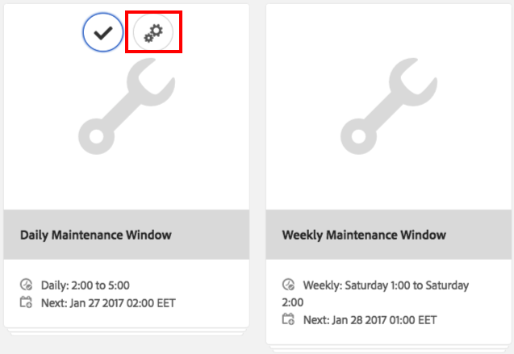
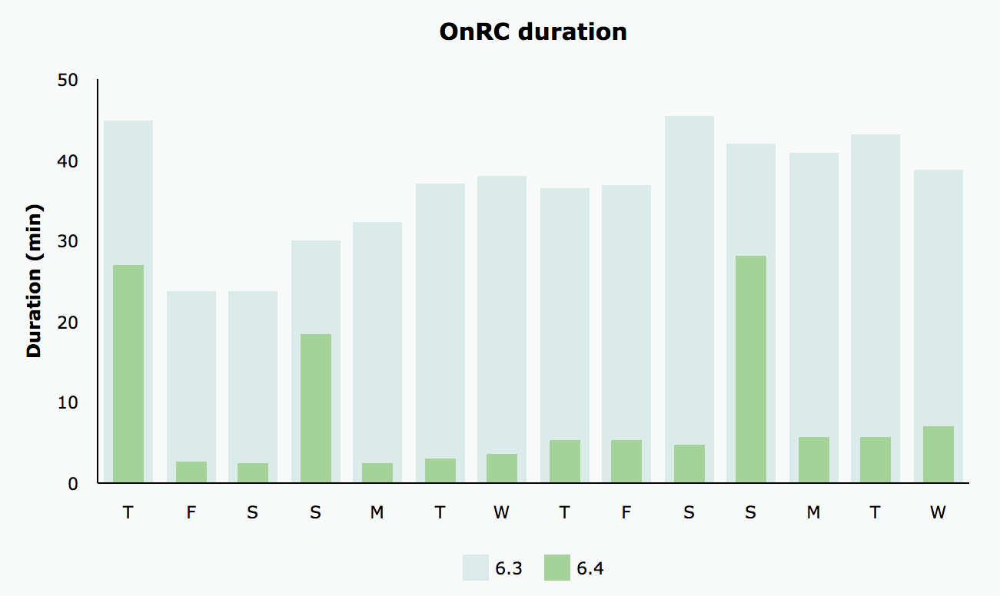

# 修訂清除{#revision-cleanup}

## 簡介 {#introduction}

每個對儲存庫的更新都會建立新的內容修訂。 因此，隨著每次更新，儲存庫的大小都會增大。 為了避免儲存庫增長失控，需要清理舊版本以釋放磁碟資源。 此維護功能稱為「修訂清除」。 自AEM 6.0以來，它已提供離線常式。

AEM 6.3推出名為「線上修訂清除」的線上版本。 相較於必須關閉AEM例項的「離線修訂清除」,AEM例項線上時可執行「線上修訂清除」。 「線上修訂清除」預設為開啟，這是執行修訂清除的建議方式。

**注意**:如 [需簡介及如何使用線上修訂清除](https://helpx.adobe.com/experience-manager/kt/platform-repository/using/revision-cleanup-technical-video-use.html) ，請參閱影片。

修訂版清除程式包含三個階段：估 **計**、 **壓縮****和清理**。 估計會根據可能收集的廢棄項目數量決定是否執行下一階段（壓縮）。 在壓縮階段期間，會重寫tar檔案，而不會保留任何未使用的內容。 清除階段隨後會移除舊區段，包括舊區段可能包含的任何垃圾。 離線模式通常可回收更多空間，因為線上模式需要考慮AEM的工作集，而AEM的工作集會保留其他區段不會被收集。

如需修訂清除的詳細資訊，請參閱下列連結：

* [如何運行聯機修訂清除](/help/sites-deploying/revision-cleanup.md#how-to-run-online-revision-cleanup)
* [線上修訂清除常見問題](/help/sites-deploying/revision-cleanup.md#online-revision-cleanup-frequently-asked-questions)
* [如何運行離線修訂清除](/help/sites-deploying/revision-cleanup.md#how-to-run-offline-revision-cleanup)

此外，您也可以閱讀Oak [官方檔案。](https://jackrabbit.apache.org/oak/docs/nodestore/segment/overview.html)

### 何時使用「線上修訂清除」而非「離線修訂清除」? {#when-to-use-online-revision-cleanup-as-opposed-to-offline-revision-cleanup}

**建議使用「線上修訂清除」來執行修訂清除。** 離線修訂清除僅能例外地使用——例如，在移轉至新儲存格式之前，或Adobe客戶服務要求您這麼做。

## 如何運行聯機修訂清除 {#how-to-run-online-revision-cleanup}

「線上修訂清除」依預設設定，可自動在AEM Author和Publish執行個體上每天執行一次。 您只需在使用者活動最少的時段內定義維護視窗即可。 您可以按如下方式配置「聯機修訂清除」任務：

1. 在主AEM視窗中，前往「工具 **-作業——儀表板——維護** 」，或將您的瀏覽器指向： `https://serveraddress:serverport/libs/granite/operations/content/maintenance.html`

   

1. 將滑鼠指標暫 **留在「每日維護視窗** 」上，然後按 **一下「設定** 」圖示。

   

1. 輸入所需的值（重複、開始時間、結束時間），然後按一下「儲 **存」**。

   

或者，如果要手動運行修訂版清除任務，可以：

1. 轉至「 **工具」-「操作」-「儀表板」** -「維護」或直接瀏覽至 `https://serveraddress:serverport/libs/granite/operations/content/maintenance.html`
1. 按一下「 **Daily Maintenance（每日維護）」窗口**。
1. 將滑鼠指標暫留在「修 **訂版清除** 」圖示上。
1. 按一 **下Run**。

   

### 在離線修訂清除後運行聯機修訂清除 {#running-online-revision-cleanup-after-offline-revision-cleanup}

修訂清除程式會逐代回收舊修訂。 這意味著每次運行修訂清除時，都會建立新一代並保存在磁碟上。 但是，兩種類型的修訂清除有差異：離線修訂清除保留一代，而線上修訂清除保留兩代。 因此，在離線修訂清除後執行線 **上修訂** 清除時，會發生下列情況：

1. 在第一次聯機修訂清除後，系統資訊庫的大小將翻倍。 這是因為現在磁碟上有兩代儲存器。
1. 在後續運行中，儲存庫將在建立新一代時臨時增長，然後穩定回到第一次運行後的大小，因為線上修訂清理過程將回收上一代。

此外，請記住，每代提交的類型和數量與前代相比，其大小可能有所不同，因此最終大小可能因運行而異。

由於這種情況，建議將磁碟的大小至少比最初估計的儲存庫大小大兩三倍。

## 全壓縮和尾壓縮模式 {#full-and-tail-compaction-modes}

**AEM 6.5針對「** 線上修訂清除」程 **序的壓縮階段推** 出兩種新模式 **** :

* 完全 **壓縮模式** ，將重寫整個儲存庫中的所有段和tar檔案。 因此，後續的清理階段可以刪除整個儲存庫中最大的垃圾量。 由於完全壓縮會影響整個儲存庫，因此需要大量的系統資源和時間才能完成。 完全壓縮對應於AEM 6.3中的壓縮階段。
* 尾部 **壓縮模式** ，只重寫儲存庫中最新的段和tar檔案。 最近的區段和tar檔案是自上次執行完整或尾部壓縮後新增的區段和tar檔案。 因此，後續的清理階段只能刪除儲存庫最近部分包含的垃圾。 由於尾部壓縮只影響儲存庫的一部分，因此完成的系統資源和時間比完全壓縮要少得多。

這些壓實模式構成了效率和資源消耗之間的權衡：尾部壓實效果不明顯，對系統正常運行影響較小。 相比之下，全壓實效果更好，但對系統正常運行影響較大。

AEM 6.5也在壓縮期間引入更有效率的內容去重複化機制，進一步減少存放庫的磁碟空間。

以下兩張圖表顯示內部實驗室測試的結果，這些測試說明與AEM 6.3相比，AEM 6.5平均執行時間和磁碟平均佔用空間減少：

 

### 如何配置完整和尾部壓縮 {#how-to-configure-full-and-tail-compaction}

預設設定會在週日執行尾部壓縮，並在週日執行完整壓縮。 可以使用維護任務的新配置值來更改 `full.gc.days` 預設 `RevisionCleanupTask` 配 [置](/help/sites-deploying/revision-cleanup.md#how-to-run-online-revision-cleanup)。

當您設定 `full.gc.days` 值時，請注意，完整壓縮將在值中定義的日期期間執行，而尾部壓縮將在未定義於值的日期期間執行。 例如，如果您設定完整壓縮功能在週日執行，則尾部壓縮功能將在星期一到星期六執行。 例如，如果您設定完全壓縮功能以在一週中的每一天執行，則完全壓縮功能將無法執行。

此外，請考慮：

* **尾部壓實** ，效果不明顯，對正常系統運行影響較小。 因此，本計畫於營業日期間執行。
* **全壓縮** (Full compaction)效果更好，但對系統正常運行的影響也更大。 因此，本計畫在工作日後使用。
* 尾部壓縮和完全壓縮都應計畫在非尖峰時段運行。

### 疑難排解 {#troubleshooting}

使用新的壓縮模式時，請記住以下事項：

* 您可以監控輸入／輸出(I/O)活動，例如：I/O操作、等待IO的CPU、提交隊列大小。 這有助於確定系統是否已綁定到I/O，並需要調整大小。
* 指 `RevisionCleanupTaskHealthCheck` 出「聯機修訂清除」的整體運行狀況。 它的運作方式與AEM 6.3相同，不會區分完整和尾部壓縮。
* 日誌消息會傳送有關壓縮模式的相關資訊。 例如，當「聯機修訂清除」啟動時，相應的日誌消息將指示壓縮模式。 此外，在某些轉角情況下，系統將在計畫運行尾部壓縮時恢復為完全壓縮，而日誌消息將指示此更改。 下面的日誌樣本表示壓縮模式，以及從尾部到完全壓縮的變化：

```
TarMK GC: running tail compaction
TarMK GC: no base state available, running full compaction instead
```

### 已知限制 {#known-limitations}

在某些情況下，尾部和完全壓縮模式之間的交替會延遲清理過程。 更準確地說，在完全壓縮後，儲存庫將增長（其大小將翻倍）。 當儲存庫將降低到預先完全壓縮大小以下時，將在後續的尾部壓縮中回收額外空間。 還應避免並行維護任務執行。

**建議將磁碟的大小至少比最初估計的儲存庫大小大兩三倍。**

## 線上修訂清除常見問題 {#online-revision-cleanup-frequently-asked-questions}

### AEM 6.5升級考量事項 {#aem-upgrade-considerations}

<table>
 <tbody>
  <tr>
   <td>問題 </td>
   <td>答案</td>
  </tr>
  <tr>
   <td>升級至AEM 6.5時，應該注意什麼？</td>
   <td><p>TarMK的永續性格式將隨AEM 6.5而變更。這些更改不需要主動遷移步驟。 現有儲存庫將進行滾動遷移，該遷移對用戶是透明的。 第一次AEM 6.5（或相關工具）存取儲存庫時，就會開始移轉程式。</p> <p><strong>一旦開始移轉至AEM 6.5永續性格式，儲存庫就無法還原回先前的AEM 6.3永續性格式。</strong></p> </td>
  </tr>
 </tbody>
</table>

### 移轉至Oak Segment Tar {#migrating-to-oak-segment-tar}

<table>
 <tbody>
  <tr>
   <td><strong>問題</strong></td>
   <td><strong>答案</strong></td>
   <td> </td>
  </tr>
  <tr>
   <td><strong>為什麼需要遷移儲存庫？</strong></td>
   <td><p>在AEM 6.3中，需要變更儲存格式，尤其是為了改善「線上修訂清除」的效能和效能。 這些變更不向後相容，而且必須移轉使用舊Oak Segment（AEM 6.2和舊版）建立的儲存機制。</p> <p>更改儲存格式的其他好處：</p>
    <ul>
     <li>更佳的延展性（最佳化的區段大小）。</li>
     <li>Faster <a href="/help/sites-administering/data-store-garbage-collection.md" target="_blank">Data Store Garbage Collection</a>.<br /> </li>
     <li>未來增強功能的基礎工作。</li>
    </ul> </td>
   <td> </td>
  </tr>
  <tr>
   <td><strong>是否仍支援舊版Tar格式？</strong></td>
   <td>AEM 6.3僅支援新的Oak Segment Tar。</td>
   <td> </td>
  </tr>
  <tr>
   <td><strong>內容移轉一律是強制性的嗎？</strong></td>
   <td>是. 除非您從新的例項開始，否則您永遠必須移轉內容。</td>
   <td> </td>
  </tr>
  <tr>
   <td><strong>我是否可以升級至6.3，稍後再進行移轉（例如，使用其他維護視窗）?</strong></td>
   <td>否，如上所述，內容移轉是強制性的。</td>
   <td> </td>
  </tr>
  <tr>
   <td><strong>遷移時可以避免停機嗎？</strong></td>
   <td>否. 這是一次性工作，無法在執行中的執行中執行。</td>
   <td> </td>
  </tr>
  <tr>
   <td><strong>如果我意外針對錯誤的儲存庫格式運行，會發生什麼情況？</strong></td>
   <td>如果您嘗試針對oak-segment-tar資料庫（或相反）執行oak-segment模組，啟動將失敗，並顯示 <em>IllegalStateException</em> ，並顯示「無效的區段格式」訊息。 不會發生資料損毀。</td>
   <td> </td>
  </tr>
  <tr>
   <td><strong>是否需要重新索引搜索索引？</strong></td>
   <td>否. 從oak-segment移轉至oak-segment-tar會引入容器格式的變更。 所包含的資料不受影響，也不會修改。</td>
   <td> </td>
  </tr>
  <tr>
   <td><strong>如何最好地計算遷移期間和遷移後所需的磁碟空間？</strong></td>
   <td>移轉等同於以新格式重新建立區段儲存。 這可用於估計遷移期間所需的額外磁碟空間。 遷移後，可刪除舊段儲存以回收空間。</td>
   <td> </td>
  </tr>
  <tr>
   <td><strong>如何最佳地估計遷移的持續時間？</strong></td>
   <td>如果在移轉之前執行離線修 <a href="/help/sites-deploying/revision-cleanup.md#how-to-run-offline-revision-cleanup">訂版本清除</a> ，移轉效能可大幅改善。 建議所有客戶在升級程式之前執行。 通常，遷移的持續時間應與離線修訂清除任務的持續時間類似，前提是離線修訂清除任務在遷移之前已經執行。</td>
   <td> </td>
  </tr>
 </tbody>
</table>

### 運行聯機修訂清除 {#running-online-revision-cleanup}

<table>
 <tbody>
  <tr>
   <td><strong>問題</strong></td>
   <td><strong>答案</strong></td>
   <td> </td>
  </tr>
  <tr>
   <td><strong>執行「線上修訂清除」的頻率為何？</strong></td>
   <td>一天一次. 這是「操作儀表板」中的預設配置。</td>
   <td> </td>
  </tr>
  <tr>
   <td><strong>如何配置聯機修訂清除維護任務的開始時間？</strong></td>
   <td>請參閱 <a href="/help/sites-deploying/revision-cleanup.md#how-to-run-online-revision-cleanup">How to run Online Revision Cleanup</a> （如何執行線上修訂清除）一節。 </td>
   <td> </td>
  </tr>
  <tr>
   <td><strong>線上修訂清除是否有不應超過的最大頻率？</strong></td>
   <td>建議您依預設設定，每天執行一次線上修訂清除。<br /> </td>
   <td> </td>
  </tr>
  <tr>
   <td><strong>哪些關鍵指標決定了運行「聯機修訂清除」的頻率？</strong></td>
   <td>無需確定「線上修訂清除」配置為維護任務的頻率，並且它每天自動運行。</td>
   <td> </td>
  </tr>
  <tr>
   <td><strong>為什麼「線上修訂清除」首次運行時不回收任何空間？</strong></td>
   <td>線上修訂清除功能可代代代相傳舊修訂。 每次執行修訂版本清除時，都會產生新一代。 只有至少兩代的內容才會被回收，這意味著在第一次運行中，沒有什麼可回收的。</td>
   <td> </td>
  </tr>
  <tr>
   <td><strong>為什麼第一個聯機修訂清除在離線修訂清除後運行時不會回收任何空間？</strong></td>
   <td><p>「離線修訂清除」可回收除最新一代產品之外的所有內容，而「線上修訂清除」則可回收最新兩代產品。 對於新儲存庫，聯機修訂清除在離線修訂清除後首次執行時不會回收任何空間，因為沒有可回收的舊代。</p> <p>此外，請閱讀本章的「在離線修訂清除後運行線上修訂清 <a href="/help/sites-deploying/revision-cleanup.md#how-to-run-online-revision-cleanup">理」部分</a>。</p> </td>
   <td> </td>
  </tr>
  <tr>
   <td><strong>「作者」和「發佈」通常會有不同的「線上修訂清除」視窗嗎？</strong></td>
   <td>這取決於辦公時間和客戶線上狀態的流量模式。 維護窗口應配置在主生產時間之外，以獲得最佳的清理效果。 對於多個AEM Publish例項(TarMK Farm),「線上修訂清除」的維護視窗應錯開。</td>
   <td> </td>
  </tr>
  <tr>
   <td><strong>運行聯機修訂清除之前是否有任何先決條件？</strong></td>
   <td><p>「線上修訂清除」僅適用於AEM 6.3和更新版本。 此外，如果您使用舊版AEM，則需要移轉至新的 <a href="/help/sites-deploying/revision-cleanup.md#migrating-to-oak-segment-tar">Oak Segment Tar</a>。</p> </td>
   <td> </td>
  </tr>
  <tr>
   <td><strong>決定線上修訂清除持續時間的因素有哪些？</strong></td>
   <td>因素有：<br />
    <ul>
     <li>儲存庫大小</li>
     <li>在系統上載入（每分鐘請求數，尤其是寫操作）</li>
     <li>活動模式（讀取與寫入）</li>
     <li>硬體規格（CPU效能、記憶體、IOPS）</li>
    </ul> </td>
   <td> </td>
  </tr>
  <tr>
   <td><strong>在執行「線上修訂清除」時，作者是否仍能工作？</strong></td>
   <td>是的，「線上修訂清除」可以處理併發寫入。 不過，「線上修訂清除」在不進行並行寫入事務的情況下工作更快、更有效。 建議將「線上修訂清除」維護任務安排在相對安靜的時間，而不需要大量流量。</td>
   <td> </td>
  </tr>
  <tr>
   <td><strong>運行聯機修訂清除時，對磁碟空間和堆記憶體的最低要求是什麼？</strong></td>
   <td><p>在聯機修訂清除期間，會持續監視磁碟空間。 如果可用磁碟空間降至臨界值以下，則將取消該過程。 關鍵值是儲存庫當前磁碟佔用空間的25% ，且不可配置。</p> <p><strong>建議將磁碟的大小至少比最初估計的儲存庫大小大兩三倍。</strong></p> <p>清除過程中會持續監視空閒堆空間。 如果空閒堆空間降到臨界值以下，則取消該進程。 臨界值是透過org.apache.jackrabbit.oak.segment.SegmentNodeStoreService#MEMORY_THRESHOLD來設定。 預設值為15%。</p> <p>Recommendations for minimum compaction heap sizing are not separed for the AEM memory sizing recommendations. 一般規則是：如 <strong>果AEM例項的大小足夠處理使用案例和預期的負載，清除程式將會取得足夠的記憶體。</strong></p> </td>
   <td> </td>
  </tr>
  <tr>
   <td><strong>運行線上修訂清除時預期的效能影響是什麼？</strong></td>
   <td>聯機修訂清除是一個後台進程，它同時從儲存庫讀取和寫入到常規系統操作。 特別是，它可能需要在短時間內獲得對儲存庫的獨佔訪問權，以防止其他線程寫入儲存庫。</td>
   <td> </td>
  </tr>
  <tr>
   <td><strong>「線上修訂清除」預期運行多久？</strong></td>
   <td>根據我們內部執行的最新效能測試，執行時間不應超過2小時。</td>
   <td> </td>
  </tr>
  <tr>
   <td><strong>如果「線上修訂清除」需要更長的時間，該怎麼辦？</strong></td>
   <td>
    <ul>
     <li>確保每日執行。<br /> </li>
     <li>通過相應地在Operations Dashboard中配置維護窗口，確保在最小儲存庫活動期間執行該操作。</li>
     <li>擴展系統資源（CPU、記憶體、I/O）。</li>
    </ul> </td>
   <td> </td>
  </tr>
  <tr>
   <td><strong>如果「Online Revision Cleanup（聯機修訂清除）」超過配置的維護窗口，會發生什麼情況？</strong></td>
   <td>確保其他維護任務不會延遲其執行。 如果在同一維護窗口中執行的維護任務比「聯機修訂清除」還多，則可能會發生這種情況。 請注意，維護任務是按順序執行的，不具有可配置的順序。</td>
   <td> </td>
  </tr>
  <tr>
   <td><strong>為什麼會跳過修訂版廢棄項目收集？</strong></td>
   <td><p>「修訂清除」依賴於估計階段來判斷是否有足夠的廢棄項目需要清除。 估計器將當前大小與上次壓縮後儲存庫的大小進行比較。 如果大小超過配置的delta ，則清理將運行。 大小增量設定為1 GB。 這實際上意味著，如果自上次清理運行以來儲存庫大小未增長1 GB，則將跳過新修訂清理小版本。 </p> <p>以下是估計階段的相關日誌條目：</p>
    <ul>
     <li>版本GC將運行：大 <em>小delta為N%或N/N（N/N位元組），因此運行壓縮</em></li>
     <li>修訂版GC將 <strong>不運行</strong> :大 <em>小delta為N%或N/N（N/N位元組），因此現在跳過壓縮</em></li>
    </ul> </td>
   <td> </td>
  </tr>
  <tr>
   <td><strong>如果效能影響過高，是否可以安全地中止自動壓縮？</strong></td>
   <td>是. 自從AEM 6.3起，您就可透過「作業控制面板」中的「維護工作視窗」或透過JMX安全地停止它。</td>
   <td> </td>
  </tr>
  <tr>
   <td><strong>如果AEM例項在排程的清除工作期間關閉，進程是否安全中止，或是在壓縮完成之前關閉是否被封鎖？</strong></td>
   <td>修訂清除將被中斷，儲存庫將安全關閉。</td>
   <td> </td>
  </tr>
  <tr>
   <td><strong>線上修訂清理期間，當系統崩潰時會發生什麼情況？</strong></td>
   <td>在此類情況下，不存在資料損壞的風險。 垃圾剩菜將通過後續的運行進行清理。</td>
   <td> </td>
  </tr>
  <tr>
   <td><strong>未運行聯機修訂清除會產生什麼影響？</strong></td>
   <td>效能會隨時間而降低。</td>
   <td> </td>
  </tr>
  <tr>
   <td><strong>正在收集哪些修訂？</strong></td>
   <td>依預設，「線上修訂清除」只會收集至少24小時的修訂。</td>
   <td> </td>
  </tr>
  <tr>
   <td><strong>如果並行寫入儲存庫時造成過多干擾，會發生什麼情況？</strong></td>
   <td><p>如果系統上有寫併發，則聯機修訂清除可能需要獨佔的寫訪問權限才能在壓縮週期結束時提交更改。 如Oak檔案中 <strong>詳細說明</strong>，系統將進入forceCompact模 <a href="https://jackrabbit.apache.org/oak/docs/nodestore/segment/overview.html" target="_blank">式</a>。 在強制壓縮期間，獲取獨佔寫鎖定，以便最終提交更改而不干擾任何併發寫入。 若要限制對回應時間的影響，可定義逾時值。 此值預設為1分鐘，這表示如果強制壓縮未在1分鐘內完成，則壓縮處理將中止，以利於併發提交。</p> <p>力壓縮的持續時間取決於以下因素：</p>
    <ul>
     <li>硬體：特別是IOPS。 持續時間會隨著IOPS的增加而減少。</li>
     <li>區段商店大小：持續時間會隨著區段儲存區的大小而增加。</li>
    </ul> </td>
   <td> </td>
  </tr>
  <tr>
   <td><p><strong>待機實例上如何執行聯機修訂清除？</strong></p> </td>
   <td><p>在冷備用設定中，只需將主實例配置為運行聯機修訂清除。 在備用實例上，無需特別計畫「線上修訂清除」。</p> <p>備用實例上的相應操作是「自動清理」，這對應於「聯機修訂清理」的清理階段。 在主實例上執行聯機修訂清除後，在備用實例上運行自動清除。</p> <p>估計和壓縮階段將不會在備用實例上運行。</p> </td>
   <td> </td>
  </tr>
  <tr>
   <td><strong>「離線修訂清除」是否可釋放比「線上修訂清除」更多的磁碟空間？</strong></td>
   <td><p>「離線修訂清除」可立即移除舊修訂，而「線上修訂清除」則需要考慮應用程式堆疊仍在參照的舊修訂。 因此，前者可以比後者更積極地去除垃圾，在少數垃圾收集週期中，效果被攤銷。</p> <p>此外，請閱讀本章的「在離線修訂清除後運行線上修訂清 <a href="/help/sites-deploying/revision-cleanup.md#how-to-run-online-revision-cleanup">理」部分</a>。</p> </td>
   <td> </td>
  </tr>
  <tr>
   <td>對記憶體映射檔案操作有任何考慮嗎？</td>
   <td>
    <ul>
     <li><strong>在Windows環境中</strong>，一律強制執行一般檔案存取，因此不會使用記憶體映射存取。 一般建議是，所有可用的RAM都應分配給堆，並且segmentCache大小應增加。 您可將segmentCache.size選項新增至org.apache.jackrabbit.oak.segment.SegmentNodeStoreService.config（例如segmentCache.size=20480），以增加segmentCache。 請記得為作業系統和其他進程保留一些RAM。</li>
     <li><strong>在非Windows環境</strong>，增加物理記憶體的大小，以改進儲存庫的記憶體映射。</li>
    </ul> </td>
   <td>
    <ul>
     <li> </li>
    </ul> </td>
  </tr>
 </tbody>
</table>

### 監視線上修訂清除 {#monitoring-online-revision-cleanup}

<table>
 <tbody>
  <tr>
   <td><strong>線上修訂清除期間需要監控哪些內容？</strong></td>
   <td>
    <ul>
     <li>啟用「聯機修訂清除」時，應監視磁碟空間。 清理將不運行，或者在磁碟空間不足時會以搶佔方式終止。</li>
     <li>檢查日誌中有關「Online Revision Cleanup（聯機修訂清除）」的完成時間。 不得超過2小時。</li>
     <li>查核點數。 如果壓縮執行時有3個以上的查核點，建議清除查核點。</li>
    </ul> </td>
   <td> </td>
  </tr>
  <tr>
   <td><strong>如何檢查聯機修訂清除是否成功完成？</strong></td>
   <td><p>通過檢查日誌，可以檢查聯機修訂清除是否已成功完成。</p> <p>例如，「<code>TarMK GC #{}: compaction completed in {} ({} ms), after {} cycles</code>」意指壓縮步驟成功完成，除非前面有訊息「<code>TarMK GC #{}: compaction gave up compacting concurrent commits after {} cycles</code>」，這表示並行載入過多。</p> <p>相應地，會出現一<code>TarMK GC #{}: cleanup completed in {} ({} ms</code>則消息「 」，表示清除步驟已成功完成。</p> </td>
   <td><p> </p> </td>
  </tr>
  <tr>
   <td><strong>我們可以在哪裡找到上一個聯機修訂清除執行的統計資訊？</strong></td>
   <td><p>狀態、進度和統計資料會透過JMX(<code>SegmentRevisionGarbageCollection</code> MBean)公開。 有關MBean的詳細 <code>SegmentRevisionGarbageCollection</code> 資訊，請閱 <a href="https://jackrabbit.apache.org/oak/docs/nodestore/segment/overview.html#monitoring-via-jmx" target="_blank">讀以下段落</a>。</p> <p>可透過 <code>EstimatedRevisionGCCompletion</code> <code>SegmentRevisionGarbageCollection MBean.</code></p> <p>您可以使用獲取MBean的引用 <code>ObjectName org.apache.jackrabbit.oak:name="Segment node store revision garbage collection",type="SegmentRevisionGarbageCollection”</code>。</p> <p>請注意，統計資料僅自上次系統啟動後可用。 您可運用外部監控工具，讓資料不受AEM正常運作的限制。 請參 <a href="/help/sites-administering/operations-dashboard.md#monitoring-with-nagios" target="_blank">閱AEM檔案，以附加健康檢查至Nagios，做為外部監視工具的範例</a>。</p> </td>
   <td> </td>
  </tr>
  <tr>
   <td><strong>哪些相關日誌條目？</strong></td>
   <td>
    <ul>
     <li>聯機修訂清除已啟動／已停止
      <ul>
       <li>線上修訂清除由三個階段組成：估計、壓縮和清理。 如果儲存庫中沒有足夠的廢棄項目，估計可能會強制壓縮和清除。 在最新版AEM中，訊息"<code>TarMK GC #{}: estimation started</code>"會標示估計的開始，"<code>TarMK GC #{}: compaction started, strategy={}</code>"會標示壓縮的開始，"T<code>arMK GC #{}: cleanup started. Current repository size is {} ({} bytes</code>"會標示清理的開始。</li>
      </ul> </li>
     <li>修訂版清除獲取的磁碟空間
      <ul>
       <li>只有在清理階段完成時，才會回收空間。 清除階段的完成由日誌消息「T<code>arMK GC #{}: cleanup completed in {} ({} ms</code>」標籤。 後清理大小為{}（{}位元組），空間回收{}（{}位元組）。 壓縮圖重量／深度為{}/{}（{}位元組/{}）。"</li>
      </ul> </li>
     <li>修訂版清除期間發生問題
      <ul>
       <li>故障情況很多，所有都標有WARN或ERROR日誌消息，以「TarMK GC」開頭。</li>
      </ul> </li>
    </ul> <p>另請參閱下面 <a href="/help/sites-deploying/revision-cleanup.md#troubleshooting-based-on-error-messages">的基於錯誤消息的故障排除</a> 一節。</p> </td>
   <td> </td>
  </tr>
  <tr>
   <td><strong>如何檢查聯機修訂清除完成後回收了多少空間？</strong></td>
   <td>清除週期結束時，日誌中會顯示一條消息：「<code>TarMK GC #3: cleanup completed</code>」，其中包括儲存庫的大小和回收的垃圾量。</td>
   <td> </td>
  </tr>
  <tr>
   <td><strong>在聯機修訂清除完成後如何檢查儲存庫的完整性？</strong></td>
   <td><p>聯機修訂清除後，不需要儲存庫完整性檢查。 </p> <p>但是，您可以執行下列操作來檢查清理後的儲存庫狀態：</p>
    <ul>
     <li>儲存庫遍 <a href="/help/sites-deploying/consistency-check.md" target="_blank">歷檢查</a></li>
     <li>清理程式完成後，請使用oak-run工具來檢查不一致。 有關如何執行此操作的詳細資訊，請查看 <a href="https://github.com/apache/jackrabbit-oak/blob/trunk/oak-doc/src/site/markdown/nodestore/segment/overview.md#check" target="_blank">Apache文檔。</a> 您不需要關閉AEM即可執行工具。</li>
    </ul> </td>
   <td> </td>
  </tr>
  <tr>
   <td><strong>如何檢測聯機修訂清除是否失敗以及恢復的步驟為何？</strong></td>
   <td>失敗條件由以"TarMK GC"開頭的WARN或ERROR日誌消息標籤。 另請參閱下面 <a href="/help/sites-deploying/revision-cleanup.md#troubleshooting-based-on-error-messages">的基於錯誤消息的故障排除</a> 一節。</td>
   <td> </td>
  </tr>
  <tr>
   <td><strong>修訂清除健康檢查中公開哪些資訊？ 它們如何及何時對色彩編碼狀態層級有貢獻？ </strong></td>
   <td><p>Revision Clean-up Health Check是 <a href="/help/sites-administering/operations-dashboard.md#health-reports" target="_blank">Operations Dashboard的一部分</a>。<br /> </p> <p>如果「聯機修 <strong>訂清除」</strong> (Online Revision Cleanup)維護任務的上次執行成功完成，則狀態為「綠色」(GREEN)。</p> <p>如果「Online Revision Cleanup(聯 <strong>機修訂清除</strong> )」維護任務被取消一次，則它將為黃色。<br /> </p> <p>如果「聯 <strong>機修訂清除</strong> 」維護任務已連續取消三次，則該任務將為RED。 <strong>在這種情況下，需要手動交互</strong> ，否則「線上修訂清理」可能再次失敗。 如需詳細資訊，請閱讀下方 <a href="/help/sites-deploying/revision-cleanup.md#troubleshooting-online-revision-cleanup">的疑難排解</a> 一節。<br /> </p> <p>另請注意，系統重新啟動後，Health Check狀態將會重設。 因此，新重新啟動的實例在Revision Cleanup Health Check上將顯示綠色狀態。 您可運用外部監控工具，讓資料不受AEM正常運作的限制。 請參 <a href="/help/sites-administering/operations-dashboard.md#monitoring-with-nagios">閱AEM檔案，以附加健康檢查至Nagios，做為外部監視工具的範例</a>。</p> </td>
   <td> </td>
  </tr>
  <tr>
   <td><p><strong>如何監視備用實例上的自動清理？</strong></p> </td>
   <td><p>狀態、進度和統計資料會透過JMX使用 <code>SegmentRevisionGarbageCollection</code> MBean公開。 另請參閱下列 <a href="https://jackrabbit.apache.org/oak/docs/nodestore/segment/overview.html#monitoring-via-jmx" target="_blank">Oak檔案</a>。 </p> <p>您可以使用獲得MBean的引用 <code>ObjectName org.apache.jackrabbit.oak:name="Segment node store revision garbage collection",type="SegmentRevisionGarbageCollection”</code>。</p> <p>請注意，統計資料僅在上次系統啟動後才可用。 您可運用外部監控工具，讓資料不受AEM正常運作時間的限制。 此外，請參閱「 <a href="/help/sites-administering/operations-dashboard.md#monitoring-with-nagios" target="_blank">AEM檔案」，以附加Nagios的健康狀況檢查，做為外部監控工具的範例</a>。</p> <p>日誌檔案還可用於檢查自動清理的狀態、進度和統計資訊。</p> </td>
   <td> </td>
  </tr>
  <tr>
   <td><p><strong>在備用實例的「自動清理」期間需要監視哪些內容？</strong></p> </td>
   <td>
    <ul>
     <li>運行「Automatic Cleanup（自動清理）」時，應監視磁碟空間。</li>
     <li>完成時間（透過記錄檔），以確保不超過2小時。</li>
     <li>區段儲存在「自動清除」執行後的大小。 備用實例上的段儲存的大小應與主實例上的段儲存的大小大致相同。</li>
    </ul> </td>
   <td> </td>
  </tr>
 </tbody>
</table>

### 線上修訂清除疑難排解 {#troubleshooting-online-revision-cleanup}

<table>
 <tbody>
  <tr>
   <td><strong>如果不運行「線上修訂清理」，最糟糕的情況是什麼？</strong></td>
   <td>AEM例項將會耗用磁碟空間，這會導致生產中斷。</td>
   <td> </td>
  </tr>
  <tr>
   <td><strong>在發佈例項上執行線上修訂清除時，使用者流量是否會有問題？</strong></td>
   <td>高使用者流量會影響壓縮階段是否能成功完成。<br /> </td>
   <td> </td>
  </tr>
  <tr>
   <td><strong>根據Health Check和日誌條目，Online Revision Cleanup連續三次未成功完成。 要成功完成聯機修訂清除，需要執行什麼操作？</strong></td>
   <td>您可以採取數個步驟來尋找並修正問題：<br />
    <ul>
     <li>首先，檢查日誌條目<br /> </li>
     <li>根據日誌中的資訊，採取適當的操作：
      <ul>
       <li>如果日誌顯示五個缺少的精簡週期和該週期的逾時 <code>forceCompact</code> ，請將維護窗口安排在儲存庫寫入量較低時的安靜時間。 您可以在位於https://serveraddress:serverport/libs/granite/operations/content/monitoring/page.html的儲存庫度量監視工具中檢查儲存庫寫入 <em>操作</em></li>
       <li>如果清理停止在維護窗口的末尾，請確保維護任務用戶介面中維護窗口的配置足夠大</li>
       <li>如果可用堆記憶體不足，請確保實例具有足夠的記憶體。</li>
       <li>如果反應遲到，Segmentstore可能會增長太多，以致於「線上修訂清除」無法在較長的維護期間內完成。 例如，如果上週未成功完成「線上修訂清除」，則建議計畫離線維護並執行「離線修訂清除」，以便將段儲存恢復為可管理的大小。</li>
      </ul> </li>
    </ul> </td>
   <td> </td>
  </tr>
  <tr>
   <td><strong>開啟Healthcheck警報後，需要採取哪些措施？</strong></td>
   <td>請參閱上一點。</td>
   <td> </td>
  </tr>
  <tr>
   <td><strong>如果在計畫的維護窗口期間，「線上修訂清除」超時，會發生什麼情況？</strong></td>
   <td>線上修訂清除將被取消，剩菜將被移除。 它將在下次計畫維護窗口時再次啟動。</td>
   <td> </td>
  </tr>
  <tr>
   <td><strong>什麼導致 <code>SegmentNotFoundException</code> 實例登錄到，如 <code>error.log</code> 何恢復？</strong></td>
   <td><p>當 <code>SegmentNotFoundException</code> TarMK嘗試訪問它找不到的儲存單元（段）時，它將記錄該資料。 有三種情況可能導致此問題：</p>
    <ol>
     <li>規避建議存取機制（例如Sling和JCR API）並使用較低層級的API/SPI來存取儲存庫，然後超過區段的保留時間的應用程式。 也就是說，它會將對實體的引用保留時間比「聯機修訂清除」允許的保留時間長（預設為24小時）。 此案件是暫時性的，不會導致資料損毀。 若要復原，應使用oak-run工具來確認例外的暫時性質（oak-run檢查不應報告任何錯誤）。 為此，實例需要離線並在之後重新啟動。</li>
     <li>外部事件導致磁碟上的資料損壞。 這可能是磁碟故障、磁碟空間不足或意外修改所需資料檔案。 在此情況下，例項必須離線，並使用oak-run檢查進行修復。 如需如何執行oak-run檢查的詳細資訊，請閱讀下列 <a href="https://github.com/apache/jackrabbit-oak/blob/trunk/oak-doc/src/site/markdown/nodestore/segment/overview.md#check" target="_blank">Apache檔案</a>。</li>
     <li>所有其他問題都應透過 <a href="https://helpx.adobe.com/marketing-cloud/contact-support.html" target="_blank">Adobe客戶服務解決</a>。</li>
    </ol> </td>
   <td> </td>
  </tr>
 </tbody>
</table>

### 根據錯誤訊息進行疑難排解 {#troubleshooting-based-on-error-messages}

如果在聯機修訂清除過程中發生意外，error.log將是詳細的。 以下矩陣旨在說明最常見的訊息並提供可能的解決方案：

| **相位** | **日誌消息** | **說明** | **後續步驟** |
|---|---|---|---|
|  |  |  |  |
| 估計 | TarMK GC #2:由於壓縮已暫停，因此已跳過估計 | 當按配置在系統上禁用壓縮時，跳過估計階段。 | 啟用「線上修訂清除」。 |
|  | TarMK GC #2:估計中斷：${REASON}。 正在跳過壓縮。 | 估計相位提前終止。 可能中斷估計階段的一些事件範例：主機系統記憶體或磁碟空間不足。 | 這取決於具體原因。 |
| 壓縮 | TarMK GC #2:已暫停 | 只要壓縮階段被配置暫停，則估計階段和壓縮階段都不會執行。 | 啟用線上修訂清除。 |
|  | TarMK GC #2:壓縮已取消：${REASON}。 | 壓縮階段提前終止。 可能中斷壓縮階段的一些事件範例：主機系統記憶體或磁碟空間不足。 此外，還可以通過關閉系統或通過管理介面（如操作控制面板中的維護窗口）明確取消壓縮來取消壓縮。 | 這取決於具體原因。 |
|  | TarMK GC #2:compaction失敗，在32.902分鐘（1974140毫秒）後，經過5個週期 | 此訊息並不表示發生不可復原的錯誤，但只有壓縮在經過一定的嘗試後才終止。 另請閱讀以 [下段落](https://jackrabbit.apache.org/oak/docs/nodestore/segment/overview.html#how-does-compaction-works-with-concurrent-writes)。 | 閱讀下列 [Oak檔案](https://jackrabbit.apache.org/oak/docs/nodestore/segment/overview.html#how-does-compaction-works-with-concurrent-writes)，以及「執行線上修訂清 [理」區段的最後一個問題](/help/sites-deploying/revision-cleanup.md#running-online-revision-cleanup) 。 |
| 清理 | TarMK GC #2:清除中斷 | 已通過關閉儲存庫來取消清理。 預期不會影響一致性。 此外，磁碟空間很可能無法完全回收。 將在下次修訂版清理週期中回收。 | 調查為何關閉了儲存庫，並且繼續嘗試避免在維護窗口期間關閉儲存庫。 |

## 如何運行離線修訂清除 {#how-to-run-offline-revision-cleanup}

>[!CAUTION]
>
>您必鬚根據AEM安裝中使用的Oak版本，使用不同版本的Oak-run工具。 請在使用此工具之前，先檢查下列版本需求清單：
>
>* 對於Oak版 **本1.0.0到1.0.11**&#x200B;或&#x200B;**1.1.0到1.1.6**，請使用Oak-run版本** 1.0.11**
   >
   >
* 若是比上 **述版本更新的Oak版本**，請使用符合您AEM安裝Oak核心的Oak-run版本。
>


Adobe提供了一種名為 **Oak-run的工具** ，用於執行修訂清除。 您可從下列位置下載：

[https://repo1.maven.org/maven2/org/apache/jackrabbit/oak-run/](https://repo1.maven.org/maven2/org/apache/jackrabbit/oak-run/)

此工具是可運行的jar，可手動運行以壓縮儲存庫。 此過程稱為離線修訂清除，因為必須關閉儲存庫才能正確運行工具。 請務必根據您的維護窗口規劃清理。

有關如何提高清理過程效能的提示，請參 [閱Inderage the Performance of Offline Revision Cleanup](/help/sites-deploying/revision-cleanup.md#increasing-the-performance-of-offline-revision-cleanup)。

>[!NOTE]
>
>您也可以在維護作業開始前清除舊查核點（以下程式中的步驟2和3）。 建議僅適用於擁有100個以上查核點的例項。

1. 請務必確認您有AEM例項的最近備份。

   關閉AEM。

1. （選用）使用工具尋找舊查核點：

   ```xml
   java -jar oak-run.jar checkpoints install-folder/crx-quickstart/repository/segmentstore
   ```

1. （可選）然後，刪除未參考的查核點：

   ```xml
   java -jar oak-run.jar checkpoints install-folder/crx-quickstart/repository/segmentstore rm-unreferenced
   ```

1. 執行壓縮並等待它完成：

   ```xml
   java -jar -Dsun.arch.data.model=32 oak-run.jar compact install-folder/crx-quickstart/repository/segmentstore
   ```

### 提高離線修訂清除的效能 {#increasing-the-performance-of-offline-revision-cleanup}

Oak-run工具提供多項功能，旨在提高修訂版清除程式的效能，並盡可能減少維護視窗。

該清單包括幾個命令行參數，如下所述：

* **-mmap。** 您可以將此設定為true或false。 如果設定為true，則使用記憶體映射訪問。 如果設為false，則會使用檔案存取。 如果未指定，則64位系統將使用記憶體映射訪問，32位系統將使用檔案訪問。 在Windows上，一律會強制執行一般檔案存取，並忽略此選項。 **此參數已取代-Dtar.memoryMapped參數。**

* **-Dupdate.limit**。 定義臨時事務刷新到磁碟的閾值。 預設值為10000。

* **-Dcompress-interval**。 壓縮當前映射之前要保留的壓縮映射條目數。 預設值為100000。 如果有足夠的堆記憶體可用，則應將此值增加到更高的數目，以加快吞吐量。 **此參數已在Oak 1.6版中移除，且無效。**

* **-Dcompaction-progress-log**。 將記錄的壓縮節點數。 預設值為150000，這表示操作期間將記錄前150000個壓縮節點。 請搭配使用這個參數，並搭配下列說明的下一個參數。

* **-Dtar.PersistCompactionMap。** 將此參數設定為true可使用磁碟空間而不是堆記憶體來保存壓縮映射。 需要oak-run工具 **1.4版** 及更新版本。 如需詳細資訊，請參閱「離線修訂清除常 [見問題」一節中的問題](/help/sites-deploying/revision-cleanup.md#offline-revision-cleanup-frequently-asked-questions) 3。 **此參數已在Oak 1.6版中移除，且無效。**

* **-force。** 強制壓縮並忽略非相符的區段儲存版本。

>[!CAUTION]
>
>使用參 `--force` 數會將區段商店升級至最新版本，這與舊版Oak版本不相容。 此外，考慮到不可能降級。 一般而言，您應謹慎使用這些參數，而且您必須對如何使用這些參數有相關知識。

使用中參數的範例：

```xml
java -Dupdate.limit=10000 -Dcompaction-progress-log=150000 -Dlogback.configurationFile=logback.xml -Xmx8g -jar oak-run-*.jar checkpoints <repository>
```

### 觸發修訂清除的其他方法 {#additional-methods-of-triggering-revision-cleanup}

除了上述方法外，您也可以使用JMX控制台觸發修訂清除機制，如下所示：

1. 前往http://localhost:4502/system/console/jmx以開啟JMX主控台（英文） [。](http://localhost:4502/system/console/jmx)
1. 按一下 **RevisionGarbageCollection** MBean。
1. 在下一個視窗中，按一 **下startRevisionGC()** ，然後 **** 按一下叫用以啟動Revision Garbage Collection工作。

### 離線修訂清除常見問題 {#offline-revision-cleanup-frequently-asked-questions}

<table>
 <tbody>
  <tr>
   <td><strong>決定「離線修訂清除」持續時間的因素有哪些？</strong></td>
   <td><p>儲存庫大小和需要清理的修訂量決定了清理的持續時間。</p> </td>
  </tr>
  <tr>
   <td><strong>修訂版和頁面版本之間有何差異？</strong></td>
   <td>
    <ul>
     <li><strong></strong> Oak修訂版：Oak將所有內容組織在由節點和屬性組成的大型樹狀結構中。 此內容樹的每個快照或修訂都是不可變的，對樹的更改將表示為新修訂的序列。 通常，每次內容修改都會觸發新修訂。 另請參閱 <a href="https://jackrabbit.apache.org/dev/ngp.html" target="_blank"> 追蹤連結</a>。</li>
     <li><strong></strong> 頁面版本：版本修訂會在特定時間點建立頁面的「快照」。 通常，在啟動頁面時會建立新版本。 如需詳細資訊，請參 <a href="/help/sites-authoring/working-with-page-versions.md" target="_blank">閱使用頁面版本</a>。</li>
    </ul> </td>
  </tr>
  <tr>
   <td><strong>如果離線修訂清除任務在8小時內未完成，如何加快它？</strong></td>
   <td>如果修訂版任務在8小時內未完成，而線程轉儲顯示 <a href="/help/sites-administering/operations-dashboard.md#diagnosis-tools" target="_blank">主熱點是</a> ，請將下列參數與oak-run工具1.4版或更 <code>InMemoryCompactionMap.findEntry</code>高版本 <strong></strong>一起使用： <code>-Dtar.PersistCompactionMap=true</code>。 請注意， <code>-Dtar.PersistCompactionMap</code> Oak 1.6版中的參數已移除。</td>
  </tr>
 </tbody>
</table>

