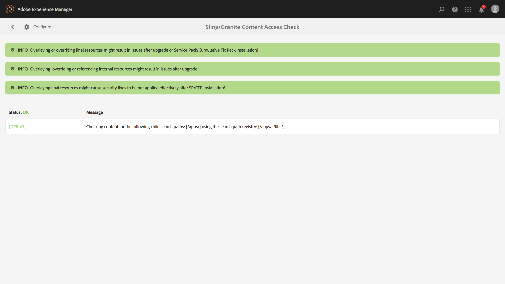

# 永續升級{#sustainable-upgrades}

## 自定義框架 {#customization-framework}

### 體系結構（功能/基礎架構/內容/應用程式）  {#architecture-functional-infrastructure-content-application}

定制框架功能旨在幫助減少代碼（如APIS）或內容（如覆蓋）的不可擴展區域中不友好升級的違規。

定制框架有兩個元件：這樣 **API曲面** 和 **內容分類**。

#### API曲面 {#api-surface}

在以前的版本AEM中，許多API都通過Uber Jar暴露。 其中一些API不打算由客戶使用，但是它們暴露在跨捆綁包的AEM支援功能中。 今後，Java API將標籤為「Public（公共）」或「Private（專用）」 ，以向客戶指示哪些API在升級上下文中可以安全使用。 其他具體內容包括：

* 標籤為 `Public` 可供定制實施包使用和引用。

* 公共API將向後相容相容軟體包的安裝。
* 相容性包將包含相容性Uber JAR，以確保向後相容性
* 標籤為 `Private` 僅供內部捆綁包使AEM用，不應供定制捆綁包使用。

>[!NOTE]
>
>C.C. `Private` 和 `Public` 在這種情況下，不應將Java概念與公共類和私有類混淆。

#### 內容分類 {#content-classifications}

長期以AEM來，客戶一直使用重疊和Sling Resource Moberation的原則來擴展和定制功能AEM. 為控制台和UI提供AEM電源的預定義功能儲存在 **/libs**。 客戶永遠不修改下面的任何內容 **/libs** 但可以在 **/app** 覆蓋和擴展中定義的功能 **/libs** （有關詳細資訊，請參閱使用重疊開發）。 這在作為中的內容升級時AEM仍然引發了許多問題 **/libs** 可能會發生變化，導致重疊功能以意想不到的方式斷開。 客戶還可以通AEM過繼承擴展元件 `sling:resourceSuperType`，或僅在中引用元件 **/libs** 直接通過sling:resourceType。 類似的升級問題可能與參考和覆蓋使用案例有關。

為了讓客戶更安全、更輕鬆地瞭解 **/libs** 可安全使用和覆蓋 **/libs** 已分為以下混合：

* **公共（花崗岩：公共區域）**  — 將節點定義為公共節點，以便它可以重疊、繼承( `sling:resourceSuperType`)或直接使用( `sling:resourceType`)。 在/lib下標為Public的節點添加相容性包後，可以安全地進行升級。 通常，客戶只應利用標籤為「Public」的節點。

* **摘要（花崗岩：摘要區域）**  — 將節點定義為抽象。 節點可以重疊或繼承( `sling:resourceSupertype`)，但不能直接使用( `sling:resourceType`)。

* **最終（花崗岩：最終區域）**  — 將節點定義為最終節點。 理想情況下，分類為最終節點的節點不應重疊或繼承。 最終節點可以直接通過 `sling:resourceType`。 預設情況下，最終節點下的子節點被視為內部節點。

* ***內部（花崗岩：內部區域）*** *- *將節點定義為內部節點。 理想情況下，分類為內部的節點不應被覆蓋、繼承或直接使用。 這些節點僅用於

* **無注釋**  — 節點根據樹層次繼承分類。 預設情況下， / root為Public。 **父節點被分類為「內部」或「最終」，節點也被視為「內部」。**

>[!NOTE]
>
>這些策略只針對基於Sling搜索路徑的機制實施。 其他領域 **/libs** 就像客戶端庫可能被標籤為 `Internal`，但仍可與標準客戶端lib inclusion一起使用。 在這些情況下，客戶必須繼續遵守內部分類。

#### CRXDE Lite內容類型指示器 {#crxde-lite-content-type-indicators}

應用於CRXDE Lite的混合將顯示標籤為的內容節點和樹 `INTERNAL` 顯示。 對於 `FINAL` 只有表徵圖呈灰色。 這些節點的子級也將顯示為灰色。 在這兩種情況下，「覆蓋節點」功能都被禁用。

**公共**

**最終**

**內部**

**內容運行狀況檢查**

>[!NOTE]
>
>自6.AEM5起，Adobe建議使用模式檢測器檢測內容訪問違規。 模式檢測器報告更為詳細，檢測問題更多，誤報率更低。
>
>有關詳細資訊，請參見 [用模式檢測器評估升級複雜度](/help/sites-deploying/pattern-detector.md)。

AEM6.5將附帶運行狀況檢查，以便在重疊或引用的內容以與內容分類不一致的方式使用時提醒客戶。

** Sling/Granite內容訪問檢查**是一種新的運行狀況檢查，它監視儲存庫，以查看客戶代碼是否未正確訪問中的受保護節AEM點。

這將掃描 **/app** 通常需要幾秒才能完成。

要訪問此新運行狀況檢查，您需要執行以下操作：

1. 從主AEM螢幕導航到 **工具>操作>運行狀況報告**
1. 按一下 **Sling/Granite內容訪問檢查** 如下所示：

   

掃描完成後，將顯示警告清單，通知受保護節點的最終用戶未正確引用：

修復違規後，將返回綠色狀態：

運行狀況檢查顯示後台服務收集的資訊，後台服務在所有Sling搜索路徑上使用覆蓋或資源類型時非同步檢查。 如果內容混合使用不正確，則報告違規。
