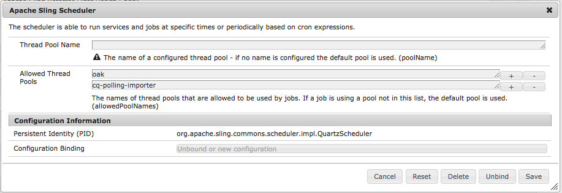

# 疑難排解Oak索引{#troubleshooting-oak-indexes}

## 慢速重新索引 {#slow-re-indexing}

AEM的內部重新索引程式會收集儲存庫資料，並將它儲存在Oak索引中，以支援內容的效能查詢。 在例外情況下，程式可能會變得緩慢甚至停滯。 本頁提供疑難排解指南，可協助您識別索引是否緩慢、找出原因並解決問題。

請務必區分需要花費不適當時間的重新建立索引，以及需要花費大量時間的重新建立索引，因為這是為大量內容建立索引。 例如，索引內容所花的時間會隨著內容量而擴展，因此大型生產儲存庫的重新索引所需時間會比小型開發儲存庫更長。

如需重新 [建立內容索引的詳細資訊](/help/sites-deploying/best-practices-for-queries-and-indexing.md) ，請參閱查詢與索引的最佳實務。

## 初始偵測 {#initial-detection}

初始偵測慢速索引需要檢視 `IndexStats` JMX MBeans。 在受影響的AEM例項上，執行下列動作：

1. 開啟Web Console，然後按一下JMX標籤，或前往https://&lt;host>:&lt;port>/system/console/jmx(例如 [http://localhost:4502/system/console/jmx](http://localhost:4502/system/console/jmx))。
1. 導覽至Mbean `IndexStats` 。
1. 開啟「 `IndexStats` 」和「 `async`」的MBean `fulltext-async`。

1. 對於兩個MBean，檢查 **Done** timestamp和 **LastIndexTime** timestamp是否比當前時間少45分鐘。

1. 對於任一MBean，如果時間值(**Done** 或 **LastIndexedTime**)大於當前時間的45分鐘，則索引作業會失敗或花費太長時間。 這會導致非同步索引過時。

## 強制關閉後，索引暫停 {#indexing-is-paused-after-a-forced-shutdown}

強制關閉會導致AEM在重新啟動後最多暫停30分鐘的非同步索引，而且通常需要另外15分鐘才能完成第一次重新索引通過，總共約45分鐘(與45分鐘的 [Initial Detection](/help/sites-deploying/troubleshooting-oak-indexes.md#initial-detection) temprane)。 如果您懷疑索引在強制關閉後暫停：

1. 首先，判斷AEM例項是否以強制方式關閉（AEM程式已強制中止，或發生電源故障），然後重新啟動。

   * [AEM記錄](/help/sites-deploying/configure-logging.md) ，可依此目的加以審查。

1. 如果發生強制關閉，在重新啟動時，AEM會自動暫停重新建立索引最多30分鐘。
1. 等待約45分鐘，讓AEM繼續正常的非同步索引作業。

## 線程池過載 {#thread-pool-overloaded}

>[!NOTE]
>
>對於AEM 6.1，請確定 [已安裝AEM 6.1 CFP 11](https://helpx.adobe.com/experience-manager/release-notes-aem-6-1-cumulative-fix-pack.html) 。

在特殊情況下，用於管理非同步索引的線程池可能會過載。 為了隔離索引程式，可以設定執行緒池，以防止其他AEM工作干擾Oak即時索引內容的能力。 若要這麼做，您應：

1. 為Apache Sling排程器定義新的隔離執行緒池，以用於非同步索引：

   * 在受影響的AEM例項上，導覽至AEM OSGi Web Console>OSGi>Configuration>Apache Sling Scheduler或前往https://&lt;host>:&lt;port>/system/console/configMgr(例如 [http://localhost:4502/system/console/configMgr](http://localhost:4502/system/console/configMgr))
   * 在「允許的線程池」欄位中添加一個項，其值為&quot;oak&quot;。
   * 按一下右下角的「儲存」，儲存變更。
   

1. 驗證新的Apache Sling Scheduler執行緒池已註冊並顯示在Apache Sling Scheduler Satus網站主控台中。

   * 導覽至AEM OSGi Web console>Status>Sling Scheduler，或前往https://&lt;host>:&lt;port>/system/console/status-slingscheduler(例如 [http://localhost:4502/system/console/status-slingscheduler](http://localhost:4502/system/console/status-slingscheduler))
   * 驗證是否存在以下池條目：

      * ApacheSlingoak
      * ApacheSlingdefault
   

## 觀察隊列已滿 {#observation-queue-is-full}

如果在短時間內對儲存庫進行了太多更改和提交，則由於完全觀察隊列，索引可能會延遲。 首先，確定觀測隊列是否滿：

1. 轉到Web控制台並按一下JMX頁籤，或轉到https://&lt;host>:&lt;port>/system/console/jmx(例如 [http://localhost:4502/system/console/jmx](http://localhost:4502/system/console/jmx))
1. 開啟Oak Repository統計資料MBean，並判斷 `ObservationQueueMaxLength` 是否有大於10,000的值。

   * 在一般作業中，此最大值必須最終降至零(尤其是在 `per second` 區段中)，以確認 `ObservationQueueMaxLength`秒量度為0。
   * 如果值為10,000或更多，並且穩步增加，則表明至少一個（可能更多）隊列無法像發生新更改（提交）那樣快速處理。
   * 每個觀察佇列都有限制（預設為10,000），如果佇列達到此限制，其處理會降低。
   * 當使用MongoMK時，當佇列長度增加時，內部Oak快取效能會降低。 統計MBean中的快取的增 `missRate` 加可 `DocChildren` 看到此 `Consolidated Cache` 關聯。

1. 為避免超過可接受的觀察隊列限制，建議您：

   * 降低提交的恆定速率。 提交中的短尖峰是可以接受的，但應該降低恆定速率。
   * 按照效能調整提示> 「 `DiffCache` Mongo儲存調 [整」>「文檔快取大小」中所述增加大小](https://helpx.adobe.com/experience-manager/kb/performance-tuning-tips.html#main-pars_text_3)。

## 識別和修正停滯的重新索引過程 {#identifying-and-remediating-a-stuck-re-indexing-process}

在兩種情況下，重新編製索引可以被視為「完全停滯」:

* 重新編製索引非常緩慢，以至於日誌檔案中沒有報告有關所遍歷的節點數的顯著進展。

   * 例如，如果在一小時內沒有訊息，或進度太慢，以至需要一週或更久才能完成。

* 如果索引線程中的日誌檔案(例如， `OutOfMemoryException`)中出現重複的異常，重新索引將停滯在無盡的循環中。 重複記錄中的相同例外，表示Oak嘗試重複索引相同的項目，但在相同問題上失敗。

要識別並修復停滯的重新索引過程，請執行以下操作：

1. 為了找出索引卡住的原因，必須收集下列資訊：

   * 收集5分鐘的線程轉儲，每2秒一個線程轉儲。
   * [為附加程式設定DEBUG級別和日誌](/help/sites-deploying/configure-logging.md)。

      * *org.apache.jackrabbit.oak.plugins.index.AsyncIndexUpdate*
      * *org.apache.jackrabbit.oak.plugins.index.IndexUpdate*
   * 從非同步MBean收集 `IndexStats` 資料：

      * 導覽至AEM OSGi Web Console>Main>JMX>IndexStat>async

         或前往 [http://localhost:4502/system/console/jmx/org.apache.jackrabbit.oak%3Aname%3Dasync%2Ctype%3DIndexStats](http://localhost:4502/system/console/jmx/org.apache.jackrabbit.oak%3Aname%3Dasync%2Ctype%3DIndexStats)
   * 使 [用oak-run.jar的主控台模式](https://github.com/apache/jackrabbit-oak/tree/trunk/oak-run) ，收集* `/:async`*節點下的詳細資訊。
   * 使用MBean收集資料庫查核點 `CheckpointManager` 清單：

      * AEM OSGi Web Console>Main>JMX>CheckpointManager>listChreckeptions()

         或前往 [http://localhost:4502/system/console/jmx/org.apache.jackrabbit.oak%3Aname%3DSegment+node+store+checkpoint+management%2Ctype%3DCheckpointManager](http://localhost:4502/system/console/jmx/org.apache.jackrabbit.oak%3Aname%3DSegment+node+store+checkpoint+management%2Ctype%3DCheckpointManager)

1. 收集完步驟1中概述的所有資訊後，請重新啟動AEM。

   * 重新啟動AEM可解決併發負載高（觀察佇列溢位或類似情況）的問題。
   * 如果重新啟動無法解決問題，請向 [Adobe客戶服務開啟問題](https://helpx.adobe.com/marketing-cloud/contact-support.html) ，並提供步驟1中收集的所有資訊。

## 安全中止非同步重新索引 {#safely-aborting-asynchronous-re-indexing}

可以通過和f索引通道( `async, async-reindex`Mbean)安全中止(在完成索引之 `ulltext-async` 前停 `IndexStats` 止)重新索引。 如需詳細資訊，請參閱How to Abort Reindexing上的Apache Oak [檔案](https://jackrabbit.apache.org/oak/docs/query/indexing.html#abort-reindex)。 此外，請考慮：

* Lucene和Lucene屬性索引的重新索引可以中止，因為它們是自然同步的。
* 只有透過啟動重新索引時，Oak屬性索引的重新索引才能中止 `PropertyIndexAsyncReindexMBean`。

要安全中止重新編製索引，請執行以下步驟：

1. 識別控制需要停止的重新建立索引通道的IndexStats MBean。

   * 前往AEM OSGi Web Console>Main>JMX或https://&lt;host>:&lt;port>/system/console/jmx(例如 [http://localhost:4502/system/console/jmx](http://localhost:4502/system/console/jmx))，透過JMX主控台導覽至適當的IndexStats MBean
   * 根據您要停止的重新索引通道(、或 `async``async-reindex``fulltext-async`)，開啟IndexStats MBean

      * 若要識別適當的通道，進而識別IndexStats MBean實例，請查看Oak Indexes &quot;async&quot;屬性。 「async」屬性將包含車道名稱： `async`、 `async-reindex`或 `fulltext-async`。
      * 您也可以存取「非同步」欄中的AEM的Index Manager，以取得通道。 要訪問索引管理器，請導航至操作>診斷>索引管理器。
   

1. 在適當 `abortAndPause()` 的MBean上調用 `IndexStats` 命令。
1. 正確標籤Oak索引定義，以防止在索引通道恢復時繼續重新索引。

   * 在重新索引現有索 **引時** ，請將reindex屬性設為false

      * `/oak:index/someExistingIndex@reindex=false`
   * 或者，對於新的 **指數** ，可以選擇：

      * 將type屬性設為disabled

         * `/oak:index/someNewIndex@type=disabled`
      * 或完全刪除索引定義
   完成時將更改提交到儲存庫。

1. 最後，在中止的索引通道上恢復非同步索引。

   * 在步驟2 `IndexStats` 中發出該命 `abortAndPause()` 令的MBean中，調用該 `resume()`命令。

## 防止慢速重新索引 {#preventing-slow-re-indexing}

最好在安靜時段（例如，不是在大型內容收錄時）重新索引，最理想的是在維護視窗中，當AEM的負載已知並受控時。 此外，請確保在其他維護活動期間不會重新編製索引。
