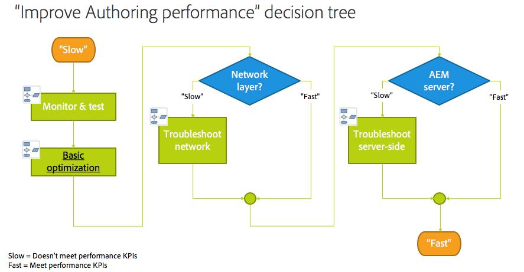

# 疑難排解{#troubleshooting}

本節包含可協助您疑難排解之記錄檔的詳細資訊，並包含有關您可能在AEM中遇到之部分問題的資訊。

## 疑難排解作者效能 {#troubleshoot-author-performance}

分析編寫例項的效能變得相當複雜。 首先需要確定效能正在下降的技術堆疊級別。

以下決策樹提供了縮小瓶頸的指導。

## 基本最佳化 {#basic-optimization}

## 配置日誌檔案和審核日誌 {#configuring-log-files-and-audit-logs}

AEM會記錄詳細記錄，您可能想要設定這些記錄，以疑難排解安裝問題。 有關資訊，請參 [閱使用審計記錄和日誌檔案](/help/sites-deploying/monitoring-and-maintaining.md#working-with-audit-records-and-log-files) 。

## 使用詳細選項 {#using-the-verbose-option}

當您啟動AEM WCM時，可將-v(verbose)選項新增至命令列，如：java -jar cq-wcm-quickstart-&lt;version>.jar -v.

詳細選項顯示控制台上的一些快速啟動日誌輸出，以便用於故障排除。

## 常見安裝問題 {#common-installation-issues}

下節將說明某些安裝問題及其解決方案。

### **按兩下快速啟動jar沒有任何作用，或者使用其他程式開啟jar檔案（例如，存檔管理器）{#double-clicking-the-quickstart-jar-does-not-have-any-effect-or-opens-the-jar-file-with-another-program-for-example-archive-manager}**

這通常表示作業系統案頭環境配置為開啟副檔名為。jar的檔案的方式有問題。 它也可能表示您未安裝Java，或您使用的是不支援的Java版本。

當jar檔案使用普及的ZIP格式時，某些歸檔程式可能會自動配置案頭以將jar檔案作為歸檔檔案開啟。

若要疑難排解，請執行下列動作：

* 再次檢查您是否至少安裝了Java 1.6版。
* 在AEM WCM快速入門中試用內容選單（通常以滑鼠右鍵按一下），然後選取「開啟方式……」.&quot;
* 檢查是否列出Java或Sun Java，並嘗試使用它執行AEM WCM。 如果您已安裝多個Java版本，請選擇支援的版本。

   如果您成功執行此步驟，而您的作業系統提供一個選項，讓您始終使用選取的程式來執行。jar檔案，請加以選取。 現在以後，按兩下應該能夠運作。

* 有時重新安裝支援的Java版本有助於恢復正確的關聯。
* 您始終可以使用命令行運行CRX ，或者像本文檔前面所述的啟動／停止指令碼。

### **我在CRX上執行的應用程式會擲出記憶體不足的錯誤{#my-application-running-on-crx-throws-out-of-memory-errors}**

>[!NOTE]
>
>另請參閱 [分析記憶體問題](https://helpx.adobe.com/experience-manager/kb/AnalyzeMemoryProblems.html)。

CRX本身的記憶體使用量很低。 如果在CRX中運行的應用程式記憶體要求較高或請求大量記憶體操作（例如，大事務），則需要使用適當的記憶體設定來啟動CRX運行的JVM實例。

使用Java命令選項來定義JVM的記憶體設定（例如，java -Xmx512m -jar crx&amp;ast;.jar將heapsize設為512MB）。

從命令列啟動AEM WCM時，請指定記憶體設定選項。 AEM WCM啟動／停止指令碼或管理AEM WCM啟動的自訂指令碼也可以修改，以定義所需的記憶體設定。

如果已將堆大小定義為512MB，則可能希望通過建立堆轉儲進一步分析記憶體問題：

要在記憶體不足時自動建立堆轉儲，請使用以下命令：

java -Xmx256m -XX:+HeapDumpOnOutOfMemoryError -jar &amp;ast;.jar

這將生成堆轉儲檔案(**java_...hprof**)，每當程式記憶體不足時。 生成堆轉儲後，該進程可繼續運行。 通常，一個堆轉儲檔案足以分析問題。

### **連按兩下「AEM快速入門」後，「AEM歡迎」畫面不會顯示在瀏覽器中{#the-aem-welcome-screen-does-not-display-in-the-browser-after-double-clicking-aem-quickstart}**

在某些情況下，即使儲存庫本身已成功執行，AEM WCM歡迎畫面也不會自動顯示。 這可能取決於作業系統設定、瀏覽器組態或類似因素。

常見的症狀是AEM WCM Quickstart視窗會顯示「AEM WCM啟動，等待伺服器啟動……」.&quot; 如果訊息顯示較長時間，請使用預設的4502連接埠或執行例項的連接埠，手動將AEM WCM URL輸入瀏覽器視窗中：http://localhost:4502/。

此外，記錄檔可能會顯示瀏覽器未啟動的原因。

有時，AEM WCM Quickstart視窗會顯示訊息「AEM WCM running on http://localhost:port/」，而瀏覽器不會自動啟動。 在此例中，按一下「AEM WCM快速入門」視窗中的URL（它是超連結），或在瀏覽器中手動輸入URL。

如果其他一切都失敗，請查看記錄，以瞭解發生了什麼。

## 使用應用程式伺服器進行安裝故障排除 {#troubleshooting-installations-with-an-application-server}

### **請求geometrixx-outdoor頁面時傳回「找不到頁面」{#page-not-found-returned-when-requesting-a-geometrixx-outdoor-page}**

**適用於WebLogic 10.3.5和JBoss 5.1**

當geometrixx-outdoors/en page的請求傳回404(Page Not Foun)時，您可重新檢查您是否已在這些特定Application Servers所需的sling.properties檔案中設定其他sling屬性。

如需詳細資訊， *請參閱「部署AEM網頁應用程式* 」步驟。

### **回應標題大小可以大於4Kb{#response-header-size-can-be-greater-than-kb}**

502錯誤可能表示Web伺服器無法處理AEM HTTP回應標頭的大小。 AEM可產生HTTP回應標頭，其中包含大小大於4Kb的Cookie。 請確定您的servlet容器已設定好，以便最大回應標題大小可超過4kb。

例如，對於Tomcat 7.0,  HTTP連接器的maxHttpHeaderSize屬性可控制標題大小的限制。

## 解除安裝Adobe Experience Manager {#uninstalling-adobe-experience-manager}

由於AEM會安裝在單一目錄中，所以不需要解除安裝公用程式。 解除安裝可能就像刪除整個安裝目錄一樣簡單，不過解除安裝AEM的方式取決於您要達到的目的，以及您使用的永續儲存空間。

如果永久儲存嵌入安裝目錄（例如，在預設TarPM安裝中），則刪除資料夾也會刪除資料。

>[!NOTE]
>
>Adobe強烈建議您在刪除AEM之前先備份儲存庫。 如果刪除整個&lt;cq-installation-directory>，將刪除儲存庫。 要保留儲存庫資料，請在刪除其他資料夾之前，將&lt;cq-installation-directory>/crx-quickstart/repository資料夾移動或複製到其他位置。

如果您的AEM安裝使用外部儲存（例如資料庫伺服器），移除資料夾並不會自動移除資料，但會移除儲存設定，因此很難還原JCR內容。

### **JSP檔案不在JBoss上編譯{#jsp-files-are-not-compiled-on-jboss}**

如果您在JBoss上將JSP檔案安裝或更新到Experience Manager，且未編譯相應的servlet，請確保正確配置了JBoss JSP編譯器。 如需詳細資訊，請參閱[JBoss中的JSP編譯問題](https://helpx.adobe.com/experience-manager/kb/jsps-dont-compile-jboss.html) 。
