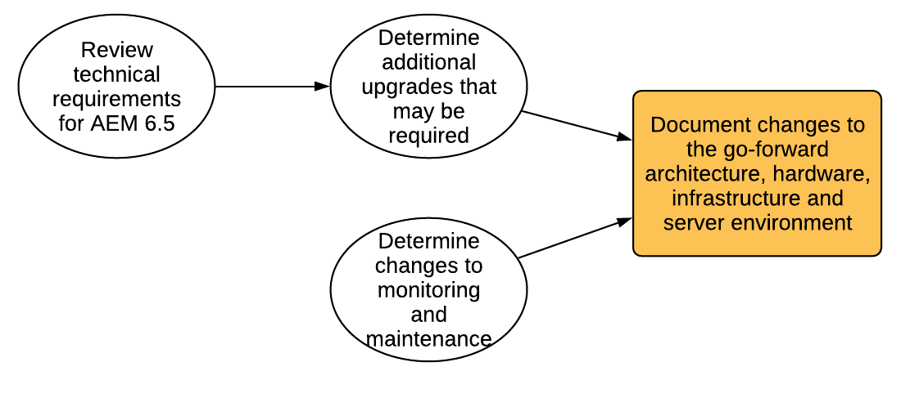

# 規劃升級{#planning-your-upgrade}

## AEM專案概述 {#aem-project-overview}

AEM通常用於高影響力的部署，可能會為數百萬使用者提供服務。 通常，執行個體上會部署自訂應用程式，這會增加複雜性。 任何升級此類部署的工作都必須有條不紊地處理。

本指南有助於在規劃升級時建立明確的目標、階段和交付專案。 它著重於整體專案執行和指南。 雖然提供實際升級步驟的概觀，但會視情況參考可用的技術資源。 應搭配檔案中提及的可用技術資源使用。

「AEM升級」處理需要謹慎處理計畫、分析及執行階段，並為每個階段定義主要交付專案。

可以直接從AEM 6.0版升級到6.5版。執行5.6.x及以下版本的客戶，必須先升級至6.0版或以上版本，建議使用6.0 (SP3)。 此外，新的Oak區段Tar格式現在已用於6.3之後的區段節點存放區，並且即使是6.0、6.1和6.2，儲存庫移轉至此新格式也是強制性的。

>[!CAUTION]
>
>如果您要從AEM 6.2升級至6.3，您應該從以下版本升級：**6.2-SP1-CFP1 —6.2SP1-CFP12.1**)或 **6.2SP1-CFP15** 往後。 否則，如果您要從 **6.2SP1-CFP13/6.2SP1CFP14** 若為AEM 6.3，您至少必須升級至版本 **6.3.2.2**. 否則，AEM Sites在升級後會失敗。

## 升級範圍與需求 {#upgrade-scope-requirements}

在下方，您會找到典型AEM升級專案中受影響的區域清單：

<table>
 <tbody>
  <tr>
   <td><strong>元件</strong></td>
   <td><strong>影響</strong></td>
   <td><strong>說明</strong></td>
  </tr>
  <tr>
   <td>作業系統</td>
   <td>不確定，但微小的效果</td>
   <td>在AEM升級時，也可能需要升級作業系統，這可能會造成一些影響。</td>
  </tr>
  <tr>
   <td>Java™ Runtime</td>
   <td>中等影響</td>
   <td>AEM 6.3需要JRE 1.7.x （64位元）或更新版本。 JRE 1.8是Oracle目前唯一支援的版本。</td>
  </tr>
  <tr>
   <td>硬體</td>
   <td>中等影響</td>
   <td>線上修訂清除需要免費  磁碟空間等於存放庫大小的25%和15%的可用棧積空間  以成功完成。 您可能需要將硬體升級至  確保線上修訂清除有足夠的資源，以完全  執行。 此外，如果從AEM 6之前的版本升級，則  可能是額外的儲存需求。</td>
  </tr>
  <tr>
   <td>內容存放庫（CRX或Oak）</td>
   <td>高影響力</td>
   <td>從6.1版開始，AEM不支援CRX2，因此將移轉至  若從舊版升級，則需要Oak (CRX3)。 AEM 6.3具有  實作了一個也需要移轉的新區段節點存放區。 此  crx2oak工具用於此目的。</td>
  </tr>
  <tr>
   <td>AEM元件/內容</td>
   <td>中等影響</td>
   <td><code>/libs</code> 和 <code>/apps</code> 可透過升級輕鬆處理，但 <code>/etc</code> 通常需要手動重新應用自訂。</td>
  </tr>
  <tr>
   <td>AEM服務</td>
   <td>低影響力</td>
   <td>大部分的AEM核心服務都經過升級測試。 這是影響較低的區域。</td>
  </tr>
  <tr>
   <td>自訂應用程式服務</td>
   <td>從低到高的影響力</td>
   <td>視應用程式和自訂而定，可能會  JVM的相依性、作業系統版本，以及一些相關的索引  變更，因為索引不會在Oak中自動產生。</td>
  </tr>
  <tr>
   <td>自訂應用程式內容</td>
   <td>從低到高的影響力</td>
   <td>無法透過升級處理的內容可以備份  進行升級之前，然後移回存放庫。  大部分的內容都可透過移轉工具處理。</td>
  </tr>
 </tbody>
</table>

請務必確保您執行的是支援的作業系統、Java™執行階段、httpd和Dispatcher版本。 如需詳細資訊，請參閱 [AEM 6.5技術需求頁面](/help/sites-deploying/technical-requirements.md). 升級這些元件必須在您的專案計畫中考量，並應於升級AEM前進行。

## 專案階段 {#project-phases}

規劃和執行AEM升級需要做許多工作。 為了釐清進入此流程的不同工作，Adobe已將計畫與執行作業劃分為不同的階段。 在以下各節中，每個階段都會產生專案未來階段通常會使用的交付專案。

### 作者培訓計畫 {#planning-for-author-training}

任何新發行版本都可能引入UI和使用者工作流程的潛在變更。 此外，新發行版本引入的新功能可能對企業有益。 Adobe建議您檢閱已引進的功能變更，並組織計畫以訓練您的使用者如何有效使用這些變更。

AEM 6.5中的新功能可在以下網址找到： [adobe.com的AEM區段](/help/release-notes/release-notes.md). 請務必留意貴組織常用的UI或產品功能有任何變更。 瀏覽新功能時，請注意對貴組織有價值的任何功能。 檢視AEM 6.5中的變更後，為作者開發訓練計畫。 這可能需要使用免費提供的資源，例如說明專題影片或透過提供的正式培訓 [Adobe數位學習服務](https://learning.adobe.com/).

### 建立測試計畫 {#creating-a-test-plan}

每位客戶的AEM實作都是獨一無二，並且已經過客製化以符合其業務需求。 因此，請務必判斷已對系統進行的所有自訂，以便將其包含在測試計畫中。 此測試計畫會為Adobe在升級的執行個體上執行的QA程式提供電源。

確切的生產環境需要複製，並在升級後對其執行測試，以確保所有應用程式和自訂程式碼仍如預期執行。 回覆所有自訂並執行效能、載入和安全性測試。 組織測試計畫時，除了現成可用的UI和日常操作中使用的工作流程之外，請務必涵蓋所有已針對系統進行的自訂。 這些可能包括自訂OSGI服務和servlet、與Adobe Experience Cloud的整合、透過AEM聯結器的與協力廠商的整合、自訂第三方整合、自訂元件和範本、AEM中的自訂UI覆蓋以及自訂工作流程。 對於從AEM 6之前的版本移轉的客戶，應分析任何自訂查詢，因為這些查詢可能需要編制索引。 對於已使用AEM 6.x版本的客戶，仍應測試這些查詢，以確保其索引在升級後繼續有效運作。

### 決定所需的架構和基礎架構變更 {#determining-architectural-and-infrastructure-changes-needed}

升級時，您可能還需要升級技術棧疊中的其他元件，例如作業系統或JVM。 此外，由於存放庫變更，可能需要額外的硬體。 這僅適用於從6.x版之前的執行個體移轉的客戶，但必須考慮。 最後，您的營運實務可能需有所變更，包括監控、維護、備份與災難回覆程式。

檢閱AEM 6.5的技術需求，並確定您目前的軟硬體足以應付。 如需作業處理的潛在變更，請參閱下列檔案：

**監控與維護：**

[操作控制面板](/help/sites-administering/operations-dashboard.md)

[Assets 監控最佳實務](/help/assets/assets-monitoring-best-practices.md)

[使用JMX主控台監控伺服器資源](/help/sites-administering/jmx-console.md)

[修訂清除](/help/sites-deploying/revision-cleanup.md)

**備份/還原與災難回覆：**

[備份和還原](/help/sites-administering/backup-and-restore.md)

[效能與擴充性](/help/sites-deploying/performance.md)

[如何使用TarMK冷待命執行AEM](/help/sites-deploying/tarmk-cold-standby.md)

#### 內容重組考量事項 {#content-restructuring-considerations}

AEM已引進存放庫結構的變更，這有助於使升級更順暢。 這些變更包括根據Adobe或客戶是否擁有內容，將內容從/etc資料夾移出至/libs、/apps和/content等資料夾，從而限制在發行期間覆寫內容的機會。 存放庫重組已經完成，因此在6.5升級時不需要變更程式碼，但建議檢閱詳細資訊： [AEM中的存放庫重組](/help/sites-deploying/repository-restructuring.md) 規劃升級時。

### 評估升級複雜性 {#assessing-upgrade-complexity}

由於Adobe客戶套用至其AEM環境的自訂數量和性質差異極大，因此請務必花一些時間預先判斷升級時應期望的整體工作量等級。

您有兩種方法來評估升級的複雜性，預備階段可使用新引進的模式偵測器，此偵測器可在您的AEM 6.1、6.2和6.3執行個體上執行。 模式偵測器是使用報告模式來評估預期的升級整體複雜度的最簡單方式。 模式偵測器報表包含用來識別自訂程式碼基底使用中無法使用API的模式（這是使用6.3中的升級前相容性檢查完成）。

初始評估之後，更全面的下一步可能是升級測試執行個體，並執行一些基本的冒煙測試。 Adobe也提供一些。 此外， [已棄用及已移除的功能](/help/release-notes/deprecated-removed-features.md) 您不僅應該檢閱要升級至的版本，也應該檢閱來源和目標版本之間的任何版本。 例如，如果從AEM 6.2升級至6.5，除了針對AEM 6.5的功能外，也請務必檢閱AEM 6.3已過時和已移除的功能。

最近推出的模式偵測器可讓您相當準確地估計在大部分情況下升級時的情形。 不過，對於較複雜的自訂專案和部署，如有不相容的變更，您可以根據中的指示，將開發執行個體升級至AEM 6.5 [執行就地升級](/help/sites-deploying/in-place-upgrade.md). 完成後，請在此環境中執行一些高階煙霧測試。 本練習的目標不是要徹底完成測試案例清查並產生正式的瑕疵清查，而是要提供升級程式碼以符合6.5相容性所需的工作量粗略估計。 當與 [圖樣偵測](/help/sites-deploying/pattern-detector.md) 以及上一節所決定的架構變更，可提供粗略的估計，給專案管理團隊以計畫升級。

### 建置升級和回覆Runbook {#building-the-upgrade-and-rollback-runbook}

雖然Adobe已記錄升級AEM執行個體的程式，但每個客戶的網路配置、部署架構和自訂都需要微調和量身打造此方法。 因此，Adobe鼓勵您檢閱所有提供的檔案，並將其用於告知專案特定的Runbook，其中會概述您將在環境中遵循的特定升級和復原程式。 如果從CRX2升級，請務必評估從CRX2移轉至Oak時內容移轉所需的時間。 對於大型存放庫而言，這可能相當龐大。

Adobe已在以下位置提供升級和復原程式： [升級程式](/help/sites-deploying/upgrade-procedure.md) 以及在執行中套用升級的逐步指示 [就地升級](/help/sites-deploying/in-place-upgrade.md). 您應該檢閱這些指示，並搭配系統架構、自訂和停機時間容許度加以考慮，以決定升級期間要執行的適當切換和復原程式。 在草擬您的自訂Runbook時，應包含架構或伺服器大小的任何變更。 請務必注意，這應視為第一份草稿。 當您的團隊完成QA和開發週期並將升級部署到中繼環境時，可能需要執行一些額外的步驟。 理想情況下，本檔案應包含足夠的資訊，若將其交給您的營運人員，他們將能夠完全從內含的資訊完成升級。

### 開發專案計畫 {#developing-a-project-plan}

先前練習的輸出可用於建立專案計畫，涵蓋測試或開發工作、培訓及實際升級執行的預期時間表。

完整的專案計畫應包括：

* 完成開發及測試計畫
* 升級開發和QA環境
* 更新AEM 6.5的自訂程式碼基底
* QA測試和修正週期
* 升級中繼環境
* 整合、效能和負載測試
* 環境認證
* 上線

### 執行開發和QA {#performing-development-and-qa}

Adobe已提供以下專案的程式 [升級程式碼和自訂](/help/sites-deploying/upgrading-code-and-customizations.md) 以與AEM 6.5相容。在執行此反複處理程式時，應視需要變更Runbook。 另請參閱 [AEM 6.5的回溯相容性](/help/sites-deploying/backward-compatibility.md) 提供自訂如何保持回溯相容的資訊，通常在升級後不需要立即開發。

開發和測試過程通常是反複的過程。 由於自訂，在升級期間進行的變更可能會導致產品的整個區段無法使用。 一旦開發人員已解決問題的根本原因，並且測試團隊有權測試這些功能，就有可能發現其他問題。 發現需要調整升級流程的問題時，請務必將其新增到您的自訂升級Runbook。 在反複測試和修正之後，程式碼庫應該會經過完整驗證，並準備好部署到中繼環境。

### 最終測試 {#final-testing}

Adobe建議在程式碼基底獲得組織的QA團隊認證後，進行最後一輪測試。 這輪測試將需要在中繼環境中驗證您的Runbook，然後進行多輪使用者接受、效能和安全性測試。

此步驟非常重要，因為這是您唯一能夠針對生產環境驗證Runbook中的步驟的時間。 升級環境後，請務必讓使用者有時間登入並完成在日常活動中使用系統時所做的活動。 使用者使用先前未考量的系統部分是很常見的現象。 在上線之前，找出並修正這些區域的問題，可協助避免代價高昂的生產中斷。 由於新版AEM包含基礎平台的重大變更，因此也必須在系統上執行效能、載入及安全性測試，就像您第一次啟動它一樣。

### 執行升級 {#performing-the-upgrade}

收到所有利害關係人的最終簽核後，就可以依照定義的Runbook程式執行了。 Adobe已提供升級和復原的步驟 [升級程式](/help/sites-deploying/upgrade-procedure.md) 和安裝步驟執行 [就地升級](/help/sites-deploying/in-place-upgrade.md) 作為參考點。

Adobe在環境驗證的升級指示中提供了一些步驟。 這些包括基本檢查，例如掃描升級記錄檔和驗證所有OSGi套件組合皆已正確啟動，但Adobe建議也根據您的業務流程，使用您自己的測試案例進行驗證。 Adobe也建議檢查AEM線上修訂清除及相關常式的排程，以確保這些作業會在您公司的安靜時間發生。 這些常式對於AEM的長期效能至關重要。
