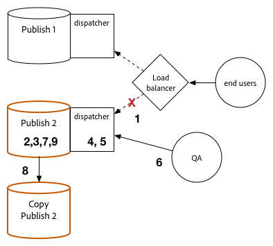

# 升級程式 {#upgrade-procedure}

>[!NOTE]
>
>由於大部分的AEM升級都是就地執行，因此升級作業層需要停機。 遵循這些最佳實務，可將發佈層停機時間減至最少或免除。

在升級AEM環境時，您需要考慮在升級作者環境或發佈環境之間的方式差異，以便將您的作者和使用者的停機時間減至最少。 本頁概述升級目前在AEM 6.x版本上執行的AEM拓撲的高階程式。由於作者和發佈層以及基於Mongo和TarMK的部署之間的流程不同，因此每個層和微內核都列在單獨的部分中。 在執行部署時，我們建議您先升級您的作者環境、決定成功，然後繼續進行發佈環境。

## TarMK作者層 {#tarmk-author-tier}

### 啟動拓撲 {#starting-topology}

本節假定的拓撲由運行在TarMK上且具有冷備用的Author伺服器組成。 複製從作者伺服器到TarMK發佈群。 雖然此處未說明，但此方法也可用於使用卸載的部署。 請務必在Author實例上禁用複製代理之後以及重新啟用它們之前，升級或重建新版本上的卸載實例。

### 升級準備 {#upgrade-preparation}

1. 停止內容製作

1. 停止備用實例

1. 在作者上禁用複製代理

1. 運行預 [升級維護任務](/help/sites-deploying/pre-upgrade-maintenance-tasks.md)。

### 升級執行 {#upgrade-execution}

1. 執行就 [地升級](/help/sites-deploying/in-place-upgrade.md)
1. 如果需要，請更 *新調度器模組*

1. QA驗證升級

1. 關閉作者實例。

### 如果成功 {#if-successful}

1. 複製升級實例以建立新的Cold Standby

1. 啟動Author實例

1. 啟動備用實例。

### 如果失敗（回滾） {#if-unsuccessful-rollback}

1. 啟動Cold Standby實例作為新的主實例

1. 從冷備用模式重建作者環境。

## MongoMK作者叢集 {#mongomk-author-cluster}

### 啟動拓撲 {#starting-topology-1}

本節假定的拓撲由MongoMK Author群集組成，其中至少包含兩個AEM Author實例，由至少兩個MongoMK資料庫作為後盾。 所有作者實例都共用一個資料儲存。 這些步驟應同時套用至S3和File資料存放區。 複製從作者伺服器到TarMK發佈群。

### 升級準備 {#upgrade-preparation-1}

1. 停止內容製作
1. 克隆資料儲存以進行備份
1. 停止除一個AEM作者例項（您的主要作者）外的所有作業
1. 從複製副本集（您的主Mongo實例）中刪除除一個MongoDB節點之外的所有MongoDB節點
1. 更新主 `DocumentNodeStoreService.cfg` 作者上的檔案，以反映您的單個成員複製副本集
1. 重新啟動主作者，以確保其正常重新啟動
1. 在主作者上禁用複製代理
1. 在主 [要Author實例上運行升級前](/help/sites-deploying/pre-upgrade-maintenance-tasks.md) 維護任務
1. 如有必要，請將主Mongo實例上的MongoDB升級為3.2版（使用WiredTiger）

### 升級執行 {#Upgrade-execution-1}

1. 在主 [要作者上執行就地](/help/sites-deploying/in-place-upgrade.md) 升級
1. 視需要更新Dispatcher或Web *模組*
1. QA驗證升級

### 如果成功 {#if-successful-1}

1. 建立新的6.5 Author執行個體，連線至升級的Mongo執行個體

1. 重建從群集中刪除的MongoDB節點

1. 更新文 `DocumentNodeStoreService.cfg` 件以反映完整的複製副本集

1. 重新啟動「作者」例項，一次一個

1. 刪除克隆的資料儲存。

### 如果失敗（回滾） {#if-unsuccessful-rollback-2}

1. 重新配置次Author實例以連接到克隆的資料儲存

1. 關閉升級的Author主實例

1. 關閉升級的Mongo主實例。

1. 啟動輔助Mongo實例，其中一個實例作為新的主實例

1. 配置次 `DocumentNodeStoreService.cfg` Author實例上的檔案，以指向尚未升級的Mongo實例的複製副本集

1. 啟動次要的「作者」例項

1. 清除升級的作者實例、Mongo節點和資料儲存。

## TarMK發佈群組 {#tarmk-publish-farm}

### TarMK發佈群組 {#tarmk-publish-farm-1}

此部分假定的拓撲由兩個TarMK發佈實例組成，前面是由負載平衡器前面的Dispatchers。 複製從作者伺服器到TarMK發佈群。

### 升級執行 {#upgrade-execution-2}

1. 在負載平衡器停止Publish 2例項的流量
1. 在 [Publish 2上執行升級前](/help/sites-deploying/pre-upgrade-maintenance-tasks.md) 維護
1. 在Publish 2 [上執行就地](/help/sites-deploying/in-place-upgrade.md) 升級
1. 視需要更新Dispatcher或Web *模組*
1. 刷新Dispatcher快取
1. QA會驗證Publish 2透過防火牆後方的Dispatcher
1. 關閉發佈2
1. 複製Publish 2例項
1. 開始發佈2

### 如果成功 {#if-successful-2}

1. 啟用流量以發佈2
1. 將流量停止為發佈1
1. 停止Publish 1例項
1. 將Publish 1例項取代為Publish 2復本
1. 視需要更新Dispatcher或Web *模組*
1. 刷新Dispatcher快取以用於Publish 1
1. 開始發佈1
1. QA會驗證Publish 1透過防火牆後方的Dispatcher

### 如果失敗（回滾） {#if-unsuccessful-rollback-1}

1. 建立發佈1的復本
1. 將Publish 2例項取代為Publish 1副本
1. 刷新Dispatcher快取以用於Publish 2
1. 開始發佈2
1. QA會驗證Publish 2透過防火牆後方的Dispatcher
1. 啟用流量以發佈2

## 最終升級步驟 {#final-upgrade-steps}

1. 啟用流量以發佈1
1. QA會從公開URL執行最終驗證
1. 從作者環境啟用複製代理
1. 繼續製作內容
1. 執行 [升級後檢查](/help/sites-deploying/post-upgrade-checks-and-troubleshooting.md)。

