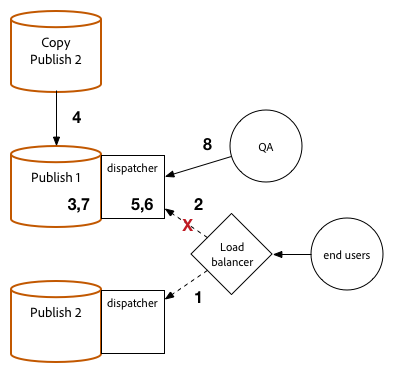

# 升級過程 {#upgrade-procedure}

>[!NOTE]
>
>由於大多數升級都是就地執行的，因此升級將AEM需要「作者」層停機。 通過遵循這些最佳做法，可以最小化或消除發佈層停機時間。

在升級AEM環境時，您需要考慮升級作者環境或發佈環境之間在方法上的差異，以便最大限度地減少您的作者和最終用戶的停機時間。 本頁概述了升級當前在6.AEMx版上運行的拓撲的AEM高級過程。由於作者層和發佈層以及基於Mongo和TarMK的部署之間的進程不同，因此每個層和微內核已在單獨的部分中列出。 執行部署時，我們建議先升級您的作者環境，確定成功與否，然後繼續到發佈環境。

<!--
>[!IMPORTANT]
>
>The downtime during the upgrade can be significally reduced by indexing the repository before performing the upgrade. For more information, see [Using Offline Reindexing To Reduce Downtime During an Upgrade](/help/sites-deploying/upgrade-offline-reindexing.md)
-->

## TarMK作者層 {#tarmk-author-tier}

### 啟動拓撲 {#starting-topology}

此部分假定的拓撲由運行在TarMK上且具有冷備用的Author伺服器組成。 從作者伺服器到TarMK發佈場進行複製。 雖然此處未說明，但此方法也可用於使用卸載的部署。 在Author實例上禁用複製代理後，在重新啟用它們之前，確保在新版本上升級或重新生成卸載實例。

### 升級準備 {#upgrade-preparation}

1. 停止內容創作

1. 停止備用實例

1. 禁用作者上的複製代理

1. 運行 [預升級維護任務](/help/sites-deploying/pre-upgrade-maintenance-tasks.md)。

### 升級執行 {#upgrade-execution}

1. 運行 [就地升級](/help/sites-deploying/in-place-upgrade.md)
1. 更新調度程式模組 *如果需要*

1. QA驗證升級

1. 關閉作者實例。

### 如果成功 {#if-successful}

1. 複製已升級實例以建立新的冷備用實例

1. 啟動Author實例

1. 啟動備用實例。

### 如果失敗（回滾） {#if-unsuccessful-rollback}

1. 將冷備用實例作為新主實例啟動

1. 從「冷備用」重建「作者」環境。

## MongoMK作者群集 {#mongomk-author-cluster}

### 啟動拓撲 {#starting-topology-1}

本節假定的拓撲由MongoMK Author群集組成，該群集至少包含兩個AEM Author實例，並且至少支援兩個MongoMK資料庫。 所有作者實例共用一個資料儲存。 這些步驟應同時適用於S3和檔案資料儲存。 從作者伺服器到TarMK發佈場進行複製。

### 升級準備 {#upgrade-preparation-1}

1. 停止內容創作
1. 克隆資料儲存以進行備份
1. 停止除一個AEM作者實例外的所有實例，即您的主要作者
1. 從複製副本集（主Mongo實例）中刪除除一個MongoDB節點外的所有MongoDB節點
1. 更新 `DocumentNodeStoreService.cfg` 主作者上的檔案，以反映您的單個成員複製副本集
1. 重新啟動主作者，以確保其正確重新啟動
1. 禁用主作者上的複製代理
1. 運行 [預升級維護任務](/help/sites-deploying/pre-upgrade-maintenance-tasks.md) 主作者實例
1. 如有必要，使用WiredTiger將主Mongo實例上的MongoDB升級到3.2版

### 升級執行 {#Upgrade-execution-1}

1. 運行 [就地升級](/help/sites-deploying/in-place-upgrade.md) 主作者
1. 更新Dispatcher或Web模組 *如果需要*
1. QA驗證升級

### 如果成功 {#if-successful-1}

1. 建立新的6.5作者實例，連接到升級的Mongo實例

1. 重建從群集中刪除的MongoDB節點

1. 更新 `DocumentNodeStoreService.cfg` 要反映完整副本集的檔案

1. 重新啟動Author實例，一次一個

1. 刪除克隆的資料儲存。

### 如果失敗（回滾）  {#if-unsuccessful-rollback-2}

1. 重新配置輔助作者實例以連接到克隆的資料儲存

1. 關閉已升級的作者主實例

1. 關閉已升級的Mongo主實例。

1. 啟動輔助Mongo實例，其中一個實例作為新的主實例

1. 配置 `DocumentNodeStoreService.cfg` 輔助Author實例上的檔案，指向尚未升級的Mongo實例的複製副本集

1. 啟動輔助Author實例

1. 清除已升級的作者實例、Mongo節點和資料儲存。

## TarMK發佈場 {#tarmk-publish-farm}

### TarMK發佈場 {#tarmk-publish-farm-1}

此部分假定的拓撲由兩個TarMK發佈實例組成，前面是調度程式，後面是負載平衡器。 從作者伺服器到TarMK發佈場進行複製。

### 升級執行 {#upgrade-execution-2}

1. 在負載平衡器上停止到Publish 2實例的通信
1. 運行 [升級前維護](/help/sites-deploying/pre-upgrade-maintenance-tasks.md) 發佈2
1. 運行 [就地升級](/help/sites-deploying/in-place-upgrade.md) 發佈2
1. 更新Dispatcher或Web模組 *如果需要*
1. 刷新Dispatcher快取
1. QA通過防火牆後的Dispatcher驗證Publish 2
1. 關閉發佈2
1. 複製發佈2實例
1. 開始發佈2

### 如果成功 {#if-successful-2}

1. 啟用通信以發佈2
1. 停止發佈1的通信
1. 停止發佈1實例
1. 將Publish 1實例替換為Publish 2的副本
1. 更新Dispatcher或Web模組 *如果需要*
1. 刷新發佈1的Dispatcher快取
1. 開始發佈1
1. QA通過防火牆後的Dispatcher驗證Publish 1

### 如果失敗（回滾） {#if-unsuccessful-rollback-1}

1. 建立發佈1的副本
1. 將Publish 2實例替換為Publish 1的副本
1. 刷新發佈2的Dispatcher快取
1. 開始發佈2
1. QA通過防火牆後的Dispatcher驗證Publish 2
1. 啟用通信以發佈2

## 最終升級步驟 {#final-upgrade-steps}

1. 啟用通信以發佈1
1. QA從公共URL執行最終驗證
1. 從作者環境啟用複製代理
1. 恢復內容創作
1. 執行 [升級後檢查](/help/sites-deploying/post-upgrade-checks-and-troubleshooting.md)。

