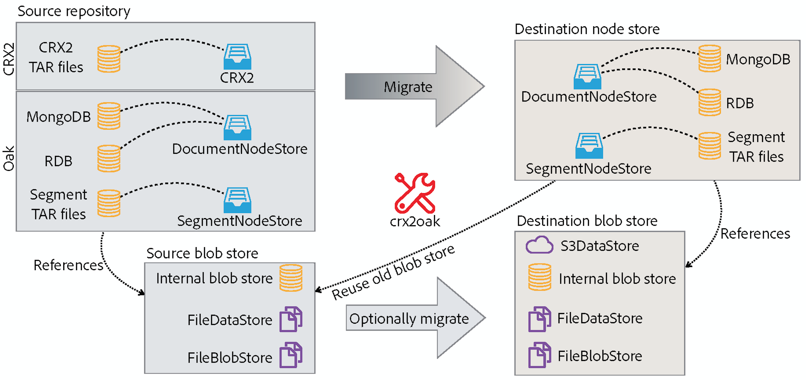

# 使用CRX2Oak遷移工具{#using-the-crx-oak-migration-tool}

## 簡介 {#introduction}

CRX2Oak是一種工具，旨在在不同儲存庫之間遷移資料。

它可用於將基於Apache Jackrabbit 2的舊版CQ版本的資料遷移到Oak，還可用於在Oak儲存庫之間複製資料。

您可以從以下位置的公共Adobe庫下載最新版本的crx2oak:
[https://repo1.maven.org/maven2/com/adobe/granite/crx2oak/](https://repo1.maven.org/maven2/com/adobe/granite/crx2oak/)

>[!NOTE]
>
>有關Apache Oak和持久性關鍵概念的詳細信AEM息，請參見 [平台簡AEM介](/help/sites-deploying/platform.md)。

## 遷移使用案例 {#migration-use-cases}

該工具可用於：

* 從較舊的CQ 5版本遷移到AEM6
* 在多個Oak儲存庫之間複製資料
* 在不同Oak MicroKernel實現之間轉換資料。

支援使用外部Blob儲存區（通常稱為資料儲存區）遷移儲存庫，這些支援以不同組合提供。 一個可能的遷移路徑來自使用外部的CRX2儲存庫 `FileDataStore` 使用 `S3DataStore`。

下圖說明了CRX2Oak支援的所有可能遷移組合：



## 功能 {#features}

在升級期間調用CRX2Oak,AEM用戶可以指定預定義的遷移配置檔案，以自動重新配置持久性模式。 這稱為快速啟動模式。

還可以單獨運行，以備需要更多自定義。 但是，請注意，在此模式下，僅對儲存庫進行更改，需要手動執行AEM任何附加重新配置。 這稱為獨立模式。

另需注意的是，在獨立模式下使用預設設定時，將只遷移節點儲存，而新儲存庫將重新使用舊的二進位儲存。

### 自動快速啟動模式 {#automated-quickstart-mode}

自AEM6.3以來，CRX2Oak能夠處理用戶定義的遷移配置檔案，這些配置檔案可以配置所有已經可用的遷移選項。 這既允許更高的靈活性，又允許自動配置在獨立模式下AEM使用工具時不可用的功能。

為了將CRX2Oak切換為快速啟動模式，您需要通過此作業系統環境變數定義安裝目錄中crx-AEMquickstart資料夾的路徑：

**對於基於UNIX的系統和macOS:**

```shell
export SLING_HOME="/path/to/crx-quickstart"
```

**對於Windows:**

```shell
SET "SLING_HOME=/path/to/crx-quickstart"
```

#### 恢復支援 {#resume-support}

遷移可以隨時中斷，並可以隨後恢復。

#### 可定製的升級邏輯 {#customizable-upgrade-logic}

自定義Java邏輯也使用 `CommitHooks`。 自定義 `RepositoryInitializer` 可以實現類，以便用自定義值初始化儲存庫。

#### 支援記憶體映射操作 {#support-for-memory-mapped-operations}

CRX2Oak還支援預設的記憶體映射操作。 記憶體映射大大提高了效能，應盡可能使用。

>[!CAUTION]
>
>但請注意，Windows平台不支援記憶體映射操作。 因此，建議將 **— 禁用 — mmap** 在Windows上執行遷移時使用的參數。

#### 內容的選擇性遷移 {#selective-migration-of-content}

預設情況下，該工具將整個儲存庫遷移到 `"/"` 路徑。 但是，您完全控制應遷移哪些內容。

如果新實例上沒有要求的內容的任何部分，則可以使用 `--exclude-path` 來排除內容並優化升級過程的參數。

#### 路徑合併 {#path-merging}

如果需要在兩個儲存庫之間複製資料，並且您在兩個實例上都有不同的內容路徑，則可以在 `--merge-path` 的下界。 一旦您這樣做， CRX2Oak將只將新節點複製到目標儲存庫，並保留舊節點。


#### 版本支援 {#version-support}

預設情況下AEM，將建立每個被修改的節點或頁面的版本，並將其儲存在儲存庫中。 然後，這些版本可用於將頁面還原到早期狀態。

但是，即使刪除了原始頁面，也不會清除這些版本。 在處理已運行了很長時間的儲存庫時，遷移可能需要處理由孤立版本引起的大量冗餘資料。

對於這些類型的情況，一個有用的特徵是 `--copy-versions` 的下界。 它可用於在遷移或複製儲存庫期間跳過版本節點。

您還可以通過添加來選擇是否複製孤立版本 `--copy-orphaned-versions=true`。

這兩個參數也支援 `YYYY-MM-DD` 日期格式，以防您要在特定日期之前復製版本。


#### 開源版本 {#open-source-version}

CRX2Oak的開放原始碼版本以橡木升級的形式提供。 它支援除以下外的所有功能：

* CRX2支援
* 遷移配置檔案支援
* 支援自動重AEM新配置

查看 [Apache文檔](https://jackrabbit.apache.org/oak/docs/migration.html) 的子菜單。

## 參數 {#parameters}

### 節點儲存選項 {#node-store-options}

* `--cache`:快取大小(MB)(預設為 `256`)

* `--mmap`:啟用段儲存的記憶體映射檔案訪問
* `--src-password:` 源RDB資料庫的密碼

* `--src-user:` 源RDB的用戶

* `--user`:目標RDB的用戶

* `--password`:目標RDB的口令。

### 遷移選項 {#migration-options}

* `--early-shutdown`:在複製節點後和應用提交掛接之前關閉源JCR2儲存庫
* `--fail-on-error`:如果無法從源儲存庫讀取節點，則強制遷移失敗。
* `--ldap`:將LDAP用戶從CQ 5.x實例遷移到基於Oak的實例。 要使此功能正常運行，Oak配置中的Identity Provider需要命名為ldap。 有關詳細資訊，請參見 [LDAP文檔](/help/sites-administering/ldap-config.md)。

* `--ldap-config:` 與 `--ldap` CQ 5.x儲存庫的參數，該儲存庫使用多個LDAP伺服器進行身份驗證。 可以用它指向CQ 5.x `ldap_login.conf` 或 `jaas.conf` 配置檔案。 格式為 `--ldapconfig=path/to/ldap_login.conf`。

### 版本儲存選項 {#version-store-options}

* `--copy-orphaned-versions`:跳過複製孤立版本。 支援的參數包括： `true`。 `false` 和 `yyyy-mm-dd`。 預設為 `true`.

* `--copy-versions:` 復製版本儲存。 參數： `true`。 `false`。 `yyyy-mm-dd`。 預設為 `true`.

#### 路徑選項 {#path-options}

* `--include-paths:` 複製過程中要包含的路徑清單（以逗號分隔）
* `--merge-paths`:複製期間要合併的路徑清單（以逗號分隔）
* `--exclude-paths:` 複製期間要排除的路徑的逗號分隔清單。

### 源Blob儲存區選項 {#source-blob-store-options}

* `--src-datastore:` 要用作源的資料儲存目錄 `FileDataStore`

* `--src-fileblobstore`:要用作源的資料儲存目錄 `FileBlobStore`

* `--src-s3datastore`:要用於源的資料儲存目錄 `S3DataStore`

* `--src-s3config`:源的配置檔案 `S3DataStore`。

### 目標BlobStore選項 {#destination-blobstore-options}

* `--datastore:` 要用作目標的資料儲存目錄 `FileDataStore`

* `--fileblobstore:` 要用作目標的資料儲存目錄 `FileBlobStore`

* `--s3datastore`:要用於目標的資料儲存目錄 `S3DataStore`

* `--s3config`:目標的配置檔案 `S3DataStore`。

### 幫助選項 {#help-options}

* `-?, -h, --help:` 顯示幫助資訊。

## 偵錯 {#debugging}

您還可以為遷移過程啟用調試資訊，以排除在遷移過程中可能出現的任何問題。 您可以根據希望在以下模式下運行工具的方式不同地執行此操作：

<table>
 <tbody>
  <tr>
   <td><strong>CRX2Oak模式</strong></td>
   <td><strong>動作</strong></td>
  </tr>
  <tr>
   <td>快速啟動模式</td>
   <td>可以添加 <strong> — 日誌級TRACE</strong> 或 <strong> — 日誌級DEBUG </strong>命令行中。 在此模式下，日誌將自動重定向到 <strong>upgrade.log檔案</strong>。</td>
  </tr>
  <tr>
   <td>獨立模式</td>
   <td><p>添加 <strong> — 軌跡</strong> 選項到CRX2Oak命令行以顯示標準輸出上的TRACE事件(您需要使用重定向字元重定向日誌：「&gt;」或「tee」命令供以後檢查)。</p> </td>
  </tr>
 </tbody>
</table>

## 其他注意事項 {#other-considerations}

遷移到MongoDB複製副本集時，請確保 `WriteConcern` 參數 `2` 和Mongo資料庫的所有連接。

通過添加 `w=2` 連接字串末尾的參數，如下所示：

```xml
java -Xmx4092m -jar crx2oak.jar crx-quickstart/repository/ mongodb://localhost:27017/aem-author?replicaset=replica1&w=2
```

>[!NOTE]
>
>有關詳細資訊，請參閱上的MongoDB連接字串文檔 [撰寫關注事項](https://docs.mongodb.org/manual/reference/connection-string/#write-concern-options)。
