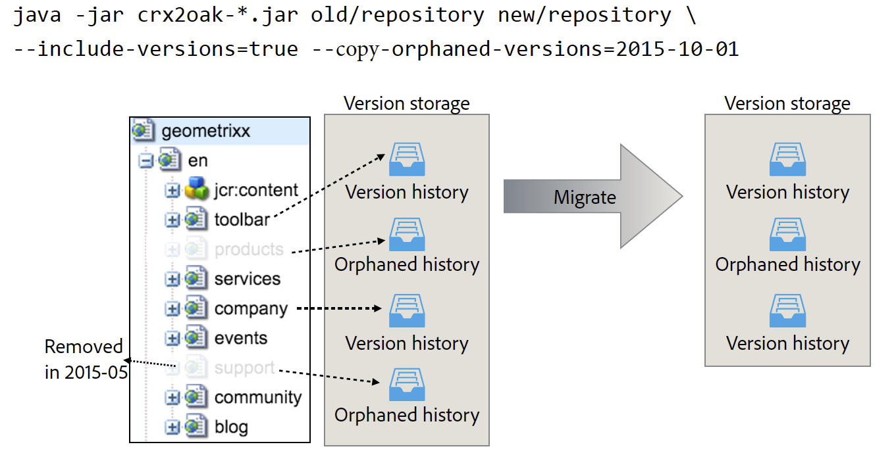

# 使用CRX2Oak移轉工具{#using-the-crx-oak-migration-tool}

## 簡介 {#introduction}

CRX2Oak是一種工具，旨在在不同資料庫之間移轉資料。

它可用來將舊版CQ中以Apache Jackrabbit 2為基礎的資料移轉至Oak，也可用來在Oak資料庫之間複製資料。

您可從公用Adobe存放庫下載最新版的crx2oak，網址為：
[https://repo.adobe.com/nexus/content/groups/public/com/adobe/granite/crx2oak/](https://repo.adobe.com/nexus/content/groups/public/com/adobe/granite/crx2oak/)

最新版本的變更和修正清單可在[CRX2Oak發行說明](https://docs.adobe.com/content/help/en/experience-manager-64/release-notes/crx2oak.html)中找到。

>[!NOTE]
>
>有關Apache Oak和永久性主要概念的AEM詳細資訊，請參閱[平台AEM簡介](/help/sites-deploying/platform.md)。

## 遷移使用案例{#migration-use-cases}

此工具可用於：

* 從舊版CQ 5移轉至AEM6
* 在多個Oak資料庫之間複製資料
* 在不同Oak MicroKernel實作之間轉換資料。

支援使用外部Blob儲存庫（通常稱為Data Stores）遷移儲存庫的不同組合。 一個可能的遷移路徑是從使用外部`FileDataStore`的CRX2儲存庫到使用`S3DataStore`的Oak儲存庫。

下圖說明CRX2Oak支援的所有可能移轉組合：


## 功能 {#features}

在升級期間會呼叫CRX2Oak,AEM讓使用者可以指定預先定義的移轉設定檔，以自動重新配置永續性模式。 這稱為快速啟動模式。

此外，您也可以個別執行，以備需要更多自訂時使用。 但是，請注意，在此模式下，僅對儲存庫進行更改，需要手動執AEM行任何其他重新配置。 這稱為獨立模式。

另一個要注意的是，在獨立模式下使用預設設定時，將只遷移節點儲存，新儲存庫將重新使用舊的二進位儲存。

### 自動快速啟動模式{#automated-quickstart-mode}

自AEM6.3以來，CRX2Oak可處理使用者定義的移轉設定檔，這些設定檔可使用所有可用的移轉選項來設定。 這可讓您在獨立模式下使用工具時，擁有更高的彈性AEM，並可自動設定無法使用的功能。

要將CRX2Oak切換為快速啟動模式，您需要通過以下作業系統環境變數定義安裝目錄中crx-quickstartAEM資料夾的路徑：

**對於基於UNIX的系統和macOS:**

```shell
export SLING_HOME="/path/to/crx-quickstart"
```

**針對Windows:**

```shell
SET "SLING_HOME=/path/to/crx-quickstart"
```

#### 恢復支援{#resume-support}

遷移可以隨時中斷，並有可能在之後恢復。

#### 可自訂的升級邏輯{#customizable-upgrade-logic}

自訂Java邏輯cand也可使用`CommitHooks`來實作。 可以實施自定義`RepositoryInitializer`類，以便用自定義值初始化儲存庫。

#### 支援記憶體映射操作{#support-for-memory-mapped-operations}

CRX2Oak也依預設支援記憶體映射作業。 記憶體映射可大大提高效能，應盡可能使用。

>[!CAUTION]
>
>但請注意，Windows平台不支援記憶體映射作業。 因此，建議在Windows上執行遷移時添加&#x200B;**-disable-mmap**&#x200B;參數。

#### 選擇性遷移內容{#selective-migration-of-content}

預設情況下，該工具將整個儲存庫遷移到`"/"`路徑下。 不過，您可以完全控制應移轉的內容。

如果新實例中有任何內容不需要的部分，則可使用`--exclude-path`參數排除內容並優化升級過程。

#### 合併{#path-merging}的路徑

如果需要在兩個儲存庫之間複製資料，並且您在兩個實例上都有不同的內容路徑，則可以在`--merge-path`參數中定義該資料。 一旦完成，CRX2Oak將只將新節點複製到目標儲存庫，並保留舊節點。


#### 版本支援{#version-support}

預設情AEM況下，將建立修改的每個節點或頁的版本，並將其儲存在儲存庫中。 然後，這些版本可用來將頁面還原為舊版。

不過，即使刪除原始頁面，這些版本也不會清除。 在處理長期運行的儲存庫時，遷移可能需要處理由孤立版本造成的大量冗餘資料。

對於這些類型的情況，一個有用的功能是添加`--copy-versions`參數。 它可用於在遷移或複製儲存庫期間跳過版本節點。

您也可以選擇是否通過添加`--copy-orphaned-versions=true`來複製孤立版本。

這兩個參數也支援`YYYY-MM-DD`日期格式，以備您要在特定日期之前復製版本時使用。



#### 開放原始碼版本{#open-source-version}

CRX2Oak的開放原始碼版本以oak-upgrade的形式提供。 它支援除以下功能之外的所有功能：

* CRX2支援
* 移轉設定檔支援
* 支援自動重AEM新配置

如需詳細資訊，請參閱[Apache Documentation](https://jackrabbit.apache.org/oak/docs/migration.html)。

## 參數 {#parameters}

### 節點儲存選項{#node-store-options}

* `--cache`:快取大小（以MB為單位）(預設為 `256`)

* `--mmap`:啟用區段存放區的記憶體對應檔案存取
* `--src-password:` 源RDB資料庫的口令

* `--src-user:` 源RDB的用戶

* `--user`:目標RDB的用戶

* `--password`:目標RDB的口令。

### 遷移選項{#migration-options}

* `--early-shutdown`:在複製節點後和應用提交掛接之前關閉源JCR2儲存庫
* `--fail-on-error`:如果無法從源儲存庫讀取節點，則強制遷移失敗。
* `--ldap`:將LDAP使用者從CQ 5.x執行個體移轉至Oak架構的執行個體。為了讓這項功能運作，Oak組態中的身分提供者必須命名為ldap。 有關詳細資訊，請參見[LDAP文檔](/help/sites-administering/ldap-config.md)。

* `--ldap-config:` 將其與使用多個LDAP服 `--ldap` 務器進行身份驗證的CQ 5.x儲存庫參數結合使用。您可使用它指向CQ 5.x `ldap_login.conf`或`jaas.conf`組態檔。 格式為`--ldapconfig=path/to/ldap_login.conf`。

### 版本商店選項{#version-store-options}

* `--copy-orphaned-versions`:跳過複製孤立版本。支援的參數包括：`true`、`false`和`yyyy-mm-dd`。 預設為 `true`.

* `--copy-versions:` 復製版本儲存。參數：`true`、`false`、`yyyy-mm-dd`。 預設為 `true`.

#### 路徑選項{#path-options}

* `--include-paths:` 複製期間要包含的路徑的逗號分隔清單
* `--merge-paths`:複製期間要合併的路徑的逗號分隔清單
* `--exclude-paths:` 複製期間要排除的路徑的逗號分隔清單。

### 源Blob儲存選項{#source-blob-store-options}

* `--src-datastore:` 要用作源的資料儲存目錄  `FileDataStore`

* `--src-fileblobstore`:要用作源的資料儲存目錄  `FileBlobStore`

* `--src-s3datastore`:要用於源的資料儲存目錄  `S3DataStore`

* `--src-s3config`:源的配置檔案 `S3DataStore`。

### 目標BlobStore選項{#destination-blobstore-options}

* `--datastore:` 要用作目標的資料儲存目錄  `FileDataStore`

* `--fileblobstore:` 要用作目標的資料儲存目錄  `FileBlobStore`

* `--s3datastore`:要用於目標的資料儲存目錄  `S3DataStore`

* `--s3config`:目標的配置檔案 `S3DataStore`。

### 幫助選項{#help-options}

* `-?, -h, --help:` 顯示說明資訊。

## 調試{#debugging}

您也可以啟用移轉程式的除錯資訊，以疑難排解程式中可能出現的問題。 您可以根據要在以下位置運行工具的模式，以不同的方式執行此操作：

<table>
 <tbody>
  <tr>
   <td><strong>CRX2Oak模式</strong></td>
   <td><strong>動作</strong></td>
  </tr>
  <tr>
   <td>快速啟動模式</td>
   <td>運行CRX2Oak時，可將<strong>—log-levelTRACE</strong>或<strong>—log-level DEBUG </strong>選項添加到命令行中。 在此模式下，日誌會自動重定向到<strong>upgrade.log檔案</strong>。</td>
  </tr>
  <tr>
   <td>獨立模式</td>
   <td><p>將<strong> -trace</strong>選項添加到CRX2Oak命令行中，以顯示標準輸出上的TRACE事件(您需要使用重定向字元重新定向日誌：'&gt;'或'tee'命令，以供稍後檢查)。</p> </td>
  </tr>
 </tbody>
</table>

## 其他考量事項{#other-considerations}

遷移到MongoDB複製副本集時，請確保在與Mongo資料庫的所有連接上將`WriteConcern`參數設定為`2`。

您可以在連接字串末尾添加`w=2`參數，如下所示：

```xml
java -Xmx4092m -XX:MaxPermSize=1024m -jar crx2oak.jar crx-quickstart/repository/ mongodb://localhost:27017/aem-author?replicaset=replica1&w=2
```

>[!NOTE]
>
>如需詳細資訊，請參閱[寫入顧慮](https://docs.mongodb.org/manual/reference/connection-string/#write-concern-options)上的MongoDB連線字串檔案。

