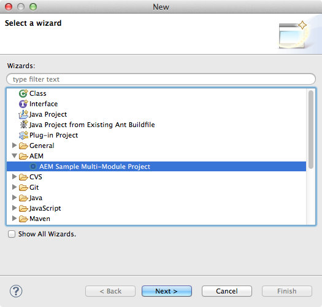

# AEM Developer Tools for Eclipse{#aem-developer-tools-for-eclipse}


## 概覽 {#overview}

AEM Developer Tools for Eclipse是Eclipse外掛程式，以Apache License 2下發行的 [Eclipse plugin for Apache Sling](https://sling.apache.org/documentation/development/ide-tooling.html) 為基礎。

它提供數種功能，讓AEM開發更輕鬆：

* 透過Eclipse Server Connector與AEM例項緊密整合。
* 內容與OSGI組合的同步化。
* 使用程式碼熱交換功能進行除錯支援。
* 透過特定專案建立精靈，簡單引導AEM專案。
* 輕鬆編輯JCR屬性。

## 需求 {#requirements}

在使用AEM開發人員工具之前，您必須：

* 下載並安裝適 [用於Java EE開發人員的Eclipse IDE](https://eclipse.org/downloads/packages/eclipse-ide-java-ee-developers/lunar)。 AEM Developer Tools目前支援Eclipse Kepler或更新版本

* 可與AEM 5.6.1版或更新版本一起使用
* 按照 `eclipse.ini` Eclipse常見問答集中的說明，編輯您的設定檔案，以設定您的Eclipse安裝，確 [保您至少擁有1GB的堆](https://wiki.eclipse.org/FAQ_How_do_I_increase_the_heap_size_available_to_Eclipse%3F)積記憶體。

>[!NOTE]
>
>在macOS上，您必須在 **Eclipse.app上按滑鼠右鍵** ，然後選取「 **Show Package Contents** 」（顯示套件內容）才能找到您的 `eclipse.ini`**。**

## 如何安裝AEM Developer Tools for Eclipse {#how-to-install-the-aem-developer-tools-for-eclipse}

在您符合上述 [要求](#requirements) ，就可依下列方式安裝外掛程式：

1. 瀏覽 [**AEM **Developer Tools網站](https://eclipse.adobe.com/aem/dev-tools/)。

1. 複製安 **裝連結**。

   請注意，您也可以下載封存檔，而非使用安裝連結。 這允許離線安裝，但您會漏掉自動更新通知。

1. 在Eclipse中，開啟「說 **明** 」功能表。
1. 按一下 **安裝新軟體**。
1. **按一**&#x200B;下新增…….
1. 在「名 **稱** 」中輸入AEM Developer Tools。
1. 在 **位置** ，複製安裝URL。
1. 按一下「 **確定**」。
1. 同時檢 **查AEM** 和 **Sling** plugins。
1. 按一 **下「下一步**」。
1. 按一 **下「下一步**」。
1. 接受這些合約，然後按一下「 **完成**」。
1. 按一 **下「是** 」，以重新啟動Eclipse。

## 如何匯入現有專案 {#how-to-import-existing-projects}

>[!NOTE]
>
>請參 [閱從AEM下載Eclipse中套裝的使用方式](https://stackoverflow.com/questions/29699726/how-to-work-with-a-bundle-in-eclipse-when-it-was-downloaded-from-aem/29705407#29705407)。

## AEM透視 {#the-aem-perspective}

AEM Development Tools for Eclipse隨附「透視」功能，可讓您完全控制AEM專案和例項。


## 示例多模組項目 {#sample-multi-module-project}

AEM Developer Tools for Eclipse隨附範例、多模組專案，可協助您快速上手使用Eclipse中的專案設定，並提供數種AEM功能的最佳實務指南。 [進一步瞭解Project Archetype](https://github.com/Adobe-Marketing-Cloud/aem-project-archetype)。

請依照下列步驟建立範例專案：

1. 在「文 **件** >新建 **>** 項目」菜單中，瀏覽至 ************「AEM Sample Multi-Module Project」和「AEM Sample Module Project」部分。

   

1. 按一 **下「下一步**」。

   >[!NOTE]
   >
   >這個步驟可能需要一段時間，因為m2eclipse需要掃描原型型錄。

   

1. 選 **擇com.adobe.granite.archetypes:樣本——項目——原型：（最高數目）** ，然後按一下「下 **一步**」。

   

1. 填寫范 **例專案的名稱**、 **群組ID****和對象ID** 。 您也可以選擇設定一些進階屬性。

   

1. 然後，您應設定Eclipse將連線至的AEM伺服器。

   若要使用除錯程式功能，您必須在除錯模式中啟動AEM —— 這可透過將下列項目新增至命令列來達成：

   ```
       -nofork -agentlib:jdwp=transport=dt_socket,server=y,suspend=n,address=10123
   ```

   

1. 按一 **下完成**。 將建立項目結構。

   >[!NOTE]
   >
   >在全新安裝中(更具體而言：從未下載過依賴項時)，您可能會建立出錯誤的項目。 在這種情況下，請遵循解決無效項目定 [義中描述的過程](#resolving-invalid-project-definition)。

## 疑難排解 {#troubleshooting}

### 解決無效的項目定義 {#resolving-invalid-project-definition}

要解決無效的從屬關係和項目定義，請按如下步驟進行：

1. 選取所有已建立的專案。
1. 按一下右鍵。 在功能表 **中** ，選 **取「更新專案**」。
1. 檢查 **Force Updates of Snapshot/Releases**。
1. 按一下 **確定**。 Eclipse會嘗試下載所需的相依性。

### 在JSP檔案中啟用標籤庫自動完成 {#enabling-tag-library-autocompletion-in-jsp-files}

標籤庫自動完成功能不會立即生效，因為專案中已新增適當的相依性。 使用AEM Uber jar時有一個已知問題，其中不包含所需的tld和TagExtraInfo檔案。

若要解決這個問題，請確定org.apache.sling.scripting.jsp.taglib工件位於AEM Uber Jar之前的類路徑中。 對於Maven項目，請在pom.xml中將下列相依性置於Uber Jar之前。

```xml
<dependency>
  <groupId>org.apache.sling</groupId>
  <artifactId>org.apache.sling.scripting.jsp.taglib</artifactId>
  <scope>provided</scope>
</dependency>
```

請確定新增適合您部署AEM的版本。

## More information {#more-information}

Eclipse網站的Apache Sling IDE官方工具提供您有用的資訊：

* 本文 [**件將引導您瞭解AEM Development Tools支援的整體概念、伺服器整合和部署功能&#x200B;**,Apache Sling IDE工具for Eclipse](https://sling.apache.org/documentation/development/ide-tooling.html)User Guide。
* 疑難 [排解區](https://sling.apache.org/documentation/development/ide-tooling.html#troubleshooting)。
* 「已 [知問題」清單](https://sling.apache.org/documentation/development/ide-tooling.html#known-issues)。

以下正式 [的Eclipse](https://eclipse.org/) 檔案可協助您設定環境：

* [Eclipse快速入門](https://eclipse.org/users/)
* [Eclipse Luna幫助系統](https://help.eclipse.org/luna/index.jsp)
* [Maven整合(m2eclipse)](https://www.eclipse.org/m2e/)

