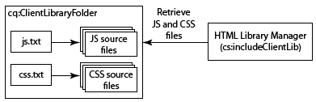

# 使用用戶端端程式庫{#using-client-side-libraries}

現代網站嚴重依賴由複雜JavaScript和CSS程式碼驅動的用戶端處理。 組織並最佳化此程式碼的服務可能是個複雜的問題。

為協助處理此問題，AEM提供 **用戶端程式庫資料夾**，可讓您將用戶端代碼儲存在存放庫中、將其組織為類別，以及定義將每類代碼提供給用戶端的時間和方式。 然後，用戶端資料庫系統會負責在您的最終網頁中產生正確的連結，以載入正確的程式碼。

## 用戶端程式庫在AEM中的運作方式 {#how-client-side-libraries-work-in-aem}

在頁面HTML中包含用戶端程式庫（即JS或CSS檔案）的標準方式只是包含 `<script>` 或 `<link>` 標籤（在JSP中），包含有關檔案的路徑。 例如，

```xml
...
<head>
   ...
   <script type="text/javascript" src="/etc/clientlibs/granite/jquery/source/1.8.1/jquery-1.8.1.js"></script>
   ...
</head>
...
```

雖然此方法適用於AEM，但在頁面及其組成元件變得複雜時，可能會導致問題。 在這種情況下，最終HTML輸出中可能會包含相同JS程式庫的多個副本。 若要避免此情況，並允許對用戶端程式庫使用進行邏輯組織 **用戶端程式庫資料夾**.

用戶端程式庫資料夾是類型的存放庫節點 `cq:ClientLibraryFolder`. 這是 [CND標籤法](https://jackrabbit.apache.org/node-type-notation.html) is

```shell
[cq:ClientLibraryFolder] > sling:Folder
  - dependencies (string) multiple
  - categories (string) multiple
  - embed (string) multiple
  - channels (string) multiple
```

依預設， `cq:ClientLibraryFolder` 節點可以放置在 `/apps`, `/libs` 和 `/etc` 存放庫的子樹(這些預設值和其他設定可透過 **AdobeGraniteHTML程式庫管理員** 面板 [系統控制台](https://localhost:4502/system/console/configMgr))。

每個 `cq:ClientLibraryFolder` 會填入一組JS和/或CSS檔案，以及一些支援檔案（請參閱下方）。 屬性 `cq:ClientLibraryFolder` 設定如下：

* `categories`:識別JS和/或CSS檔案集在此內所屬的類別 `cq:ClientLibraryFolder` 摔倒。 此 `categories` 屬性為多值，可讓程式庫資料夾成為多個類別的一部分（請參閱下方以了解其效用）。

* `dependencies`:這是此庫資料夾所依賴的其他客戶端庫類別的清單。 例如，在 `cq:ClientLibraryFolder` 節點 `F` 和 `G`，若 `F` 需要另一個檔案 `G` 為了正常運作， `categories` of `G` 應該屬於 `dependencies` of `F`.

* `embed`:用於從其他程式庫中內嵌程式碼。 如果節點F嵌入節點G和H，則產生的HTML是來自節點G和H的內容的集中。
* `allowProxy`:如果用戶端程式庫位於 `/apps`，此屬性可透過代理servlet存取。 請參閱 [找到客戶端庫資料夾並使用代理客戶端庫Servlet](/help/sites-developing/clientlibs.md#locating-a-client-library-folder-and-using-the-proxy-client-libraries-servlet) 下方。

## 參考用戶端程式庫 {#referencing-client-side-libraries}

由於HTL是開發AEM網站的慣用技術，因此HTL應用於在AEM中納入用戶端程式庫。 但是，也可以使用JSP執行此操作。

### 使用HTL {#using-htl}

在HTL中，用戶端程式庫會透過AEM提供的協助範本載入，可透過 [ `data-sly-use`](https://helpx.adobe.com/experience-manager/htl/using/block-statements.html#use). 此檔案提供三個範本，可透過 [ `data-sly-call`](https://helpx.adobe.com/experience-manager/htl/using/block-statements.html#template-call):

* **cs**  — 僅載入所參考用戶端程式庫的CSS檔案。
* **js**  — 僅載入所參考用戶端程式庫的JavaScript檔案。
* **all**  — 載入所引用客戶端庫的所有檔案（包括CSS和JavaScript）。

每個 helper 範本都需要 `categories` 選項來參照所需的用戶端程式庫。 這個選項可以是字串值陣列，或是包含逗號分隔值清單的字串。

有關詳細資訊和用法的示例，請參見文檔 [開始使用HTML範本語言](https://helpx.adobe.com/experience-manager/htl/using/getting-started.html#loading-client-libraries).

### 使用JSP {#using-jsp}

新增 `ui:includeClientLib` 標籤到JSP代碼，以在生成的HTML頁中添加到客戶端庫的連結。 若要參考程式庫，請使用 `categories` 屬性 `ui:includeClientLib` 節點。

```
<%@taglib prefix="ui" uri="https://www.adobe.com/taglibs/granite/ui/1.0" %>
<ui:includeClientLib categories="<%= categories %>" />
```

例如， `/etc/clientlibs/foundation/jquery` 節點的類型 `cq:ClientLibraryFolder` 具有值的類別屬性 `cq.jquery`. JSP檔案中的以下代碼引用庫：

```xml
<ui:includeClientLib categories="cq.jquery"/>
```

產生的HTML頁面包含下列程式碼：

```xml
<script type="text/javascript" src="/etc/clientlibs/foundation/jquery.js"></script>
```

如需完整資訊，包括篩選JS、CSS或主題程式庫的屬性，請參閱 [ui:includeClientLib](/help/sites-developing/taglib.md#lt-ui-includeclientlib).

>[!CAUTION]
>
>`<cq:includeClientLib>`，過去通常用於包含用戶端程式庫，自AEM 5.6起即已過時。 [ `<ui:includeClientLib>`](/help/sites-developing/taglib.md#lt-ui-includeclientlib) 應如上所述使用。

## 建立客戶端庫資料夾 {#creating-client-library-folders}

建立 `cq:ClientLibraryFolder` 節點來定義JavaScript和階層式樣式表程式庫，並使它們可用於HTML頁面。 使用 `categories` 節點的屬性，以識別其所屬的程式庫類別。

節點包含一或多個執行階段會合併為單一JS和/或CSS檔案的來源檔案。 產生的檔案名稱為節點名稱，且 `.js` 或 `.css` 檔案名副檔名。 例如，名為的程式庫節點 `cq.jquery` 導致產生的檔案名為 `cq.jquery.js` 或 `cq.jquery.css`.

用戶端程式庫資料夾包含下列項目：

* 要合併的JS和/或CSS來源檔案。
* 支援CSS樣式的資源，例如影像檔案。

   **注意：** 您可以使用子資料夾來組織源檔案。
* 一 `js.txt` 檔案和/或一個 `css.txt` 識別要合併到所產生JS和/或CSS檔案的來源檔案的檔案。



有關介面工具集的客戶端庫特有需求的資訊，請參見 [使用和擴展小部件](/help/sites-developing/widgets.md).

Web客戶端必須具有訪問 `cq:ClientLibraryFolder` 節點。 您也可以從存放庫的安全區域公開程式庫（請參閱下方的「從其他程式庫內嵌程式碼」）。

### 在/lib中覆蓋庫 {#overriding-libraries-in-lib}

位於下方的用戶端程式庫資料夾 `/apps` 優先於同名資料夾(類似地位於 `/libs`. 例如， `/apps/cq/ui/widgets` 優先於 `/libs/cq/ui/widgets`. 當這些程式庫屬於相同類別時，以下程式庫 `/apps` 中所有規則的URL區段。

### 找到客戶端庫資料夾並使用代理客戶端庫Servlet {#locating-a-client-library-folder-and-using-the-proxy-client-libraries-servlet}

在舊版中，用戶端程式庫資料夾位於下方 `/etc/clientlibs` 儲存庫中。 仍支援此功能，但建議現在將用戶端程式庫置於 `/apps`. 這是在其他指令碼附近找到用戶端程式庫，這通常可在下方找到 `/apps` 和 `/libs`.

>[!NOTE]
>
>客戶端庫資料夾下的靜態資源必須位於名為的資料夾中 *資源*. 如果資料夾下沒有靜態資源，例如影像 *資源*，則無法在發佈例項上參照。 以下是範例：https://localhost:4503/etc.clientlibs/geometrixx/components/clientlibs/resources/example.gif

>[!NOTE]
>
>為了將程式碼與內容和設定隔離開來，建議在下方找出用戶端程式庫 `/apps` 透過 `/etc.clientlibs` 透過運用 `allowProxy` 屬性。

為了在 `/apps` 若要存取，請使用代理伺服器。 ACL仍在客戶端庫資料夾上強制執行，但Servlet允許通過讀取內容 `/etc.clientlibs/` 若 `allowProxy` 屬性設為 `true`.

靜態資源位於客戶端庫資料夾下的資源下，則只能通過代理訪問。

例如：

* 您的 `/apps/myproject/clientlibs/foo`
* 您的 `/apps/myprojects/clientlibs/foo/resources/icon.png`

然後您設定 `allowProxy` 屬性 `foo` 變成真。

* 然後您就可以要求 `/etc.clientlibs/myprojects/clientlibs/foo.js`
* 然後，您可以透過 `/etc.clientlibs/myprojects/clientlibs/foo/resources/icon.png`

>[!CAUTION]
>
>使用代理用戶端程式庫時，AEM Dispatcher設定可能需要更新，以確保允許具有擴充用戶端的URI。

>[!CAUTION]
>
>Adobe建議在下方找到用戶端程式庫 `/apps` 並使用代理servlet提供。 但請記住，最佳實務仍需要公開網站一律不包含直接透過 `/apps` 或 `/libs` 路徑。

### 建立客戶端庫資料夾 {#create-a-client-library-folder}

1. 在網頁瀏覽器中開啟CRXDE Lite([https://localhost:4502/crx/de](https://localhost:4502/crx/de))。
1. 選擇要查找客戶端庫資料夾的資料夾，然後按一下 **建立>建立節點**.
1. 輸入庫檔案的名稱，然後在「類型」清單中選擇 `cq:ClientLibraryFolder`. 按一下 **確定** 然後按一下 **全部儲存**.
1. 若要指定程式庫所屬的類別或類別，請選取 `cq:ClientLibraryFolder` 節點，添加以下屬性，然後按一下 **全部儲存**:

   * 名稱：類別
   * 類型：字串
   * 值：類別名稱
   * 多重：選擇

1. 通過任何方法將源檔案添加到庫資料夾。 例如，使用WebDav客戶端來複製檔案，或建立檔案並手動編寫內容。

   **注意：** 您可以視需要在子資料夾中組織源檔案。

1. 選擇客戶端庫資料夾，然後按一下 **建立>建立檔案**.
1. 在檔案名框中，鍵入以下檔案名之一，然後按一下「確定」：

   * **`js.txt`:** 使用此檔案名生成JavaScript檔案。
   * **`css.txt`:** 使用此檔案名生成級聯樣式表。

1. 開啟檔案並鍵入以下文本以標識源檔案路徑的根：

   `#base=*[root]*`

   更換* `[root]`*包含源檔案的資料夾路徑（相對於TXT檔案）。 例如，當源檔案與TXT檔案位於同一資料夾時，請使用以下文本：

   `#base=.`

   下列程式碼會將根設定為行動資料夾，名為在 `cq:ClientLibraryFolder` 節點：

   `#base=mobile`

1. 在下面的行 `#base=[root]`，鍵入源檔案相對根的路徑。 將每個檔案名放在單獨的一行。
1. 按一下 **全部儲存**.

### 連結至相依性 {#linking-to-dependencies}

當用戶端程式庫資料夾中的程式碼參考其他程式庫時，請將其他程式庫識別為相依性。 在JSP中， `ui:includeClientLib` 參考用戶端程式庫資料夾的標籤會導致HTML程式碼包含您產生的程式庫檔案的連結，以及相依性。

相依性必須是其他 `cq:ClientLibraryFolder`. 若要識別相依性，請新增屬性至 `cq:ClientLibraryFolder` 節點（具有以下屬性）:

* **名稱：** 相依性
* **類型：** 字串[]
* **值：** 當前庫資料夾所依賴的cq:ClientLibraryFolder節點的categories屬性的值。

例如， / `etc/clientlibs/myclientlibs/publicmain` 對 `cq.jquery` 程式庫。 引用主客戶端庫的JSP將生成包含以下代碼的HTML:

```xml
<script src="/etc/clientlibs/foundation/cq.jquery.js" type="text/javascript">
<script src="/etc/clientlibs/mylibs/publicmain.js" type="text/javascript">
```

### 從其他程式庫內嵌程式碼 {#embedding-code-from-other-libraries}

您可以將用戶端程式庫的程式碼內嵌至另一個用戶端程式庫。 在執行階段，內嵌程式庫產生的JS和CSS檔案會包含內嵌程式庫的程式碼。

嵌入代碼對於提供對儲存在儲存庫安全區域中的庫的訪問非常有用。

#### 應用程式專屬用戶端程式庫資料夾 {#app-specific-client-library-folders}

最好將所有與應用程式相關的檔案保留在以下其應用程式資料夾中 `/app`. 也是拒絕網站訪客存取 `/app` 檔案夾。 若要同時滿足這兩種最佳實務，請在 `/etc` 內嵌用戶端程式庫的資料夾，位於下方 `/app`.

使用categories屬性來識別要內嵌的用戶端程式庫資料夾。 若要內嵌程式庫，請新增屬性至內嵌 `cq:ClientLibraryFolder` 節點，使用以下屬性：

* **名稱：** 內嵌
* **類型：** 字串[]
* **值：** 類別屬性的值 `cq:ClientLibraryFolder` 要嵌入的節點。

#### 使用內嵌將請求減至最少 {#using-embedding-to-minimize-requests}

在某些情況下，您可能會發現，您的發佈例項針對一般頁面產生的最終HTML包含相對大量 `<script>` 元素，尤其是如果您的網站使用用戶端內容資訊進行分析或鎖定目標時。 例如，在非最佳化的專案中，您可能會找到下列系列 `<script>` HTML中的元素：

```xml
<script type="text/javascript" src="/etc/clientlibs/granite/jquery.js"></script>
<script type="text/javascript" src="/etc/clientlibs/granite/utils.js"></script>
<script type="text/javascript" src="/etc/clientlibs/granite/jquery/granite.js"></script>
<script type="text/javascript" src="/etc/clientlibs/foundation/jquery.js"></script>
<script type="text/javascript" src="/etc/clientlibs/foundation/shared.js"></script>
<script type="text/javascript" src="/etc/clientlibs/foundation/personalization/kernel.js"></script>
```

在這種情況下，將所有必要的用戶端程式庫程式碼合併到單一檔案中，以減少頁面載入時來回請求的數量，會是很實用的作法。 要執行此操作，您可以 `embed` 使用的內嵌屬性，將必要的程式庫放入應用程式專用的用戶端程式庫中 `cq:ClientLibraryFolder` 節點。

AEM包含下列用戶端程式庫類別。 您應僅內嵌特定網站運作所需的內容。 不過， **您應維護此處列出的順序**:

1. `browsermap.standard`
1. `browsermap`
1. `jquery-ui`
1. `cq.jquery.ui`
1. `personalization`
1. `personalization.core`
1. `personalization.core.kernel`
1. `personalization.clientcontext.kernel`
1. `personalization.stores.kernel`
1. `personalization.kernel`
1. `personalization.clientcontext`
1. `personalization.stores`
1. `cq.collab.comments`
1. `cq.collab.feedlink`
1. `cq.collab.ratings`
1. `cq.collab.toggle`
1. `cq.collab.forum`
1. `cq.cleditor`

#### CSS檔案中的路徑 {#paths-in-css-files}

內嵌CSS檔案時，產生的CSS程式碼會使用與內嵌程式庫相關的資源路徑。 例如，可公開存取的程式庫 `/etc/client/libraries/myclientlibs/publicmain` 內嵌 `/apps/myapp/clientlib` 用戶端程式庫：


此 `main.css` 檔案包含下列樣式：

```xml
body {
  padding: 0;
  margin: 0;
  background: url(images/bg-full.jpg) no-repeat center top;
  width: 100%;
}
```

用於 `publicmain` 節點使用原始影像的URL生成包含以下樣式：

```xml
body {
  padding: 0;
  margin: 0;
  background: url(../../../apps/myapp/clientlib/styles/images/bg-full.jpg) no-repeat center top;
  width: 100%;
}
```

### 對特定行動群組使用程式庫 {#using-a-library-for-specific-mobile-groups}

使用 `channels` 用戶端程式庫資料夾的屬性，以識別使用程式庫的行動群組。 此 `channels` 當針對不同裝置功能設計相同類別的程式庫時，屬性很實用。

要將客戶端庫資料夾與設備組關聯，請向 `cq:ClientLibraryFolder` 節點（具有以下屬性）:

* **名稱：** 頻道
* **類型：** 字串[]
* **值：** 行動群組的名稱。 若要從群組中排除程式庫資料夾，請在名稱前加上感嘆號(&quot;!&quot;)。

例如，下表列出 `channels` 的每個客戶端庫資料夾的屬性 `cq.widgets` 類別：

| 客戶端庫資料夾 | channels屬性的值 |
|---|---|
| `/libs/cq/analytics/widgets` | `!touch` |
| `/libs/cq/analytics/widgets/themes/default` | `!touch` |
| `/libs/cq/cloudserviceconfigs/widgets` | `!touch` |
| `/libs/cq/touch/widgets` | `touch` |
| `/libs/cq/touch/widgets/themes/default` | `touch` |
| `/libs/cq/ui/widgets` | `!touch` |
| `/libs/cq/ui/widgets/themes/default` | `!touch` |

<!-- Search&Promote is end of life as of September 1, 2022 | `/libs/cq/searchpromote/widgets` | `!touch` | -->
<!-- Search&Promote is end of life as of September 1, 2022 | `/libs/cq/searchpromote/widgets/themes/default` |*[no value]* -->

## 使用前置處理器 {#using-preprocessors}

AEM支援可插拔的前置處理器，並支援 [YUI壓縮機](https://github.com/yui/yuicompressor#yui-compressor---the-yahoo-javascript-and-css-compressor) CSS和JavaScript適用的 [Google封閉編譯器(GCC)](https://developers.google.com/closure/compiler/) YUI設為AEM預設預處理器的JavaScript適用的。

可插拔預處理器允許靈活使用，包括：

* 定義可處理指令碼源的指令碼處理器
* 處理器可配置選項
* 處理器可用於縮制，但也可用於非縮制的情況
* clientlib可定義要使用的處理器

>[!NOTE]
>
>依預設，AEM會使用YUI壓縮器。 請參閱 [YUI壓縮程式GitHub檔案](https://github.com/yui/yuicompressor/issues) 以取得已知問題的清單。 切換至特定客戶端的GCC壓縮機可解決使用UI時觀察到的一些問題。

>[!CAUTION]
>
>請勿將縮制的程式庫放入用戶端程式庫。 請改為提供原始程式庫，如果需要縮制，請使用前置處理器的選項。

### 使用狀況 {#usage}

您可以選擇為每個客戶端庫或系統範圍配置前置處理器配置。

* 新增多值屬性 `cssProcessor` 和 `jsProcessor` 在clientlibrary節點上

* 或者，透過 **HTML程式庫管理員** OSGi配置

clientlib節點上的預處理器配置優先於OSGI配置。

### 格式和範例 {#format-and-examples}

#### 格式 {#format}

```xml
config:= mode ":" processorName options*;
mode:= "default" | "min";
processorName := "none" | <name>;
options := ";" option;
option := name "=" value;
```

#### CSS縮制和GCC for JS的YUI壓縮器 {#yui-compressor-for-css-minification-and-gcc-for-js}

```xml
cssProcessor: ["default:none", "min:yui"]
jsProcessor: ["default:none", "min:gcc;compilationLevel=advanced"]
```

#### Typescript以預處理，然後GCC以縮制和模糊化 {#typescript-to-preprocess-and-then-gcc-to-minify-and-obfuscate}

```xml
jsProcessor: [
   "default:typescript",
   "min:typescript",
   "min:gcc;obfuscate=true"
]
```

#### 其他GCC選項 {#additional-gcc-options}

```xml
failOnWarning (defaults to "false")
languageIn (defaults to "ECMASCRIPT5")
languageOut (defaults to "ECMASCRIPT5")
compilationLevel (defaults to "simple") (can be "whitespace", "simple", "advanced")
```

有關GCC選項的更多詳細資訊，請參見 [GCC檔案](https://developers.google.com/closure/compiler/docs/compilation_levels).

### 設定系統預設縮制符 {#set-system-default-minifier}

在AEM中，YUI設為預設縮制碼。 要將此更改為GCC，請執行以下步驟。

1. 前往Apache Felix Config Manager，網址為 [https://localhost:4502/system/console/configMgr](https://localhost:4502/system/console/configMgr)
1. 尋找和編輯 **AdobeGraniteHTML程式庫管理員**.
1. 啟用 **Minify** 選項（如果尚未啟用）。
1. 設定值 **JS處理器預設配置** to `min:gcc`.

   如果以分號(例如 `min:gcc;obfuscate=true`.

1. 按一下 **儲存** 以儲存變更。

## 偵錯工具 {#debugging-tools}

AEM提供數種工具，用於偵錯和測試用戶端程式庫資料夾。

### 請參閱內嵌檔案 {#see-embedded-files}

若要追蹤內嵌程式碼的來源，或確保內嵌的用戶端程式庫能產生預期的結果，您可以在執行階段查看內嵌的檔案名稱。 若要查看檔案名稱，請附加 `debugClientLibs=true` 參數。 產生的程式庫包含 `@import` 陳述式，而非內嵌程式碼。

在上一個範例中 [從其他程式庫內嵌程式碼](/help/sites-developing/clientlibs.md#embedding-code-from-other-libraries) 區段 `/etc/client/libraries/myclientlibs/publicmain` 用戶端程式庫資料夾內嵌 `/apps/myapp/clientlib` 客戶端庫資料夾。 將參數附加到網頁會在網頁的原始碼中產生下列連結：

```xml
<link rel="stylesheet" href="/etc/clientlibs/mycientlibs/publicmain.css">
```

開啟 `publicmain.css` 檔案會顯示下列程式碼：

```xml
@import url("/apps/myapp/clientlib/styles/main.css");
```

1. 在網頁瀏覽器的位址方塊中，將下列文字附加至HTML的URL:

   `?debugClientLibs=true`
1. 頁面載入時，檢視頁面來源。
1. 按一下作為連結元素的href提供的連結，以開啟檔案並檢視原始碼。

### 探索用戶端程式庫 {#discover-client-libraries}

此 `/libs/cq/granite/components/dumplibs/dumplibs` 元件生成有關係統上所有客戶端庫資料夾的資訊頁。 此 `/libs/granite/ui/content/dumplibs` 節點將元件作為資源類型。 若要開啟頁面，請使用下列URL（視需要變更主機和連接埠）:

`https://<host>:<port>/libs/granite/ui/content/dumplibs.test.html`

資訊包括程式庫路徑和類型（CSS或JS），以及程式庫屬性的值，例如類別和相依性。 頁面上的後續表格會顯示每個類別和管道中的程式庫。

### 請參閱生成的輸出 {#see-generated-output}

此 `dumplibs` 元件包含測試選擇器，可顯示為 `ui:includeClientLib` 標籤。 頁面包含不同js、css和主題屬性組合的程式碼。

1. 使用下列其中一種方法開啟「測試輸出」頁面：

   * 從 `dumplibs.html` 頁面，按一下 **按一下這裡進行輸出測試** 文字。

   * 在網頁瀏覽器中開啟下列URL（視需要使用不同的主機和連接埠）:

      * `http://<host>:<port>/libs/granite/ui/content/dumplibs.html`

   預設頁面顯示沒有類別屬性值之標籤的輸出。

1. 若要查看類別的輸出，請輸入用戶端程式庫的 `categories` 屬性，按一下 **提交查詢**.

## 為開發和生產配置程式庫處理 {#configuring-library-handling-for-development-and-production}

HTML程式庫管理員服務程式 `cq:ClientLibraryFolder` 標籤，並在執行階段產生程式庫。 環境、開發或生產的類型會決定您應如何設定服務：

* 提高安全性：停用除錯
* 提高效能：移除空白字元並壓縮程式庫。
* 改善可讀性：包含空白字元且不壓縮。

如需設定服務的詳細資訊，請參閱 [AEMHTML程式庫管理員](/help/sites-deploying/osgi-configuration-settings.md#aemhtmllibrarymanager).
