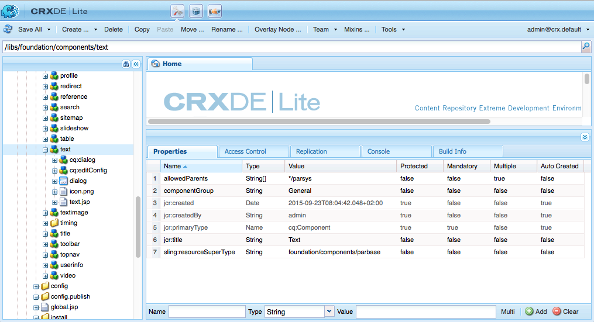
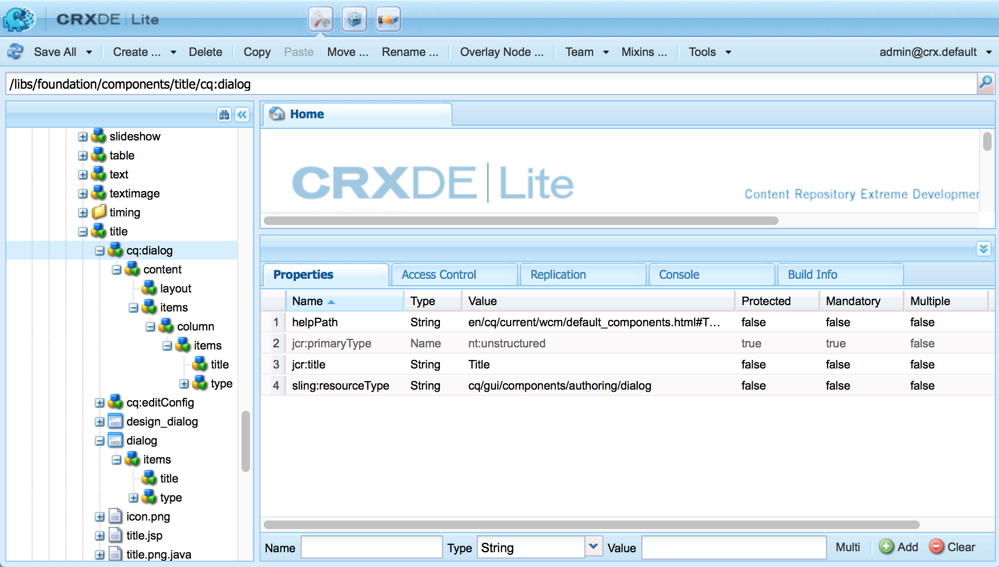
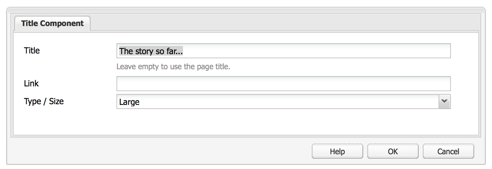

# AEM元件——基本概念{#aem-components-the-basics}

當您開始開發新元件時，您需要瞭解其結構和組態的基本知識。

此程式包括閱讀理論並檢視標準AEM例項中廣泛的元件實作。 雖然AEM已改用新的標準、現代化、可觸控的UI，但仍持續支援傳統的UI，這讓後一種方式略顯複雜。

## 概覽 {#overview}

本節將介紹開發您自己的元件時所需的詳細資訊。

### 規劃 {#planning}

開始實際設定或編碼元件之前，您應詢問：

* 您到底需要新元件做什麼？
   * 清晰的規格有助於在開發、測試和移交的所有階段。 詳細資訊可能會隨時間而改變，但規範可以更新（儘管更改也應記錄在案）。
* 您需要從頭開始建立元件，還是可以從現有元件繼承基本功能？
   * 我們不需要重新發明車輪。
   * AEM提供數種機制，可讓您繼承和延伸其他元件定義的詳細資料，包括覆寫、覆蓋和 [Sling Resource Merger](/help/sites-developing/sling-resource-merger.md)。
* 您的元件是否需要邏輯來選取／控制內容？
   * 邏輯應與使用者介面層分開。 HTL的設計目的是協助確保這一點。
* 您的元件是否需要CSS格式？
   * CSS格式應與元件定義分開。 定義HTML元素命名的慣例，以便您透過外部CSS檔案修改這些元素。
* 我應該考慮哪些安全方面？
   * 如需詳 [細資訊，請參閱安全性檢查清單](/help/sites-administering/security-checklist.md#development-best-practices) -開發最佳實務。

### 觸控式與傳統UI {#touch-enabled-vs-classic-ui}

在開始進行任何有關開發元件的嚴肅討論之前，您必須知道作者將使用哪個UI:

* **觸控式UI**
   [標準使用者介面](/help/sites-developing/touch-ui-concepts.md) ，是以Adobe Marketing Cloud的統一使用者體驗為基礎，使用 [Coral UI](/help/sites-developing/touch-ui-concepts.md#coral-ui) 和 [Granite UI的基礎技術](/help/sites-developing/touch-ui-concepts.md#granite-ui)。
* **傳統UI**&#x200B;使用者介面，以AEM 6.4已淘汰的ExtJS技術為基礎。

如需詳 [細資訊，請參閱客戶的UI介面](/help/sites-deploying/ui-recommendations.md) 建議。

可實作元件以支援觸控式UI、傳統UI或兩者。 在檢視標準例項時，您也會看到原本專為傳統UI、觸控式UI或兩者設計的現成可用元件。

因此，本頁將說明兩者的基本概念，以及如何辨識它們。

>[!NOTE]
> Adobe建議運用觸控式UI，以運用最新技術。 [AEM Modernination Tools&amp;(moderniatzion-tools.md)可讓移轉更輕鬆。

### 內容邏輯與轉換標籤 {#content-logic-and-rendering-markup}

建議將負責標籤和轉換的代碼與控制用於選擇元件內容的邏輯的代碼分開。

HTL [](https://docs.adobe.com/content/help/en/experience-manager-htl/using/overview.html)（一種範本語言）支援此理念，專門限制它以確保使用真正的程式設計語言來定義基礎商業邏輯。 這個（選用）邏輯是從HTL以特定命令叫用。 此機制會反白標示為特定檢視所呼叫的程式碼，並視需要允許相同元件不同檢視的特定邏輯。

### HTL與JSP {#htl-vs-jsp}

HTL是AEM 6.0中引進的HTML範本語言。

在開發您自己的元件時，有關是否使用 [HTL](https://docs.adobe.com/content/help/en/experience-manager-htl/using/overview.html) 或JSP(Java Server Pages)的討論應該很直接，因為HTL現在是AEM的建議指令碼語言。

HTL和JSP都可用來開發傳統和觸控式使用者介面的元件。 雖然有人傾向於假設HTL僅適用於傳統UI的觸控式UI和JSP，但這是誤解，而且更多是因為時間的緣故。 觸控式UI和HTL大約在相同時段內併入AEM。 由於HTL現在是建議的語言，所以會用於新元件，而新元件通常用於觸控式UI。

>[!NOTE]
>
>例外是Granite UI Foundation表格欄位（如對話方塊中所用）。 這些仍需要使用JSP。

### 開發您自己的元件 {#developing-your-own-components}

若要針對適當的UI建立您自己的元件，請參閱（閱讀本頁後）:

* [AEM元件（適用於觸控式UI）](/help/sites-developing/developing-components.md)
* [Classic UI的AEM元件](/help/sites-developing/developing-components-classic.md)

快速入門的方法是複製現有元件，然後進行所需的變更。 要瞭解如何建立自己的元件並將其添加到段落系統中，請參閱：

* [開發元件](/help/sites-developing/developing-components-samples.md) （主要針對觸控式UI）

### 將元件移至發佈例項 {#moving-components-to-the-publish-instance}

轉換內容的元件必須部署在與內容相同的AEM例項上。 因此，在作者實例上用於編寫和呈現頁面的所有元件都必須部署在發佈實例上。 部署後，這些元件可用來呈現已啟動的頁面。

使用下列工具將元件移至發佈例項：

* [使用Package Manager](/help/sites-administering/package-manager.md) ，將您的元件新增至封裝，並將它們移至其他AEM例項。
* [使用「激活樹」複製工具](/help/sites-authoring/publishing-pages.md#manage-publication) ，可複製元件。

>[!NOTE]
>
>這些機制也可用於在其他例項之間傳輸元件，例如從您的開發傳輸至您的測試例項。

### 從「開始」開始要感知的元件 {#components-to-be-aware-of-from-the-start}

* 頁面:

   * AEM有頁 *面元件* ( `cq:Page`)。
   * 這是一種對內容管理非常重要的特定資源類型。
      * 頁面對應於保存網站內容的網頁。

* 段落制度：

   * 段落系統是網站管理段落清單時的關鍵部分。 它用於保存和構建保存實際內容的各個元件。
   * 您可以在段落系統中建立、移動、複製和刪除段落。
   * 您也可以選取可在特定段落系統中使用的元件。
   * 標準例項中有各種可用的段落系統(例如 `parsys`, ` [responsivegrid](/help/sites-authoring/responsive-layout.md)`)。

## 結構 {#structure}

AEM元件的結構強大而有彈性，主要考量是：

* 資源類型
* 元件定義
* 元件的屬性和子節點
* 對話方塊
* 設計對話框
* 元件可用性
* 元件及其建立的內容

### 資源類型 {#resource-type}

結構的關鍵要素是資源類型。

* 內容結構宣告意圖。
* 資源類型實施它們。

這種抽象化有助於確保即使外觀和感覺隨著時間而改變，意圖也會持續。

### 元件定義 {#component-definition}

#### 元件基礎 {#component-basics}

元件的定義可以按如下方式劃分：

* AEM元件是以 [Sling為基礎](https://sling.apache.org/documentation.html)。
* AEM元件位於（通常）下方：

   * HTL: `/libs/wcm/foundation/components`
   * JSP: `/libs/foundation/components`

* 專案／網站特定元件（通常）位於：

   * `/apps/<myApp>/components`

* AEM標準元件定義為 `cq:Component` 並具有關鍵元素：

   * jcr屬性：

      jcr屬性清單；這些是可變的，有些可能是可選的，儘管元件節點的基本結構、其屬性和子節點由定義定 `cq:Component` 義

   * 資源:

      這些定義元件使用的靜態元素。

   * 指令碼:
   用於實現元件的結果實例的行為。

* **根節點**:

   * `<mycomponent> (cq:Component)` -元件的層次節點。

* **重要屬性**:

   * `jcr:title` -元件標題；例如，當元件列在元件瀏覽器或sidekick中時，會當做標籤使用。
   * `jcr:description` -元件說明；可在元件瀏覽器或sidekick中當做滑鼠移過提示使用。
   * 傳統 UI:

      * `icon.png` -此元件的表徵圖。
      * `thumbnail.png` -如果此元件列在段落系統中，則顯示的影像。
   * Touch UI

      * 如需詳細資 [訊，請參閱Touch UI中的「元件圖示](/help/sites-developing/components-basics.md#component-icon-in-touch-ui) 」一節。


* **重要子節點**:

   * `cq:editConfig (cq:EditConfig)` -定義元件的編輯屬性，並使元件顯示在「元件」瀏覽器或Sidekick中。

      注意：如果元件有對話方塊，則會自動出現在「元件」瀏覽器或Sidekick中，即使cq:editConfig不存在亦然。

   * `cq:childEditConfig (cq:EditConfig)` -控制未定義子元件的作者UI方面 `cq:editConfig`。
   * 啟用觸控的UI:

      * `cq:dialog` ( `nt:unstructured`)-此元件的對話框。 定義允許用戶配置元件和／或編輯內容的介面。
      * `cq:design_dialog` ( `nt:unstructured`)-此元件的設計編輯
   * 傳統 UI:

      * `dialog` ( `cq:Dialog`)-此元件的對話框。 定義允許用戶配置元件和／或編輯內容的介面。
      * `design_dialog` ( `cq:Dialog`)-此元件的設計編輯。


#### Touch UI中的元件圖示 {#component-icon-in-touch-ui}

當開發人員建立元件時，元件的圖示或縮寫會透過元件的JCR屬性來定義。 這些屬性依下列順序計算，並使用第一個找到的有效屬性。

1. `cq:icon` -指向 [Coral UI程式庫中標準圖示的字串屬性](https://helpx.adobe.com/experience-manager/6-5/sites/developing/using/reference-materials/coral-ui/coralui3/Coral.Icon.html) ，以顯示在元件瀏覽器中
   * 使用Coral圖示的HTML屬性值。
1. `abbreviation` -字串屬性，用於自定義元件瀏覽器中元件名稱的縮寫
   * 縮寫應限制為兩個字元。
   * 提供空字串將從屬性的前兩個字元建立縮寫 `jcr:title` 。
      * 例如，「Im」代表「Image」
      * 本地化的標題將用來建立縮寫。
   * 僅當元件具有屬性時，縮寫才 `abbreviation_commentI18n` 被翻譯，然後將其用作翻譯提示。
1. `cq:icon.png` 或 `cq:icon.svg` -此元件的表徵圖，顯示在元件瀏覽器中
   * 20 x 20像素是標準元件的圖示大小。
      * 較大的圖示會縮小（用戶端）。
   * 建議的顏色是rgb(112、112、112)> #707070
   * 標準元件圖示的背景是透明的。
   * Only `.png` and `.svg` files are supported.
   * 如果透過Eclipse外掛程式從檔案系統匯入，則檔案名稱必須 `_cq_icon.png` 例如 `_cq_icon.svg` 或例如。
   * `.png` 如果兩者都 `.svg` 在，就先例

如果元件上未找 `cq:icon`到上 `abbreviation`述屬 `cq:icon.png` 性(、或 `cq:icon.svg`):

* 系統將在超元件上搜索與屬性相同的屬 `sling:resourceSuperType` 性。
* 如果在超級元件級別中沒有發現任何縮寫或空縮寫，系統將從當前元件屬性的第一個字母 `jcr:title` 構建縮寫。

要取消超級元件中表徵圖的繼承，在元件上 `abbreviation` 設定空屬性將恢復為預設行為。

「元 [件控制台](/help/sites-authoring/default-components-console.md#component-details) 」(Component Console)顯示如何定義特定元件的圖示。

#### SVG圖示範例 {#svg-icon-example}

```xml
<?xml version="1.0" encoding="utf-8"?>
<!DOCTYPE svg PUBLIC "-//W3C//DTD SVG 1.1//EN" "https://www.w3.org/Graphics/SVG/1.1/DTD/svg11.dtd">
<svg version="1.1" id="Layer_1" xmlns="https://www.w3.org/2000/svg" xmlns:xlink="https://www.w3.org/1999/xlink" x="0px" y="0px"
     width="20px" height="20px" viewBox="0 0 20 20" enable-background="new 0 0 20 20" xml:space="preserve">
    <ellipse cx="5" cy="5" rx="3" ry="3" fill="#707070"/>
    <ellipse cx="15" cy="5" rx="4" ry="4" fill="#707070"/>
    <ellipse cx="5" cy="15" rx="5" ry="5" fill="#707070"/>
    <ellipse cx="15" cy="15" rx="4" ry="4" fill="#707070"/>
</svg>
```

### 元件的屬性和子節點 {#properties-and-child-nodes-of-a-component}

定義元件所需的許多節點／屬性對兩個UI都很常見，差異仍獨立，因此您的元件可以在兩個環境中工作。

元件是一種類型的節 `cq:Component` 點，具有以下屬性和子節點：

<table>
 <tbody>
  <tr>
   <td><strong>名稱 <br /> </strong></td>
   <td><strong>類型 <br /> </strong></td>
   <td><strong>說明 <br /> </strong></td>
  </tr>
  <tr>
   <td>.<br /> </td>
   <td><code>cq:Component</code></td>
   <td>目前元件. 元件是節點類型 <code>cq:Component</code>。<br /> </td>
  </tr>
  <tr>
   <td><code>componentGroup</code></td>
   <td><code>String</code></td>
   <td>可在元件瀏覽器（觸控式UI）或Sidekick（傳統UI）中選取元件的群組。<br /> 值用於 <code>.hidden</code> 無法從UI（如實際段落系統）選擇的元件。</td>
  </tr>
  <tr>
   <td><code>cq:isContainer</code></td>
   <td><code>Boolean</code></td>
   <td>指出元件是否為容器元件，因此可包含其他元件，例如段落系統。</td>
  </tr>
  <tr>
   <td> </td>
   <td> </td>
   <td> </td>
  </tr>
  <tr>
   <td><code>cq:dialog</code></td>
   <td><code>nt:unstructured</code> </td>
   <td>啟用觸控的UI的編輯對話方塊定義。</td>
  </tr>
  <tr>
   <td><code>dialog</code></td>
   <td><code>cq:Dialog</code></td>
   <td>傳統UI的編輯對話框定義。</td>
  </tr>
  <tr>
   <td><code>cq:design_dialog</code></td>
   <td><code>nt:unstructured</code></td>
   <td>觸控式使用者介面的設計對話方塊定義。</td>
  </tr>
  <tr>
   <td><code>design_dialog</code></td>
   <td><code>cq:Dialog </code></td>
   <td>傳統UI的設計對話框定義。<br /> </td>
  </tr>
  <tr>
   <td><code>dialogPath</code></td>
   <td><code>String</code></td>
   <td>當元件沒有對話框節點時，用於覆蓋大小寫的對話框路徑。<br /> </td>
  </tr>
  <tr>
   <td> </td>
   <td> </td>
   <td> </td>
  </tr>
  <tr>
   <td><code>cq:cellName</code></td>
   <td><code>String</code></td>
   <td>如果已設定，此屬性會視為儲存格ID。 如需詳細資訊，請參閱知識庫文章「 <a href="https://helpx.adobe.com/experience-manager/kb/DesigneCellId.html">如何建立設計儲存格ID</a>」。<br /> </td>
  </tr>
  <tr>
   <td><code>cq:childEditConfig</code></td>
   <td><code>cq:EditConfig</code></td>
   <td>當元件是容器（例如段落系統）時，這將驅動子節點的編輯配置。<br /> </td>
  </tr>
  <tr>
   <td><code>cq:editConfig</code></td>
   <td><code>cq:EditConfig</code></td>
   <td><a href="#edit-behavior">編輯元件的配置</a>。<br /> </td>
  </tr>
  <tr>
   <td><code>cq:htmlTag</code></td>
   <td><code>nt:unstructured </code></td>
   <td>傳回新增至周圍html標籤的其他標籤屬性。 可將屬性新增至自動產生的視訊。</td>
  </tr>
  <tr>
   <td><code>cq:noDecoration</code></td>
   <td><code>Boolean</code></td>
   <td>如果為true，則不會使用自動產生的div和css類別來呈現元件。<br /> </td>
  </tr>
  <tr>
   <td><code>cq:template</code></td>
   <td><code>nt:unstructured</code></td>
   <td>如果找到此節點，當從「元件瀏覽器」或「側腳」新增元件時，此節點將用作內容範本。</td>
  </tr>
  <tr>
   <td><code>cq:templatePath</code></td>
   <td><code>String</code></td>
   <td>從「元件」瀏覽器或Sidekick新增元件時，節點用作內容範本的路徑。 這必須是絕對路徑，而不是相對於元件節點。<br /> 除非您想要在其他地方重複使用已可使用的內容，否則這並非必要， <code>cq:template</code> 而且已足夠（請參閱下文）。</td>
  </tr>
  <tr>
   <td><code>jcr:created</code></td>
   <td><code>Date</code></td>
   <td>元件的建立日期。<br /> </td>
  </tr>
  <tr>
   <td><code>jcr:description</code></td>
   <td><code>String</code></td>
   <td>元件說明。<br /> </td>
  </tr>
  <tr>
   <td><code>jcr:title</code></td>
   <td><code>String</code></td>
   <td>元件的標題。<br /> </td>
  </tr>
  <tr>
   <td><code>sling:resourceSuperType</code></td>
   <td><code>String</code></td>
   <td>設定後，元件將繼承此元件。<br /> </td>
  </tr>
  <tr>
   <td><code>virtual</code></td>
   <td><code>sling:Folder</code></td>
   <td>允許建立虛擬元件。 若要查看範例，請參閱聯絡元件：<br /> <code>/libs/foundation/components/profile/form/contact</code></td>
  </tr>
  <tr>
   <td><code>&lt;breadcrumb.jsp&gt;</code></td>
   <td><code>nt:file</code> </td>
   <td>指令檔。<br /> </td>
  </tr>
  <tr>
   <td><code>icon.png</code></td>
   <td><code>nt:file</code></td>
   <td>元件的圖示，會出現在Sidekick中的Title旁。<br /> </td>
  </tr>
  <tr>
   <td><code>thumbnail.png</code></td>
   <td><code>nt:file</code></td>
   <td>從Sidekick將元件拖曳至適當位置時顯示的可選縮圖。<br /> </td>
  </tr>
 </tbody>
</table>

如果我們查看 **Text** （任一版本）元件，我們可以看到下列元素：

* HTL( `/libs/wcm/foundation/components/text`)

   

* JSP( `/libs/foundation/components/text`)

   

特定權益物業包括：

* `jcr:title` -元件標題；這可用來識別元件，例如，它會出現在元件瀏覽器或sidekick的元件清單中
* `jcr:description` -元件說明；可在sidekick內的元件清單中當做滑鼠移過提示使用
* `sling:resourceSuperType`:這表示擴展元件（通過覆蓋定義）時的繼承路徑

特別感興趣的子節點包括：

* `cq:editConfig` ( `cq:EditConfig`-這控制視覺方面；例如，它可以定義列或介面工具集的外觀，或可以新增自訂控制項
* `cq:childEditConfig` ( `cq:EditConfig`)-這可控制子元件的視覺方面，這些元件沒有自己的定義
* 啟用觸控的UI:
   * `cq:dialog` ( `nt:unstructured`)-定義用於編輯此元件內容的對話框
   * `cq:design_dialog` ( `nt:unstructured`)-指定此元件的設計編輯選項
* 傳統 UI:
   * `dialog` ( `cq:Dialog`)-定義編輯此元件內容的對話方塊（特定於傳統UI）
   * `design_dialog` ( `cq:Dialog`)-指定此元件的設計編輯選項
   * `icon.png` -圖形檔案，用作Sidekick中元件的表徵圖
   * `thumbnail.png` -從Sidekick拖曳元件時，要當做元件縮圖使用的圖形檔案

### 對話方塊 {#dialogs}

對話框是元件的關鍵元素，因為它們為作者提供了一個介面，以便配置和提供該元件的輸入。

視元件的複雜性而定，您的對話框可能需要一個或多個頁籤——以保持對話框的簡短並排序輸入欄位。

對話方塊定義是UI專屬的：

>[!NOTE]
>
>* 為了相容性，啟用觸控的UI可使用傳統UI對話方塊的定義，但尚未為啟用觸控的UI定義對話方塊。
>* 也提 [供對話方塊轉換工具](/help/sites-developing/dialog-conversion.md) ，協助您擴充／轉換僅為傳統UI定義對話方塊的元件。
>


* 觸控式UI
   * `cq:dialog` ( `nt:unstructured`節點):
      * 定義用於編輯此元件內容的對話框
      * 觸控式UI的特定功能
      * 是使用Granite UI元件定義的
      * have a property `sling:resourceType`, as standard Sling content structure
      * 可以具有一個屬 `helpPath` 性來定義在「幫助」表徵圖(? 表徵圖)。
         * 對於現成可用的元件，這通常會參照檔案中的頁面。
         * 如果未指 `helpPath` 定，則會顯示預設URL（檔案概述頁面）。
   

   在對話方塊中，會定義個別欄位：

   

* 傳統 UI
   * `dialog` (節 `cq:Dialog`點)
      * 定義用於編輯此元件內容的對話框
      * 特定於傳統UI
      * 是使用ExtJS Widget定義
      * 有屬 `xtype`性，它參照ExtJS
      * 可以具有一個屬 `helpPath` 性來定義在選擇「幫助」按鈕時訪問的上下文相關幫助資源(絕對或相 **對路徑** )。
         * 對於現成可用的元件，這通常會參照檔案中的頁面。
         * 如果未指 `helpPath` 定，則會顯示預設URL（檔案概述頁面）。
   

   在對話方塊中，會定義個別欄位：

   

   在傳統對話方塊中：

   * 您可以將對話框建立為 `cq:Dialog`，它將提供單個頁籤——如文本元件中的頁籤，或者如果需要多個頁籤，如文本時間元件中的頁籤，則可以將對話框定義為 `cq:TabPanel`。
   * a `cq:WidgetCollection` ( `items`)用於為輸入欄位( `cq:Widget`)或其它頁籤( `cq:Widget`)提供基礎 此階層可加以擴充。


### 設計對話框 {#design-dialogs}

設計對話框與用於編輯和配置內容的對話框非常相似，但它們為作者提供了介面，以配置和提供該元件的設計詳細資訊。

[設計對話方塊在設計模式中可用](/help/sites-authoring/default-components-designmode.md)，但並非所有元件(例如 **Title** 和 **Image** )都需要它們，但 **Text** 則不需要。

段落系統（例如parsys）的設計對話框是一個特殊情況，因為它允許用戶選擇特定的其他元件（從元件瀏覽器或側腳）。

### 將元件新增至段落系統 {#adding-your-component-to-the-paragraph-system}

在定義元件後，它必須可供使用。 要使元件可用於段落系統中，您可以執行以下任一操作：

1. 開啟 [頁面的設計模式](/help/sites-authoring/default-components-designmode.md) ，並啟用必要的元件。
1. 將所需元件添加到模板定 `components` 義的屬性中：

   `/etc/designs/<*yourProject*>/jcr:content/<*yourTemplate*>/par`

   例如，請參閱：

   `/etc/designs/geometrixx/jcr:content/contentpage/par`

   

### 元件及其建立的內容 {#components-and-the-content-they-create}

如果我們在頁面上建立並設定 **Title** （標題）元件的例項： `<content-path>/Prototype.html`

* 觸控式UI

   

* 傳統 UI

   

然後，我們可以看到在儲存庫中建立的內容的結構：


尤其是，如果您查看標題的實際文 **字**:

* 定義（適用於兩個UI）具有屬 `name`性= `./jcr:title`

   * `/libs/foundation/components/title/cq:dialog/content/items/column/items/title`
   * `/libs/foundation/components/title/dialog/items/title`

* 在內容中，這會產生保 `jcr:title` 存作者內容的屬性。

定義的屬性取決於各個定義。 雖然可能比上面複雜，但它們仍然遵循相同的基本原則。

## 元件層次和繼承 {#component-hierarchy-and-inheritance}

AEM中的元件受3種不同階層的規範：

* **資源類型層次**

   這可用來使用屬性來擴充元件 `sling:resourceSuperType`。 這可讓元件繼承。 例如，文本元件將繼承標準元件中的各種屬性。

   * 指令碼（由Sling解決）
   * 對話
   * 說明（包括縮圖影像、圖示等）

* **容器階層**

   這用於將配置設定填充到子元件中，最常用於parsys方案。

   例如，可在父元件上定義編輯欄按鈕、控制集佈局（編輯欄、變換）、對話框佈局（內嵌、浮動）的配置設定，並傳播到子元件。

   中的配置設定（與編輯功能相關） `cq:editConfig` 和 `cq:childEditConfig` 傳播。

* **包含階層**

   在執行時期，會依包含的順序加入。

   設計人員會使用此階層，而設計人員則會依據此階層來呈現各種設計；包括版面資訊、css資訊、parsys中的可用元件等。

## 編輯行為 {#edit-behavior}

本節說明如何設定元件的編輯行為。 這包括一些屬性，如元件可用的操作、就地編輯器的特性以及與元件上的事件相關的偵聽器。

此設定是觸控式和傳統UI的常見設定，但有特定的差異。

元件的編輯行為是通過在元件節點下 `cq:editConfig` 面添加類型 `cq:EditConfig` 的節點(類型 `cq:Component`)和添加特定屬性和子節點來配置的。 以下屬性和子節點可用：

* [ 節 `cq:editConfig` 點屬性](#configuring-with-cq-editconfig-properties):

   * `cq:actions` ( `String array`):定義可在元件上執行的操作。
   * `cq:layout` ( `String`)::定義在傳統UI中編輯元件的方式。
   * `cq:dialogMode` ( `String`):定義在傳統UI中開啟元件對話方塊的方式

      * 在觸控式使用者介面中，對話方塊一律會在案頭模式中浮動，並在行動裝置中自動以全螢幕方式開啟。
   * `cq:emptyText` ( `String`):定義當沒有視覺內容時顯示的文字。
   * `cq:inherit` ( `Boolean`):定義是否從其繼承的元件繼承缺失值。
   * `dialogLayout` （字串）:定義對話方塊的開啟方式。


* [ `cq:editConfig` 子節點](#configuring-with-cq-editconfig-child-nodes):

   * `cq:dropTargets` (節點類 `nt:unstructured`型):定義可接受內容搜尋器資產的拖放目標的清單

      * 傳統UI中僅提供多個放置目標。
      * 在觸控式UI中，允許單一放置目標。
   * `cq:actionConfigs` (節點類 `nt:unstructured`型):定義附加至cq:actions清單的新動作清單。
   * `cq:formParameters` (節點類 `nt:unstructured`型):定義添加到對話框表單的其他參數。
   * `cq:inplaceEditing` (節點類 `cq:InplaceEditingConfig`型):定義元件的就地編輯配置。
   * `cq:listeners` (節點類 `cq:EditListenersConfig`型):定義在元件上執行動作之前或之後所發生的動作。


>[!NOTE]
>
>在此頁中，節點（屬性和子節點）表示為XML，如以下示例所示。

```
<jcr:root xmlns:cq="https://www.day.com/jcr/cq/1.0" xmlns:jcr="https://www.jcp.org/jcr/1.0"
    cq:actions="[edit]"
    cq:dialogMode="floating"
    cq:layout="editbar"
    jcr:primaryType="cq:EditConfig">
    <cq:listeners
        jcr:primaryType="cq:EditListenersConfig"
        afteredit="REFRESH_PAGE"/>
</jcr:root>
```

儲存庫中有許多現有配置。 您可以輕鬆搜尋特定屬性或子節點：

* 若要尋找節點的屬 `cq:editConfig` 性，例如 `cq:actions`，您可在 **CRXDE Lite中使用查詢工具** ，並使用下列XPath查詢字串進行搜尋：

   `//element(cq:editConfig, cq:EditConfig)[@cq:actions]`

* 查找子節點， `cq:editConfig`例如可以搜索類 `cq:dropTargets`型的子節點 `cq:DropTargetConfig`;您可以在** CRXDE Lite**中使用查詢工具，並使用下列XPath查詢字串進行搜尋：

   `//element(cq:dropTargets, cq:DropTargetConfig)`

### 使用cq進行配置：編輯配置屬性 {#configuring-with-cq-editconfig-properties}

### cq：動作 {#cq-actions}

屬 `cq:actions` 性( `String array`)定義可對元件執行的一個或多個操作。 下列值可用於配置：

<table>
 <tbody>
  <tr>
   <td><strong>屬性值</strong></td>
   <td><strong>說明</strong></td>
  </tr>
  <tr>
   <td><code>text:&lt;some text&gt;</code></td>
   <td>顯示靜態文本值&lt;some text&gt;<br /> Only visible in classic UI。 啟用觸控的使用者介面不會在內容相關功能表中顯示動作，因此不適用。</td>
  </tr>
  <tr>
   <td>-</td>
   <td>添加間隔物。<br /> 僅在傳統UI中顯示。 啟用觸控的使用者介面不會在內容相關功能表中顯示動作，因此不適用。</td>
  </tr>
  <tr>
   <td><code>edit</code></td>
   <td>新增按鈕以編輯元件。</td>
  </tr>
      <tr>
    <td><code>editannotate</code></td>
    <td>新增按鈕以編輯元件以及允許 <a href="/help/sites-authoring/annotations.md">註解</a>。</td>
   </tr>
  <tr>
   <td><code>delete</code></td>
   <td>新增按鈕以刪除元件</td>
  </tr>
  <tr>
   <td><code>insert</code></td>
   <td>新增按鈕，以在目前元件之前插入新元件</td>
  </tr>
  <tr>
   <td><code>copymove</code></td>
   <td>新增按鈕以複製並剪下元件。</td>
  </tr>
 </tbody>
</table>

以下配置將編輯按鈕、間隔器、刪除和插入按鈕添加到元件編輯欄中：

```
<jcr:root xmlns:cq="https://www.day.com/jcr/cq/1.0" xmlns:jcr="https://www.jcp.org/jcr/1.0"
    cq:actions="[edit,-,delete,insert]"
    cq:layout="editbar"
    jcr:primaryType="cq:EditConfig"/>
```

以下配置將「從基本框架繼承的配置」文本添加到元件編輯欄：

```
<jcr:root xmlns:cq="https://www.day.com/jcr/cq/1.0" xmlns:jcr="https://www.jcp.org/jcr/1.0"
    cq:actions="[text:Inherited Configurations from Base Framework]"
    cq:layout="editbar"
    jcr:primaryType="cq:EditConfig"/>
```

### cq:layout（僅限Classic UI） {#cq-layout-classic-ui-only}

屬 `cq:layout` 性( `String`)定義在傳統UI中編輯元件的方式。 下列值可用：

<table>
 <tbody>
  <tr>
   <td><strong>屬性值</strong></td>
   <td><strong>說明</strong></td>
  </tr>
  <tr>
   <td><code>rollover</code></td>
   <td>預設值。 元件版本可透過點按和／或內容選單「滑鼠移過」存取。<br /> 若要進階使用，請注意對應的用戶端物件是： <code>CQ.wcm.EditRollover</code>。</td>
  </tr>
  <tr>
   <td><code>editbar</code></td>
   <td>元件版本可透過工具列存取。<br /> 若要進階使用，請注意對應的用戶端物件是： <code>CQ.wcm.EditBar</code>。</td>
  </tr>
  <tr>
   <td><code>auto</code></td>
   <td>用戶端程式碼會保留此選項。</td>
  </tr>
 </tbody>
</table>

>[!NOTE]
>
>滑鼠指向效果和編輯列的概念不適用於觸控式使用者介面。

以下配置將編輯按鈕添加到元件編輯欄中：

```
<jcr:root xmlns:cq="https://www.day.com/jcr/cq/1.0" xmlns:jcr="https://www.jcp.org/jcr/1.0"
    cq:actions="[edit]"
    cq:layout="editbar"
    jcr:primaryType="cq:EditConfig">
</jcr:root>
```

### cq:dialogMode（僅限Classic UI） {#cq-dialogmode-classic-ui-only}

元件可以連結至編輯對話方塊。 屬 `cq:dialogMode` 性( `String`)定義在傳統UI中如何開啟元件對話框。 下列值可用：

<table>
 <tbody>
  <tr>
   <td><strong>屬性值</strong></td>
   <td><strong>說明</strong></td>
  </tr>
  <tr>
   <td><code>floating</code></td>
   <td>對話框是浮動的。<br /> </td>
  </tr>
  <tr>
   <td><code>inline</code></td>
   <td>(預設值). 對話方塊會錨定在元件上。<br /> </td>
  </tr>
  <tr>
   <td><code>auto</code></td>
   <td>如果元件寬度小於用戶端值，則對 <code>CQ.themes.wcm.EditBase.INLINE_MINIMUM_WIDTH</code> 話方塊是浮動的，否則是內嵌的。</td>
  </tr>
 </tbody>
</table>

>[!NOTE]
>
>在觸控式使用者介面中，對話方塊一律會在案頭模式中浮動，並在行動裝置中自動以全螢幕方式開啟。

以下配置定義帶有編輯按鈕的編輯欄和浮動對話框：

```
<jcr:root xmlns:cq="https://www.day.com/jcr/cq/1.0" xmlns:jcr="https://www.jcp.org/jcr/1.0"
    cq:actions="[edit]"
    cq:dialogMode="floating"
    cq:layout="editbar"
    jcr:primaryType="cq:EditConfig">
</jcr:root>
```

### cq:emptyText {#cq-emptytext}

屬 `cq:emptyText` 性( `String`)定義當沒有視覺內容時顯示的文字。 預設為： `Drag components or assets here`。

### cq:inherit {#cq-inherit}

屬 `cq:inherit` 性( `boolean`)定義是否從其繼承的元件繼承缺失值。 預設為 `false`。

### dialogLayout {#dialoglayout}

屬性 `dialogLayout` 定義對話框的預設開啟方式。

* 值「」(A) `fullscreen` 將在全屏開啟對話框。
* 預設為空值或缺少屬性，以正常開啟對話方塊。
* 請注意，使用者隨時都可以在對話方塊中切換全螢幕模式。
* 不適用於傳統UI。

### 使用cq進行配置：EditConfig子節點 {#configuring-with-cq-editconfig-child-nodes}

### cq:dropTargets {#cq-droptargets}

節 `cq:dropTargets` 點(節點類型 `nt:unstructured`)定義可接受從內容搜尋器拖曳的資產拖放的拖放目標清單。 它是類型節點的集合 `cq:DropTargetConfig`。

>[!NOTE]
>
>傳統UI中僅提供多個放置目標。
>
>在觸控式使用者介面中，僅會使用第一個目標。

每個類型的子節 `cq:DropTargetConfig` 點在元件中定義一個放置目標。 節點名稱很重要，因為它必須用在JSP中，如下所示，才能生成分配給DOM元素的CSS類名稱，該元素是有效的放置目標：

```
<drop target css class> = <drag and drop prefix> +
 <node name of the drop target in the edit configuration>
```

由 `<drag and drop prefix>` Java屬性定義：

`com.day.cq.wcm.api.components.DropTarget.CSS_CLASS_PREFIX`.

例如，類名在Download元件( `/libs/foundation/components/download/download.jsp`)的JSP中定義如下，其中 `file` 是Download元件編輯配置中放置目標的節點名：

`String ddClassName = DropTarget.CSS_CLASS_PREFIX + "file";`

類型的節 `cq:DropTargetConfig` 點需要以下屬性：

<table>
 <tbody>
  <tr>
   <td><strong>屬性名稱</strong></td>
   <td><strong>屬性值<br /> </strong></td>
  </tr>
  <tr>
   <td><code>accept</code></td>
   <td>套用至資產MIME類型的Regex，以驗證是否允許刪除。</td>
  </tr>
  <tr>
   <td><code>groups</code></td>
   <td>放置目標組的陣列。 每個群組都必須符合內容搜尋器擴充功能中定義且附加至資產的群組類型。</td>
  </tr>
  <tr>
   <td><code>propertyName</code></td>
   <td>有效刪除後將更新的屬性名稱。</td>
  </tr>
 </tbody>
</table>

下列組態是從下載元件取得。 它可讓群組中的任何資產（MIME類型可以是任何字串） `media` 從內容搜尋器拖放至元件中。 刪除後，將更新元件 `fileReference` 屬性：

```
    <cq:dropTargets jcr:primaryType="nt:unstructured">
        <file
            jcr:primaryType="cq:DropTargetConfig"
            accept="[.*]"
            groups="[media]"
            propertyName="./fileReference"/>
    </cq:dropTargets>
```

### cq:actionConfigs（僅限Classic UI） {#cq-actionconfigs-classic-ui-only}

節 `cq:actionConfigs` 點(節點類型 `nt:unstructured`)定義新操作清單，這些新操作附加到由屬性定義的列 `cq:actions` 表中。 每個子節點都 `cq:actionConfigs` 通過定義Widget來定義新操作。

下列範例設定定義新按鈕（使用傳統UI的分隔符號）:

* 分隔符，由xtype定義 `tbseparator`;

   * 這僅用於傳統UI。
   * 此定義會由觸控式UI忽略，因為xtypes會被忽略（而動作工具列在觸控式UI中的建構方式不同，因此不需要分隔符號）。

* 名為「管 **理注釋** 」的按鈕，用於運行處理程式函式 `CQ_collab_forum_openCollabAdmin()`。

```
<jcr:root xmlns:cq="https://www.day.com/jcr/cq/1.0" xmlns:jcr="https://www.jcp.org/jcr/1.0" xmlns:nt="https://www.jcp.org/jcr/nt/1.0"
    cq:actions="[EDIT,COPYMOVE,DELETE,INSERT]"
    jcr:primaryType="cq:EditConfig">
    <cq:actionConfigs jcr:primaryType="nt:unstructured">
        <separator0
            jcr:primaryType="nt:unstructured"
            xtype="tbseparator"/>
        <manage
            jcr:primaryType="nt:unstructured"
            handler="function(){CQ_collab_forum_openCollabAdmin();}"
            text="Manage comments"/>
    </cq:actionConfigs>
</jcr:root>
```

>[!NOTE]
>
>請參 [閱將新動作新增至元件工具列](/help/sites-developing/customizing-page-authoring-touch.md#add-new-action-to-a-component-toolbar) ，以做為觸控式UI的範例。

### cq:formParameters {#cq-formparameters}

節點 `cq:formParameters` (節點類型 `nt:unstructured`)定義了添加到對話框表單中的其他參數。 每個屬性都會映射至表單參數。

以下配置將一個名為的參 `name`數添加到對話框表 `photos/primary` 單中，使用值設定：

```
    <cq:formParameters
        jcr:primaryType="nt:unstructured"
        name="photos/primary"/>
```

### cq:inplaceEditing {#cq-inplaceediting}

節點 `cq:inplaceEditing` (節點類型 `cq:InplaceEditingConfig`)定義元件的就地編輯配置。 它可以具有以下屬性：

<table>
 <tbody>
  <tr>
   <td><strong>屬性名稱</strong></td>
   <td><strong>屬性值<br /> </strong></td>
  </tr>
  <tr>
   <td><code>active</code></td>
   <td>(<code>boolean</code>)True可啟用元件的就地編輯。</td>
  </tr>
  <tr>
   <td><code>configPath</code></td>
   <td>(<code>String</code>)編輯器配置的路徑。 配置可由配置節點指定。</td>
  </tr>
  <tr>
   <td><code>editorType</code></td>
   <td><p>(<code>String</code>)編輯器類型。 可用類型包括：</p>
    <ul>
     <li>明文：用於非HTML內容。<br /> </li>
     <li>標題：是增強的純文字編輯器，可在編輯開始前將圖形標題轉換為純文字。 由Geometrixx標題元件使用。<br /> </li>
     <li>文字：以用於HTML內容（使用Rich Text Editor）。<br /> </li>
    </ul> </td>
  </tr>
 </tbody>
</table>

以下配置啟用元件的就地編輯，並將其定 `plaintext` 義為編輯器類型：

```
    <cq:inplaceEditing
        jcr:primaryType="cq:InplaceEditingConfig"
        active="{Boolean}true"
        editorType="plaintext"/>
```

### cq：偵聽器 {#cq-listeners}

節點 `cq:listeners` (節點類型 `cq:EditListenersConfig`)定義在元件上執行操作之前或之後所發生的情況。 下表定義了其可能的屬性。

<table>
 <tbody>
  <tr>
   <td><strong>屬性名稱</strong></td>
   <td><strong>屬性值<br /> </strong></td>
   <td><p><strong>預設值</strong></p> <p>（僅限傳統UI）</p> </td>
  </tr>
  <tr>
   <td><code>beforedelete</code></td>
   <td>在刪除元件之前觸發處理程式。<br /> </td>
   <td> </td>
  </tr>
  <tr>
   <td><code>beforeedit</code></td>
   <td>在編輯元件之前觸發處理程式。</td>
   <td> </td>
  </tr>
  <tr>
   <td><code>beforecopy</code></td>
   <td>在複製元件之前觸發處理程式。</td>
   <td> </td>
  </tr>
  <tr>
   <td><code>beforemove</code></td>
   <td>在移動元件之前觸發處理程式。</td>
   <td> </td>
  </tr>
  <tr>
   <td><code>beforeinsert</code></td>
   <td>在插入元件之前觸發處理程式。<br /> 僅適用於觸控式UI。</td>
   <td> </td>
  </tr>
  <tr>
   <td><code>beforechildinsert</code></td>
   <td>處理常式會在元件插入至其他元件之前觸發（僅限容器）。</td>
   <td> </td>
  </tr>
  <tr>
   <td><code>afterdelete</code></td>
   <td>移除元件後，就會觸發處理常式。</td>
   <td><code>REFRESH_SELF</code></td>
  </tr>
  <tr>
   <td><code>afteredit</code></td>
   <td>編輯元件後，就會觸發處理常式。</td>
   <td><code>REFRESH_SELF</code></td>
  </tr>
  <tr>
   <td><code>aftercopy</code></td>
   <td>在複製元件後觸發處理程式。</td>
   <td><code>REFRESH_SELF</code></td>
  </tr>
  <tr>
   <td><code>afterinsert</code></td>
   <td>在插入元件後觸發處理程式。</td>
   <td><code>REFRESH_INSERTED</code></td>
  </tr>
  <tr>
   <td><code>aftermove</code></td>
   <td>在移動元件後觸發處理程式。</td>
   <td><code>REFRESH_SELFMOVED</code></td>
  </tr>
  <tr>
   <td><code>afterchildinsert</code></td>
   <td>在將元件插入另一個元件（僅限容器）後，就會觸發處理常式。</td>
   <td> </td>
  </tr>
 </tbody>
</table>

>[!NOTE]
>
>和處 `REFRESH_INSERTED` 理 `REFRESH_SELFMOVED` 常式僅在傳統UI中可用。

>[!NOTE]
>
>監聽器的預設值僅在傳統UI中設定。

>[!NOTE]
>
>對於嵌套元件，對於定義為節點上屬性的操作，存在某些 `cq:listeners` 限制：

>* 對於嵌套元件，以下屬性的值 *必須*`REFRESH_PAGE`:>
>* `aftermove`
* `aftercopy`


事件處理常式可與自訂實作一起實作。 例如(其中 `project.customerAction` 是靜態方法):

`afteredit = "project.customerAction"`

下列範例等同於設 `REFRESH_INSERTED` 定：

`afterinsert="function(path, definition) { this.refreshCreated(path, definition); }"`

>[!NOTE]
對於傳統UI，若要查看哪些參數可用於處理常式，請參閱和介面工具集文 `before<action>` 件的 `after<action>` 和事件 [ 部 `CQ.wcm.EditBar`](https://helpx.adobe.com/experience-manager/6-5/sites/developing/using/reference-materials/widgets-api/index.html?class=CQ.wcm.EditBar) 分( [`CQ.wcm.EditRollover`](https://helpx.adobe.com/experience-manager/6-5/sites/developing/using/reference-materials/widgets-api/index.html?class=CQ.wcm.EditRollover) and events)。

使用下列配置，在刪除、編輯、插入或移動元件後刷新頁面：

```
    <cq:listeners
        jcr:primaryType="cq:EditListenersConfig"
        afterdelete="REFRESH_PAGE"
        afteredit="REFRESH_PAGE"
        afterinsert="REFRESH_PAGE"
        afterMove="REFRESH_PAGE"/>
```
