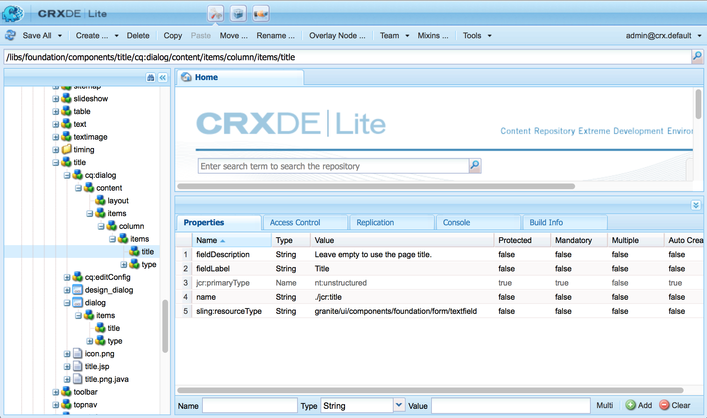

# 組AEM件 — 基礎{#aem-components-the-basics}

開發新元件時，您需要瞭解其結構和配置的基本知識。

此過程涉及讀取理論並查看標準實例中的廣泛元件AEM實現。 後一種方法略顯複雜，AEM因為儘管已轉向新的標準、現代、可觸摸的UI，但它仍支援經典UI。

## 概觀 {#overview}

本節介紹開發您自己的元件時所需的詳細資訊。

### 規劃 {#planning}

在開始實際配置或編碼元件之前，您應詢問：

* 您到底需要新元件做什麼？
   * 清晰的規格可幫助在開發、測試和移交的所有階段。 詳細資訊可能會隨時間而改變，但規範可以更新（儘管更改也應記錄在案）。
* 您是需要從頭開始建立元件，還是可以從現有元件繼承基礎知識？
   * 沒必要再發明車輪。
   * 提供了多種機制AEM，允許您繼承和擴展其他元件定義的詳細資訊，包括覆蓋、覆蓋和 [Sling資源合併](/help/sites-developing/sling-resource-merger.md)。
* 您的元件是否需要邏輯來選擇/操作內容？
   * 邏輯應與用戶介面層保持分離。 HTL旨在幫助確保此情況發生。
* 您的元件是否需要CSS格式？
   * CSS格式應與元件定義分開。 定義用於命名HTML元素的約定，以便您可以通過外部CSS檔案修改這些元素。
* 我應該考慮哪些安全方面？
   * 請參閱 [安全性核對表 — 開發最佳做法](/help/sites-administering/security-checklist.md#development-best-practices) 的上界。

### 支援觸摸與經典UI {#touch-enabled-vs-classic-ui}

在開始進行任何嚴肅的討論之前，您需要瞭解您的作者將使用的UI:

* **啟用觸摸的UI**
   [標準用戶介面](/help/sites-developing/touch-ui-concepts.md) 基於Adobe Marketing Cloud的統一用戶體驗，使用 [珊瑚UI](/help/sites-developing/touch-ui-concepts.md#coral-ui) 和 [花崗岩UI](/help/sites-developing/touch-ui-concepts.md#granite-ui)。
* **經典UI**
基於ExtJS技術的用戶介面，該技術已棄AEM用於6.4。

請參閱 [面向客戶的UI介面Recommendations](/help/sites-deploying/ui-recommendations.md) 的子菜單。

可實施元件以支援啟用觸摸的UI、標準UI或兩者。 在查看標準實例時，您還會看到最初為標準UI或啟用觸摸的UI設計的現成元件，或兩者兼有。

因此，我們將在本頁上介紹兩者的基本知識，以及如何識別它們。

>[!NOTE]
>
>Adobe建議利用支援觸摸的UI從最新技術中獲益。 [現代化AEM工具](modernization-tools.md) 可以使遷移更容易。

### 內容邏輯和呈現標籤  {#content-logic-and-rendering-markup}

建議將負責標籤和呈現的代碼與控制用於選擇元件內容的邏輯的代碼分開。

這一哲學得到 [HTL](https://experienceleague.adobe.com/docs/experience-manager-htl/content/overview.html)，特意限定為確保使用真實寫程式語言來定義底層業務邏輯的模板化語言。 此（可選）邏輯從HTL中調用，並帶有特定命令。 此機制將突出顯示為給定視圖調用的代碼，如果需要，還允許針對同一元件的不同視圖使用特定邏輯。

### HTL與JSP {#htl-vs-jsp}

HTL是一種HTML模板語言，AEM帶有6.0。

是否使用的探討 [HTL](https://experienceleague.adobe.com/docs/experience-manager-htl/content/overview.html) 或JSP(Java Server Pages)時，開發自己的元件應該簡單明瞭，因為HTL現在是推薦的指令碼語言AEM。

HTL和JSP都可用於為經典和啟用觸摸的UI開發元件。 雖然有一種傾向認為HTL僅用於傳統UI的啟用觸摸的UI和JSP，但這是一種誤解，更多是由於時間的原因。 該觸摸式UI和HTL大約在同AEM一時間段內被合併。 由於HTL現在是推薦的語言，因此它正用於新元件，而新元件通常用於啟用觸摸的UI。

>[!NOTE]
>
>例外是「花崗岩UI基礎表單域」（在對話框中使用）。 這些仍然需要使用JSP。

### 開發您自己的元件 {#developing-your-own-components}

要為相應的UI建立您自己的元件，請參閱（讀取此頁後）:

* [啟AEM用觸摸的UI的元件](/help/sites-developing/developing-components.md)
* [傳AEM統UI的元件](/help/sites-developing/developing-components-classic.md)

一種快速的入門方法是複製現有元件，然後進行所需的更改。 要瞭解如何建立自己的元件並將其添加到段落系統中，請參閱：

* [開發元件](/help/sites-developing/developing-components-samples.md) （側重於啟用觸摸的用戶介面）

### 將元件移至發佈實例 {#moving-components-to-the-publish-instance}

呈現內容的元件必須部署在與內容AEM相同的實例上。 因此，在作者實例上用於創作和呈現頁面的所有元件必須部署在發佈實例上。 部署後，這些元件可用於呈現激活的頁面。

使用以下工具將元件移動到發佈實例：

* [使用包管理器](/help/sites-administering/package-manager.md) 將元件添加到包中，並將其移到另AEM一個實例。
* [使用「激活樹」複製工具](/help/sites-authoring/publishing-pages.md#manage-publication) 複製元件。

>[!NOTE]
>
>這些機制還可用於在其它實例(例如從開發到test實例)之間傳送元件。

### 要從「開始」中感知的元件 {#components-to-be-aware-of-from-the-start}

* Page:

   * 具AEM有 *頁* 元件(C) `cq:Page`)。
   * 這是一種對內容管理非常重要的特定資源類型。
      * 頁面與包含網站內容的網頁相對應。

* 段落系統：

   * 段落系統是網站的關鍵部分，因為它管理著一個段落清單。 它用於保存和構造保存實際內容的各個元件。
   * 您可以在段落系統中建立、移動、複製和刪除段落。
   * 也可以選擇可在特定段落系統中使用的元件。
   * 標準實例中有各種段落系統(例如 `parsys`。 ` [responsivegrid](/help/sites-authoring/responsive-layout.md)`)。

## 結構 {#structure}

元件結構AEM強大靈活，主要考慮：

* 資源類型
* 元件定義
* 元件的屬性和子節點
* 對話方塊
* 設計對話框
* 元件可用性
* 元件及其建立的內容

### 資源類型 {#resource-type}

結構的關鍵元素是資源類型。

* 內容結構聲明意圖。
* 資源類型實施它們。

這是一個抽象概念，有助於確保即使外觀和感覺隨時間而改變，意圖也會保持時間。

### 元件定義 {#component-definition}

#### 元件基礎 {#component-basics}

元件的定義可按如下方式分解：

* 組AEM件基於 [吊帶](https://sling.apache.org/documentation.html)。
* 組AEM件(通常位於：

   * HTL: `/libs/wcm/foundation/components`
   * JSP: `/libs/foundation/components`

* 項目/地點特定的元件（通常）位於：

   * `/apps/<myApp>/components`

* AEM標準元件定義為 `cq:Component` 並有關鍵要素：

   * jcr屬性：

      jcr屬性清單；這些是可變的，而且某些可能是可選的，儘管元件節點的基本結構、其屬性和子節點由元件節點定義 `cq:Component` 定義

   * 資源:

      這些元素定義元件使用的靜態元素。

   * 指令碼:

   用於實現元件的結果實例的行為。

* **根節點**:

   * `<mycomponent> (cq:Component)`  — 元件的層次結構節點。

* **重要屬性**:

   * `jcr:title`  — 元件標題；例如，當元件在元件瀏覽器或側腳中列出時，將用作標籤。
   * `jcr:description`  — 元件說明；可在元件瀏覽器或側鍵中用作滑鼠懸停提示。
   * 傳統 UI:

      * `icon.png`  — 此元件的表徵圖。
      * `thumbnail.png`  — 如果此元件列在段落系統中，則顯示的影像。
   * 觸控式 UI

      * 請參閱一節 [Touch UI中的元件表徵圖](/help/sites-developing/components-basics.md#component-icon-in-touch-ui) 的雙曲餘切值。


* **重要子節點**:

   * `cq:editConfig (cq:EditConfig)`  — 定義元件的編輯屬性，並使元件能夠顯示在「元件」瀏覽器或「側腳」中。

      注：如果元件具有對話框，則即使cq:editConfig不存在，該對話框也會自動出現在「元件」瀏覽器或「側腳」中。

   * `cq:childEditConfig (cq:EditConfig)`  — 控制未定義其自身的子元件的作者UI方面 `cq:editConfig`。
   * 啟用觸摸的UI:

      * `cq:dialog` ( `nt:unstructured`) — 此元件的對話框。 定義允許用戶配置元件和/或編輯內容的介面。
      * `cq:design_dialog` ( `nt:unstructured`) — 此元件的設計編輯
   * 傳統 UI:

      * `dialog` ( `cq:Dialog`) — 此元件的對話框。 定義允許用戶配置元件和/或編輯內容的介面。
      * `design_dialog` ( `cq:Dialog`) — 為此元件設計編輯。


#### Touch UI中的元件表徵圖 {#component-icon-in-touch-ui}

元件的表徵圖或縮寫是在開發人員建立元件時通過元件的JCR屬性定義的。 這些屬性按以下順序計算，並使用找到的第一個有效屬性。

1. `cq:icon`  — 指向標準表徵圖的字串屬性 [Coral UI庫](https://helpx.adobe.com/experience-manager/6-5/sites/developing/using/reference-materials/coral-ui/coralui3/Coral.Icon.html) 在元件瀏覽器中顯示
   * 使用「珊瑚」表徵圖的HTML屬性值。
1. `abbreviation`  — 字串屬性，用於自定義元件瀏覽器中元件名稱的縮寫
   * 縮寫應限制為兩個字元。
   * 提供空字串將從的 `jcr:title` 屬性。
      * 例如，&quot;Image&quot;的&quot;Im&quot;
      * 本地化標題將用於生成縮寫。
   * 僅當元件具有 `abbreviation_commentI18n` 屬性，然後用作翻譯提示。
1. `cq:icon.png` 或 `cq:icon.svg`  — 此元件的表徵圖，在元件瀏覽器中顯示
   * 20 x 20像素是標準元件的表徵圖大小。
      * 較大的表徵圖將縮小（客戶端）。
   * 建議的顏色是rgb(112、112、112)> #707070
   * 標準元件表徵圖的背景是透明的。
   * 僅 `.png` 和 `.svg` 支援檔案。
   * 如果通過Eclipse插件從檔案系統導入，則檔案名需要轉義為 `_cq_icon.png` 或 `_cq_icon.svg` 例如。
   * `.png` 先例 `.svg` 如果兩者都存在

如果上述屬性均不存在( `cq:icon`。 `abbreviation`。 `cq:icon.png` 或 `cq:icon.svg`)。

* 系統將在超元件上搜索與 `sling:resourceSuperType` 屬性。
* 如果在超級元件級別未找到任何縮寫或找到空縮寫，則系統將根據 `jcr:title` 當前元件的屬性。

要取消從超級元件繼承表徵圖，請設定空 `abbreviation` 元件上的屬性將恢復為預設行為。

的 [元件控制台](/help/sites-authoring/default-components-console.md#component-details) 顯示如何定義特定元件的表徵圖。

#### SVG表徵圖示例 {#svg-icon-example}

```xml
<?xml version="1.0" encoding="utf-8"?>
<!DOCTYPE svg PUBLIC "-//W3C//DTD SVG 1.1//EN" "https://www.w3.org/Graphics/SVG/1.1/DTD/svg11.dtd">
<svg version="1.1" id="Layer_1" xmlns="https://www.w3.org/2000/svg" xmlns:xlink="https://www.w3.org/1999/xlink" x="0px" y="0px"
     width="20px" height="20px" viewBox="0 0 20 20" enable-background="new 0 0 20 20" xml:space="preserve">
    <ellipse cx="5" cy="5" rx="3" ry="3" fill="#707070"/>
    <ellipse cx="15" cy="5" rx="4" ry="4" fill="#707070"/>
    <ellipse cx="5" cy="15" rx="5" ry="5" fill="#707070"/>
    <ellipse cx="15" cy="15" rx="4" ry="4" fill="#707070"/>
</svg>
```

### 元件的屬性和子節點 {#properties-and-child-nodes-of-a-component}

定義元件所需的許多節點/屬性是兩個UI的共同點，差異仍然獨立，因此元件可以在兩個環境中工作。

元件是類型的節點 `cq:Component` 具有以下屬性和子節點：

<table>
 <tbody>
  <tr>
   <td><strong>名稱 <br /> </strong></td>
   <td><strong>類型 <br /> </strong></td>
   <td><strong>說明 <br /> </strong></td>
  </tr>
  <tr>
   <td>.<br /> </td>
   <td><code>cq:Component</code></td>
   <td>目前元件. 元件為節點類型 <code>cq:Component</code>。<br /> </td>
  </tr>
  <tr>
   <td><code>componentGroup</code></td>
   <td><code>String</code></td>
   <td>在元件瀏覽器（啟用觸摸的UI）或Sidekick（經典UI）中可選擇元件的組。<br /> 值 <code>.hidden</code> 用於無法從UI中選擇的元件，如實際段落系統。</td>
  </tr>
  <tr>
   <td><code>cq:isContainer</code></td>
   <td><code>Boolean</code></td>
   <td>指示元件是否是容器元件，因此可以包含其他元件，如段落系統。</td>
  </tr>
  <tr>
   <td> </td>
   <td> </td>
   <td> </td>
  </tr>
  <tr>
   <td><code>cq:dialog</code></td>
   <td><code>nt:unstructured</code> </td>
   <td>啟用觸摸的UI的編輯對話框的定義。</td>
  </tr>
  <tr>
   <td><code>dialog</code></td>
   <td><code>cq:Dialog</code></td>
   <td>經典UI的編輯對話框的定義。</td>
  </tr>
  <tr>
   <td><code>cq:design_dialog</code></td>
   <td><code>nt:unstructured</code></td>
   <td>啟用觸摸的UI的設計對話框的定義。</td>
  </tr>
  <tr>
   <td><code>design_dialog</code></td>
   <td><code>cq:Dialog </code></td>
   <td>經典UI的設計對話框的定義。<br /> </td>
  </tr>
  <tr>
   <td><code>dialogPath</code></td>
   <td><code>String</code></td>
   <td>當元件沒有對話框節點時用於覆蓋案例的對話框路徑。<br /> </td>
  </tr>
  <tr>
   <td> </td>
   <td> </td>
   <td> </td>
  </tr>
  <tr>
   <td><code>cq:cellName</code></td>
   <td><code>String</code></td>
   <td>如果設定，則此屬性被視為單元格ID。 有關詳細資訊，請參閱知識庫文章 <a href="https://helpx.adobe.com/experience-manager/kb/DesigneCellId.html">如何構建設計單元格ID</a>。<br /> </td>
  </tr>
  <tr>
   <td><code>cq:childEditConfig</code></td>
   <td><code>cq:EditConfig</code></td>
   <td>當元件是容器（例如段落系統）時，這將驅動子節點的編輯配置。<br /> </td>
  </tr>
  <tr>
   <td><code>cq:editConfig</code></td>
   <td><code>cq:EditConfig</code></td>
   <td><a href="#edit-behavior">編輯元件的配置</a>。<br /> </td>
  </tr>
  <tr>
   <td><code>cq:htmlTag</code></td>
   <td><code>nt:unstructured </code></td>
   <td>返回添加到周圍html標籤的附加標籤屬性。 允許將屬性添加到自動生成的視圖。</td>
  </tr>
  <tr>
   <td><code>cq:noDecoration</code></td>
   <td><code>Boolean</code></td>
   <td>如果為true，則不使用自動生成的div和css類呈現元件。<br /> </td>
  </tr>
  <tr>
   <td><code>cq:template</code></td>
   <td><code>nt:unstructured</code></td>
   <td>如果找到，則當從「元件瀏覽器」或「邊」添加元件時，此節點將用作內容模板。</td>
  </tr>
  <tr>
   <td><code>cq:templatePath</code></td>
   <td><code>String</code></td>
   <td>從「元件」瀏覽器或「側腳」添加元件時用作內容模板的節點路徑。 這必須是絕對路徑，而不是相對於元件節點。<br /> 除非您希望重新使用其他位置已有的內容，否則不需要這樣做， <code>cq:template</code> 足夠（見下文）。</td>
  </tr>
  <tr>
   <td><code>jcr:created</code></td>
   <td><code>Date</code></td>
   <td>元件的建立日期。<br /> </td>
  </tr>
  <tr>
   <td><code>jcr:description</code></td>
   <td><code>String</code></td>
   <td>元件的說明。<br /> </td>
  </tr>
  <tr>
   <td><code>jcr:title</code></td>
   <td><code>String</code></td>
   <td>元件的標題。<br /> </td>
  </tr>
  <tr>
   <td><code>sling:resourceSuperType</code></td>
   <td><code>String</code></td>
   <td>設定後，元件將繼承自此元件。<br /> </td>
  </tr>
  <tr>
   <td><code>virtual</code></td>
   <td><code>sling:Folder</code></td>
   <td>允許建立虛擬元件。 要查看示例，請查看以下聯繫人元件：<br /> <code>/libs/foundation/components/profile/form/contact</code></td>
  </tr>
  <tr>
   <td><code>&lt;breadcrumb.jsp&gt;</code></td>
   <td><code>nt:file</code> </td>
   <td>指令碼檔案。<br /> </td>
  </tr>
  <tr>
   <td><code>icon.png</code></td>
   <td><code>nt:file</code></td>
   <td>元件的表徵圖顯示在「Title in Sidekick」（側腳中的標題）旁邊。<br /> </td>
  </tr>
  <tr>
   <td><code>thumbnail.png</code></td>
   <td><code>nt:file</code></td>
   <td>從Sidekick將元件拖入到位時顯示的可選縮略圖。<br /> </td>
  </tr>
 </tbody>
</table>

如果我們看看 **文本** 元件（任一版本），我們可以看到以下元素：

* HTL ( `/libs/wcm/foundation/components/text`)

   

* JSP( `/libs/foundation/components/text`)

   

特定權益物業包括：

* `jcr:title`  — 元件名稱；這可用於標識元件，例如，它出現在元件瀏覽器或側腳中的元件清單中
* `jcr:description`  — 元件說明；可用作側腳內元件清單中的滑鼠懸停提示
* `sling:resourceSuperType`:這表示在擴展元件（通過覆蓋定義）時的繼承路徑

特定感興趣的子節點包括：

* `cq:editConfig` ( `cq:EditConfig`) — 該控制項控制視覺方面；例如，它可以定義條形或小部件的外觀，也可以添加自定義控制項
* `cq:childEditConfig` ( `cq:EditConfig`) — 它控制沒有自己定義的子元件的可視方面
* 啟用觸摸的UI:
   * `cq:dialog` ( `nt:unstructured`) — 定義編輯此元件內容的對話框
   * `cq:design_dialog` ( `nt:unstructured`) — 指定此元件的設計編輯選項
* 傳統 UI:
   * `dialog` ( `cq:Dialog`) — 定義編輯此元件內容的對話框（特定於標準UI）
   * `design_dialog` ( `cq:Dialog`) — 指定此元件的設計編輯選項
   * `icon.png`  — 要用作Sidekick中元件表徵圖的圖形檔案
   * `thumbnail.png`  — 從Sidekick中拖動元件時用作元件縮覽圖的圖形檔案

### 對話方塊 {#dialogs}

對話框是元件的關鍵元素，因為它們為作者提供了配置和提供該元件輸入的介面。

根據元件的複雜性，您的對話框可能需要一個或多個頁籤 — 以縮短對話框並對輸入欄位進行排序。

對話框定義特定於UI:

>[!NOTE]
>
>* 為了相容性，當未為啟用觸摸的UI定義對話框時，啟用觸摸的UI可以使用經典UI對話框的定義。
>* 的 [現代化AEM工具](/help/sites-developing/modernization-tools.md) 還提供用於幫助您擴展/轉換僅為經典UI定義對話框的元件。
>


* 啟用觸摸的UI
   * `cq:dialog` ( `nt:unstructured`)節點：
      * 定義編輯此元件內容的對話框
      * 特定於啟用觸摸的UI
      * 是使用Granite UI元件定義的
      * 有一處房產 `sling:resourceType`，作為標準Sling內容結構
      * 可以擁有 `helpPath` 定義在「幫助」表徵圖(?)時訪問的上下文相關幫助資源（絕對或相對路徑） 表徵圖)。
         * 對於開箱即用的元件，這通常會引用文檔中的頁面。
         * 否 `helpPath` 指定時，將顯示預設URL（文檔概述頁）。

   

   在對話框中，定義了各個欄位：

   

* 傳統 UI
   * `dialog` ( `cq:Dialog`)節點
      * 定義編輯此元件內容的對話框
      * 特定於經典UI
      * 使用ExtJS小部件定義
      * 有一處房產 `xtype`，指ExtJS
      * 可以擁有 `helpPath` 定義在 **幫助** 按鈕
         * 對於開箱即用的元件，這通常會引用文檔中的頁面。
         * 否 `helpPath` 指定時，將顯示預設URL（文檔概述頁）。

   

   在對話框中，定義了各個欄位：

   

   在經典對話框中：

   * 可以建立對話框 `cq:Dialog`，它將提供單個頁籤 — 如在文本元件中，或者如果需要多個頁籤，如在textimage元件中，可將對話框定義為 `cq:TabPanel`。
   * a `cq:WidgetCollection` ( `items`)用於為任一輸入欄位提供基( `cq:Widget`)或其他頁籤( `cq:Widget`)。 可以擴展此層次結構。


### 設計對話框 {#design-dialogs}

設計對話框與用於編輯和配置內容的對話框非常相似，但它們為作者提供了介面以配置和提供該元件的設計詳細資訊。

[「設計模式」(Design Mode)中提供設計對話框](/help/sites-authoring/default-components-designmode.md)，但並非所有元件(例如 **標題** 和 **影像** 都有設計對話， **文本** 不會。

段落系統（例如parsys）的設計對話框是一個特殊情況，因為它允許用戶選擇特定的其他元件（從元件瀏覽器或側腳）。

### 將元件添加到段落系統 {#adding-your-component-to-the-paragraph-system}

定義了元件後，必須使其可用。 要使元件在段落系統中可用，您可以執行以下任一操作：

1. 開啟 [設計模式](/help/sites-authoring/default-components-designmode.md) 的子菜單。
1. 將所需的元件添加到 `components` 模板定義的屬性：

   `/etc/designs/<*yourProject*>/jcr:content/<*yourTemplate*>/par`

   例如，請參見：

   `/etc/designs/geometrixx/jcr:content/contentpage/par`

   

### 元件及其建立的內容 {#components-and-the-content-they-create}

如果建立和配置 **標題** 元件： `<content-path>/Prototype.html`

* 啟用觸摸的UI

   

* 傳統 UI

   

然後，我們可以看到在儲存庫中建立的內容的結構：


特別是，如果您查看 **標題**:

* 定義（對於兩個UI）具有 `name`= `./jcr:title`

   * `/libs/foundation/components/title/cq:dialog/content/items/column/items/title`
   * `/libs/foundation/components/title/dialog/items/title`

* 在內容中，將生成屬性 `jcr:title` 保存作者的內容。

定義的屬性取決於各個定義。 雖然可能比上面複雜，但也遵循同樣的基本原則。

## 元件層次和繼承 {#component-hierarchy-and-inheritance}

內的組AEM件受3個不同層次的限制：

* **資源類型層次結構**

   這用於使用屬性擴展元件 `sling:resourceSuperType`。 這樣元件就可以繼承。 例如，文本元件將從標準元件繼承各種屬性。

   * 指令碼（由Sling解析）
   * 對話
   * 說明（包括縮略圖、表徵圖等）

* **容器層次結構**

   這用於將配置設定填充到子元件中，並且最常用於parsys方案。

   例如，可在父元件上定義編輯欄按鈕、控制集佈局（編輯欄、滾動圖形）、對話框佈局（內聯、浮動）的配置設定，並傳播到子元件。

   中的配置設定（與編輯功能相關） `cq:editConfig` 和 `cq:childEditConfig` 傳播。

* **包括層次結構**

   在運行時，將按包含的序列強加此項。

   該層次結構由設計人員使用，而設計人員又作為繪製各個設計方面的基礎；包括佈局資訊、css資訊、parsys中的可用元件等。

## 編輯行為 {#edit-behavior}

本節介紹如何配置元件的編輯行為。 這包括可用於元件的操作、就地編輯器的特性以及與元件上的事件相關的監聽器等屬性。

該配置對於啟用觸摸的UI和經典UI都是通用的，儘管有某些特定的差異。

通過添加 `cq:editConfig` 類型節點 `cq:EditConfig` 元件節點下(類型 `cq:Component`)和添加特定屬性和子節點。 以下屬性和子節點可用：

* [ `cq:editConfig` 節點屬性](#configuring-with-cq-editconfig-properties):

   * `cq:actions` ( `String array`):定義可在元件上執行的操作。
   * `cq:layout` ( `String`)::定義在經典UI中編輯元件的方式。
   * `cq:dialogMode` ( `String`):定義在經典UI中開啟元件對話框的方式

      * 在啟用觸摸的UI中，對話框始終在案頭模式下浮動，並在移動中自動以全屏方式開啟。
   * `cq:emptyText` ( `String`):定義當沒有可視內容時顯示的文本。
   * `cq:inherit` ( `Boolean`):定義是否從其繼承的元件繼承缺少的值。
   * `dialogLayout` （字串）:定義對話框的開啟方式。


* [ `cq:editConfig` 子節點](#configuring-with-cq-editconfig-child-nodes):

   * `cq:dropTargets` （節點類型） `nt:unstructured`):定義可接受內容查找器資產刪除的刪除目標清單

      * 多個刪除目標僅在經典UI中可用。
      * 在啟用觸摸的UI中，允許單個放置目標。
   * `cq:actionConfigs` （節點類型） `nt:unstructured`):定義附加到cq:actions清單的新操作的清單。
   * `cq:formParameters` （節點類型） `nt:unstructured`):定義添加到對話框窗體的附加參數。
   * `cq:inplaceEditing` （節點類型） `cq:InplaceEditingConfig`):定義元件的原位編輯配置。
   * `cq:listeners` （節點類型） `cq:EditListenersConfig`):定義在元件上執行操作之前或之後發生的操作。


>[!NOTE]
>
>在此頁中，節點（屬性和子節點）表示為XML，如下例所示。

```
<jcr:root xmlns:cq="https://www.day.com/jcr/cq/1.0" xmlns:jcr="https://www.jcp.org/jcr/1.0"
    cq:actions="[edit]"
    cq:dialogMode="floating"
    cq:layout="editbar"
    jcr:primaryType="cq:EditConfig">
    <cq:listeners
        jcr:primaryType="cq:EditListenersConfig"
        afteredit="REFRESH_PAGE"/>
</jcr:root>
```

儲存庫中有許多現有配置。 您可以輕鬆搜索特定屬性或子節點：

* 查找屬性 `cq:editConfig` 節點，例如 `cq:actions`，可在中使用「查詢」工具 **CRXDE Lite** 並使用以下XPath查詢字串進行搜索：

   `//element(cq:editConfig, cq:EditConfig)[@cq:actions]`

* 查找的子節點 `cq:editConfig`，例如，您可以 `cq:dropTargets`，其類型 `cq:DropTargetConfig`;您可以在**CRXDE Lite**中使用查詢工具，並使用以下XPath查詢字串進行搜索：

   `//element(cq:dropTargets, cq:DropTargetConfig)`

### 元件佔位符 {#component-placeholders}

元件必須始終呈現作者可見的某些HTML，即使元件沒有內容。 否則，它可能會從編輯器介面的視覺上消失，從而使其在技術上存在，但在頁面和編輯器中不可見。 在這種情況下，作者將無法選擇空元件並與其進行交互。

因此，在頁面編輯器中呈現頁面時(當WCM模式為 `edit` 或 `preview`)。
佔位符的典型HTML標籤如下：

```HTML
<div class="cq-placeholder" data-emptytext="Component Name"></div>
```

呈現上述佔位符HTML的典型HTL指令碼如下：

```HTML
<div class="cq-placeholder" data-emptytext="${component.properties.jcr:title}"
     data-sly-test="${(wcmmode.edit || wcmmode.preview) && isEmpty}"></div>
```

在上一個示例中， `isEmpty` 是一個變數，僅當元件沒有內容且作者不可見時，該變數才為true。

為避免重複，Adobe建議元件的實施者為這些佔位符使用HTL模板， [就像核心元件提供的。](https://github.com/adobe/aem-core-wcm-components/blob/master/content/src/content/jcr_root/apps/core/wcm/components/commons/v1/templates.html)

然後，使用以下HTL行完成模板在上一個連結中的使用：

```HTML
<sly data-sly-use.template="core/wcm/components/commons/v1/templates.html"
     data-sly-call="${template.placeholder @ isEmpty=!model.text}"></sly>
```

在上一個示例中， `model.text` 是僅當內容具有內容且可見時才為true的變數。

在「核心元件」中，可以看到此模板的使用示例。 [如標題元件中。](https://github.com/adobe/aem-core-wcm-components/blob/master/content/src/content/jcr_root/apps/core/wcm/components/title/v2/title/title.html#L27)

### 使用cq:EditConfig屬性配置 {#configuring-with-cq-editconfig-properties}

### cq：動作 {#cq-actions}

的 `cq:actions` 屬性( `String array`)定義可對元件執行的一個或多個操作。 以下值可用於配置：

<table>
 <tbody>
  <tr>
   <td><strong>屬性值</strong></td>
   <td><strong>說明</strong></td>
  </tr>
  <tr>
   <td><code>text:&lt;some text&gt;</code></td>
   <td>顯示靜態文本值 &lt;some text=""&gt;<br /> 僅在經典UI中可見。 啟用觸摸的UI不會在上下文菜單中顯示操作，因此不適用。</td>
  </tr>
  <tr>
   <td>-</td>
   <td>添加間隔器。<br /> 僅在經典UI中可見。 啟用觸摸的UI不會在上下文菜單中顯示操作，因此不適用。</td>
  </tr>
  <tr>
   <td><code>edit</code></td>
   <td>添加按鈕以編輯元件。</td>
  </tr>
      <tr>
    <td><code>editannotate</code></td>
    <td>添加按鈕以編輯元件，並允許 <a href="/help/sites-authoring/annotations.md">注釋</a>。</td>
   </tr>
  <tr>
   <td><code>delete</code></td>
   <td>添加按鈕以刪除元件</td>
  </tr>
  <tr>
   <td><code>insert</code></td>
   <td>添加按鈕以在當前元件之前插入新元件</td>
  </tr>
  <tr>
   <td><code>copymove</code></td>
   <td>添加一個按鈕以複製和剪切元件。</td>
  </tr>
 </tbody>
</table>

以下配置將編輯按鈕、間隔器、刪除和插入按鈕添加到元件編輯欄：

```
<jcr:root xmlns:cq="https://www.day.com/jcr/cq/1.0" xmlns:jcr="https://www.jcp.org/jcr/1.0"
    cq:actions="[edit,-,delete,insert]"
    cq:layout="editbar"
    jcr:primaryType="cq:EditConfig"/>
```

以下配置將文本「從基本框架繼承的配置」添加到元件編輯欄：

```
<jcr:root xmlns:cq="https://www.day.com/jcr/cq/1.0" xmlns:jcr="https://www.jcp.org/jcr/1.0"
    cq:actions="[text:Inherited Configurations from Base Framework]"
    cq:layout="editbar"
    jcr:primaryType="cq:EditConfig"/>
```

### cq:layout（僅限經典UI） {#cq-layout-classic-ui-only}

的 `cq:layout` 屬性( `String`)定義如何在經典用戶介面中編輯元件。 以下值可用：

<table>
 <tbody>
  <tr>
   <td><strong>屬性值</strong></td>
   <td><strong>說明</strong></td>
  </tr>
  <tr>
   <td><code>rollover</code></td>
   <td>預設值。 元件版本可通過按一下和/或上下文菜單「在滑鼠上」訪問。<br /> 對於高級用途，請注意相應的客戶端對象是： <code>CQ.wcm.EditRollover</code>。</td>
  </tr>
  <tr>
   <td><code>editbar</code></td>
   <td>元件版本可通過工具欄訪問。<br /> 對於高級用途，請注意相應的客戶端對象是： <code>CQ.wcm.EditBar</code>。</td>
  </tr>
  <tr>
   <td><code>auto</code></td>
   <td>選項留給客戶端代碼。</td>
  </tr>
 </tbody>
</table>

>[!NOTE]
>
>滑鼠經過和編輯欄的概念在啟用觸摸的用戶介面中不適用。

以下配置將編輯按鈕添加到元件編輯欄：

```
<jcr:root xmlns:cq="https://www.day.com/jcr/cq/1.0" xmlns:jcr="https://www.jcp.org/jcr/1.0"
    cq:actions="[edit]"
    cq:layout="editbar"
    jcr:primaryType="cq:EditConfig">
</jcr:root>
```

### cq:dialogMode（僅限經典UI） {#cq-dialogmode-classic-ui-only}

該元件可連結到編輯對話框。 的 `cq:dialogMode` 屬性( `String`)定義在經典UI中開啟元件對話框的方式。 以下值可用：

<table>
 <tbody>
  <tr>
   <td><strong>屬性值</strong></td>
   <td><strong>說明</strong></td>
  </tr>
  <tr>
   <td><code>floating</code></td>
   <td>對話框浮動。<br /> </td>
  </tr>
  <tr>
   <td><code>inline</code></td>
   <td>(預設值). 對話框定位在元件上。<br /> </td>
  </tr>
  <tr>
   <td><code>auto</code></td>
   <td>如果元件寬度小於客戶端 <code>CQ.themes.wcm.EditBase.INLINE_MINIMUM_WIDTH</code> 值，對話框是浮動的，否則是內聯的。</td>
  </tr>
 </tbody>
</table>

>[!NOTE]
>
>在啟用觸摸的UI中，對話框始終以案頭模式浮動，並在移動中以全屏方式自動開啟。

以下配置使用編輯按鈕和浮動對話框定義編輯欄：

```
<jcr:root xmlns:cq="https://www.day.com/jcr/cq/1.0" xmlns:jcr="https://www.jcp.org/jcr/1.0"
    cq:actions="[edit]"
    cq:dialogMode="floating"
    cq:layout="editbar"
    jcr:primaryType="cq:EditConfig">
</jcr:root>
```

### cq：空文本 {#cq-emptytext}

的 `cq:emptyText` 屬性( `String`)定義在沒有可視內容時顯示的文本。 預設為： `Drag components or assets here`。

### cq：繼承 {#cq-inherit}

的 `cq:inherit` 屬性( `boolean`)定義是否從其繼承的元件繼承缺失值。 預設為 `false`。

### 對話框佈局 {#dialoglayout}

的 `dialogLayout` 屬性定義對話框在預設情況下應如何開啟。

* 值 `fullscreen` 全屏開啟對話框。
* 空值或缺少屬性的預設值將正常開啟對話框。
* 請注意，用戶始終可以在對話框中切換全屏模式。
* 不適用於經典UI。

### 使用cq:EditConfig子節點配置 {#configuring-with-cq-editconfig-child-nodes}

### cq:dropTargets {#cq-droptargets}

的 `cq:dropTargets` 節點（節點類型） `nt:unstructured`)定義可接受從內容查找器中拖動的資產中刪除的刪除目標的清單。 它用作類型節點的集合 `cq:DropTargetConfig`。

>[!NOTE]
>
>多個刪除目標僅在經典UI中可用。
>
>在啟用觸摸的UI中，僅使用第一個目標。

類型的每個子節點 `cq:DropTargetConfig` 在元件中定義放置目標。 節點名很重要，因為必須在JSP中使用它，以便生成分配給DOM元素的CSS類名，該元素是有效刪除目標：

```
<drop target css class> = <drag and drop prefix> +
 <node name of the drop target in the edit configuration>
```

的 `<drag and drop prefix>` 由Java屬性定義：

`com.day.cq.wcm.api.components.DropTarget.CSS_CLASS_PREFIX`。

例如，類名在Download元件( `/libs/foundation/components/download/download.jsp`) `file` 是「下載」元件的編輯配置中放置目標的節點名：

`String ddClassName = DropTarget.CSS_CLASS_PREFIX + "file";`

類型的節點 `cq:DropTargetConfig` 需要具有以下屬性：

<table>
 <tbody>
  <tr>
   <td><strong>屬性名稱</strong></td>
   <td><strong>屬性值<br /> </strong></td>
  </tr>
  <tr>
   <td><code>accept</code></td>
   <td>應用於資產mime類型的規則運算式，以驗證是否允許刪除。</td>
  </tr>
  <tr>
   <td><code>groups</code></td>
   <td>放置目標組的陣列。 每個組必須與內容查找器擴展中定義的和附加到資產的組類型相匹配。</td>
  </tr>
  <tr>
   <td><code>propertyName</code></td>
   <td>有效刪除後將更新的屬性的名稱。</td>
  </tr>
 </tbody>
</table>

以下配置是從下載元件中獲取的。 它啟用 `media` 要從內容查找器中刪除到元件中的組。 刪除後，元件屬性 `fileReference` 正在更新：

```
    <cq:dropTargets jcr:primaryType="nt:unstructured">
        <file
            jcr:primaryType="cq:DropTargetConfig"
            accept="[.*]"
            groups="[media]"
            propertyName="./fileReference"/>
    </cq:dropTargets>
```

### cq:actionConfigs（僅限經典UI） {#cq-actionconfigs-classic-ui-only}

的 `cq:actionConfigs` 節點（節點類型） `nt:unstructured`)定義附加到由 `cq:actions` 屬性。 每個子節點 `cq:actionConfigs` 通過定義小部件定義新操作。

以下示例配置定義了一個新按鈕（帶有標準UI的分隔符）:

* 由xtype定義的分隔符 `tbseparator`;

   * 這僅用於經典UI。
   * 啟用觸摸的UI忽略此定義，因為忽略了xtypes（由於操作工具欄在啟用觸摸的UI中的構造方式不同，因此不需要分隔符）。

* 名為的按鈕 **管理注釋** 運行handler函式 `CQ_collab_forum_openCollabAdmin()`。

```
<jcr:root xmlns:cq="https://www.day.com/jcr/cq/1.0" xmlns:jcr="https://www.jcp.org/jcr/1.0" xmlns:nt="https://www.jcp.org/jcr/nt/1.0"
    cq:actions="[EDIT,COPYMOVE,DELETE,INSERT]"
    jcr:primaryType="cq:EditConfig">
    <cq:actionConfigs jcr:primaryType="nt:unstructured">
        <separator0
            jcr:primaryType="nt:unstructured"
            xtype="tbseparator"/>
        <manage
            jcr:primaryType="nt:unstructured"
            handler="function(){CQ_collab_forum_openCollabAdmin();}"
            text="Manage comments"/>
    </cq:actionConfigs>
</jcr:root>
```

>[!NOTE]
>
>請參閱 [將新操作添加到元件工具欄](/help/sites-developing/customizing-page-authoring-touch.md#add-new-action-to-a-component-toolbar) 作為啟用觸摸的UI的示例。

### cq:formParameters {#cq-formparameters}

的 `cq:formParameters` 節點（節點類型） `nt:unstructured`)定義添加到對話框窗體的其他參數。 每個屬性都映射到表單參數。

以下配置添加了名為 `name`，使用值設定 `photos/primary` 對話框：

```
    <cq:formParameters
        jcr:primaryType="nt:unstructured"
        name="photos/primary"/>
```

### cq：就地編輯 {#cq-inplaceediting}

的 `cq:inplaceEditing` 節點（節點類型） `cq:InplaceEditingConfig`)定義元件的就地編輯配置。 它可以具有以下屬性：

<table>
 <tbody>
  <tr>
   <td><strong>屬性名稱</strong></td>
   <td><strong>屬性值<br /> </strong></td>
  </tr>
  <tr>
   <td><code>active</code></td>
   <td>(<code>boolean</code>)為True以啟用元件的原位編輯。</td>
  </tr>
  <tr>
   <td><code>configPath</code></td>
   <td>(<code>String</code>)編輯器配置的路徑。 配置可由配置節點指定。</td>
  </tr>
  <tr>
   <td><code>editorType</code></td>
   <td><p>(<code>String</code>)編輯器類型。 可用類型包括：</p>
    <ul>
     <li>明文：用於非HTML內容。<br /> </li>
     <li>標題：是增強的純文字檔案編輯器，在開始編輯之前將圖形標題轉換為純文字檔案。 由Geometrixx標題元件使用。<br /> </li>
     <li>文本：用於HTML內容（使用RT編輯器）。<br /> </li>
    </ul> </td>
  </tr>
 </tbody>
</table>

以下配置允許對元件進行原位編輯並定義 `plaintext` 編輯器類型：

```
    <cq:inplaceEditing
        jcr:primaryType="cq:InplaceEditingConfig"
        active="{Boolean}true"
        editorType="plaintext"/>
```

### cq：偵聽器 {#cq-listeners}

的 `cq:listeners` 節點（節點類型） `cq:EditListenersConfig`)定義在元件上執行操作之前或之後發生的操作。 下表定義了其可能的屬性。

<table>
 <tbody>
  <tr>
   <td><strong>屬性名稱</strong></td>
   <td><strong>屬性值<br /> </strong></td>
   <td><p><strong>預設值</strong></p> <p>（僅限經典UI）</p> </td>
  </tr>
  <tr>
   <td><code>beforedelete</code></td>
   <td>在刪除元件之前觸發處理程式。<br /> </td>
   <td> </td>
  </tr>
  <tr>
   <td><code>beforeedit</code></td>
   <td>在編輯元件之前觸發處理程式。</td>
   <td> </td>
  </tr>
  <tr>
   <td><code>beforecopy</code></td>
   <td>在複製元件之前觸發處理程式。</td>
   <td> </td>
  </tr>
  <tr>
   <td><code>beforemove</code></td>
   <td>在移動元件之前觸發處理程式。</td>
   <td> </td>
  </tr>
  <tr>
   <td><code>beforeinsert</code></td>
   <td>在插入元件之前觸發處理程式。<br /> 僅對啟用觸摸的UI操作。</td>
   <td> </td>
  </tr>
  <tr>
   <td><code>beforechildinsert</code></td>
   <td>在將元件插入另一個元件（僅限容器）之前，會觸發處理程式。</td>
   <td> </td>
  </tr>
  <tr>
   <td><code>afterdelete</code></td>
   <td>刪除元件後將觸發處理程式。</td>
   <td><code>REFRESH_SELF</code></td>
  </tr>
  <tr>
   <td><code>afteredit</code></td>
   <td>編輯元件後將觸發處理程式。</td>
   <td><code>REFRESH_SELF</code></td>
  </tr>
  <tr>
   <td><code>aftercopy</code></td>
   <td>在複製元件後觸發處理程式。</td>
   <td><code>REFRESH_SELF</code></td>
  </tr>
  <tr>
   <td><code>afterinsert</code></td>
   <td>在插入元件後觸發處理程式。</td>
   <td><code>REFRESH_INSERTED</code></td>
  </tr>
  <tr>
   <td><code>aftermove</code></td>
   <td>在移動元件後觸發處理程式。</td>
   <td><code>REFRESH_SELFMOVED</code></td>
  </tr>
  <tr>
   <td><code>afterchildinsert</code></td>
   <td>在將元件插入另一個元件（僅限容器）後，將觸發處理程式。</td>
   <td> </td>
  </tr>
 </tbody>
</table>

>[!NOTE]
>
>的 `REFRESH_INSERTED` 和 `REFRESH_SELFMOVED` 處理程式僅在經典UI中可用。

>[!NOTE]
>
>監聽程式的預設值僅在經典UI中設定。

>[!NOTE]
>
>在嵌套元件的情況下，對定義為上的屬性的操作有某些限制 `cq:listeners` 節點：
>
>* 對於嵌套元件，以下屬性的值 *必須* 是 `REFRESH_PAGE`:>
>  * `aftermove`
>  * `aftercopy`


事件處理程式可以使用自定義實現來實現。 例如(其中 `project.customerAction` 是靜態方法):

`afteredit = "project.customerAction"`

下面的示例等效於 `REFRESH_INSERTED` 配置：

`afterinsert="function(path, definition) { this.refreshCreated(path, definition); }"`

>[!NOTE]
>
>有關經典UI，請參閱 `before<action>` 和 `after<action>` 事件部分 [ `CQ.wcm.EditBar`](https://helpx.adobe.com/experience-manager/6-5/sites/developing/using/reference-materials/widgets-api/index.html?class=CQ.wcm.EditBar) 和 [ `CQ.wcm.EditRollover`](https://helpx.adobe.com/experience-manager/6-5/sites/developing/using/reference-materials/widgets-api/index.html?class=CQ.wcm.EditRollover) 構件文檔。

使用以下配置，在刪除、編輯、插入或移動元件後刷新頁面：

```
    <cq:listeners
        jcr:primaryType="cq:EditListenersConfig"
        afterdelete="REFRESH_PAGE"
        afteredit="REFRESH_PAGE"
        afterinsert="REFRESH_PAGE"
        afterMove="REFRESH_PAGE"/>
```
