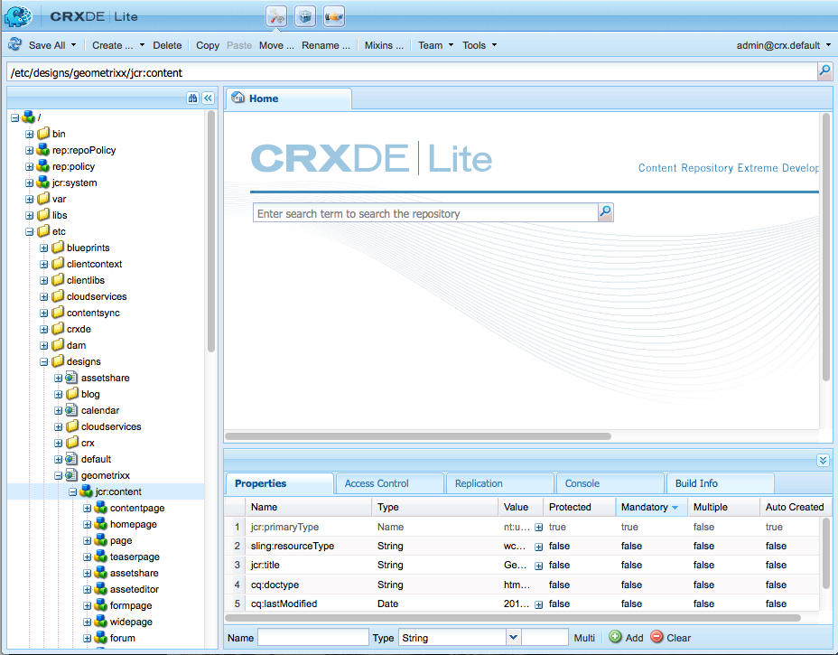

# 設計與設計人員{#designs-and-the-designer}

>[!CAUTION]
>
>本文說明如何根據傳統UI建立網站。 Adobe建議您運用最新的AEM技術來建立網站，如「開發AEM網站快速入門」一文 [中所述](/help/sites-developing/getting-started.md)。

您將需要為網站建立設計，而在AEM中，您需使用設計工具來建立。

>[!NOTE]
>
>如需網頁協助工具的詳細資訊，請參 [閱AEM和網頁協助工具准則](/help/managing/web-accessibility.md)。

## 使用設計人員 {#using-the-designer}

您的設計可在「工具」( **Tools** )頁籤的「設 **計** 」(Designs)部分定義：


您可以在此處建立儲存設計所需的結構，然後上傳所需的級聯樣式表和影像。

設計會儲存在下 `/etc/designs`面。 使用節點的屬性指定用於網站的設計 `cq:designPath` 路徑 `jcr:content` 。



>[!NOTE]
>
>在設計模式下對頁面所做的所有變更都會保留在網站的設計節點下方，並自動套用至具有相同設計的所有頁面。

## 您需要的 {#what-you-will-need}

若要實現您的設計，您需要：

**CSS** —— 階層式樣式表可定義頁面上特定區域的格式。
**影像** -您用於背景、按鈕等功能的任何影像。

### 設計網站時的考量 {#considerations-when-designing-your-website}

在開發網站時，強烈建議您在下方儲存影像和CSS檔案， `/etc/design/<project>` 如此您就可以參照下列程式碼片段所描述的目前設計。

```xml
<%= currentDesign.getPath() + "/static/img/icon.gif %>
```

上述範例提供幾項優點：

* 元件可根據使用不同設計路徑的每個網站有不同的外觀／感覺。
* 只要將設計路徑指向網站根部的不同節點，即可輕鬆重新設計網 `design/v1` 站 `design/v2.`

* `/etc/designs` 而且， `/content` 瀏覽器只會看到外部URL保護您，讓外部使用者對樹狀結構下的內容感到好奇 `/apps` 。 上述URL優點也有助於系統管理員設定更好的安全性，因為您將資產暴露在幾個不同位置。

