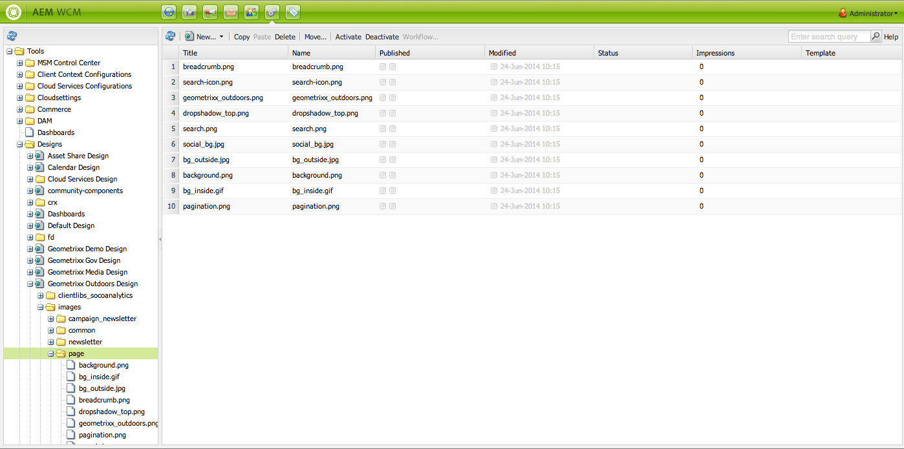

# 設計與設計人員{#designs-and-the-designer}

>[!CAUTION]
>
>本文說明如何根據傳統UI建立網站。 Adobe建議您的AEM網站運用最新技術，如[開發AEM Sites快速入門文章](/help/sites-developing/getting-started.md)所述。

設計人員可用來使用[中的Classic UI](/help/release-notes/touch-ui-features-status.md)建立網站的設計AEM。

>[!NOTE]
>
>有關Web輔助功能的詳細資訊，請參AEM閱[和Web輔助功能指南](/help/managing/web-accessibility.md)。

## 使用設計器{#using-the-designer}

您的設計可在&#x200B;**工具**&#x200B;標籤的&#x200B;**designs**&#x200B;區段中定義：



您可以在此處建立儲存設計所需的結構，然後上傳所需的級聯樣式表和影像。

設計儲存在`/apps/<your-project>`下。 使用`jcr:content`節點的`cq:designPath`屬性指定用於網站的設計路徑。


>[!NOTE]
>
>在設計模式下對頁面所做的所有變更都會保留在網站的設計節點下方，並自動套用至具有相同設計的所有頁面。

## 您需要的{#what-you-will-need}

若要實現您的設計，您需要：

**CSS**  —— 階層式樣式表可定義頁面上特定區域的格式。**影像** -您用於背景、按鈕等功能的任何影像。

### 設計網站{#considerations-when-designing-your-website}時的考量事項

在開發網站時，強烈建議您將影像和CSS檔案儲存在`/apps/<your-project>`下，如此您就可參照下列程式碼片段所描述的目前設計。

```xml
<%= currentDesign.getPath() + "/static/img/icon.gif %>
```

上述範例提供幾項優點：

* 元件可根據使用不同設計路徑的每個網站有不同的外觀／感覺。
* 只要將設計路徑指向網站根部的不同節點（從`design/v1`到`design/v2.`），即可重新設計網站

* `/etc/designs` 而且 `/content` 瀏覽器唯一看到的外部URL可保護您，讓外部使用者對樹狀結構下的內容感到 `/apps` 好奇。上述URL優點也有助於系統管理員設定更好的安全性，因為您將資產暴露在幾個不同位置。
