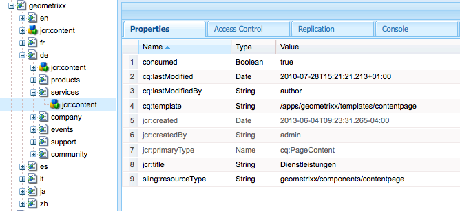

# 建立和使用卸載作業{#creating-and-consuming-jobs-for-offloading}

Apache Sling Discovery功能提供了Java API，使您能夠建立使用JobManager作業和JobConsumer服務。

有關建立卸載拓撲和配置主題消耗的資訊，請參見 [卸載作業](/help/sites-deploying/offloading.md)。

## 處理作業負載 {#handling-job-payloads}

卸載框架定義了兩個用於標識作業負載的作業屬性。 卸載複製代理使用這些屬性標識要複製到拓撲中實例的資源：

* `offloading.job.input.payload`:以逗號分隔的內容路徑清單。 內容被複製到執行作業的實例。
* `offloading.job.output.payload`:以逗號分隔的內容路徑清單。 作業執行完成後，作業負載將複製到建立作業的實例上的這些路徑。

使用 `OffloadingJobProperties` 引用屬性名稱的枚舉：

* `OffloadingJobProperties.INPUT_PAYLOAD.propertyName()`
* `OffloadingJobProperties.OUTPUT_PAYLOAD.propetyName()`

作業不需要負載。 但是，如果作業需要操作資源，並且作業被卸載到未建立作業的電腦，則必須執行負載。

## 建立卸載作業 {#creating-jobs-for-offloading}

建立調用JobManager.addJob方法以建立自動選擇的JobConsumer執行的作業的客戶端。 提供以下資訊以建立作業：

* 主題：作業主題。
* 名稱：（可選）
* 屬性映射：A `Map<String, Object>` 包含任意數量屬性的對象，如輸入負載路徑和輸出負載路徑。 此映射對象可用於執行該作業的JobConsumer對象。

以下示例服務為給定主題和輸入負載路徑建立作業。

```java
package com.adobe.example.offloading;

import org.apache.felix.scr.annotations.Component;
import org.apache.felix.scr.annotations.Service;
import org.apache.felix.scr.annotations.Reference;

import java.util.HashMap;

import org.apache.sling.event.jobs.Job;
import org.apache.sling.event.jobs.JobManager;

import org.apache.sling.api.resource.ResourceResolverFactory;
import org.apache.sling.api.resource.ResourceResolver;

import com.adobe.granite.offloading.api.OffloadingJobProperties;

@Component
@Service
public class JobGeneratorImpl implements JobGenerator  {

 @Reference
 private JobManager jobManager;
 @Reference ResourceResolverFactory resolverFactory;

 public String createJob(String topic, String payload) throws Exception {
  Job offloadingJob;

  ResourceResolver resolver = resolverFactory.getResourceResolver(null);
  if(resolver.getResource(payload)!=null){

   HashMap<String, Object> jobprops = new HashMap<String, Object>();
   jobprops.put(OffloadingJobProperties.INPUT_PAYLOAD.propertyName(), payload);

   offloadingJob = jobManager.addJob(topic, null, jobprops);
  } else {
   throw new Exception("Payload for job cannot be found");
  }
  if (offloadingJob == null){
   throw new Exception ("Offloading job could not be created");
  }
  return offloadingJob.getId();
 }
}
```

為調用JobGeneratorImpl.createJob時，日誌包含以下消息 `com/adobe/example/offloading` 主題和 `/content/geometrixx/de/services` 負載：

```shell
10.06.2013 15:43:33.868 *INFO* [JobHandler: /etc/workflow/instances/2013-06-10/model_1554418768647484:/content/geometrixx/en/company] com.adobe.example.offloading.JobGeneratorImpl Received request to make job for topic com/adobe/example/offloading and payload /content/geometrixx/de/services
```

## 發展就業消費者 {#developing-a-job-consumer}

要消耗作業，請開發一個OSGi服務 `org.apache.sling.event.jobs.consumer.JobConsumer` 。 使用 `JobConsumer.PROPERTY_TOPICS` 屬性。

以下示例JobConsumer實現在 `com/adobe/example/offloading` 主題。 使用者只需將負載內容節點的Cunsed屬性設定為true。

```java
package com.adobe.example.offloading;

import org.apache.felix.scr.annotations.Component;
import org.apache.felix.scr.annotations.Property;
import org.apache.felix.scr.annotations.Reference;
import org.apache.felix.scr.annotations.Service;
import org.apache.sling.api.resource.ResourceResolver;
import org.apache.sling.api.resource.ResourceResolverFactory;
import org.apache.sling.event.jobs.Job;
import org.apache.sling.event.jobs.JobManager;
import org.apache.sling.event.jobs.consumer.JobConsumer;
import org.slf4j.Logger;
import org.slf4j.LoggerFactory;

import javax.jcr.Session;
import javax.jcr.Node;

import com.adobe.granite.offloading.api.OffloadingJobProperties;

@Component
@Service
public class MyJobConsumer implements JobConsumer {

 public static final String TOPIC = "com/adobe/example/offloading";

 @Property(value = TOPIC)
 static final String myTopic = JobConsumer.PROPERTY_TOPICS;

 @Reference
 private ResourceResolverFactory resolverFactory;

 @Reference
 private JobManager jobManager;

 private final Logger log = LoggerFactory.getLogger(getClass());

 public JobResult process(Job job) {
  JobResult result = JobResult.FAILED;
  String topic = job.getTopic();
  log.info("Consuming job of topic: {}", topic);
  String payloadIn =  (String) job.getProperty(OffloadingJobProperties.INPUT_PAYLOAD.propertyName());
  String payloadOut =  (String) job.getProperty(OffloadingJobProperties.OUTPUT_PAYLOAD.propertyName());

  log.info("Job has Input Payload {} and Output Payload {}",payloadIn, payloadOut);

  ResourceResolver resolver = null;
  try {
   resolver = resolverFactory.getAdministrativeResourceResolver(null);
   Session session = resolver.adaptTo(Session.class);
   Node inNode = session.getNode(payloadIn);
   inNode.getNode(Node.JCR_CONTENT).setProperty("consumed",true);
   result = JobResult.OK;
  }catch (Exception e){
   log.info("ERROR -- JOB RESULT IS FAILURE " + e.getMessage());
   result = JobResult.FAILED;
  }
  log.info("Job OK for payload {}",payloadIn);
  return result;
 }
}
```

MyJobConsumer類為/content/geometrixx/de/services的輸入負載生成以下日誌消息：

```shell
10.06.2013 16:02:40.803 *INFO* [pool-7-thread-17-<main queue>(com/adobe/example/offloading)] com.adobe.example.offloading.MyJobConsumer Consuming job of topic: com/adobe/example/offloading
10.06.2013 16:02:40.803 *INFO* [pool-7-thread-17-<main queue>(com/adobe/example/offloading)] com.adobe.example.offloading.MyJobConsumer Job has Input Payload /content/geometrixx/de/services and Output Payload /content/geometrixx/de/services
10.06.2013 16:02:40.884 *INFO* [pool-7-thread-17-<main queue>(com/adobe/example/offloading)] com.adobe.example.offloading.MyJobConsumer Job OK for payload /content/geometrixx/de/services
```

可以使用CRXDE Lite來觀察「已使用」屬性：



## 馬文依賴項 {#maven-dependencies}

將以下依賴關係保護添加到pom.xml檔案，以便Maven可以解析與卸載相關的類。

```xml
<dependency>
   <groupId>org.apache.sling</groupId>
   <artifactId>org.apache.sling.event</artifactId>
   <version>3.1.5-R1485539</version>
   <scope>provided</scope>
</dependency>
<dependency>
   <groupId>com.adobe.granite</groupId>
   <artifactId>com.adobe.granite.offloading.core</artifactId>
   <version>1.0.4</version>
   <scope>provided</scope>
</dependency>
```

以上示例還需要以下依賴關係定義：

```xml
<dependency>
   <groupId>org.apache.sling</groupId>
   <artifactId>org.apache.sling.api</artifactId>
   <version>2.4.3-R1488084</version>
   <scope>provided</scope>
</dependency>

<dependency>
   <groupId>org.apache.sling</groupId>
   <artifactId>org.apache.sling.jcr.jcr-wrapper</artifactId>
   <version>2.0.0</version>
   <scope>provided</scope>
</dependency>
```
