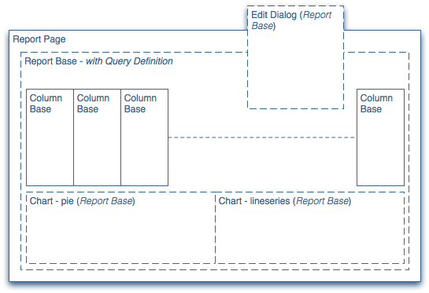

# 開發報表{#developing-reports}

AEM提供一些標準報 [表](/help/sites-administering/reporting.md) ，其中大部分是以報表架構為基礎。

使用架構，您可以延伸這些標準報表，或開發您自己的全新報表。 報告架構與現有的CQ5概念和原則緊密整合，讓開發人員可以將其現有的CQ5知識當做開發報告的跳板。

對於隨AEM傳送的標準報表：

* 這些報告建立在報告框架上：

   * [元件報表](/help/sites-administering/reporting.md#component-report)
   * [頁面活動報表](/help/sites-administering/reporting.md#page-activity-report)
   * [使用者報表](/help/sites-administering/reporting.md#user-report)
   * [工作流程例項報表](/help/sites-administering/reporting.md#workflow-instance-report)

* 下列報告以個別原則為基礎，因此無法延伸：

   * [磁碟使用情況](/help/sites-administering/reporting.md#disk-usage)
   * [運行狀況檢查](/help/sites-administering/reporting.md#health-check)
   * [工作流程報表](/help/sites-administering/reporting.md#workflow-report)

>[!NOTE]
>
>教學課 [程「建立您自己的報表——範例](#creating-your-own-report-an-example) 」也會顯示下列可使用的原則數目。
>
>您也可以參考標準報表，以檢視其他實作範例。

>[!NOTE]
>
>在下列範例和定義中，會使用下列符號：
>
>* 每行定義一個節點或一個屬性，其中：
   >
   >  
* `N:<name> [<nodeType>]`
   >
   >     
   說明名稱為和節點類 `<*name*>` 型為的節點 `<*nodeType*>`*。*
   >
   >  
* `P:<name> [<propertyType]`
   >
   >     
   說明名稱為和屬 `<*name*>` 性類型的屬性 `<*propertyType*>`。
   >
   >  
* `P:<name> = <value>`
   >
   >     
   說明必 `<name>` 須設為的值的屬性 `<value>`。
   >
   >
* 縮排顯示節點之間的層次相關性。
>* 以|表示可能的項目清單；例如，類型或名稱：
>
>  
例如 `String|String[]` ，表示屬性可以是字串或字串[]。
>
>* `[]` 描述了陣列；例如[] String或查詢定義中的節 [點陣列](#query-definition)。
>
>
除非另有說明，否則預設類型為：
>
>* 節點- `nt:unstructured`
>* 屬性 - `String`


## 報告框架 {#reporting-framework}

報告框架遵循下列原則：

* 它完全以CQ5 queryBuilder執行的查詢所傳回的結果集為基礎。
* 結果集定義了報告中顯示的資料。 結果集中的每一行都對應於報表的表格視圖中的一行。
* 可在結果集上執行的操作類似於RDBMS概念；主要 *是分組**和聚合*。

* 大部分的資料擷取和處理都是在伺服器端完成。
* 用戶端負責顯示預先處理的資料。 客戶端僅執行次要處理任務（例如，在單元格內容中建立連結）。

報告框架（由標準報告的結構說明）使用下列由處理佇列饋送的構成區塊：



### 報表頁面 {#report-page}

報表頁面：

* 是標準CQ5頁面。
* 以為報表設 [定的標準CQ5範本為基礎](#report-template)。

### 報表庫 {#report-base}

該 [ 組 `reportbase`](#report-base-component) 件構成任何報表的基礎：

* 保留傳遞基 [礎資料](#the-query-and-data-retrieval) 結果集的查詢的定義。

* 是已調整的段落系統，將包含新增至報 `columnbase`表的所有欄()。
* 定義哪些圖表類型可用以及哪些當前活動。
* 定義「編輯」對話方塊，可讓使用者設定報表的某些方面。

### 欄基 {#column-base}

每一列都是元件的 [ 實 `columnbase` 例](#column-base-component) :

* 是段落，由各報表的 `reportbase`參數()使用。
* 定義到基礎結果集 [的連結](#the-query-and-data-retrieval);例如，定義此結果集中引用的特定資料，以及其處理方式。
* 持有其他定義；例如可用的匯整和篩選，以及任何預設值。

### 查詢與資料檢索 {#the-query-and-data-retrieval}

查詢：

* 定義為元件的一 [`reportbase`](#report-base) 部分。
* 以 [CQ QueryBuilder為基礎](https://helpx.adobe.com/experience-manager/6-5/sites/developing/using/reference-materials/javadoc/com/day/cq/search/QueryBuilder.html)。
* 擷取用作報表基礎的資料。 結果集（表）的每一行都與查詢返回的節點相關聯。 然後，從此 [資料集中](#column-base-component) ，提取各列的特定資訊。

* 通常包括：

   * 根路徑。

      這指定要搜索的儲存庫的子樹。

      為幫助最大限度地降低效能影響，建議（嘗試）將查詢限制在儲存庫的特定子樹中。 根路徑可在報表範本中預先定 [義](#report-template) ，或由使用者在「設定(編 [輯)」對話方塊中設定](#configuration-dialog)。

   * [一個或多個條件](#query-definition)。

      這些是為了生成（初始）結果集；例如，節點類型或屬性約束的限制。

**這裡的關鍵點是，查詢結果集中返回的每個單一節點都用來在報表上產生單一行（因此是1:1關係）。**

開發人員必須確保為報表定義的查詢會傳回適合該報表的節點集。 但是，節點本身不需要保存所有必需的資訊，這也可以從父節點和／或子節點派生。 例如，用於「用戶報告」的 [查詢](/help/sites-administering/reporting.md#user-report) ，會根據節點類型(在本例中 `rep:user`)選擇節點。 但是，此報告中的大多數列不會直接從這些節點獲取其資料，而是從子節點獲取資料 `profile`。

### 處理佇列 {#processing-queue}

查 [詢傳回](#the-query-and-data-retrieval) ，要顯示為報表列的資料結果集。 在將結果集中的每一行（伺服器端）轉移至用戶端 [以顯示在報表上](#phases-of-the-processing-queue)，會分數個階段進行處理。

這允許：

* 從基礎結果集中提取和導出值。

   例如，它可讓您計算兩個屬性值之間的差異，將兩個屬性值當成單一值處理。

* 解析提取的值；這可以通過多種方式實現。

   例如，路徑可以映射至標題(如各自 *jcr:title屬性中較人工可讀的內容* )。

* 在不同點套用濾鏡。
* 視需要建立複合值。

   例如，由顯示給使用者的文字、用於排序的值和用於（在用戶端）建立連結的額外URL組成。

#### 處理佇列的工作流程 {#workflow-of-the-processing-queue}

下列工作流程代表處理佇列：


#### 處理佇列的階段 {#phases-of-the-processing-queue}

其中包括詳細步驟和元素：

1. 使用值擷取器，將初 [始查詢(reportbase)傳回的結果](#query-definition) ，轉換為基本結果集。

   值提取器會根據欄類型自 [動選擇](#column-specific-definitions)。 它們用於從基礎JCR查詢中讀取值並從中建立結果集；之後，可以進一步處理。 例如，對於類型， `diff` 值提取器讀取兩個屬性，計算隨後添加到結果集中的單個值。 無法配置值提取器。

1. 對於包含原始資料的初始結果集， [會套用初始篩選](#column-specific-definitions) (*原始階段* )。

1. 值會預先 [處理](#processing-queue);定義為應用 *階段* 。

1. [篩選](#column-specific-definitions) (指派給預 *處理階段* )會對預處理值執行。

1. 值已解析；根據定義的 [解析器](#processing-queue)。
1. [篩選](#column-specific-definitions) (指派給解 *析階段* )會對解析值執行。

1. 資料會分 [組和匯總](#column-specific-definitions)。
1. 陣列資料可轉換為（以字串為基礎的）清單來解決。

   這是一個隱含步驟，可將多值結果轉換為可顯示的清單；根據多值JCR屬性的儲存格值需要（未匯總）此值。

1. 值會再次預先 [處理](#processing-queue);定義為afterApply *階段* 。

1. 資料會排序。
1. 處理的資料被傳輸到客戶端。

>[!NOTE]
>
>在元件上定義返回基本資料結果集的初始查 `reportbase` 詢。
>
>處理佇列的其他元素是在元件上定義 `columnbase` 的。

## 報告建構與設定 {#report-construction-and-configuration}

建立和設定報表時需要下列項目：

* 報 [表元件定義的位置](#location-of-report-components)
* 組 [`reportbase` 件](#report-base-component)
* 一個或多個 [ 元 `columnbase` 件](#column-base-component)
* 頁面 [元件](#page-component)
* 報 [告設計](#report-design)
* 報告 [模板](#report-template)

### 報表元件的位置 {#location-of-report-components}

預設報告元件保留在下 `/libs/cq/reporting/components`。

不過，強烈建議您不要更新這些節點，而是在或更適當的情況下建立自己 `/apps/cq/reporting/components` 的元件節點 `/apps/<yourProject>/reports/components`。

其中（例如）:

```
N:apps
    N:cq [nt:folder]
        N:reporting|reports [sling:Folder]
            N:components [sling:Folder]
```

在此下，您為報表建立根，在此下，報表基礎元件和列基礎元件：

```
N:apps
    N:cq [nt:folder]
        N:reporting|reports [sling:Folder]
            N:components [sling:Folder]
                N:<reportname> [sling:Folder]
                        N:<reportname> [cq:Component]  // report base component
                        N:<columnname> [cq:Component]  // column base component
```

### 頁面元件 {#page-component}

報表頁面必須使用 `sling:resourceType` 的 `/libs/cq/reporting/components/reportpage`。

自訂的頁面元件不應是必要的（在大多數情況下）。

## 報表基礎元件 {#report-base-component}

每個報表類型都需要衍生自的容器元件 `/libs/cq/reporting/components/reportbase`。

此元件可做為整個報表的容器，並提供下列資訊：

* 查 [詢定義](#query-definition)。
* 用 [於設定報表的](#configuration-dialog) （選用）對話方塊。
* 任何 [整合在報](#chart-definitions) 表中的圖表。

```
N:<reportname> [cq:Component]
    P:sling:resourceSuperType = "cq/reporting/components/reportbase"
    N:charting
    N:dialog [cq:Dialog]
    N:queryBuilder
```

### 查詢定義 {#query-definition}

```xml
N:queryBuilder
    N:propertyConstraints
    [
        N:<name> // array of nodes (name irrelevant), each with the following properties:
            P:name
            P:value
    ]
    P:nodeTypes [String|String[]]
    P:mandatoryProperties [String|String[]
  ]
```

* `propertyConstraints`

   可用於將結果集限制為具有特定值的特定屬性的節點。 如果指定了多個約束，則節點必須滿足所有約束（AND操作）。

   例如：

   ```
   N:propertyConstraints
    [
    N:0
    P:sling:resourceType
    P:foundation/components/textimage
    N:1
    P:jcr:modifiedBy
    P:admin
    ]
   ```

   會傳回使 `textimage` 用者上次修改的所有元 `admin` 件。

* `nodeTypes`

   用於將結果集限制為指定的節點類型。 可以指定多個節點類型。

* `mandatoryProperties`

   可用於將結果集限制為具有所有指定屬 *性* 的節點。 屬性的值未被考慮在內。

所有項目皆為選用項目，並可視需要加以組合，但您必須至少定義其中一項。

### 圖表定義 {#chart-definitions}

```xml
N:charting
    N:settings
        N:active [cq:WidgetCollection]
        [
            N:<name> // array of nodes, each with the following property
                P:id   // must match the id of a child node of definitions
        ]
    N:definitions [cq:WidgetCollection]
    [
        N:<name> // array of nodes, each with the following properties
            P:id
            P:type
            // additional, chart type specific configurations
    ]
```

* `settings`

   保存活動圖表的定義。

   * `active`

      由於可以定義多個設定，因此您可以使用它來定義哪些設定目前有效。 這些節點由一系列節點定義(這些節點沒有強制命名約定，但標準報告通常使用 `0`, `1`... `x`)，每個都具有以下屬性：

      * `id`

         活動圖表的識別。 這必須符合其中一個圖表的ID `definitions`。

* `definitions`

   定義報表可能可用的圖表類型。 要 `definitions` 使用的將由設定指 `active` 定。

   定義是使用節點陣列指定的(通常也稱為 `0`, `1`... `x`)，每個屬性具有下列屬性：

   * `id`

      圖表標識。

   * `type`

      可用的圖表類型。 從中選擇：

      * `pie`
圓形圖。 僅從目前資料產生。

      * `lineseries`
系列線（代表實際快照的連接點）。 僅從歷史資料產生。
   * 其他屬性可用，視圖表類型而定：

      * 對於圖表類型 `pie`:

         * `maxRadius` ( `Double/Long`)

            圓形圖允許的最大半徑；因此圖表允許的最大大小（無圖例）。 如果已定義， `fixedRadius` 則忽略。

         * `minRadius` ( `Double/Long`)

            圓形圖允許的最小半徑。 如果已定義， `fixedRadius` 則忽略。

         * `fixedRadius` ( `Double/Long`)定義圓形圖的固定半徑。
      * 對於圖表類型 [`lineseries`](/help/sites-administering/reporting.md#display-limits):

         * `totals` ( `Boolean`)

            如果應該顯示另一行顯示 **Total** ，則返回true。
預設: `false`

         * `series` ( `Long`)

            要顯示的行／系列數。
預設值： `9` （這也是允許的最大值）

         * `hoverLimit` ( `Long`)

            聚合快照的最大數量（每行水準線上顯示的點，代表不同值），即當用戶將滑鼠移過圖表圖例中的不同值或相應標籤時，將顯示彈出窗口。

            預設值： `35` （亦即，如果超過35個不同值適用於目前圖表設定，則完全不會顯示彈出式視窗）。

            另外有10個快顯視窗的限制，可以並行顯示（當將滑鼠移至圖例文字上時，可顯示多個快顯視窗）。


### 配置對話框 {#configuration-dialog}

每個報表都可以有一個設定對話方塊，讓使用者可指定報表的各種參數。 當報表頁面開啟時，可 **透過「編輯** 」按鈕存取此對話方塊。

此對話方塊是標準的CQ [對話方](/help/sites-developing/components-basics.md#dialogs) 塊，可依此方式設定(如需詳細資訊，請 [參閱CQ.Dialog](https://helpx.adobe.com/experience-manager/6-5/sites/developing/using/reference-materials/widgets-api/index.html?class=CQ.Dialog) )。

範例對話方塊的外觀如下：

```xml
<?xml version="1.0" encoding="UTF-8"?>
<jcr:root xmlns:cq="https://www.day.com/jcr/cq/1.0" xmlns:jcr="https://www.jcp.org/jcr/1.0"
    jcr:primaryType="cq:Dialog"
    height="{Long}424">
    <items jcr:primaryType="cq:WidgetCollection">
        <props jcr:primaryType="cq:Panel">
            <items jcr:primaryType="cq:WidgetCollection">
                <title
                    jcr:primaryType="cq:Widget"
                    path="/libs/cq/reporting/components/commons/title.infinity.json"
                    xtype="cqinclude"/>
                <description
                    jcr:primaryType="cq:Widget"
                    path="/libs/cq/reporting/components/commons/description.infinity.json"
                    xtype="cqinclude"/>
                <rootPath
                    jcr:primaryType="cq:Widget"
                    fieldLabel="Root path"
                    name="./report/rootPath"
                    rootPath=""
                    rootTitle="Repository root"
                    xtype="pathfield"/>
                <processing
                    jcr:primaryType="cq:Widget"
                    path="/libs/cq/reporting/components/commons/processing.infinity.json"
                    xtype="cqinclude"/>
                <scheduling
                    jcr:primaryType="cq:Widget"
                    path="/libs/cq/reporting/components/commons/scheduling.infinity.json"
                    xtype="cqinclude"/>
            </items>
        </props>
    </items>
</jcr:root>
```

提供了一些預配置的元件；可在對話方塊中參考這些值，使 `xtype` 用屬性值為 `cqinclude`:

* **`title`**

   `/libs/cq/reporting/components/commons/title`

   文字欄位以定義報表標題。

* **`description`**

   `/libs/cq/reporting/components/commons/description`

   文字區域，以定義報表說明。

* **`processing`**

   `/libs/cq/reporting/components/commons/processing`

   報表處理模式的選擇器（手動／自動載入資料）。

* **`scheduling`**

   `/libs/cq/reporting/components/commons/scheduling`

   用於調度歷史圖表快照的選擇器。

>[!NOTE]
>
>引用的元件必須使用尾碼 `.infinity.json` 包含（請參見上例）。

### 根路徑 {#root-path}

此外，還可為報表定義根路徑：

* **`rootPath`**

   這會將報告限制為儲存庫的某個部分（樹或子樹），建議使用該部分進行效能優化。 根路徑由每個報告頁 `rootPath` 面的節 `report` 點屬性指定（在建立頁面時取自範本）。

   它可由：

   * 報 [告模板](#report-template) （作為固定值或作為配置對話框的預設值）。
   * 使用者（使用此參數）

## 列基元件 {#column-base-component}

每個列類型都需要從中派生的元件 `/libs/cq/reporting/components/columnbase`。

列元件定義以下組合：

* 列特 [定查詢配置](#column-specific-query) 。
* 解析 [器和預處理](#resolvers-and-preprocessing)。
* 欄特 [定定義](#column-specific-definitions) (例如篩選器和匯總；子 `definitions` 節點)。
* [欄預設值](#column-default-values)。
* 用 [戶端篩選](#client-filter) ，從伺服器傳回的資料中擷取要顯示的資訊。
* 此外，列元件必須提供適合的實例 `cq:editConfig`。 定義必 [要事件和動作](#events-and-actions) 。
* 一般欄的 [設定](#generic-columns)。

```
N:<columnname> [cq:Component]
    P:componentGroup
    P:jcr:title
    P:sling:resourceSuperType = "cq/reporting/components/columnbase"
    N:cq:editConfig [cq:EditConfig] // <a href="#events-and-actions">Events and Actions</a>
    N:defaults // <a href="#column-default-values">Column Default Values</a>
    N:definitions
      N:queryBuilder // <a href="#column-specific-query">Column Specific Query</a>
        P:property [String|String[]] // Column Specific Query
        P:subPath // Column Specific Query
        P:secondaryProperty [String|String[]] // Column Specific Query
        P:secondarySubPath // Column Specific Query
      N:data
        P:clientFilter [String] // <a href="#client-filter">Client Filter</a>
        P:resolver // <a href="#resolvers-and-preprocessing">Resolvers and Preprocessing</a>
        N:resolverConfig // Resolvers and Preprocessing
        N:preprocessing // Resolvers and Preprocessing
      P:type // <a href="#column-specific-definitions">Column Specific Definitions</a>
      P:groupable [Boolean] // Column Specific Definitions
      N:filters [cq:WidgetCollection] // Column Specific Definitions
      N:aggregates [cq:WidgetCollection] // Column Specific Definitions
```

另請參閱 [定義新報表](#defining-your-new-report)。

### 列特定查詢 {#column-specific-query}

這定義了在個別欄中使用的特定 [資料擷取(從報表資料結果集](#the-query-and-data-retrieval))。

```xml
N:definitions
    N:queryBuilder
        P:property [String|String[]]
        P:subPath
        P:secondaryProperty [String|String[]]
        P:secondarySubPath
```

* `property`

   定義用於計算實際單元格值的屬性。

   如果屬性定義為String[] ，則會掃描（依序）多個屬性，以尋找實際值。

   例如，在下列情況下：

   `property = [ "jcr:lastModified", "jcr:created" ]`

   相應的值提取器（此處控制）將：

   * 檢查是否有jcr:lastModified屬性可用，如果有，請使用它。
   * 如果沒有jcr:lastModified屬性，則會改用jcr:created的內容。

* `subPath`

   如果結果不位於查詢返回的節點上，則定 `subPath` 義屬性的實際位置。

* `secondaryProperty`

   定義另一個屬性，該屬性也必須用於計算實際儲存格值；這將僅用於某些列類型（diff和sortable）。

   例如，在「工作流程例項報表」中，指定的屬性可用來儲存開始和結束時間之間時間差異的實際值（以毫秒為單位）。

* `secondarySubPath`

   與subPath類似， `secondaryProperty` 使用時。

在大多數情況下， `property` 只會使用。

### 用戶端篩選 {#client-filter}

客戶端過濾器從伺服器返回的資料中提取要顯示的資訊。

>[!NOTE]
>
>在套用整個伺服器端處理後，此篩選器會在clientside執行。

```xml
N:definitions
    N:data
        P:clientFilter [String]
```

`clientFilter` 定義為JavaScript函式，可：

* 作為輸入，接收一個參數；從伺服器傳回的資料（如此完全預先處理）
* 輸出時，傳回篩選（處理）的值；從輸入資訊中提取或導出的資料

下列範例會從元件路徑擷取對應的頁面路徑：

```
function(v) {
    var sepPos = v.lastIndexOf('/jcr:content');
    if (sepPos < 0) {
        return v;
    }
    return v.substring(sepPos + '/jcr:content'.length, v.length);
}
```

### 解析器與預處理 {#resolvers-and-preprocessing}

處 [理隊列定義](#processing-queue) 各種解析器並配置預處理：

```xml
N:definitions
    N:data
        P:resolver
        N:resolverConfig
        N:preprocessing
            N:apply
            N:applyAfter
```

* `resolver`

   定義要使用的解析器。 可使用下列解析器：

   * `const`

      將值映射至其他值；例如，此函式用於解析常數，例如 `en` 其等效值 `English`。

   * `default`

      預設解析器。 這是一個虛擬解析器，它實際上無法解決任何問題。

   * `page`

      解析路徑值至適當頁面的路徑；更精確地到對應的節 `jcr:content` 點。 例如， `/content/.../page/jcr:content/par/xyz` 已解析為 `/content/.../page/jcr:content`。

   * `path`

      通過可選地附加子路徑並從解析路徑上的節點屬性（由定義）中獲取實際值來解析路 `resolverConfig`徑值。 例如，有 `path` 一 `/content/.../page/jcr:content``jcr:title` 個可解析為屬性的內容，這表示頁面路徑已解析為頁面標題。

   * `pathextension`

      通過預先定義路徑並從已解析路徑上的節點屬性中獲取實際值來解析值。 例如，值可 `de` 能會以路徑為前置詞， `/libs/wcm/core/resources/languages`例如從屬性取值 `language`，將國家代碼解析為語 `de` 言說明 `German`。

* `resolverConfig`

   提供解析程式的定義；可用的選項取決於選 `resolver` 定：

   * `const`

      使用屬性指定要解析的常數。 屬性的名稱定義要解析的常數；屬性的值定義已解析的值。

      例如，具有 **Name**=和 `1` Value的屬 **性將**`=One` 解析為1到1。

   * `default`

      沒有可用的配置。

   * `page`

      * `propertyName` (可選)

         定義應用於解析值的屬性名稱。 若未指定，則會使用 *jcr:title* （頁面標題）的預設值；對於解 `page` 析程式，這表示先將路徑解析為頁面路徑，再進一步解析為頁面標題。
   * `path`

      * `propertyName` (可選)

         指定應用於解析值的屬性的名稱。 如果未指定，則使用缺 `jcr:title` 省值。

      * `subPath` (可選)

         此屬性可用於指定在值解析之前附加到路徑的尾碼。
   * `pathextension`

      * `path` （強制）

         定義要前置的路徑。

      * `propertyName` （強制）

         定義實際值所在的已解析路徑上的屬性。

      * `i18n` （可選）類型布爾值)

         判斷已解析的值是否應 *國際化* (即使用 [CQ5的國際化服務](/help/sites-administering/tc-manage.md))。


* `preprocessing`

   預處理是選擇性的，可以（個別）系結至處理階段套用 *或套* 用 *After*:

   * `apply`

      初始預處理階段([處理佇清單示中的步驟3](#processing-queue))。

   * `applyAfter`

      在預處理後套[用(處理佇列的表示步驟9](#processing-queue))。

#### 解析器 {#resolvers}

解析器用於提取所需資訊。 各種解析器的範例包括：

**康斯特**

以下將解析字串 `VersionCreated` 的contant值 `New version created`。

請參閱 `/libs/cq/reporting/components/auditreport/typecol/definitions/data`。

```xml
N:data
    P:resolver=const
    N:resolverConfig
        P:VersionCreated="New version created"
```

**頁面**

解析對應頁面jcr:content(child)節點上jcr:description屬性的路徑值。

請參閱 `/libs/cq/reporting/components/compreport/pagecol/definitions/data`。

```xml
N:data
    P:resolver=page
    N:resolverConfig
        P:propertyName="jcr:description"
```

**路徑**

下列程式碼會解析屬 `/content/.../page` 性內容的路徑， `jcr:title` 這表示頁面路徑已解析為頁面標題。

請參閱 `/libs/cq/reporting/components/auditreport/pagecol/definitions/data`。

```xml
N:data
    P:resolver=path
    N:resolverConfig
        P:propertyName="jcr:title"
        P:subPath="/jcr:content"
```

**路徑延伸功能**

下列項目會以路徑 `de` 副檔名為前置值 `/libs/wcm/core/resources/languages`，然後從屬性取值 `language`，將國家代碼解析為語 `de` 言說明 `German`。

請參閱 `/libs/cq/reporting/components/userreport/languagecol/definitions/data`。

```xml
N:data
    P:resolver=pathextension
    N:resolverConfig
        P:path="/libs/wcm/core/resources/languages"
        P:propertyName="language"
```

#### 預處理 {#preprocessing}

定 `preprocessing` 義可套用至：

* 原始值：

   原始值的預處理定義直接指 `apply` 定於和/ `applyAfter` 或。

* 值：

   如有必要，可為每個聚合提供單獨的定義。

   為了指定聚合值的顯式預處理，預處理定義必須駐留在相應的子 `aggregated` 節點( `apply/aggregated`, `applyAfter/aggregated`)上。 如果需要對不同聚合進行明確的預處理，則預處理定義位於具有相應聚合（例如或其它聚合）名稱的子 `apply/aggregated/min/max` 節點上。

您可以指定下列任一項，以在預處理期間使用：

* [查找和替換模](#preprocessing-find-and-replace-patterns)式找到時，指定的模式（定義為規則運算式）被另一個模式替換；例如，這可用來擷取原稿的子字串。

* [資料類型格式化程式](#preprocessing-data-type-formatters)

   將數值轉換為相對字串；例如，表示1小時時差的值&#39;&#39;將被解析為字串，例如 `1:24PM (1 hour ago)`。

例如：

```xml
N:definitions
    N:data
        N:preprocessing
            N:apply|applyAfter
                P:pattern         // regex
                P:replace         // replacement for regex
                // and/or
                P:format          // data type formatter
```

#### 預處理——尋找和取代圖樣 {#preprocessing-find-and-replace-patterns}

對於預處理，您可以指 `pattern` 定(定義為規則運 [算式](https://en.wikipedia.org/wiki/Regular_expression) 或regex)，該運算式會被模式取 `replace` 代：

* `pattern`

   用於定位子字串的規則運算式。

* `replace`

   字串或字串的表示法，將用作原始字串的替換。 這通常表示規則運算式所定位之字串的子字串 `pattern`。

範例取代可劃分為：

* 對於具有以 `definitions/data/preprocessing/apply` 下兩個屬性的節點：

   * `pattern`: `(.*)(/jcr:content)(/|$)(.*)`
   * `replace`: `$1`

* 字串的形式為：

   * `/content/geometrixx/en/services/jcr:content/par/text`

* 將分為四個部分：

   * `$1` - `(.*)` - `/content/geometrixx/en/services`
   * `$2` - `(/jcr:content)` - `/jcr:content`
   * `$3` - `(/|$)` - `/`
   * `$4` - `(.*)` - `par/text`

* 並取代為以下字串 `$1`:

   * `/content/geometrixx/en/services`

#### 預處理——資料類型格式化程式 {#preprocessing-data-type-formatters}

這些格式化程式會將數值轉換為相對字串。

例如，這可用於允許和聚合的 `min`時 `avg` 間 `max` 列。 As `min`/ `avg`/ `max` aggregates會顯示為時 *間差* (例如 `10 days ago`)，它們需要資料格式化器。 為此，將 `datedelta` 對/ `min`/ `avg`/聚合值應 `max` 用格式化程式。 如果集 `count` 合也可用，則不需要格式化程式，原始值也不需要。

目前可用的資料類型格式化程式包括：

* `format`

   資料類型格式化程式：

   * `duration`

      持續時間是兩個定義日期之間的時間範圍。 例如，工作流程動作的開始和結束需要1小時，從2/13/11 11:23開始，一小時後於2/13/11 12:23結束。

      它將數值（解譯為毫秒）轉換為持續時間字串；例如， `30000` 格式為* `30s`.*

   * `datedelta`

      Datadelta是過去某個日期到「現在」的時間跨度（因此，如果稍後在某個時間點檢視報表，則會產生不同的結果）。

      它會將數值（解譯為以天為單位的時差）轉換為相對日期字串。 例如，1的格式為1天前。

以下示例定義 `datedelta` 和聚合的 `min` 格式 `max` 設定：

```xml
N:definitions
    N:data
        N:preprocessing
            N:apply
                N:aggregated
                    N:min
                        P:format = "datedelta"
                    N:max
                        P:format = "datedelta"
```

### 欄特定定義 {#column-specific-definitions}

欄的特定定義定義了該欄的可用篩選器和匯總。

```xml
N:definitions
    P:type
    P:groupable [Boolean]
    N:filters [cq:WidgetCollection]
    [
        N:<name> // array of nodes (names irrelevant) with the following properties:
            P:filterType
            P:id
            P:phase
    ]
    N:aggregates [cq:WidgetCollection]
    [
        N:<name> // array of nodes (names irrelevant) with the following properties:
            P:text
            P:type
    ]
```

* `type`

   以下是標準選項：

   * `string`
   * `number`
   * `int`
   * `date`
   * `diff`
   * `timeslot`

      用於提取匯總所需日期的部分（例如，按年分組以獲取每年匯總的資料）。

   * `sortable`

      用於使用不同值（取自不同屬性）的值進行排序和顯示。
   此外， 以上任一項皆可定義為多值；例如，定 `string[]` 義字串陣列。

   值提取器由列類型選擇。 如果某個值提取器可用於列類型，則使用此提取器。 否則，將使用預設值提取器。

   類型可以（可選）採用參數。 例如，從 `timeslot:year` 日期欄位擷取年份。 類型及其參數：

   * `timeslot` -這些值與的相應常數比較 `java.utils.Calendar`。

      * `timeslot:year` - `Calendar.YEAR`
      * `timeslot:month-of-year` - `Calendar.MONTH`
      * `timeslot:week-of-year` - `Calendar.WEEK_OF_YEAR`
      * `timeslot:day-of-month` - `Calendar.DAY_OF_MONTH`
      * `timeslot:day-of-week` - `Calendar.DAY_OF_WEEK`
      * `timeslot:day-of-year` - `Calendar.DAY_OF_YEAR`
      * `timeslot:hour-of-day` - `Calendar.HOUR_OF_DAY`
      * `timeslot:minute-of-hour` - `Calendar.MINUTE`


* `groupable`

   定義報表是否可依此欄分組。

* `filters`

   篩選定義。

   * `filterType`

      可用的篩選條件包括：

      * `string`

         字串型篩選。
   * `id`

      篩選識別碼。

   * `phase`

      可用階段：

      * `raw`

         篩選器會套用至原始資料。

      * `preprocessed`

         篩選器會套用至預先處理的資料。

      * `resolved`

         篩選會套用至已解析的資料。


* `aggregates`

   匯整定義。

   * `text`

      集合的文本名稱。 如果 `text` 未指定，則將採用聚合的預設描述；例如， `minimum` 將用於聚合 `min` 。

   * `type`

      匯整類型。 可用的聚合包括：

      * `count`

         計算行數。

      * `count-nonempty`

         計算非空行數。

      * `min`

         提供最小值。

      * `max`

         提供最大值。

      * `average`

         提供平均值。

      * `sum`

         提供所有值的總和。

      * `median`

         提供中值。

      * `percentile95`

         取所有值的第95個百分位數。

### 列預設值 {#column-default-values}

這用於定義列的預設值：

```xml
N:defaults
    P:aggregate
```

* `aggregate`

   有 `aggregate` 效值與下方的值相同 `type` (請 `aggregates` 參閱列特 [定定義（定義——篩選器／聚合）](#column-specific-definitions) )。

### 事件與動作 {#events-and-actions}

「編輯配置」定義監聽程式所要檢測的必要事件以及這些事件發生後要應用的操作。 如需背景 [資訊，請參閱元件開發](/help/sites-developing/components.md) 簡介。

必須定義下列值，以確保滿足所有必要操作：

```xml
N:cq:editConfig [cq:EditConfig]
    P:cq:actions [String[]] = "insert", "delete"
    P:cq:dialogMode = "floating"
    P:cq:layout = "auto"
    N:cq:listeners [cq:EditListenersConfig]
        P:aftercreate = "REFRESH_INSERTED"
        P:afterdelete = "REFRESH_SELF"
        P:afteredit = "REFRESH_SELF"
        P:afterinsert = "REFRESH_INSERTED"
        P:aftermove = "REFRESH_SELF"
        P:afterremove = "REFRESH_SELF"
```

### 一般欄 {#generic-columns}

通用列是副檔名，其中（大部分）列定義儲存在列節點的實例（而非元件節點）上。

它們使用（標準）對話框，供您定制，用於單個通用元件。 此對話框允許報告用戶定義報告頁上一般列的列屬性(使用菜單選項「列 **屬性……**」)。

例如，「使 **用者** 」報表的「 **一般」欄**;請參閱 `/libs/cq/reporting/components/userreport/genericcol`。

要使列為通用列，請執行以下操作：

* 將列 `type` 節點的屬性設 `definition` 置為 `generic`。

   請參閱 `/libs/cq/reporting/components/userreport/genericcol/definitions`

* 在列節點下指定（標準）對話框定 `definition` 義。

   請參閱 `/libs/cq/reporting/components/userreport/genericcol/definitions/dialog`

   * 對話框的欄位必須引用與相應元件屬性（包括其路徑）相同的名稱。

      例如，如果要使通用對話框可配置通用列的類型，請使用名稱為的欄位 `./definitions/type`。

   * 使用UI/對話框定義的屬性優先於元件上定義的 `columnbase` 屬性。

* 定義編輯配置。

   請參閱 `/libs/cq/reporting/components/userreport/genericcol/cq:editConfig`

* 使用標準AEM方法來定義（其他）欄屬性。

   請注意，對於在元件實例和列實例上定義的屬性，列實例上的值優先。

   通用列的可用屬性包括：

   * `jcr:title` -列名
   * `definitions/aggregates` - aggregates
   * `definitions/filters` -篩選器
   * `definitions/type`-列的類型（必須在對話框中定義，使用選擇器／組合框或隱藏欄位）
   * `definitions/data/resolver` 和 `definitions/data/resolverConfig` (但不 `definitions/data/preprocessing` 是 `.../clientFilter`)-解析器和配置
   * `definitions/queryBuilder` -查詢產生器設定
   * `defaults/aggregate` -預設聚合
   在「用戶報告」( **User Report)上的通用列的新實例中** ，使用對話框定義的屬性將保存在以下位置：

   `/etc/reports/userreport/jcr:content/report/columns/genericcol/settings/generic`

## 報表設計 {#report-design}

設計定義了哪些列類型可用於建立報告。 它還定義了添加列的段落系統。

強烈建議您為每個報表建立個別設計。 如此可確保完全的彈性。 另請參閱 [定義新報表](#defining-your-new-report)。

預設報告元件保留在下 `/etc/designs/reports`。

報表的位置可視您的元件所在位置而定：

* `/etc/designs/reports/<yourReport>` 如果報表位於 `/apps/cq/reporting`

* `/etc/designs/<yourProject>/reports/<*yourReport*>` 用於使用模式的報 `/apps/<yourProject>/reports` 表

必要的設計屬性會在 `jcr:content/reportpage/report/columns` 上註冊(例如 `/etc/designs/reports/<reportName>/jcr:content/reportpage/report/columns`):

* `components`

   報表上允許的任何元件和／或元件群組。

* `sling:resourceType`

   具有值的屬 `cq/reporting/components/repparsys`性。

範例設計程式碼片段（取自元件報表的設計）為：

```xml
<!-- ... -->
    <jcr:content
        jcr:primaryType="nt:unstructured"
        jcr:title="Component Report"
        sling:resourceType="wcm/core/components/designer">
        <reportpage jcr:primaryType="nt:unstructured">
            <report jcr:primaryType="nt:unstructured">
                <columns
                    jcr:primaryType="nt:unstructured"
                    sling:resourceType="cq/reporting/components/repparsys"
                    components="group:Component Report"/>
            </report>
        </reportpage>
    </jcr:content>
<!-- ... -->
```

不需要指定個別欄的設計。 可在設計模式中定義可用的欄。

>[!NOTE]
>
>建議您不要對標準報表設計進行任何變更。 這是為了確保您不會在升級或安裝修補程式時遺失任何變更。
>
>如果您要自訂標準報表，請複製報表及其設計。

>[!NOTE]
>
>建立報表時，可自動建立預設欄。 這些在範本中指定。

## 報表範本 {#report-template}

每個報表類型都必須提供範本。 這些是標 [準的CQ範本](/help/sites-developing/templates.md) ，可依此設定。

範本必須：

* 將 `sling:resourceType` 設為 `cq/reporting/components/reportpage`

* 指出要使用的設計
* 通過 `report` 屬性建立引用容器( `reportbase`)元件的子節點 `sling:resourceType`

範例範本程式碼片段（取自元件報表範本）為：

```xml
<!-- ... -->
    <jcr:content
        cq:designPath="/etc/designs/reports/compreport"
        jcr:primaryType="cq:PageContent"
        sling:resourceType="cq/reporting/components/reportpage">
        <report
            jcr:primaryType="nt:unstructured"
            sling:resourceType="cq/reporting/components/compreport/compreport"/>
    </jcr:content>
<!-- .. -->
```

範例範本程式碼片段(顯示根路徑的定義（取自使用者報表範本）)為：

```xml
<!-- ... -->
    <jcr:content
        cq:designPath="/etc/designs/reports/userreport"
        jcr:primaryType="cq:PageContent"
        sling:resourceType="cq/reporting/components/reportpage">
        <report
            jcr:primaryType="nt:unstructured"
            rootPath="/home/users"
            sling:resourceType="cq/reporting/components/compreport/compreport"/>
    </jcr:content>
<!-- .. -->
```

預設報表範本會保留在下方 `/libs/cq/reporting/templates`。

不過，強烈建議您不要更新這些節點，而是在或更適當的情況下建立自己 `/apps/cq/reporting/templates` 的元件節點 `/apps/<yourProject>/reports/templates`。

其中，例如(另請參閱報 [表元件位置](#location-of-report-components)):

```xml
N:apps
    N:cq [nt:folder]
        N:reporting|reports [sling:Folder]
            N:templates [sling:Folder]
```

在此下，您為模板建立根：

```xml
N:apps
    N:cq [nt:folder]
        N:reporting|reports [sling:Folder]
            N:templates [sling:Folder]
                N:<reportname> [sling:Folder]
```

## 建立您自己的報表——範例 {#creating-your-own-report-an-example}

### 定義新報表 {#defining-your-new-report}

若要定義新報表，您必須建立並設定：

1. 報表元件的根目錄。
1. 報告基本元件。
1. 一個或多個列基元件。
1. 報表設計。
1. 報表範本的根目錄。
1. 報表範本。

為了說明這些步驟，以下示例定義了一個報告，其中列出了儲存庫中的所有OSGi配置；即節點的所有實 `sling:OsgiConfig` 例。

>[!NOTE]
>
>複製現有報表，然後自訂新版本是另一種方法。

1. 為新報表建立根節點。

   例如，在下 `/apps/cq/reporting/components/osgireport`。

   ```xml
   N:cq [nt:folder]
       N:reporting [sling:Folder]
           N:components [sling:Folder]
               N:osgireport [sling:Folder]
   ```

1. 定義您的報表庫。 例如， `osgireport[cq:Component]` 在 `/apps/cq/reporting/components/osgireport`下。

   ```xml
   N:osgireport [sling:Folder]
       N:osgireport [cq:Component]
           P:sling:resourceSuperType [String] = "cq/reporting/components/reportbase"
           N:charting [nt:unstructured]
               N:settings [nt:unstructured]
                   N:active [cq:WidgetCollection]
                       N:0 [nt:unstructured]
                           P:id [String] = "pie"
                       N:1 [nt:unstructured]
                           P:id [String] = "lineseries"
               N:definitions [cq:WidgetCollections]
                   N:0 [nt:unstructured]
                       P:id [String] = "pie"
                       P:maxRadius [Long] = 180
                       P:type [String] = "pie"
                   N:1 [nt:unstructured]
                       P:id [String] = "lineseries"
                       P:type [String] = "lineseries"
           N:dialog [cq:Dialog]
               P:height [Long] = 424
               N:items [cq:WidgetCollection]
                   N:props [cq:Panel]
                       N:items [cq:WidgetCollection]
                           N:title [cq:Widget]
                               P:path [String] = "/libs/cq/reporting/components/commons/title.infinity.json"
                               P:xtype [String] = "cqinclude"
                           N:description [cq:Widget]
                               P:path [String] = "/libs/cq/reporting/components/commons/description.infinity.json"
                               P:xtype [String] = "cqinclude"
                           N:rootPath [cq:Widget]
                               P:fieldLabel [String] = "Root path"
                               P:name [String] = "./report/rootPath"
                               P:xtype [String] = "pathfield"
                           N:processing [cq:Widget]
                               P:path [String] = "/libs/cq/reporting/components/commons/processing.infinity.json"
                               P:xtype [String] = "cqinclude"
                           N:scheduling [cq:Widget]
                               P:path [String] = "/libs/cq/reporting/components/commons/scheduling.infinity.json"
                               P:xtype [String] = "cqinclude"
           N:queryBuilder [nt:unstructured]
               P:nodeTypes [String[]] = "sling:OsgiConfig"
   ```

   這定義了報告基本元件，它：

   * 搜索所有類型的節點 `sling:OsgiConfig`
   * 同時顯示 `pie` 和圖 `lineseries` 表
   * 提供對話方塊讓使用者設定報表

1. 定義第一列(columnbase)元件。 例如， `bundlecol[cq:Component]` 在 `/apps/cq/reporting/components/osgireport`下。

   ```xml
   N:osgireport [sling:Folder]
       N:bundlecol [cq:Component]
           P:componentGroup [String] = "OSGi Report"
           P:jcr:title = "Bundle"
           P:sling:resourceSuperType [String] = "cq/reporting/components/columnbase"
           N:cq:editConfig [cq:EditConfig]
               P:cq:actions [String[]] = "insert", "delete"
               P:cq:dialogMode [String] = "floating"
               P:cq:layout [String] = "auto"
               N:cq:listeners [cq:EditListenersConfig]
                   P:aftercreate [String] "REFRESH_INSERTED"
                   P:afterdelete [String] "REFRESH_SELF"
                   P:afteredit [String] "REFRESH_SELF"
                   P:afterinsert [String] "REFRESH_INSERTED"
                   P:aftermove [String] "REFRESH_SELF"
                   P:afterremove [String] "REFRESH_SELF"
           N:defaults [nt:unstructured]
               P:aggregate [String] = "count"
           N:definitions [nt:unstructured]
               P:groupable [Boolean] = false
               P:type [String] = "string"
               N:queryBuilder [nt:unstructured]
                   P:property [String] = "jcr:path"
   ```

   這定義了列基元件：

   * 搜索並返回從伺服器接收的值；在本例中，每個節 `jcr:path` 點的屬 `sling:OsgiConfig` 性
   * 提供聚合 `count` 體
   * 無法組合
   * 具有標 `Bundle` 題（表格中的欄標題）
   * 在sidekick群組中 `OSGi Report`
   * 刷新指定事件
   >[!NOTE]
   >
   >在此示例中，沒有和的定 `N:data` 義 `P:clientFilter`。 這是因為從伺服器收到的值會以1:1為基礎傳回——這是預設行為。
   >
   >這與定義相同：
   >
   >
   ```
   >N:data [nt:unstructured]
   >   P:clientFilter [String] = "function(v) { return v; }"
   >```
   >其中，函式只會傳回它所接收的值。

1. 定義您的報表設計。 例如， `osgireport[cq:Page]` 在 `/etc/designs/reports`下。

   ```xml
   N:osgireport [cq:Page]
       N:jcr:content [nt:unstructured]
           P:jcr:title [String] = "OSGi report"
           P:sling:resourceType [String] = "wcm/core/components/designer"
           N:reportpage [nt:unstructured]
               N:report [nt:unstructured]
                   N:columns [nt:unstructured]
                       P:components [String] = "group:OSGi Report"
                       P:sling:resourceType [String] = "cq/reporting/components/repparsys"
   ```

1. 為新報表範本建立根節點。

   例如，在下 `/apps/cq/reporting/templates/osgireport`。

   ```xml
   N:cq [nt:folder]
       N:reporting [sling:Folder]
           N:templates [sling:Folder]
               N:osgireport [cq:Template]
   ```

1. 定義您的報表範本。 例如， `osgireport[cq:Template]` 在 `/apps/cq/reporting/templates`下。

   ```xml
   N:osgireport [cq:Template]
       P:allowedPaths [String[]] = "/etc/reports(/.*)?"
       P:jcr:description [String] = "Use this report generator to create a new OSGi report."
       P:jcr:title [String] = "OSGi Report Template"
       P:ranking [Long] = 100
       P:shortTitle [String] = "OSGi Report"
       N:jcr:content [cq:PageContent]
           P:cq:designPath [String] = "/etc/designs/reports/osgireport"
           P:sling:resourceType [String] = "cq/reporting/components/reportpage"
           N:report [nt:unstructured]
               P:rootPath [String] = "/"
               P:sling:resourceType [String] = "cq/reporting/components/osgireport/osgireport"
       N:thumbnail.png [nt:file]
   ```

   這定義了一個模板：

   * 定義 `allowedPaths` 產生報表的定義——在上述案例中，位於 `/etc/reports`
   * 提供範本的標題和說明
   * 提供範本清單中使用的縮圖影像（上方未列出此節點的完整定義——從現有報表複製thumbnail.png的例項最簡單）。

### 建立新報表的例項 {#creating-an-instance-of-your-new-report}

現在可以建立新報表的例項：

1. 開啟「工 **具** 」主控台。

1. 在左 **側窗格** 中選擇報表。
1. **然**&#x200B;後新……從工具列中。 定義 **標題** 和名 **稱**，從範本清單中選取新的報表類型( **OSGi報表範本**)，然後按一下「 ****&#x200B;建立Orgat」。
1. 您的新報表例項會出現在清單中。 按兩下此按鈕以開啟。
1. 將元件(例如， **OSGi Report** group中的 **Bundle** )從側腳拖曳，以建立第一欄並啟 [動報表定義](/help/sites-administering/reporting.md#the-basics-of-report-customization)。

   >[!NOTE]
   >
   >由於此示例沒有任何可組列，因此圖表將不可用。 要查看圖表，請將 `groupable` 設定為 `true`:
   >
   >
   ```
   >N:osgireport [sling:Folder]
   > N:bundlecol [cq:Component]
   > N:definitions [nt:unstructured]
   > P:groupable [Boolean] = true
   >```

## 設定報表架構服務 {#configuring-the-report-framework-services}

本節說明實作報告架構之OSGi服務的進階設定選項。

您可使用Web主控台的「設定」功能表(例如，在 `http://localhost:4502/system/console/configMgr`)檢視。 使用AEM時，有幾種方法可管理此類服務的組態設定；如需詳 [細資訊](/help/sites-deploying/configuring-osgi.md) ，請參閱設定OSGi。

### 基本服務（日CQ報告配置） {#basic-service-day-cq-reporting-configuration}

* **時區** 定義為建立時區歷史資料。 這是為了確保歷史圖表顯示全球每位使用者的相同資料。
* **地區** (Locale)定義要與歷史資料的時區( **Timezone** )搭配使用的地區。 地區設定可用來判斷某些地區特定的日曆設定（例如，一週的第一天是星期日還是星期一）。

* **快照路徑** ，定義儲存歷史圖表快照的根路徑。
* **報表路徑** ，定義報表所在的路徑。 快照服務使用此功能來確定要實際為其拍攝快照的報告。
* **Daily snapshots** defines the hour of eady snapshots when day snapshots are taken. 指定的小時位於伺服器的本地時區。
* **Hourly snapshots** defines the minute of each when hourly snapshots are taken.
* **行（最大）** 定義每個快照所儲存的最大行數。 應合理選擇此值；如果過高，則會影響儲存庫的大小（如果過低），因為處理歷史資料的方式可能不準確。
* **假資料**，如果啟用，則可以通過選擇器建立假歷史數 `fakedata` 據；如果禁用，則使用選擇 `fakedata` 器將拋出異常。

   由於資料是假的 ** ，只能用於測試和除錯。

   使用選 `fakedata` 取器會隱式完成報表，因此所有現有資料都會遺失；資料可以手動還原，但是這個程式很耗時。

* **快照用戶** (Snapshot user)定義可用於建立快照的可選用戶。

   基本上，快照是為完成報告的用戶拍攝的。 您可能會在需要指定備用使用者的情況下（例如，在發佈系統上，此使用者不存在，因為其帳戶尚未複製）。

   此外，指定使用者可能會帶來安全風險。

* **強制快照用戶**，如果啟用，則所有快照都將與在「快照用戶」下指定的用戶 *一起建立*。 如果處理不正確，可能會對安全性造成嚴重影響。

### 快取設定（日CQ報告快取） {#cache-settings-day-cq-reporting-cache}

* **啟用** 可讓您啟用或停用報表資料的快取。 啟用報告快取會在數個請求期間將報告資料保留在記憶體中。 這可能會提高效能，但會導致記憶體消耗增加，在極端情況下可能導致記憶體不足。
* **TTL** 定義快取報表資料的時間（以秒為單位）。 數量越高，效能就越好，但若資料在時段內變更，也可能傳回不正確的資料。
* **最大項目** (Max entries)定義要在任何時候快取的報表數目上限。

>[!NOTE]
>
>每個使用者和語言的報表資料可能不同。 因此，報表資料會依報表、使用者和語言快取。 這表示Max項 **目值** ，實際 `2` 上會快取其中一項的資料：
>
>* 兩個使用不同語言設定的使用者的一份報告
>* 一位使用者和兩個報表
>


