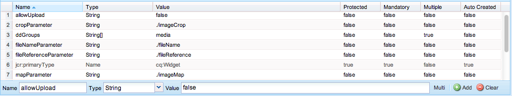

# 開發AEM元件(Classic UI){#developing-aem-components-classic-ui}

傳統UI使用ExtJS來建立Widget，以提供元件的外觀和感覺。 由於這些Widget的性質，元件與傳統UI和觸控式UI的互 [動方式有些不同](/help/sites-developing/developing-components.md)。

>[!NOTE]
>
>元件開發的許多方面都是傳統UI和觸控式UI的共通部分，因此 **[AEM元件- The Basics](/help/sites-developing/components-basics.md)** ，才能使用本頁，其中會說明傳統UI的具體內容。

>[!NOTE]
>
>雖然HTML範本語言(HTL)和JSP都可用於開發傳統UI的元件，但本頁說明如何使用JSP進行開發。 這完全是因為在傳統UI中使用JSP的歷史記錄。
>
>HTL現在是AEM的建議指令碼語言。 請參 [閱HTL](https://docs.adobe.com/content/help/en/experience-manager-htl/using/overview.html)[與開發AEM元件](/help/sites-developing/developing-components.md) ，以比較方法。

## 結構 {#structure}

元件的基本結構已涵蓋在頁面 [AEM元件- The Basics](/help/sites-developing/components-basics.md#structure)，其中同時套用觸控面板和傳統UI。 即使您不需要在新元件中使用觸控式使用者介面的設定，在繼承現有元件時也可以注意這些設定。

## JSP指令碼 {#jsp-scripts}

JSP指令碼或Servlet可用於渲染元件。 根據Sling的請求處理規則，預設指令碼的名稱為：

`<*componentname*>.jsp`

## global.jsp {#global-jsp}

JSP指令碼文 `global.jsp` 件用於提供對特定對象（即訪問內容）的快速訪問，以便訪問用於渲染元件的任何JSP指令碼檔案。

因此， `global.jsp` 在使用中提供的一個或多個對象的每個元件渲染JSP指令碼中都應 `global.jsp` 該包括。

預設值的位置 `global.jsp` 為：

`/libs/foundation/global.jsp`

>[!NOTE]
>
>CQ 5. `/libs/wcm/global.jsp`3版及更舊版本所使用的路徑現在已過時。

### global.jsp、已使用API和Taglibs的函式 {#function-of-global-jsp-used-apis-and-taglibs}

下列列出預設值中提供的最重要物件 `global.jsp`:

摘要:

* `<cq:defineObjects />`

   * `slingRequest` -包裝的請求對象( `SlingHttpServletRequest`)。
   * `slingResponse` -包裝的響應對象( `SlingHttpServletResponse`)。
   * `resource` - The Sling Resource Object( `slingRequest.getResource();`)。
   * `resourceResolver` - Sling Resource Resolver Object( `slingRequest.getResoucreResolver();`)。
   * `currentNode` -請求的已解決JCR節點。
   * `log` - The Default logger()。
   * `sling` - Sling指令碼協助程式。
   * `properties` -已定址資源( `resource.adaptTo(ValueMap.class);`)的屬性。
   * `pageProperties` -已定址資源的頁的屬性。
   * `pageManager` -用於存取AEM內容頁面( `resourceResolver.adaptTo(PageManager.class);`)的頁面管理員。
   * `component` -目前AEM元件的元件物件。
   * `designer` -用於檢索設計資訊的設計器對 `resourceResolver.adaptTo(Designer.class);`像()。
   * `currentDesign` -設計已定址資源。
   * `currentStyle` -已定址資源的樣式。

### 存取內容 {#accessing-content}

存取AEM WCM中的內容有三種方法：

* 通過以下內容中介紹的屬性對 `global.jsp`像：

   屬性物件是ValueMap的例項(請參 [閱Sling API](https://sling.apache.org/apidocs/sling5/org/apache/sling/api/resource/ValueMap.html))，並包含目前資源的所有屬性。

   範例：用 `String pageTitle = properties.get("jcr:title", "no title");` 於頁面元件的呈現指令碼。

   範例：用 `String paragraphTitle = properties.get("jcr:title", "no title");` 於標準段落元件的渲染指令碼。

* 透過下列 `currentPage` 項目中介紹的物 `global.jsp`件：

   物 `currentPage` 件是頁面的例項(請參閱 [AEM API](https://helpx.adobe.com/experience-manager/6-5/sites/developing/using/reference-materials/javadoc/com/day/cq/wcm/api/Page.mhtml))。 頁面類別提供一些存取內容的方法。

   例如: `String pageTitle = currentPage.getTitle();`

* 透過 `currentNode` 下列項目中引進的物件 `global.jsp`:

   物 `currentNode` 件是節點的例項(請參 [閱JCR API](https://jackrabbit.apache.org/api/2.16/org/apache/jackrabbit/standalone/cli/core/CurrentNode.html))。 可以通過該方法訪問節點的 `getProperty()` 屬性。

   例如: `String pageTitle = currentNode.getProperty("jcr:title");`

## JSP標籤庫 {#jsp-tag-libraries}

CQ和Sling標籤庫可讓您存取特定函式，以用於範本和元件的JSP指令碼。

如需詳細資訊，請參閱檔案標 [簽庫](/help/sites-developing/taglib.md)。

## 使用用戶端HTML程式庫 {#using-client-side-html-libraries}

現代網站嚴重依賴由複雜JavaScript和CSS程式碼驅動的用戶端處理。 組織並最佳化此程式碼的服務可能是個複雜的問題。

為協助處理此問題，AEM提供「用戶端程式庫資料夾 ****」，可讓您將用戶端程式碼儲存在儲存庫中，將它組織為類別，並定義每種程式碼的服務時機和方式。 然後用戶端程式庫系統會負責在您的最終網頁中產生正確的連結，以載入正確的程式碼。

如需詳細 [資訊，請參閱檔案使用用戶端HTML程式庫](/help/sites-developing/clientlibs.md) 。

## 對話方塊 {#dialog}

您的元件將需要對話方塊讓作者新增及設定內容。

如需詳 [細資訊，請參閱「AEM元件——基本概念](/help/sites-developing/components-basics.md#dialogs) 」。

## 設定編輯行為 {#configuring-the-edit-behavior}

您可以設定元件的編輯行為。 這包括一些屬性，如元件可用的操作、就地編輯器的特性，以及與元件上的事件相關的監聽器。 此設定是觸控式和傳統UI的常見設定，但有特定差異。

組 [件的編輯行為是通過在元件節點下添加類型的節點(](/help/sites-developing/components-basics.md#edit-behavior) 類型)和添加特定屬性和子節點來 `cq:editConfig``cq:EditConfig``cq:Component`配置的。

## 使用和擴充ExtJS Widget {#using-and-extending-extjs-widgets}

如需詳 [細資訊，請參閱使用和擴充ExtJS Widget](/help/sites-developing/widgets.md) 。

## 使用ExtJS Widget的xtypes {#using-xtypes-for-extjs-widgets}

如需詳 [細資訊](/help/sites-developing/xtypes.md) ，請參閱使用xtypes。

## 開發新元件 {#developing-new-components}

本節說明如何建立您自己的元件並將它們新增至段落系統。

快速入門的方法是複製現有元件，然後進行所需的變更。

如何開發元件的範例在「延伸文字和影像元件- [範例」中有詳細說明。](#extending-the-text-and-image-component-an-example)

### 開發新元件（調整現有元件） {#develop-a-new-component-adapt-existing-component}

若要根據現有元件開發AEM的新元件，您可以複製元件，請為新元件建立javascript檔案，並將它儲存在AEM可存取的位置(另請參閱自訂元件和其他元素 [](/help/sites-developing/dev-guidelines-bestpractices.md#customizing-components-and-other-elements)):

1. 使用CRXDE Lite，在下列位置建立新元件資料夾：

   / `apps/<myProject>/components/<myComponent>`

   重新建立節點結構（如在libs中），然後複製現有元件（如Text元件）的定義。 例如，要自定義Text元件副本：

   * 從 `/libs/foundation/components/text`
   * 至 `/apps/myProject/components/text`

1. 修改 `jcr:title` 以反映其新名稱。
1. 開啟新元件資料夾，並進行所需的變更。 此外，刪除資料夾中的任何無關資訊。

   您可以進行下列變更：

   * 在對話框中添加新欄位

      * `cq:dialog` -啟用觸控功能的UI對話方塊
      * `dialog` -傳統UI的對話框
   * 替換 `.jsp` 檔案（在新元件後命名）
   * 或完全重新使用整個元件(如果您想要
   例如，如果您取得標準「文字」元件的復本，您可以在對話方塊中新增其他欄位，然後更新以處 `.jsp` 理在此處輸入的內容。

   >[!NOTE]
   >
   >A component for the:
   >
   >* 啟用觸控的UI使用 [Granite元件](https://helpx.adobe.com/experience-manager/6-5/sites/developing/using/reference-materials/granite-ui/api/jcr_root/libs/granite/ui/index.html)
   >* 傳統UI使用 [ExtJS Widget](https://helpx.adobe.com/experience-manager/6-5/sites/developing/using/reference-materials/widgets-api/index.html)


   >[!NOTE]
   >
   >為傳統UI定義的對話方塊將在觸控式UI中運作。
   >
   >為觸控式使用者介面定義的對話方塊將無法在傳統使用者介面中運作。
   >
   >視您的實例和作者環境而定，您可能要為元件定義這兩種類型的對話框。

1. 下列節點之一應存在並正確初始化，以便新元件顯示：

   * `cq:dialog` -啟用觸控功能的UI對話方塊
   * `dialog` -傳統UI的對話框
   * `cq:editConfig` -元件在編輯環境中的行為方式（例如拖放）
   * `design_dialog` -設計模式的對話框（僅限傳統UI）

1. 在段落系統中啟動新元件，方法是：

   * 使用CRXDE Lite將值 `<path-to-component>` (例如 `/apps/geometrixx/components/myComponent`)添加到節點的屬性元件中 `/etc/designs/geometrixx/jcr:content/contentpage/par`
   * 按照向段落系 [統添加新元件中的說明](#adding-a-new-component-to-the-paragraph-system-design-mode)

1. 在AEM WCM中，在您的網站中開啟頁面，並插入您剛建立之類型的新段落，以確保元件正常運作。

>[!NOTE]
>
>若要查看頁面載入的時間統計資料，您可以使用Ctrl-Shift-U —— 並在URL `?debugClientLibs=true` 中設定。

### 向段落系統添加新元件（設計模式） {#adding-a-new-component-to-the-paragraph-system-design-mode}

開發元件後，可將其添加到段落系統中，使作者能夠在編輯頁面時選擇並使用元件。

1. 例如，在使用段落系統的製作環境中存取頁面 `<contentPath>/Test.html`。
1. 通過以下任一方式切換到設計模式：

   * 新 `?wcmmode=design` 增至URL結尾並再次存取，例如：

      `<contextPath>/ Test.html?wcmmode=design`

   * 按一下Sidekick中的設計
   您現在處於設計模式，可以編輯段落系統。

1. 按一下「編輯」。

   將顯示屬於段落系統的元件清單。 您的新元件也會列出。

   可以啟動（或停用）元件，以決定在編輯頁面時提供給作者的元件。

1. 啟動元件，然後返回正常編輯模式以確認其可供使用。

### 擴充文字和影像元件——範例 {#extending-the-text-and-image-component-an-example}

本節提供如何使用可配置的影像放置功能來擴充廣泛使用的文字和影像標準元件的範例。

文字和影像元件的擴充功能可讓編輯人員使用元件的所有現有功能，加上額外的選項，以指定影像的位置：

* 在文字的左側（目前行為和新預設值）
* 在右側

擴展此元件後，可通過元件的對話框配置影像放置。

本練習將介紹以下技術：

* 複製現有元件節點並修改其元資料
* 修改元件的對話框，包括繼承父對話框的Widget
* 修改元件的指令碼以實作新功能

>[!NOTE]
>
>此範例針對傳統UI。

>[!NOTE]
>
>此範例以Geometrixx範例內容為基礎，此內容已不再隨AEM一起出貨，而已由We.Retail取代。 如需如何下 [載和安裝Geometrixx的資訊，請參閱檔案We.Retail Reference Implementation](/help/sites-developing/we-retail.md#we-retail-geometrixx) 。

#### 擴充現有的文字時間元件 {#extending-the-existing-textimage-component}

要建立新元件，我們使用標準的textimage元件作為基礎並對其進行修改。 我們將新元件儲存在Geometrixx AEM WCM範例應用程式中。

1. 將標準textimage元件從複製 `/libs/foundation/components/textimage` 到Geometrixx元件資料夾， `/apps/geometrixx/components`並使用textimage做為目標節點名稱。 （通過導航到元件，按一下右鍵並選擇「複製」並瀏覽到目標目錄來複製元件。）

   

1. 要保持此示例的簡單性，請導航到所複製的元件並刪除新文本時間節點的所有子節點，以下子節點除外：

   * 對話框定義： `textimage/dialog`
   * 元件指令碼： `textimage/textimage.jsp`
   * 編輯配置節點（允許拖放資產）: `textimage/cq:editConfig`
   >[!NOTE]
   >
   >對話框定義取決於UI:
   >
   >* 可觸控的UI: `textimage/cq:dialog`
   >* 傳統 UI: `textimage/dialog`


1. 編輯元件中繼資料：

   * 元件名稱

      * 設為 `jcr:description``Text Image Component (Extended)`
      * 設為 `jcr:title``Text Image (Extended)`
   * 群組，其中元件列在sidekick中（保留原樣）

      * 保 `componentGroup` 留為 `General`
   * 新元件的父元件（標準textimage元件）

      * 設為 `sling:resourceSuperType``foundation/components/textimage`
   在此步驟後，元件節點如下所示：

   

1. 更改映 `sling:resourceType` 像的編輯配置節點的屬性(屬性： `textimage/cq:editConfig/cq:dropTargets/image/parameters/sling:resourceType`to `geometrixx/components/textimage.`

   這樣，當將影像拖放至頁面上的元件時，擴充的 `sling:resourceType` textimage元件的屬性會設為： `geometrixx/components/textimage.`

1. 修改元件的對話框以包含新選項。 新元件繼承與原始元件相同的對話框部分。 我們唯一的新增功能是擴充「進階」 **標籤** ，並新增「影像位置」下拉式清單，其中包含「左側 **」和「** Right ********」選項：

   * 保留屬 `textimage/dialog`性不變。
   請注意， `textimage/dialog/items` 如何有四個子節點（tab1到tab4），代表textimage對話框的四個頁籤。

   * 對於前兩個標籤（tab1和tab2）:

      * 將xtype變更為cqinclude（從標準元件繼承）。
      * 分別使用值和值添加 `/libs/foundation/components/textimage/dialog/items/tab1.infinity.json`路 `/libs/foundation/components/textimage/dialog/items/tab2.infinity.json`徑屬性。
      * 移除所有其他屬性或子節點。
   * 對於Tab3:

      * 保留屬性和子節點而不進行更改
      * 將新欄位定義添加到類 `tab3/items`型的節點位置 `cq:Widget`
      * 為新節點設定以下屬性（類型為字串） `tab3/items/position`:

         * `name`: `./imagePosition`
         * `xtype`: `selection`
         * `fieldLabel`: `Image Position`
         * `type`: `select`
      * 新增類 `position/options` 型的子節 `cq:WidgetCollection` 點以表示影像放置的兩種選擇，並在其下方建立兩個類型的節點o1和o2 `nt:unstructured`。
      * 對於節 `position/options/o1` 點設定屬性： `text` 到 `Left` 和 `value` 到 `left.`
      * 對於節 `position/options/o2` 點設定屬性： `text` 到 `Right``value` 到 `right`。
   * 刪除頁籤4。
   影像位置作為代表段落的節 `imagePosition`點的屬性保存在內 `textimage` 容中。 執行這些步驟後，元件對話方塊的外觀如下：

   

1. 擴充元件指令碼， `textimage.jsp`並額外處理新參數：

   ```xml
   Image image = new Image(resource, "image");
   
   if (image.hasContent() || WCMMode.fromRequest(request) == WCMMode.EDIT) {
        image.loadStyleData(currentStyle);
   ```

   我們將以新程式碼取代強調的程式碼片段 *%>&lt;div class=&quot;image&quot;>&lt;%* ，以產生此標籤的自訂樣式。

   ```xml
   // todo: add new CSS class for the 'right image' instead of using
   // the style attribute
   String style="";
        if (properties.get("imagePosition", "left").equals("right")) {
             style = "style=\"float:right\"";
        }
        %><div <%= style %> class="image"><%
   ```

1. 將元件保存到儲存庫。 元件已準備好進行測試。

#### 檢查新元件 {#checking-the-new-component}

開發元件後，可將其添加到段落系統中，使作者能夠在編輯頁面時選擇並使用元件。 這些步驟可讓您測試元件。

1. 在Geometrixx中開啟頁面，例如英文／公司。
1. 按一下Sidekick中的「設計」，以切換至設計模式。
1. 按一下頁面中間段落系統上的「編輯」，編輯段落系統設計。 會顯示可放置在段落系統中的元件清單，其中應包含您新開發的元件：文字影像（延伸）。 通過選擇段落系統並按一下「確定」，將其激活。
1. 切換回編輯模式。
1. 將「文字影像（延伸）」段落新增至段落系統，以範例內容初始化文字和影像。 儲存變更。
1. 開啟文字和影像段落的對話方塊，並將「進階」標籤上的「影像位置」變更為「右側」，然後按一下「確定」以儲存變更。
1. 該段落在右邊，影像在右邊。
1. 此元件現在已可供使用。

元件將其內容儲存在「公司」頁面的段落中。

### 停用影像元件的上傳功能 {#disable-upload-capability-of-the-image-component}

若要停用此功能，我們會以標準影像元件為基礎，並加以修改。 我們將新元件儲存在Geometrixx範例應用程式中。

1. 將標準影像元件從復 `/libs/foundation/components/image` 制到Geometrixx元件資料夾， `/apps/geometrixx/components`使用影像作為目標節點名稱。

   

1. 編輯元件中繼資料：

   * 將 **jcr:title設為**`Image (Extended)`

1. 導航到 `/apps/geometrixx/components/image/dialog/items/image`.
1. 新增屬性:

   * **名稱**: `allowUpload`
   * **類型**: `String`
   * **值**: `false`
   

1. 按一下「 **全部儲存**」。 元件已準備好進行測試。
1. 在Geometrixx中開啟頁面，例如英文／公司。
1. 切換至設計模式並啟動影像(Extended)。
1. 切換回編輯模式，並將它加入段落系統。 在下一張圖片上，您可以看到原始影像元件和您剛建立的影像元件之間的差異。

   原始影像元件：

   

   您的新影像元件：

   

1. 此元件現在已可供使用。

