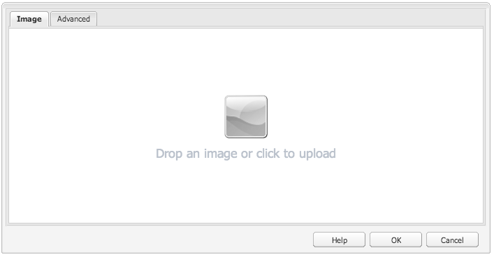

# 開AEM發元件（經典UI）{#developing-aem-components-classic-ui}

經典UI使用ExtJS建立小部件，提供元件的外觀。 由於這些小部件的性質，元件與經典UI的交互方式與 [啟用觸摸的UI](/help/sites-developing/developing-components.md)。

>[!NOTE]
>
>元件開發的許多方面對於傳統UI和啟用觸摸的UI都很常見，因此 **你必須讀 [組AEM件 — 基礎](/help/sites-developing/components-basics.md) 先** 使用此頁，該頁處理傳統UI的具體資訊。

>[!NOTE]
>
>雖然HTML模板語言(HTL)和JSP都可用於開發標準UI的元件，但本頁說明了使用JSP進行開發。 這完全是由於在傳統UI中使用JSP的歷史記錄。
>
>HTL現在是推薦的指令碼語言AEM。 請參閱 [HTL](https://experienceleague.adobe.com/docs/experience-manager-htl/content/overview.html) 和 [開發組AEM件](/help/sites-developing/developing-components.md) 來比較方法。

## 結構 {#structure}

元件的基本結構在頁面上覆蓋 [組AEM件 — 基礎](/help/sites-developing/components-basics.md#structure)，它同時應用觸摸屏和經典UI。 即使您不需要在新元件中使用啟用觸摸的用戶介面的設定，在繼承現有元件時也可以瞭解這些設定。

## JSP指令碼 {#jsp-scripts}

JSP指令碼或Servlet可用於呈現元件。 根據Sling的請求處理規則，預設指令碼的名稱為：

`<*componentname*>.jsp`

## global.jsp {#global-jsp}

JSP指令碼檔案 `global.jsp` 用於提供對特定對象（即訪問內容）的快速訪問，以訪問用於呈現元件的任何JSP指令碼檔案。

因此 `global.jsp` 應包括在呈現JSP指令碼的每個元件中，其中提供的一個或多個對象 `global.jsp` 的子菜單。

預設的位置 `global.jsp` 為：

`/libs/foundation/global.jsp`

>[!NOTE]
>
>路徑 `/libs/wcm/global.jsp`CQ 5.3及更早版本使用的CQ現在已過時。

### global.jsp、used API和Taglibs的函式 {#function-of-global-jsp-used-apis-and-taglibs}

下面列出了從預設 `global.jsp`:

摘要:

* `<cq:defineObjects />`

   * `slingRequest`  — 包裝的請求對象( `SlingHttpServletRequest`)。
   * `slingResponse`  — 包裝的響應對象( `SlingHttpServletResponse`)。
   * `resource` - Sling資源對象( `slingRequest.getResource();`)。
   * `resourceResolver` - Sling資源解析器對象( `slingRequest.getResoucreResolver();`)。
   * `currentNode`  — 請求的已解析JCR節點。
   * `log`  — 預設記錄器()。
   * `sling` - Sling指令碼幫助程式。
   * `properties`  — 定址資源的屬性( `resource.adaptTo(ValueMap.class);`)。
   * `pageProperties`  — 定址資源頁的屬性。
   * `pageManager`  — 用於訪問內容頁面的AEM頁面管理器( `resourceResolver.adaptTo(PageManager.class);`)。
   * `component`  — 當前元件的元件AEM對象。
   * `designer`  — 用於檢索設計資訊的設計器對象( `resourceResolver.adaptTo(Designer.class);`)。
   * `currentDesign`  — 編址資源的設計。
   * `currentStyle`  — 定址資源的樣式。

### 訪問內容 {#accessing-content}

訪問WCM中的內容有三AEM種方法：

* 通過中引入的屬性對象 `global.jsp`:

   屬性對象是ValueMap的實例(請參見 [Sling API](https://sling.apache.org/apidocs/sling5/org/apache/sling/api/resource/ValueMap.html))並包含當前資源的所有屬性。

   示例： `String pageTitle = properties.get("jcr:title", "no title");` 用於頁面元件的呈現指令碼中。

   示例： `String paragraphTitle = properties.get("jcr:title", "no title");` 用於標準段落元件的呈現指令碼。

* 通過 `currentPage` 引入的對象 `global.jsp`:

   的 `currentPage` 對象是頁的實例(請參見 [APIAEM](https://helpx.adobe.com/experience-manager/6-5/sites/developing/using/reference-materials/javadoc/com/day/cq/wcm/api/Page.mhtml))。 頁麵類提供了一些訪問內容的方法。

   範例: `String pageTitle = currentPage.getTitle();`

* 通過 `currentNode` 引入的對象 `global.jsp`:

   的 `currentNode` 對象是節點的實例(請參見 [JCR API](https://jackrabbit.apache.org/api/2.16/org/apache/jackrabbit/standalone/cli/core/CurrentNode.html))。 節點的屬性可通過 `getProperty()` 的雙曲餘切值。

   範例: `String pageTitle = currentNode.getProperty("jcr:title");`

## JSP標籤庫 {#jsp-tag-libraries}

CQ和Sling標籤庫允許您訪問特定函式，以便在模板和元件的JSP指令碼中使用。

有關詳細資訊，請參閱文檔 [標籤庫](/help/sites-developing/taglib.md)。

## 使用客戶端HTML庫 {#using-client-side-html-libraries}

現代網站在複雜的JavaScript和CSS代碼驅動下，嚴重依賴客戶端處理。 組織和優化此代碼的服務可能是一個複雜的問題。

為幫助處理此問題，提供 **客戶端庫資料夾**，允許您將客戶端代碼儲存在儲存庫中，將其組織為類別，並定義將每類代碼提供給客戶端的時間和方式。 然後，客戶端庫系統會注意在最終網頁中生成正確的連結以載入正確的代碼。

查看文檔 [使用客戶端HTML庫](/help/sites-developing/clientlibs.md) 的子菜單。

## 對話方塊 {#dialog}

您的元件將需要一個對話框供作者添加和配置內容。

請參閱 [組AEM件 — 基礎](/help/sites-developing/components-basics.md#dialogs) 的上界。

## 配置編輯行為 {#configuring-the-edit-behavior}

可以配置元件的編輯行為。 這包括可用於元件的操作、就地編輯器的特性以及與元件上的事件相關的監聽器等屬性。 該配置對於啟用觸摸的UI和經典UI都是通用的，儘管有某些特定的差異。

的 [已配置元件的編輯行為](/help/sites-developing/components-basics.md#edit-behavior) 通過添加 `cq:editConfig` 類型節點 `cq:EditConfig` 元件節點下(類型 `cq:Component`)和添加特定屬性和子節點。

## 使用和擴展ExtJS小部件 {#using-and-extending-extjs-widgets}

請參閱 [使用和擴展ExtJS小部件](/help/sites-developing/widgets.md) 的子菜單。

## 為ExtJS小部件使用xtypes {#using-xtypes-for-extjs-widgets}

請參閱 [使用xtypes](/help/sites-developing/xtypes.md) 的子菜單。

## 開發新元件 {#developing-new-components}

本節介紹如何建立自己的元件並將其添加到段落系統中。

一種快速的入門方法是複製現有元件，然後進行所需的更改。

詳細介紹了如何開發元件的示例 [擴展文本和影像元件 — 一個示例。](#extending-the-text-and-image-component-an-example)

### 開發新元件（調整現有元件） {#develop-a-new-component-adapt-existing-component}

要基於現有元件AEM開發新元件，您可以複製該元件，請為新元件建立一個javascript檔案並將其儲存到可訪問的位AEM置(另請參閱 [定制元件和其他元素](/help/sites-developing/dev-guidelines-bestpractices.md#customizing-components-and-other-elements)):

1. 使用CRXDE Lite，在中建立新元件資料夾：

   / `apps/<myProject>/components/<myComponent>`

   重新建立節點結構（如在lib中），然後複製現有元件（如「文本」元件）的定義。 例如，要自定義文本元件副本：

   * 從 `/libs/foundation/components/text`
   * 至 `/apps/myProject/components/text`

1. 修改 `jcr:title` 以反映新名稱。
1. 開啟新元件資料夾並進行所需更改。 此外，刪除資料夾中的任何無關資訊。

   您可以進行更改，如：

   * 在對話框中添加新欄位

      * `cq:dialog`  — 啟用觸摸的UI對話框
      * `dialog`  — 標準UI對話框
   * 更換 `.jsp` 檔案（在新元件後命名）
   * 或完全重新處理整個元件

   例如，如果您獲取標準文本元件的副本，則可以向對話框添加附加欄位，然後更新 `.jsp` 來處理那裡的輸入。

   >[!NOTE]
   >
   >以下元件：
   >
   >* 啟用觸摸的UI使用 [花崗岩](https://helpx.adobe.com/experience-manager/6-5/sites/developing/using/reference-materials/granite-ui/api/jcr_root/libs/granite/ui/index.html) 元件
   >* 經典UI使用 [ExtJS小部件](https://helpx.adobe.com/experience-manager/6-5/sites/developing/using/reference-materials/widgets-api/index.html)


   >[!NOTE]
   >
   >為標準UI定義的對話框將在啟用觸摸的UI中運行。
   >
   >為啟用觸摸的UI定義的對話框將不會在標準UI中運行。
   >
   >根據實例和作者環境，您可能要為元件定義兩種類型的對話框。

1. 下列節點之一應存在並正確初始化，以便新元件出現：

   * `cq:dialog`  — 啟用觸摸的UI對話框
   * `dialog`  — 標準UI對話框
   * `cq:editConfig`  — 元件在編輯環境中的行為（如拖放）
   * `design_dialog`  — 設計模式對話框（僅限經典UI）

1. 通過以下任一方式激活段落系統中的新元件：

   * 使用CRXDE Lite添加值 `<path-to-component>` (例如， `/apps/geometrixx/components/myComponent`)到節點的屬性元件 `/etc/designs/geometrixx/jcr:content/contentpage/par`
   * 按照中的說明 [向段落系統添加新元件](#adding-a-new-component-to-the-paragraph-system-design-mode)

1. 在AEMWCM中，開啟網站中的頁面，並插入剛建立的類型的新段落，以確保元件正常工作。

>[!NOTE]
>
>要查看頁面載入的計時統計資訊，可以使用Ctrl-Shift-U - `?debugClientLibs=true` 的子菜單。

### 向段落系統添加新元件（設計模式） {#adding-a-new-component-to-the-paragraph-system-design-mode}

在開發元件後，可將其添加到段落系統中，使作者能夠在編輯頁面時選擇和使用元件。

1. 訪問創作環境中使用段落系統的頁面，例如 `<contentPath>/Test.html`。
1. 通過以下任一方式切換到設計模式：

   * 添加 `?wcmmode=design` 到URL的末尾並再次訪問，例如：

      `<contextPath>/ Test.html?wcmmode=design`

   * 按一下「側腳」中的設計

   您現在處於設計模式，可以編輯段落系統。

1. 按一下「編輯」。

   顯示屬於段落系統的元件清單。 還會列出您的新元件。

   可激活（或停用）元件以確定在編輯頁面時提供給作者的元件。

1. 激活元件，然後返回到普通編輯模式以確認其可用。

### 擴展文本和影像元件 — 一個示例 {#extending-the-text-and-image-component-an-example}

本節提供了一個示例，說明如何使用可配置的影像放置特徵擴展廣泛使用的文本和影像標準元件。

文本和影像元件的擴展允許編輯器使用元件的所有現有功能加上一個額外選項來指定影像的放置：

* 在文本的左側（當前行為和新預設值）
* 在右邊

擴展此元件後，可通過元件的對話框配置影像放置。

本練習將介紹以下技術：

* 複製現有元件節點並修改其元資料
* 修改元件的對話框，包括繼承父對話框中的小部件
* 修改元件的指令碼以實現新功能

>[!NOTE]
>
>此示例針對經典UI。

>[!NOTE]
>
>此示例基於We.Retail已替換的不再隨附的AEMGeometrixx樣本內容。 查看文檔 [We.Retail Reference實施](/help/sites-developing/we-retail.md#we-retail-geometrixx) 下載和安裝Geometrixx。

#### 擴展現有文本時間元件 {#extending-the-existing-textimage-component}

要建立新元件，我們使用標準文本時間化元件作為基礎並對其進行修改。 我們將新元件儲存在GeometrixxAEMWCM示例應用程式中。

1. 從中複製標準文本時間化元件 `/libs/foundation/components/textimage` 進入Geometrixx元件資料夾， `/apps/geometrixx/components`，使用textimage作為目標節點名稱。 （通過導航到元件，按一下右鍵並選擇「複製」並瀏覽到目標目錄來複製元件。）

   

1. 要使此示例簡單，請導航到複製的元件並刪除新文本時間節點的所有子節點，以下子節點除外：

   * 對話框定義： `textimage/dialog`
   * 元件指令碼： `textimage/textimage.jsp`
   * 編輯配置節點（允許拖放資產）: `textimage/cq:editConfig`

   >[!NOTE]
   >
   >對話框定義依賴於UI:
   >
   >* 啟用觸摸的UI: `textimage/cq:dialog`
   >* 傳統 UI: `textimage/dialog`


1. 編輯元件元資料：

   * 元件名稱

      * 設定 `jcr:description` 至 `Text Image Component (Extended)`
      * 設定 `jcr:title` 至 `Text Image (Extended)`
   * 組，其中元件列在旁邊（保持原樣）

      * 離開 `componentGroup` 設定為 `General`
   * 新元件的父元件（標準文本時間元件）

      * 設定 `sling:resourceSuperType` 至 `foundation/components/textimage`

   在此步驟之後，元件節點如下所示：

   

1. 更改 `sling:resourceType` 映像的編輯配置節點的屬性(屬性： `textimage/cq:editConfig/cq:dropTargets/image/parameters/sling:resourceType`) `geometrixx/components/textimage.`

   這樣，當將影像拖放到頁面上的元件時， `sling:resourceType` 擴展的textimage元件的屬性設定為： `geometrixx/components/textimage.`

1. 修改元件的對話框以包括新選項。 新元件繼承與原始元件相同的對話框部分。 我們做的唯一補充就是 **高級** 頁籤，添加 **影像位置** 下拉清單，帶選項 **左** 和 **右**:

   * 離開 `textimage/dialog`屬性未更改。

   注意方式 `textimage/dialog/items` 有四個子節點，從tab1到tab4，表示textimage對話框的四個頁籤。

   * 對於前兩個頁籤（tab1和tab2）:

      * 將xtype更改為cqinclude（從標準元件繼承）。
      * 添加帶值的路徑屬性 `/libs/foundation/components/textimage/dialog/items/tab1.infinity.json`和 `/libs/foundation/components/textimage/dialog/items/tab2.infinity.json`的下界。
      * 刪除所有其他屬性或子節點。
   * 對於頁籤3:

      * 保留屬性和子節點，不更改
      * 將新欄位定義添加到 `tab3/items`，類型中的節點位置 `cq:Widget`
      * 為新屬性設定以下屬性（類型為String） `tab3/items/position`節點：

         * `name`: `./imagePosition`
         * `xtype`: `selection`
         * `fieldLabel`: `Image Position`
         * `type`: `select`
      * 添加子節點 `position/options` 類型 `cq:WidgetCollection` 表示影像放置的兩個選項，並在其下建立兩個節點，即o1和o2類型 `nt:unstructured`。
      * 對於節點 `position/options/o1` 設定屬性： `text` 至 `Left` 和 `value` 至 `left.`
      * 對於節點 `position/options/o2` 設定屬性： `text` 至 `Right` 和 `value` 至 `right`。
   * 刪除頁籤4。

   影像位置在內容中保留為 `imagePosition`表示節點的屬性 `textimage` 段。 在這些步驟之後，元件對話框如下所示：

   

1. 擴展元件指令碼， `textimage.jsp`，並額外處理新參數：

   ```xml
   Image image = new Image(resource, "image");
   
   if (image.hasContent() || WCMMode.fromRequest(request) == WCMMode.EDIT) {
        image.loadStyleData(currentStyle);
   ```

   我們將替換強調的代碼片段 *%>&lt;div class=&quot;image&quot;>&lt;%* 新代碼生成此標籤的自定義樣式。

   ```xml
   // todo: add new CSS class for the 'right image' instead of using
   // the style attribute
   String style="";
        if (properties.get("imagePosition", "left").equals("right")) {
             style = "style=\"float:right\"";
        }
        %><div <%= style %> class="image"><%
   ```

1. 將元件保存到儲存庫。 元件已準備好test。

#### 檢查新元件 {#checking-the-new-component}

開發元件後，可將其添加到段落系統中，使作者能夠在編輯頁面時選擇和使用元件。 這些步驟允許您test元件。

1. 以Geometrixx（如英語/公司）開啟頁面。
1. 按一下「Sidekick（側腳）」 ，切換到設計模式。
1. 通過按一下頁面中間的段落系統上的編輯來編輯段落系統設計。 將顯示可放置在段落系統中的元件清單，其中應包括新開發的元件「文本影像（擴展）」。 通過選擇段落系統並按一下「確定」(OK)將其激活。
1. 切換回編輯模式。
1. 將「文本影像（擴展）」段添加到段落系統，初始化文本和包含示例內容的影像。 儲存變更。
1. 開啟文本和影像段落的對話框，將「高級」頁籤上的「影像位置」更改為「右」，然後按一下「確定」以保存更改。
1. 該段在右側繪有影像。
1. 元件現在可以使用。

該元件將其內容儲存在公司頁面的段落中。

### 禁用映像元件的上載功能 {#disable-upload-capability-of-the-image-component}

要禁用此功能，我們使用標準映像元件作為基礎並對其進行修改。 我們將新元件儲存在Geometrixx示例應用程式中。

1. 從中複製標準映像元件 `/libs/foundation/components/image` 進入Geometrixx元件資料夾， `/apps/geometrixx/components`，將影像用作目標節點名稱。

   

1. 編輯元件元資料：

   * 設定 **jcr：標題** 至 `Image (Extended)`

1. 導覽至 `/apps/geometrixx/components/image/dialog/items/image`。
1. 新增屬性:

   * **名稱**: `allowUpload`
   * **類型**: `String`
   * **值**: `false`

   

1. 按一下 **全部保存**。 元件已準備好test。
1. 以Geometrixx（如英語/公司）開啟頁面。
1. 切換到設計模式並激活映像（擴展）。
1. 切換回編輯模式，並將其添加到段落系統。 在下一張圖片上，您可以看到原始影像元件與剛剛建立的影像元件之間的差異。

   原始影像元件：

   

   新映像元件：

   

1. 元件現在可以使用。
