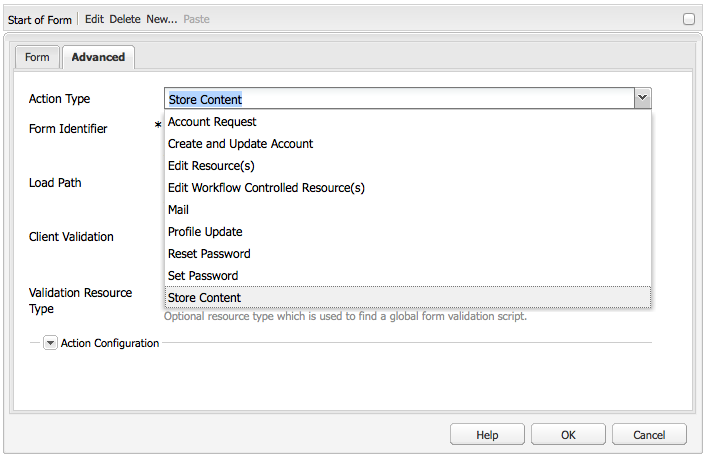
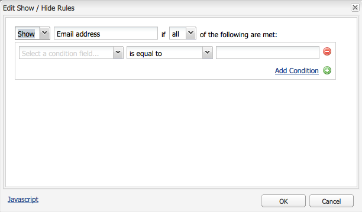
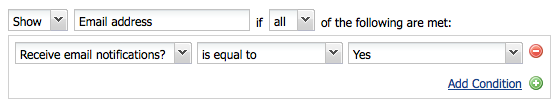

# 開發表單(Classic UI){#developing-forms-classic-ui}

表單的基本結構是：

* 表單開始
* 表單元素
* 表單結尾

所有這些都是透過一系列預設的 [Form元件來實現](/help/sites-authoring/default-components.md#form)，這些元件可在標準AEM安裝中取得。

除了開發 [新元件](/help/sites-developing/developing-components-samples.md) ，以用於表單外，您還可以：

* [以值預先載入表格](#preloading-form-values)
* [預先載入（特定）多個值的欄位
   ](#preloading-form-fields-with-multiple-values)
* [開發新動作](#developing-your-own-form-actions)
* [開發新的限制](#developing-your-own-form-constraints)
* [顯示或隱藏特定表單欄位](#showing-and-hiding-form-components)

[視需要使用指令碼](#developing-scripts-for-use-with-forms) ，以擴充功能。

>[!NOTE]
>
>本檔案著重於使用傳統UI中的 [Foundation Components](/help/sites-authoring/default-components-foundation.md) ，來開發表格。 Adobe建議在觸控式UI中 [運用新的核心元件](https://docs.adobe.com/content/help/en/experience-manager-core-components/using/introduction.html)[和隱藏條件](/help/sites-developing/hide-conditions.md) ，以開發表格。

## 預載表單值 {#preloading-form-values}

表單啟動元件為「載入路徑」( **Load Path**)提供一個欄位，該欄位是指向儲存庫中節點的可選路徑。

載入路徑是指向節點屬性的路徑，用於將預定義值載入到表單的多個欄位中。

這是一個可選欄位，它指定到儲存庫中節點的路徑。 當此節點具有與欄位名稱匹配的屬性時，表單上的相應欄位將預先載入這些屬性的值。 如果不存在匹配，則欄位包含預設值。

>[!NOTE]
>
>表 [單動作](#developing-your-own-form-actions) ，也可以設定載入初始值的資源。 這是使用內 `FormsHelper#setFormLoadResource` 部完成 `init.jsp`。
>
>僅當未設定時，作者才會從start form元件中設定的路徑填充表單。

### 預載具有多個值的表單欄位 {#preloading-form-fields-with-multiple-values}

各種表單欄位還有「項 **目載入路徑」**，這又是指向儲存庫中節點的可選路徑。

「項 **目載入路徑** 」是節點屬性的路徑，用於將預定義值載入表單上的特定欄位，例如，下拉清單 [、複選框組](/help/sites-authoring/default-components-foundation.md#dropdown-list)[或無線組](/help/sites-authoring/default-components-foundation.md#checkbox-group)。

#### 示例——預載具有多個值的下拉清單 {#example-preloading-a-dropdown-list-with-multiple-values}

下拉式清單可以設定您的選取值範圍。

「項 **目載入路徑** 」(Items Load Path)可用於從儲存庫中的資料夾訪問清單，並將這些清單預載入到欄位中：

1. 建立新的sling資料夾( `sling:Folder`)，例如， `/etc/designs/<myDesign>/formlistvalues`

1. 新增多值字串( `myList`)類型的新屬性（例如），以 `String[]`包含下拉式項目清單。 您也可以使用指令碼匯入內容，例如使用JSP指令碼或shell指令碼中的cURL。

1. 使用「項目載入路徑」欄 **位中的完整路徑** :例如， `/etc/designs/geometrixx/formlistvalues/myList`

請注意，如果中的值 `String[]` 的格式如下：

* `AL=Alabama`
* `AK=Alaska`
* *等等。*

然後AEM將產生清單為：

* `<option value="AL">Alabama</option>`
* `<option value="AK">Alaska</option>`

例如，此功能可在多語言設定中良好使用。

### 開發您自己的表單動作 {#developing-your-own-form-actions}

表單需要動作。 操作定義了當表單隨用戶資料提交時執行的操作。

標準AEM安裝提供一系列動作，您可在下列位置看到這些動作：

`/libs/foundation/components/form/actions`

和Form組 **件的** 「操作類 **型」清單** :

本節說明如何開發您自己的表格動作以納入此清單。

您可以在下面添加自己的 `/apps` 操作：

1. 建立類型節點 `sling:Folder`。 指定反映要實施之動作的名稱。

   例如：

   `/apps/myProject/components/customFormAction`

1. 在此節點上定義下列屬性，然後按一下「全 **部儲存** 」以保留您的變更：

   * `sling:resourceType` -設定為 `foundation/components/form/action`

   * `componentGroup` -定義為 `.hidden`

   * （可選）:

      * `jcr:title` -指定您選擇的標題，這將顯示在下拉式選取清單中。 如果未設定，則顯示節點名稱

      * `jcr:description` -輸入您選擇的說明

1. 在資料夾中建立對話節點：

   1. 新增欄位，讓作者在選擇動作後就可以編輯表單對話方塊。

1. 在資料夾中建立以下任一項：

   1. 貼文指令碼。
指令碼的名稱是 `post.POST.<extension>`，例如，當提交表單以處理表單時，會叫用後置指令碼，其中包含處理從表單到達的資料的程式碼 `post.POST.jsp``POST`。

   1. 新增在提交表單時叫用的轉發指令碼。
指令碼的名稱為 `forward.<extension`>，例如，此腳 `forward.jsp`本可以定義路徑。 然後，將當前請求轉發到指定的路徑。
   必要的呼叫 `FormsHelper#setForwardPath` 是（2個變體）。 典型的情況是執行一些驗證或邏輯，以尋找目標路徑，然後轉送至該路徑，讓預設的Sling POST servlet在JCR中執行實際儲存。

   也可能有另一個Servlet會執行實際處理，在這種情況下，表單動作 `forward.jsp` 和只會做為「黏合」程式碼。 其中一個示例是位於的郵件操 `/libs/foundation/components/form/actions/mail`作，它將詳細資訊轉 `<currentpath>.mail.html`發到郵件servlet所在的位置。

   因此：

   * a對 `post.POST.jsp` 於由操作本身完全完成的小操作非常有用
   * 而只 `forward.jsp` 需委託時，則很實用。
   指令碼的執行順序為：

   * 在轉譯表單( `GET`)時：

      1. `init.jsp`
      1. 對於所有欄位的約束： `clientvalidation.jsp`
      1. 表單的validationRT: `clientvalidation.jsp`
      1. 如果已設定，則透過載入資源載入表單
      1. `addfields.jsp` 在內部演算 `<form></form>`
   * 在處理表格時 `POST`:

      1. `init.jsp`
      1. 對於所有欄位的約束： `servervalidation.jsp`
      1. 表單的validationRT: `servervalidation.jsp`
      1. `forward.jsp`
      1. 如果已設定( `FormsHelper.setForwardPath`)前進路徑，請轉送請求，然後呼叫 `cleanup.jsp`

      1. 如果未設定前向路徑，請呼 `post.POST.jsp` 叫(在此結束，未呼 `cleanup.jsp` 叫)

1. 在資料夾中再次選擇新增：

   1. 用於添加欄位的指令碼。
指令碼的名稱為， `addfields.<extension>`例如，在寫 `addfields.jsp`入表單開頭的HTML後，會立即調用addfields指令碼。 這可讓動作在表單中新增自訂輸入欄位或其他HTML。

   1. 初始化指令碼。
指令碼的名稱為， `init.<extension>`例如，在呈 `init.jsp`現表單時會調用此指令碼。 它可用於初始化操作細節。&quot;

   1. 清除指令碼。
指令碼的名稱是 `cleanup.<extension>`，例如， `cleanup.jsp`此指令碼可用於執行清理。

1. 在parsys中 **使用** Forms元件。 「動 **作類型** 」下拉式清單現在會包含您的新動作。

   >[!NOTE]
   >
   >要查看屬於產品一部分的預設操作：
   >
   >
   >`/libs/foundation/components/form/actions`

### 開發您自己的表單限制 {#developing-your-own-form-constraints}

可在兩個級別施加限制：

* 針對 [個別欄位（請參閱下列程式）](#constraints-for-individual-fields)
* 作為 [表單全局驗證](#form-global-constraints)

#### 個別欄位的限制 {#constraints-for-individual-fields}

您可以為個別欄位（在下方）新增自己的約 `/apps`束，如下所示：

1. 建立類型節點 `sling:Folder`。 指定反映要實施之約束的名稱。

   例如：

   `/apps/myProject/components/customFormConstraint`

1. 在此節點上定義下列屬性，然後按一下「全 **部儲存** 」以保留您的變更：

   * `sling:resourceType` -設定為 `foundation/components/form/constraint`

   * `constraintMessage` -自訂訊息，如果欄位無效，根據限制，在提交表單時顯示

   * （可選）:

      * `jcr:title` -指定您選擇的標題，此標題會顯示在選取清單中。 如果未設定，則顯示節點名稱
      * `hint` -使用者有關如何使用欄位的其他資訊

1. 在此資料夾中，您可以需要下列指令碼：

   * 客戶端驗證指令碼：指令碼的名稱是， `clientvalidation.<extension>`例如，在 `clientvalidation.jsp`呈現表單欄位時調用此名稱。 它可用於建立用戶端javascript，以驗證用戶端上的欄位。

   * 伺服器驗證指令碼：指令碼的名稱是， `servervalidation.<extension>`例如，在提 `servervalidation.jsp`交表單時會叫用此名稱。 它可用於在提交該欄位後驗證伺服器上的欄位。

>[!NOTE]
>
>範例約束可在以下位置查看：
>
>`/libs/foundation/components/form/constraints`

#### 表單全局約束 {#form-global-constraints}

通過在啟動表單元件( `validationRT`)中配置資源類型來指定表單全局驗證。 例如：

`apps/myProject/components/form/validation`

然後，您可以定義：

* a `clientvalidation.jsp` -在欄位的客戶端驗證指令碼後插入
* 和a `servervalidation.jsp` -也在對的單個欄位伺服器進行驗證後調用 `POST`。

### 顯示和隱藏表單元件 {#showing-and-hiding-form-components}

您可以設定表單，根據表單中其他欄位的值顯示或隱藏表單元件。

只有在特定條件下才需要表格欄位時，變更表格欄位的可見性很實用。 例如，在意見表中，問題會詢問客戶是否希望以電子郵件將產品資訊傳送給他們。 在選擇「是」時，會出現文字欄位，讓客戶輸入其電子郵件地址。

使用「編 **輯顯示／隱藏規則** 」(Edit Show/Hide Rules)對話框可指定在其下顯示或隱藏表單元件的條件。

使用對話框頂部的欄位指定以下資訊：

* 是否指定隱藏或顯示元件的條件。
* 顯示或隱藏元件時，是否需要任何或所有條件為true。

這些欄位下方會顯示一或多個條件。 條件會比較另一個表單元件（在相同表單上）的值與值。 如果欄位中的實際值符合條件，則條件會評估為true。 條件包含下列資訊：

* 測試的表單欄位標題。
* 運算子。
* 與欄位值進行比較。

例如，標題* *的「選項組」元件 `Receive email notifications?`包含選項 `Yes` 按鈕 `No` 和選項按鈕。 標題為的「文本欄位」組 `Email Address` 件使用以下條件，以便在選中時 `Yes` 可見：

在Javascript中，條件會使用「元素名稱」屬性的值來參考欄位。 在上例中，Radio group元件的「元素名稱」屬性為 `contact`。 下列程式碼是該範例的等效Javascript程式碼：

`((contact == "Yes"))`

**要顯示或隱藏表單元件：**

1. 編輯特定表單元件。

1. 選擇 **顯示／隱藏** ，以開啟「編輯顯 **示／隱藏規則」對話方塊** :

   * 在第一個下拉式清單中，選取「 **顯示** 」或「 **隱藏」** ，以指定條件決定要顯示或隱藏元件。

   * 在頂端行結尾的下拉式清單中，選取：

      * **all** —— 如果所有條件都必須為true，則顯示或隱藏元件
      * **any** —— 如果只有一個或多個條件必須為true才能顯示或隱藏元件
   * 在條件行中（一個顯示為預設值），選擇元件、運算子，然後指定值。
   * 視需要按一下「新增條件」，新增 **更多條件**。
   例如：

   

1. 按一下 **確定** ，保存定義。

1. 保存定義後，在表單元件屬 **性中的「顯示／隱藏」(** Show / Hide **** )選項旁會出現「編輯規則」(Edit Rules)連結。 按一下此連結以開啟「編 **輯顯示／隱藏規則** 」對話方塊進行變更。

   按一下 **確定** ，保存所有更改。

   

   >[!CAUTION]
   >
   >可檢視和測試「顯示／隱藏」定義的效果：
   >
   >
   >
   >    * 在作 **者環境的「預覽** 」模式中（第一次切換為預覽時需要重新載入頁面）
      >
      >    
   * 在發佈環境中

#### 處理斷開的元件參照 {#handling-broken-component-references}

顯示／隱藏條件使用「元素名稱」(Element Name)屬性的值來引用表單中的其他元件。 當任何條件參考已刪除或已變更「元素名稱」屬性的元件時，「顯示／隱藏」配置無效。 發生此情況時，您需要手動更新條件，或在表單載入時發生錯誤。

當「顯示／隱藏」設定無效時，此設定僅會以JavaScript程式碼提供。 編輯代碼以更正問題。代碼使用最初用於引用元件的「元素名稱」屬性。

### 開發用於表單的指令碼 {#developing-scripts-for-use-with-forms}

有關在編寫指令碼時可使用的API元素的詳細資訊，請參閱與 [表單相關的javadoc](https://helpx.adobe.com/experience-manager/6-5/sites/developing/using/reference-materials/javadoc/com/day/cq/wcm/foundation/forms/package-summary.html)。

您可將此功能用於下列動作：在提交表單之前呼叫服務；如果服務失敗，則取消服務：

* 定義驗證資源類型
* 包含要驗證的指令碼：

   * 在JSP中，調用Web服務並建立包含錯 `com.day.cq.wcm.foundation.forms.ValidationInfo` 誤消息的對象。 如果有錯誤，表單資料將不會張貼。
