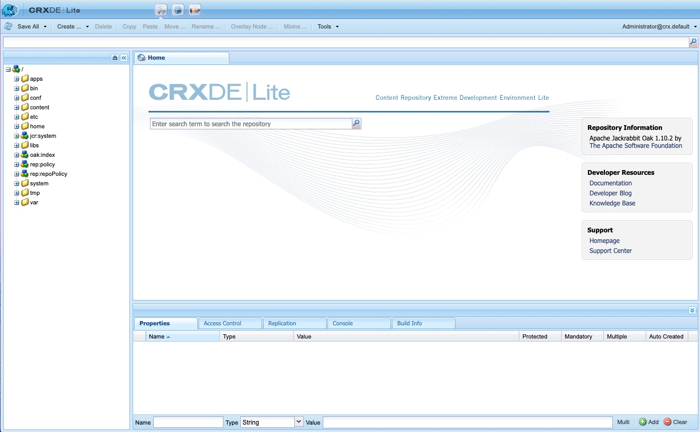

# 用CRXDE Lite開發{#developing-with-crxde-lite}

本節介紹如何使用AEMCRXDE Lite開發應用程式。

有關可用的不同開發環境的詳細資訊，請參閱概述文檔。

CRXDE Lite嵌入到AEM瀏覽器中，使您能夠在瀏覽器中執行標準開發任務。 使用CRXDE Lite，可以在記錄時建立項目、建立和編輯檔案(如.jsp和.java)、資料夾、模板、元件、對話框、節點、屬性和捆綁包。
當您沒有直接訪問伺服器、通過擴展或修改現成元件和Java包來開發應用程式時AEM，或者不需要專用調試器、代碼完成和語法突出顯示時，建議使用CRXDE Lite。

>[!NOTE]
>
>從AEM6.5.5.0開始，CRXDE Lite的匿名訪問已經不可能了。
>用戶被重定向到登錄螢幕。

>[!NOTE]
>
>建議使用 [用AEM於Eclipse的開發人員工具](/help/sites-developing/aem-eclipse.md) 和 [AEM HTL括弧擴展](/help/sites-developing/aem-brackets.md) 在項目開發過程中。

## CRXDE Lite入門 {#getting-started-with-crxde-lite}

要開始使用CRXDE Lite，請按如下步驟操作：

1. 安裝AEM。
1. 在瀏覽器中，輸入 `https://<host>:<port>/crx/de`。 預設情況下， `https://localhost:4502/crx/de`。
1. 輸入 **用戶名** 和 **密碼**。 預設情況下， `admin` 和 `admin`。

1. 按一下&#x200B;**「確定」**。

CRXDE Lite用戶介面在瀏覽器中如下所示：

您現在可以使用CRXDE Lite來開發應用程式。

## 用戶介面概述 {#overview-of-the-user-interface}

CRXDE Lite提供以下功能：

<table>
 <tbody>
  <tr>
   <td>頂部切換器欄</td>
   <td>允許您在CRXDE Lite、包管理器和包共用之間快速切換。</td>
  </tr>
  <tr>
   <td>節點路徑小部件</td>
   <td>
顯示當前選定節點的路徑。
 
也可以使用它跳轉到節點，方法是手動輸入路徑，或從其他位置貼上路徑，然後按Enter。
 
它還支援查找具有特定節點名稱的節點。 輸入要查找的節點名稱，然後等待（或按一下右側的搜索符號）。 您可以嘗試輸入，例如，字串 <em>橡木</em> 進入小部件，看看它如何工作。 如果給定節點或節點已載入到瀏覽器窗格中，則將顯示清單，您可以選擇路徑並按Enter鍵導航到該路徑。 請注意，它僅適用於當前載入到瀏覽器中CRXDE客戶端應用程式中的節點。 如果要搜索整個儲存庫，請依次使用工具和查詢。
 </td>
  </tr>
  <tr>
   <td>瀏覽器窗格</td>
   <td>
顯示儲存庫中所有節點的樹。
 
按一下節點以在 <strong>屬性</strong> 頁籤。 按一下節點後，可在工具欄中選擇操作。 再次按一下該節點以更名它。
 
樹導航濾鏡（雙目表徵圖）:使您可以篩選儲存庫中名稱包含輸入文本的節點。 它僅適用於已本地載入的節點。  
 </td>
  </tr>
  <tr>
   <td>編輯窗格</td>
   <td>
<strong>首頁</strong> 頁籤：允許您搜索內容和/或文檔並訪問開發人員資源（文檔、開發人員部落格、知識庫）和支援(Adobe首頁和支援中心)。  
 
按兩下 <strong>瀏覽器</strong> 顯示其內容；例如.jsp或.java檔案。 然後可以修改並保存更改。
 
在 <strong>編輯</strong> 工具欄上提供了以下工具：  
 - <strong>在樹中顯示： </strong>顯示儲存庫樹中的檔案。  - <strong>搜索/替換……</strong>:搜索或替換。    按兩下 <strong>編輯</strong> 開啟 <strong>轉到行</strong> 對話框，以便您可以輸入要轉到的特定行號。  </td>
  </tr>
  <tr>
   <td>「屬性」頁籤  </td>
   <td>顯示所選節點的屬性。 可以添加新屬性或刪除現有屬性。  </td>
  </tr>
  <tr>
   <td>「訪問控制」頁籤</td>
   <td>
根據當前路徑、儲存庫級別或承擔者顯示權限。
 
權限被分解為
 
- <strong>適用的訪問控制策略</strong>:可應用於當前選擇的策略。
 
- <strong>本地訪問控制策略</strong>:當前策略應用於當前選擇。
 
- <strong>有效的訪問控制策略</strong>:應用於當前選擇的當前策略可在本地設定，或從父節點繼承。
 
注意. 要能夠查看訪問控制資訊，登錄到CRXDE Lite的用戶必須具有讀取ACL項的權限。 預設情況下，匿名用戶無法查看此資訊 — 請以（例如，管理員）身份登錄以查看該資訊。
 </td>
  </tr>
  <tr>
   <td>複製頁籤</td>
   <td>
顯示當前節點的複製狀態。 可以複製和複製當前節點。
 </td>
  </tr>
  <tr>
   <td>控制台頁籤  </td>
   <td>
<strong>伺服器日誌</strong>:
 
顯示日誌消息。 您可以配置日誌級別、清除控制台、在選定滾動位置固定並啟用/禁用消息顯示。  
 
<strong>版本控制</strong>:
 
顯示版本控制消息。  
 </td>
  </tr>
  <tr>
   <td>「生成資訊」頁籤  </td>
   <td>顯示生成捆綁包時的資訊。  </td>
  </tr>
  <tr>
   <td>重新整理  </td>
   <td>刷新當前選擇。 來自其他用戶的更改將在儲存庫的視圖中更新。 您所做的更改不會受到影響。  </td>
  </tr>
  <tr>
   <td>儲存全部</td>
   <td>
<strong>儲存全部</strong>:  
 
保存您所做的所有更改。 在按一下「保存」之前，這些更改是臨時的，在退出控制台時將丟失。
 
<strong>回復</strong>:
 
放棄自上次保存操作以來在選定節點上所做的所有更改，然後重新載入選定節點的儲存庫的當前狀態。
 
<strong>全部回復</strong>:
 
放棄自上次保存操作後在整個儲存庫中所做的所有更改，然後重新載入儲存庫的當前狀態。
 </td>
  </tr>
  <tr>
   <td>建立 ...  </td>
   <td>
用於在選定節點下建立以下內容的下拉菜單：  
 
- <strong>節點</strong>:具有任意節點類型的節點  
 
- <strong>檔案</strong>:nt：檔案節點及其nt：資源子節點
 
- <strong>資料夾</strong>:nt：資料夾節點
 
- <strong>模板</strong>:AEM模板
 
- <strong>元件</strong>:AEM元件
 
- <strong>對話框</strong>:AEM對話
 </td>
  </tr>
  <tr>
   <td>刪除  </td>
   <td>刪除所選節點。  </td>
  </tr>
  <tr>
   <td>複製</td>
   <td>複製所選節點。  </td>
  </tr>
  <tr>
   <td>貼上  </td>
   <td>將複製的節點貼上到所選節點下。  </td>
  </tr>
  <tr>
   <td>移動 ...  </td>
   <td>將所選節點移動到通過對話框設定的節點。</td>
  </tr>
  <tr>
   <td>重新命名 ...  </td>
   <td>更名所選節點。  </td>
  </tr>
  <tr>
   <td>Mixin ...  </td>
   <td>允許您將混合類型添加到節點類型。 混合類型主要用於向節點添加高級功能，如版本控制、訪問控制、引用和鎖定。</td>
  </tr>
  <tr>
   <td>工具  </td>
   <td>
下拉菜單，其中包含以下工具：
 
- <strong>伺服器配置……</strong>:才能進入菲利克斯控制台。
 
- <strong>查詢……</strong>:的子菜單。
 
- <strong>權限……</strong>:開啟權限管理，您可以在其中查看和添加權限。
 
- <strong>Test訪問控制……</strong>:可以test特定路徑和/或承擔者權限的位置。
 
- <strong>導出節點類型</strong>:將系統中的節點類型導出為cnd符號。
 
- <strong>導入節點類型……</strong>:使用cnd表示法導入節點類型。
 
- <strong>安裝SiteCatalyst調試器……</strong>:有關如何安裝分析調試器的說明。
 </td>
  </tr>
  <tr>
   <td>登錄小部件  </td>
   <td>
顯示當前登錄的用戶及其登錄的工作區，例如admin@crx.default。
 
按一下它以特定用戶身份登錄或重新登錄。 如果未指定要登錄的工作區，則將登錄到預設工作區crx.default。
 
如果要以匿名用戶身份瀏覽儲存庫，請使用 <strong>匿名</strong> 以及任何密碼（如空格或點）。  
 
如果您的授權不再有效（例如，該授權已過期），則登錄小部件將顯示「」<strong>未授權 — 登錄……</strong>。 按一下它以再次登錄。
 </td>
  </tr>
 </tbody>
</table>

## 建立資料夾 {#creating-a-folder}

要建立帶CRXDE Lite的資料夾：

1. 在瀏覽器中開啟CRXDE Lite。
1. 在導航窗格中，按一下右鍵要在其下建立新資料夾的資料夾，選擇 **建立……**，則 **建立資料夾……**。

1. 輸入資料夾 **名稱** 按一下 **確定**。

1. 按一下 **全部保存** 以在伺服器上保存更改。

## 建立模板 {#creating-a-template}

要建立具有CRXDE Lite的模板：

1. 在瀏覽器中開啟CRXDE Lite。
1. 在導航窗格中，按一下右鍵要建立模板的資料夾，選擇 **建立……**，則 **建立模板……**。

1. 輸入 **標籤**。 **標題**。 **說明**。 **資源類型** 和 **排名** 的子菜單。 按一下&#x200B;**下一步**。

1. 此步驟是可選的：設定 **允許的路徑**。 按一下 **下一個**

1. 此步驟是可選的：設定 **允許的父項**。 按一下&#x200B;**下一步**。

1. 此步驟是可選的：設定 **允許的子項**。 按一下&#x200B;**「確定」**。

1. 按一下 **全部保存** 以在伺服器上保存更改。

它建立：

* 類型的節點 `cq:Template` 具有模板屬性

* 類型的子節點 `cq:PageContent` 具有頁面內容屬性

可以將屬性添加到模板：請參閱 [建立屬性](#creating-a-property) 的子菜單。

## 建立元件 {#creating-a-component}

此處描述的功能僅在安裝了CQ5（即節點類型）時才可用 `cq:Component` 在儲存庫中。

要建立具有CRXDE Lite的元件：

1. 在瀏覽器中開啟CRXDE Lite。
1. 在導航窗格中，按一下右鍵要建立元件的資料夾，選擇 **建立……**，則 **建立元件……**。

1. 輸入 **標籤**。 **標題**。 **說明**。 **超級資源類型** 和 **組** 的子菜單。 按一下&#x200B;**下一步**。

1. 此步驟是可選的：設定元件屬性 **是容器，** **無裝飾**。 **單元格名稱** 和 **對話框路徑**。 按一下&#x200B;**下一步**。

1. 此步驟是可選的：設定元件屬性 **允許的父項**。 按一下&#x200B;**下一步**。

1. 此步驟是可選的：設定元件屬性 **允許的子項**。 按一下&#x200B;**「確定」**。

1. 按一下 **全部保存** 以在伺服器上保存更改。

它建立：

* 類型的節點 `cq:Component`
* 元件屬性
* 元件.jsp指令碼

## 建立對話框 {#creating-a-dialog}

要建立具有CRXDE Lite的對話框：

1. 在瀏覽器中開啟CRXDE Lite。
1. 在導航窗格中，按一下右鍵要建立對話框的元件，選擇 **建立……**，則 **建立對話框……**。

1. 輸入 **標籤** 和 **標題**。 按一下&#x200B;**「確定」**。

1. 按一下 **拯救Al** l將更改保存在伺服器上。

它建立具有以下結構的對話框：

`dialog[cq:Dialog]/items[cq:Widget]/items[cq:WidgetCollection]/tab1[cq:Panel]`

現在，您可以通過修改屬性或建立新節點來調整對話框以適應您的需要。

也可以使用對話框編輯器編輯對話框。 按兩下CRXDE Lite中的對話框節點將顯示編輯器。 有關對話框編輯器的詳細資訊 [這裡](/help/sites-developing/dialog-editor.md)。

## 建立節點 {#creating-a-node}

要建立具有CRXDE Lite的節點：

1. 在瀏覽器中開啟CRXDE Lite。
1. 在導航窗格中，按一下右鍵要建立新節點的節點，選擇 **建立……**，則 **建立節點……**。
1. 輸入 **名稱** 和 **類型**。 按一下&#x200B;**「確定」**。
1. 按一下 **全部保存** 以在伺服器上保存更改。

現在，您可以通過修改屬性或建立新節點來調整節點以適應您的需要。

>[!NOTE]
>
>大多數編輯操作（包括「建立節點」）都保留記憶體中的所有更改，並且僅在保存時（通過「全部保存」按鈕）將它們儲存到儲存庫中。 但是，某些操作（如移動）會自動保留。
>
>在保存更改時，JCR儲存庫還首先執行有關新建立的節點是否允許父節點的節點類型的驗證。 如果在保存節點時收到錯誤消息，請檢查內容結構是否有效(例如，不能建立 `nt:unstructured` 節點作為 `nt:folder` 節點)。

## 建立屬性 {#creating-a-property}

要建立帶CRXDE Lite的屬性：

1. 在瀏覽器中開啟CRXDE Lite。
1. 在導航窗格中，選擇要添加新屬性的節點。
1. 在 **屬性** 的子菜單。 **名稱**，也請參見Wiki頁。 **類型** 和 **值**。 按一下 **添加**。

1. 按一下 **全部保存** 以在伺服器上保存更改。

## 建立指令碼 {#creating-a-script}

建立新指令碼：

1. 在瀏覽器中開啟CRXDE Lite。
1. 在導航窗格中，按一下右鍵要建立指令碼的元件，選擇 **建立……**，則 **建立檔案……**。

1. 輸入檔案 **名稱** 包括它的延期。 按一下&#x200B;**「確定」**。

1. 新檔案將作為頁籤在「編輯」窗格中開啟。
1. 編輯檔案。
1. 按一下 **全部保存** 的子菜單。

## 導出和導入節點類型 {#exporting-and-importing-node-types}

使用CRXDE Lite，可以在 [CND（緊湊命名空間和節點類型定義）表示法](https://jackrabbit.apache.org/jcr/node-type-notation.html)。

要導出節點類型定義，請執行以下操作：

1. 在瀏覽器中開啟CRXDE Lite。
1. 選擇所需節點。
1. 選擇 **工具** 然後 **導出節點類型**。

1. 定義（以cnd表示法）將顯示在瀏覽器中。 如果需要，請保存資訊。

要導入節點類型定義，請執行以下操作：

1. 在瀏覽器中開啟CRXDE Lite。
1. 選擇 **工具** 然後 **導入節點類型……**。

1. 在文本框中輸入定義的CND符號。
1. 檢查 **允許更新** 的子菜單。
1. 按一下 **導入**。

## 記錄 {#logging}

使用CRXDE Lite可顯示檔案 `error.log` 位於 `<crx-install-dir>/crx-quickstart/server/logs` 並用適當的日誌級別篩選。 按如下方式繼續：

1. 在瀏覽器中開啟CRXDE Lite。
1. 在 **控制台** 的子菜單。選擇 **伺服器日誌**。

1. 按一下 **停止** 表徵圖以顯示消息。

您可以：

* 通過按一下 **記錄配置** 表徵圖
* 按一下 **畫筆** 表徵圖
* 通過按一下 **針** 表徵圖
* 通過按一下 **停止** 表徵圖

## 存取控制 {#access-control}

>[!NOTE]
>
>請參閱 [用戶、組和訪問權限管理](/help/sites-administering/user-group-ac-admin.md) 的子菜單。
