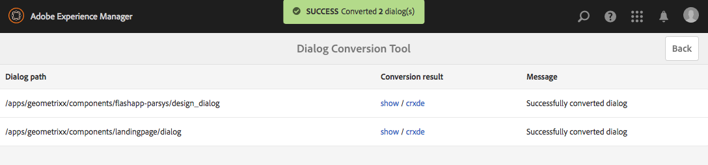

# 對話方塊轉換工具{#dialog-conversion-tool}

對話方塊轉換工具可協助擴充現有的元件，這些元件僅針對傳統UI（以ExtJS為基礎）或以Granite UI和Coral 2為基礎定義對話方塊。 此工具會使用原始對話方塊，根據Granite UI和Coral 3，為標準UI建立重複的對話方塊。

此工具的目標是盡可能自動化升級、提高效率並減少錯誤。 但是，由於此工具無法涵蓋每種情況，因此無法完全自動化程式，使用者必須檢閱轉換的對話方塊，並可能進行其他調整。 此工具旨在協助您開始轉換程式，但並非完全控制轉換。

此工具會使用標準的Granite UI和Coral 3 UI來建立新對話方塊，但會略過無法轉換的部份。 因此，如果沒有符合該特定元件的規則，則生成的對話框可能包含原始對話框中的節點。 此外，轉換的元件可能具有一些未轉換的屬性，因為沒有適當的規則可以轉換它們。

>[!CAUTION]
>
>此工具無法涵蓋每種情形，因為其轉換規則並非詳盡無遺，而且會盡力操作。 它會轉換最常用的元素和屬性，但在處理自訂或高度專業化的對話方塊時，轉換將不完整。 **轉換的對話方塊可能需要進行額外調整，而且必須審閱所有轉換。**

>[!NOTE]
>
>由於傳統UI不再開發或增強，Adobe建議客戶升級至預設的Granite UI使用者介面，以利用最新技術。
>
>雖然移轉至最新平台通常很好，但從Coral 2移轉至Coral 3並不重要。 不過，任何新專案都應以Coral 3為基礎。

## 下載並安裝對話方塊轉換工具 {#download-and-install-the-dialog-conversion-tool}

對話方塊轉換工具已變成開放原始碼，可透過GitHub存取。

GITHUB代碼

您可以在GitHub上找到此頁面的程式碼

* [在GitHub上開啟aem-dialog-conversion專案](https://github.com/Adobe-Marketing-Cloud/aem-dialog-conversion)
* 將專案下載為 [ZIP檔案](https://github.com/Adobe-Marketing-Cloud/aem-dialog-conversion/archive/master.zip)

>[!NOTE]
>
>AEM不隨對話方塊轉換工具一起提供。 您必須下載並安裝它才能使用它。

請依照下列步驟安裝對話方塊轉換工具。

1. 從「對話轉換工具 [GitHub」專案下載套件](https://github.com/Adobe-Marketing-Cloud/aem-dialog-conversion/releases)。
1. 在您的例項上安裝套件。 有關包管理的詳細資訊，請 [參閱How to Work With Packages](/help/sites-administering/package-manager.md)。

## 轉換對話框 {#converting-a-dialog}

此工具可在內容樹中與原始對話框相同的位置建立相應的Granite UI / Coral 3對話框來轉換對話框。 在Granite UI / Coral 2對話方塊中，這些對話方塊會複製到備份位置(對話方塊節點名稱會附加 `.coral2` 尾碼)，以免被覆寫。 此工具可轉換設計對話框以及編輯對話框。

使用下列步驟轉換一或多個對話方塊：

1. 開啟「 **轉換** 」控制台，可從 **Global Navigation** - **Tools** - ****>操作對話框：

   `https://<hostname>:<port>/libs/cq/dialogconversion/content/console.html`

   

1. 輸入所需路徑，例如 `/apps/geometrixx/components`。 您也可以輸入單一對話方塊的直接路徑，例如 `/apps/geometrixx/components/lead`。

   

1. 選擇「 **顯示對話框** 」以顯示該位置下的所有對話框。

   

   表格列出輸入路徑下的所有現有舊對話框。 每個對話框都列出其類型。 類型包括：

   * **** 經典：具有節點名 `cq:Dialog``dialog` 稱或 `design_dialog`
   * **** 珊瑚2:在其子內 `cq:dialog` 容節 `cq:design_dialog` 點上具有Granite UI / Coral 2資源類型的命名或節點
   每一行都包含一個用於查看對話框的連結和一個用於查看其節點結構的CRXDE Lite連結。

   >[!NOTE]
   >
   >完全沒有傳統UI或Coral 2對話方塊的元件（亦即，它們是使用Granite UI / Coral 3所設計的元件）不會列出。

1. 選取一或多個對話方塊進行轉換，然後按一下或點選「轉 **換X」對話方塊** ，開始轉換程式。

   

1. 所選對話方塊會列出其轉換結果。 如果轉換成功，則該行包含用於查看轉換對話框或在CRXDE Lite中開啟該對話框的連結。

   按一下或點 **選「上** 一步」以返回「對話轉換工具」。

   

1. 回到「對話框轉換工具」中，已轉換的對話框不再顯示在清單中。 但請注意，找到的對話框總數仍會列出，包括已轉換的對話框數，即表格中的行數不一定與找到的行數匹配。

   

1. 選中「顯 **示已轉換的對話框** 」選項，以顯示位於已轉換的指定路徑上的對話框。

   

   如果對話框已經轉換，則還會為轉換的對話框提供連結。 如果已有同級的Granite UI / Coral 3對話框可用，則視為轉換對話框。

## 對話框重寫規則 {#dialog-rewrite-rules}

該對話轉換工具基於圖重寫的概 **念**，包括通過應用重寫規則來轉換主題圖。 重寫規則是模式與替換圖形的配對。 規則會比對主題圖中特定子圖的發生次數，然後加以取代。 如需圖形重 [寫的詳細資訊](https://en.wikipedia.org/wiki/Graph_rewriting) ，請參閱https://en.wikipedia.org/wiki/Graph_rewriting。

對話框轉換工具使用此方法將指定的舊對話框樹（Classic或Granite UI / Coral 2）重寫為其Granite UI / Coral 3對應項。 這具有的優點是轉換非常靈活，而且即使考慮到複雜的元件，因為匹配是在實際子樹上完成的，而不只是單個節點或屬性。

### 演算法 {#algorithm}

重寫算法將要重寫的樹和一組重寫規則作為參數。 它以預先順序遍歷樹，並且對每個節點檢查規則是否適用於根在該節點上的子樹。 符合的第一個規則會套用至該子樹，以便重寫。 然後，遍歷會從根目錄重新啟動。 當整個樹被遍歷且沒有規則匹配任何子樹時，算法就會停止。 作為一種優化措施，該算法會跟蹤一組最終的節點，因此無需在後續遍歷中重新檢查是否匹配。 重寫規則決定了哪些節點是最終的，哪些節點應該由算法的未來通過來重新訪問。

轉換的入口點是，在 `DialogConversionServlet`POST要求中註冊 `/libs/cq/dialogconversion/content/convert.json`。 它接受路徑請求參數，此參數是一個陣列，包含應轉換的對話框的路徑。 對於每個對話框，Servlet然後通過應用所有定義的對話框重寫規則來重寫相應的對話框樹。

### 重寫規則類型 {#rewrite-rule-types}

重寫規則可以用兩種不同的方式定義，其中一種為：

* JCR節點結構——基 [於節點的重寫規則](/help/sites-developing/dialog-conversion.md#node-based-rewrite-rules)

* Java類實現特定介面——基 [於Java的重寫規則](/help/sites-developing/dialog-conversion.md#java-based-rewrite-rules)

有些 [是現成可用的](#provided-rewrite-rules)，但您也可以定義您自己的自訂規則。 [也提供範例重寫規則](/help/sites-developing/dialog-conversion.md#sample-rewrite-rules) ,

通常，單一對話框重寫規則負責重寫單個對話框元素，例如路徑瀏覽器輸入欄位。

>[!CAUTION]
>
>演算法不會偵測到重寫回圈，因 **此重寫規則不能以循環方式重寫樹**。

### 基於節點的重寫規則 {#node-based-rewrite-rules}

對話框重寫規則可以用節點和屬性來定義。

```xml
rule
  - jcr:primaryType = nt:unstructured
  - cq:rewriteRanking = 4
  + patterns
    - jcr:primaryType = nt:unstructured
    + foo
      - ...
      + ...
    + foo1
      - ...
      + ...
  + replacement
    + bar
      - ...
      + ...
```

此範例定義包含兩 **種模式** (根植於和的樹 `foo` )和替 `foo1`換 **(根植於的樹**`bar`)的規則。 模式樹和替換樹是包含節點和屬性的任意樹。 如果任何已定義的模式都匹配，則規則與子樹匹配。 為了匹配模式，主題樹必須包含與模式相同的節點（匹配名稱），並且模式中定義的所有屬性都必須匹配樹的屬性。

如果匹配，則匹配的子樹（稱為原始樹）將被替換。 替換樹可以定義映射的屬性，這些屬性將繼承原始樹中某個屬性的值。 它們必須是類型， `String` 並具有下列格式：

`${<path>}`

如果引用的屬性不存在於原始樹中，則會忽略該屬性。 或者，也可以為該情況指定預設值（僅對字串屬性可能）:

`${<path>:<default>}`

包含&#39; `:`&#39;字元的屬性可以單引號，以避免與提供預設值產生衝突。 如果運算式前置詞為&#39; `!`&#39;，則會否定布林屬性。 映射的屬性可以是多值的，在這種情況下，這些屬性將被分配到匹配樹中第一個屬性的值。

例如，以下屬 `one` 性將被指派為匹配原始樹 `./two/three` 的屬性值。

```xml
...
  + replacement
    + bar
      - one = ${./two/three}
      - negated = !${./some/boolean/prop}
      - default = ${./some/prop:default}
      - multi = [${./prop1}, ${./prop2}]
```

規則也支援下列選用屬性。

* `cq:rewriteOptional` (布林值)

   在模式節點上設定此屬性，以指出該節點不必存在，模式才能符合

* `cq:rewriteRanking` （整數）

   在規則節點上設定此屬性，以影響應用規則的順序。 這對於確保處理更多特定結構的規則不會被更一般的結構覆寫非常有用。 排名較低的規則優先於排名較高的規則。 依預設，所有規則都會 `Integer.MAX_VALUE` 接收為其排名。

替換樹還支援以下特殊屬性(以開頭命名 `cq:rewrite`):

* `cq:rewriteMapChildren` (字串)

   包含此屬性的節點將接收由屬性值引用的原始樹中節點的子代的副本(如 `cq:rewriteMapChildren=./items`)。

* `cq:rewriteFinal` (布林值)

   這是一項最佳化措施，告訴演算法包含此屬性的節點是final，不需要重新檢查是否符合重寫規則。 當置於替換節點本身時，整個替換樹被視為最終替換。
* `cq:rewriteCommonAttrs` (布林值)

   在替換節點( `rule`/ `replacement`)上設定此屬性，將原始根節點的相關屬性映射到複製根中的Granite公共屬性等效項。 它將通過複製／建立目標上的子節 `granite:data` 點並在其中寫入屬性來處理數 `data-*` 據屬性。
* `cq:rewriteRenderCondition` (布林值)

   在替換節點( `rule`/ `replacement`)上設定此屬性，將任何Granite渲染條件(或 `rendercondition` )子節點從原始根節點複製到複製根 `granite:rendercondition``granite:rendercondition` 的子節點。

此外，可將節 `cq:rewriteProperties` 點添加到替換節點，以定義結果中映射屬性的字串重寫。 節點將從替換中刪除。 節點的屬 `cq:rewriteProperties` 性必須命名與要重寫的屬性相同，並接受包含兩個參數的字串陣列：

* `pattern`:比對規則運算式，例如 `"(?:coral-Icon-)(.+)"`

* `replacement`:提供給匹配 `replaceAll` 器功能，例如 `"$1"`

以下是將Coral 2圖示屬性重寫為Coral 3等效項的範例：

```xml
...
  + replacement
    + bar
      - icon = ${./icon}
      + cq:rewriteProperties
       - icon = [(?:coral-Icon--)(.+), $1]
```

#### 定義您自己的基於節點的重寫規則 {#defining-your-own-node-based-rewrite-rules}

提供的重寫規則定義於：

`/libs/cq/dialogconversion/rules`

這些規則在此位置進一步劃分為傳統重寫規則和Coral 2重寫規則的資料夾：

`/libs/cq/dialogconversion/rules/classic`

`/libs/cq/dialogconversion/rules/coral2`

在以下網址提供一組規則可覆寫這些規則：

`/apps/cq/dialogconversion/rules`

您可以複製 `/libs/cq/dialogconversion/rules` 到， `/apps` 然後修改現有規則和／或將新規則添加到此新實例&#39;&#39;。

### 基於Java的重寫規則 {#java-based-rewrite-rules}

更複雜的重寫規則可以定義為暴露介面的OSGi服務的Java類 `com.adobe.cq.dialogconversion.DialogRewriteRule`。

此類必須實作下列方法：

```java
boolean matches(Node root) throws RepositoryException;
Node applyTo(Node root, Set<Node> finalNodes) throws DialogRewriteException, RepositoryException;
int getRanking();
```

如果 `matches` 規則與所 `true` 提供根節點上的子樹匹配，則必須返回該方法。 如果規則匹配，則樹重寫算法隨後將調用該方法， `applyTo` 該方法必須重寫在指定根節點上根的子樹。 通常，此方法會臨時更名原始樹，將新樹作為原始樹的父節點（使用其節點和屬性）的新子節點，最後刪除原始樹。 有關詳細資訊，請參見介面的Javadoc `com.adobe.cq.dialogconversion.DialogRewriteRule` 中。

#### 詳細資訊- Javadocs {#further-information-javadocs}

有關詳細資訊，請參閱的Javadoc [`com.adobe.cq.dialogconversion`](https://adobe-marketing-cloud.github.io/aem-touchui-dialogconversion-samples/javadoc/)。

#### 定義您自己的Java重寫規則 {#defining-your-own-java-based-rewrite-rules}

下列類別顯示實作介面的自訂重寫規則范 `com.adobe.cq.dialogconversion.DialogRewriteRule` 例。

```java
@Component
@Service
public class CustomDialogRewriteRule implements DialogRewriteRule {

    public boolean matches(Node root) throws RepositoryException {
        // ...
    }

    public Node applyTo(Node root, Set<Node> finalNodes) throws DialogRewriteException, RepositoryException {
        // ...
    }

    int getRanking() {
        // ...
    }

}
```

或者，您也可以延伸 `com.adobe.cq.dialogconversion.AbstractDialogRewriteRule` 為下方。 抽象類實現了 `getRanking` 該方法，並使用服 `service.ranking` 務的OSGi屬性確定規則的排名。

```java
@Component
@Service
@Properties({
        @Property(name="service.ranking", intValue = 10)
})
public class CustomDialogRewriteRule extends AbstractDialogRewriteRule {

    public boolean matches(Node root) throws RepositoryException {
        // ...
    }

    public Node applyTo(Node root, Set<Node> finalNodes) throws RewriteException, RepositoryException {
        // ...
    }

}
```

### 提供的重寫規則 {#provided-rewrite-rules}

套件 `cq-dialog-conversion-content` 包含數個預先定義的重寫規則。 如需傳統UI Widget，請參 [閱使用xtypes](/help/sites-developing/xtypes.md) ，以取得詳細資訊)。

<table>
 <tbody>
  <tr>
   <td><strong>規則</strong></td>
   <td><strong>舊元件</strong></td>
   <td><strong>Granite UI / Coral 3取代</strong></td>
  </tr>
  <tr>
   <td><code>com.adobe.cq.dialogconversion.rules.CqDialogRewriteRule</code></td>
   <td>類型的節點 <code>cq:Dialog</code>，處理不同子結構</td>
   <td><p>使 <code>granite/ui/components/foundation/container</code> 用或版 <code>fixedcolumns</code> 面 <code>tabs</code> 的</p> <p>該對話框的實際元件被複製並在算法的後續通路中重寫。</p> </td>
  </tr>
  <tr>
   <td><code>com.adobe.cq.dialogconversion.rules.IncludeRule</code></td>
   <td>xtype = <code>cqinclude</code></td>
   <td>參考節點被複製到Granite UI/Coral 3對話方塊，並（可能）隨後由演算法重寫。</td>
  </tr>
  <tr>
   <td><code>com.adobe.cq.dialogconversion.rules.MultifieldRewriteRule</code></td>
   <td>xtype = <code>multifield</code></td>
   <td><p>A <code>granite/ui/components/coral/foundation/form/multifield</code></p> <p>子節 <code>fieldConfig</code> 點（如果有的話）被單獨重寫，因此不限制受支援的元件。</p> </td>
  </tr>
  <tr>
   <td><code>/libs/cq/dialogconversion/rules/classic</code></td>
   <td><code class="code">button
      checkbox
      colorfield
      combobox
      componentselector
      datetime
      fieldset
      fileupload
      hidden
      numberfield
      panel
      password
      pathfield
      radio
      radiogroup
      select
      sizefield
      tabpanel
      tags
      textarea
      textfield</code></td>
   <td> </td>
  </tr>
  <tr>
   <td><code>/libs/cq/dialogconversion/rules/coral2</code></td>
   <td><code class="code">actionfield
      autocomplete
      button
      checkbox
      collapsible
      colorpicker
      container
      datepicker
      fieldset
      fileupload
      fixedcolumns
      heading
      hidden
      hyperlink
      include
      multifield
      nestedcheckboxlist
      nestedcheckboxlist-checkbox
      numberfield
      password
      pathbrowser
      radio
      radiogroup
      reset
      select
      submit
      switch
      tabs
      tags
      text
      textarea
      textfield
      userpicker
      well</code></td>
   <td> </td>
  </tr>
 </tbody>
</table>

### 重寫規則範例 {#sample-rewrite-rules}

GITHUB代碼

您可以在GitHub上找到此頁面的程式碼

* [在GitHub上開啟aem-touchui-dialogconversion-samples專案](https://github.com/Adobe-Marketing-Cloud/aem-touchui-dialogconversion-samples)
* 將專案下載為 [ZIP檔案](https://github.com/Adobe-Marketing-Cloud/aem-touchui-dialogconversion-samples/archive/master.zip)

