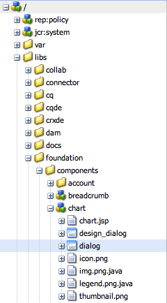

# 對話框編輯器{#dialog-editor}

對話框編輯器提供圖形介面，可輕鬆建立和編輯對話框和支架。

要查看其工作原理，請轉至CRXDE Lite，開啟瀏覽器樹，然 `/libs/foundation/components/chart` 後按兩下節點 `dialog`:

對話框節點將在對話框編輯器 **中開啟**:

## 使用者介面概觀 {#user-interface-overview}

對話框編輯器介面由四個窗格組成：

* 浮動 **視窗**，位於左上角。 此窗格包含可用於建立對話方塊的Widget，例如標籤面板、文字欄位、選擇清單和按鈕。 按一下所要的分隔列，即可展開浮動視窗中的不同類別。
* 結構 **窗格** ，位於左下角。 此窗格顯示構成對話框定義的節點的層次結構。 在CRXDE Lite或CRX Content Explorer中展開對話方塊節點，即可看到相同的結構。
* 轉 **換窗格** ，位於窗口的中央。 此窗格顯示如何將結構窗格中定義的對話框定義轉換為實際對話框。
* 屬性 **窗格** 。 此窗格顯示結構窗格中當前突出顯示的節點的屬性。

### 使用對話框編輯器 {#using-the-dialog-editor}

若要建立對話方塊，使用者會從浮動視窗拖放元素至結構窗格，並置入對話框定義階層中的位置。

當所要的結構完成後，使用者會按一 **下轉譯窗格頂端的**「儲存」。

>[!CAUTION]
>
>請注意，對話框編輯器用於建立對話框相對簡單，可能無法編輯更複雜的對話框定義。 如果對話框編輯器不允許編輯對話框結構，則必須通過使用CRXDE Lite或CRX內容瀏覽器直接編輯節點結構來建立和／或手動編輯對話框定義。

### 建立新對話框 {#creating-a-new-dialog}

****&#x200B;要建立新對話框，您需要選擇所需的元件，請按一下「創 **建……」。然後**&#x200B;建立對話框…….

輸入所需的詳細資料，然後按一 **下「全部儲存** 」 —— 現在您可以連按兩下對話方塊，以使用編輯器開啟它。

### 使用Scafdowl的對話框編輯器 {#using-the-dialog-editor-for-scaffolds}

Scaffold是包含表單的特殊頁面，可在單一步驟中填入並提交。 這可讓您使用輸入的內容快速建立頁面。

構成支架的表單由對話框定義，就像正常對話框一樣，儘管它以不同的形式出現在支架頁面上。 由於對話框定義用於定義支架，因此可以使用對話框編輯器來設計支架。 請注意，以這種方式使用對話框編輯器時，渲染窗格仍將以對話框的形式顯示對話框定義，而不是以腳手架的形式顯示。

有關使  用對話框編輯器建立支架的詳細資訊，請參閱支架。
