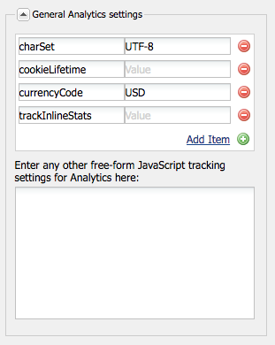

# 自訂Adobe Analytics架構{#customizing-the-adobe-analytics-framework}

Adobe Analytics架構會決定使用Adobe Analytics追蹤的資訊。 若要自訂預設架構，您可使用javascript來新增自訂追蹤、整合Adobe Analytics外掛程式，以及在用於追蹤的架構內變更一般設定。

## 關於為架構產生的javascript {#about-the-generated-javascript-for-frameworks}

頁面與Adobe Analytics架構相關聯時，該頁面包括 [Analytics模組的參考](/help/sites-administering/adobeanalytics.md)，則會自動為頁面產生analytics.sitecatalyst.js檔案。

頁面中的javascript會建立 `s_gi`物件(s_code.js Adobe Analytics程式庫所定義)，並指派值給其屬性。 對象實例的名稱為 `s`. 本節中提供的程式碼範例會對此提供數個參考 `s` 變數。

下列范常式式碼與analytics.sitecatalyst.js檔案中的程式碼類似：

```
var s_account = "my_sitecatalyst_account";
var s = s_gi(s_account);
s.fpCookieDomainPeriods = "3";
s.currencyCode= 'USD';
s.trackInlineStats= true;
s.linkTrackVars= 'None';
s.charSet= 'UTF-8';
s.linkLeaveQueryString= false;
s.linkExternalFilters= '';
s.linkTrackEvents= 'None';
s.trackExternalLinks= true;
s.linkDownloadFileTypes= 'exe,zip,wav,mp3,mov,mpg,avi,wmv,doc,pdf,xls';
s.linkInternalFilters= 'javascript:,'+window.location.hostname;
s.trackDownloadLinks= true;

s.visitorNamespace = "mynamespace";
s.trackingServer = "xxxxxxx.net";
s.trackingServerSecure = "xxxxxxx.net";

/* Plugin Config */
/*
s.usePlugins=false;
function s_doPlugins(s) {
    //add your custom plugin code here
}
s.doPlugins=s_doPlugins;
*/
```

當您使用自訂javascript程式碼來自訂架構時，您會變更此檔案的內容。

## 設定Adobe Analytics屬性 {#configuring-adobe-analytics-properties}

Adobe Analytics中有許多預先定義的變數，可在架構上設定。 此 **charset**, **cookieLifetime**, **currencyCode** 和 **trackInlineStats** 變數會包含在 **一般Analytics設定** 清單。


您可以新增變數名稱和值至清單。 這些預先定義的變數和您新增的任何變數都可用來設定 `s` analytics.sitecatalyst.js檔案中的物件。 下列範例顯示新增 `prop10` 值屬性 `CONSTANT` 以javascript程式碼表示：

```
var s_account = "my_sitecatalyst_account";
var s = s_gi(s_account);
s.fpCookieDomainPeriods = "3";
s.currencyCode= 'USD';
s.trackInlineStats= true;
s.linkTrackVars= 'None';
s.charSet= 'UTF-8';
s.linkLeaveQueryString= false;
s.linkExternalFilters= '';
s.linkTrackEvents= 'None';
s.trackExternalLinks= true;
s.linkDownloadFileTypes= 'exe,zip,wav,mp3,mov,mpg,avi,wmv,doc,pdf,xls';
s.prop10= 'CONSTANT';
s.linkInternalFilters= 'javascript:,'+window.location.hostname;
s.trackDownloadLinks= true;

s.visitorNamespace = "mynamespace";
s.trackingServer = "xxxxxxx.net";
s.trackingServerSecure = "xxxxxxx.net";
```

請依照下列程式將變數新增至清單：

1. 在Adobe Analytics架構頁面上，展開 **一般Analytics設定** 的上界。
1. 在變數清單下方，按一下「新增項目」 ，將新變數新增至清單。
1. 在左側儲存格中，輸入變數的名稱，例如 `prop10`.

1. 在右側欄中，輸入變數的值，例如 `CONSTANT`.

1. 若要移除變數，請按一下變數旁的(-)按鈕。

>[!NOTE]
>
>輸入變數和值時，請確定其格式和拼寫正確，或 **不會傳送呼叫** 搭配正確的值/變陣列。 變數和值拼錯甚至可以防止呼叫發生。
>
>請洽詢您的Adobe Analytics代表，確定這些變數已正確設定。

>[!CAUTION]
>
>此清單中的部分變數為 **強制** 為了讓Adobe Analytics呼叫正常運作，(例如 **currencyCode**, **charSet**)
>
>因此，即使從架構本身移除，在進行Adobe Analytics呼叫時，仍會附加預設值。

### 將自訂javascript新增至Adobe Analytics架構 {#adding-custom-javascript-to-an-adobe-analytics-framework}

中的免費javascript方塊 **一般Analytics設定** 區域可讓您將自訂程式碼新增至Adobe Analytics架構。



您新增的程式碼會附加至analytics.sitecatalyst.js檔案。 因此，您可以存取 `s` 變數，此為的例項 `s_gi` 在 `s_code.js`. 例如，新增下列程式碼等同於新增名為 `prop10` 值 `CONSTANT`，即上一節中的範例：

`s.prop10= 'CONSTANT';`

中的程式碼 [analytics.sitecatalyst.js](/help/sites-developing/extending-analytics-components.md) 檔案(包括Adobe Analytics的內容 `s-code.js` 檔案)包含下列程式碼：

`if (s.usePlugins) s.doPlugins(s)`

下列程式示範如何使用javascript方塊來自訂Adobe Analytics追蹤。 如果您的javascript需要使用Adobe Analytics外掛程式， [整合](/help/sites-administering/adobeanalytics.md) 進入AEM。

1. 將下列javascript程式碼新增至方塊，以便 `s.doPlugins` 執行中：

   ```
   s.usePlugins=true;
   function s_doPlugins(s) {
       //add your custom code here
   }
   s.doPlugins=s_doPlugins;
   ```

   >[!CAUTION]
   >
   >如果您想要在Adobe Analytics呼叫中傳送變數，這些變數已以某種方式自訂，無法透過基本拖放介面或透過Adobe Analytics檢視中的內嵌javascript完成，則需使用此程式碼。
   >
   >如果自訂變數位於s_doPlugins函式之外，則在Adobe Analytics呼叫中會以*undefined*傳送

1. 在 **s_doPlugins** 函式。

下列範例會使用通用的分隔符號「|」，以階層順序串連在頁面上擷取的資料。

Adobe Analytics架構具有下列設定：

* 此 `prop2` Adobe Analytics變數已對應至 `pagedata.sitesection` 網站屬性。

* 此 `prop3` Adobe Analytics變數已對應至 `pagedata.subsection` 網站屬性。

* 下列程式碼會新增至免費的javascript方塊：

   ```
   s.usePlugins=true;
    function s_doPlugins(s) {
    s.prop1 = s.prop2+'|'+s.prop3;
    }
    s.doPlugins=s_doPlugins;
   ```

* 造訪使用架構的網頁時（或在編輯模式中重新載入或預覽頁面），會執行對Adobe Analytics的呼叫。

例如，下列值會在Adobe Analytics中產生：


### 新增所有Adobe Analytics架構的全域自訂程式碼 {#adding-global-custom-code-for-all-adobe-analytics-frameworks}

提供已整合至所有Adobe Analytics架構的自訂Javascript程式碼。 頁面的Adobe Analytics架構不包含自訂 [自由格式javascript](/help/sites-administering/adobeanalytics.md)，則/libs/cq/analytics/components/sitecatalyst/config.js.jsp指令碼產生的javascript會附加至 [analytics.sitecatalyst.js](/help/sites-administering/adobeanalytics.md) 檔案。 預設情況下，指令碼沒有作用，因為它被注釋掉。 程式碼也會設定 `s.usePlugins` to `false`:

```
/* Plugin Config */
/*
s.usePlugins=false;
function s_doPlugins(s) {
    //add your custom plugin code here
}
s.doPlugins=s_doPlugins;
*/
```

analytics.sitecatalyst.js檔案中的程式碼(包括Adobe Analytics s_code.js檔案的內容)包含下列程式碼：

if(s.usePlugins)s.doPlugins(s)

因此，您的javascript應設定 `s.usePlugins` to `true` 讓程式碼 `s_doPlugins` 函式。 若要自訂程式碼，請使用您自己的javascript來覆蓋config.js.jsp檔案。 如果您的javascript需要使用Adobe Analytics外掛程式， [整合](/help/sites-administering/adobeanalytics.md) 進入AEM。

>[!NOTE]
>
>請勿編輯/libs/cq/analytics/components/sitecatalyst/config.js.jsp檔案。 某些AEM升級或維護任務可以重新安裝原始檔案，移除您的變更。

1. 在CRXDE Lite中，建立/apps/cq/analytics/components資料夾結構：

   1. 以滑鼠右鍵按一下/apps資料夾，然後按一下「建立>建立資料夾」。
   1. 指定 `cq` 作為資料夾名稱，然後按一下「確定」。
   1. 同樣地，請建立 `analytics` 和 `components` 資料夾。

1. 以滑鼠右鍵按一下 `components` 建立的資料夾，然後按一下「建立」(Create)>「建立元件」(Create Component)。 指定下列屬性值：

   * 標籤: `sitecatalyst`
   * 標題: `sitecatalyst`
   * 超級類型: `/libs/cq/analytics/components/sitecatalyst`
   * 群組: `hidden`

1. 重複按「下一步」，直到啟用「確定」按鈕，然後按一下「確定」。

   sitecatalyst元件包含自動建立的sitecatalyst.jsp檔案。

1. 以滑鼠右鍵按一下sitecatalyst.jsp檔案，然後按一下「刪除」。

1. 以滑鼠右鍵按一下sitecatalyst元件，然後按一下「建立>建立檔案」。 指定名稱 `config.js.jsp` 然後按一下「確定」。

   config.js.jsp檔案會自動開啟以供編輯。

1. 將下列文字新增至檔案，然後按一下「全部儲存」 :

   ```java
   <%@page session="true"%>
   /* Plugin Config */
   s.usePlugins=true;
   function s_doPlugins(s) {
       //add your custom plugin code here
   }
   s.doPlugins=s_doPlugins;
   ```

   /apps/cq/analytics/components/sitecatalyst/config.js.jsp指令碼產生的javascript程式碼現在會插入到analytics.sitecatalyst.js檔案中，以用於使用Adobe Analytics架構的所有頁面。

1. 新增您要在 `s_doPlugins` ，然後按一下「全部保存」。

>[!CAUTION]
>
>如果頁面架構的自由格式javascript中有任何文字（甚至僅限空白字元），則會忽略config.js.jsp。

### 在AEM中使用Adobe Analytics外掛程式 {#using-adobe-analytics-plugins-in-aem}

取得Adobe Analytics外掛程式的javascript程式碼，並將它們整合至AEM的Adobe Analytics架構中。 將代碼添加到類別的客戶端庫資料夾 `sitecatalyst.plugins` 以便供您的自訂javascript程式碼使用。

例如，如果您整合 `getQueryParams` 外掛程式，您可以從 `s_doPlugins` 函式。 下列范常式式碼會將查詢字串傳送至 **&quot;pid&quot;** 從反向連結的URL為 **eVar1**，即觸發Adobe Analytics呼叫時。

```
s.usePlugins=true;
function s_doPlugins(s) {
   // take the query string from the referrer
   s.eVar1=s.getQueryParam('pid','',document.referrer);
}
s.doPlugins=s_doPlugins;
```

AEM會安裝下列Adobe Analytics外掛程式，以便預設提供：

* getQueryParam()
* getPreviousValue()
* split()

/libs/cq/analytics/clientlibs/sitecatalyst/plugins用戶端程式庫資料夾將這些外掛程式納入sitecatalyst.plugins類別中。

>[!NOTE]
>
>為外掛程式建立新的用戶端程式庫資料夾。 請勿將外掛程式新增至 `/libs/cq/analytics/clientlibs/sitecatalyst/plugins` 檔案夾。 此實務可確保您對 `sitecatalyst.plugins` 在AEM重新安裝或升級任務期間不會覆寫類別。

請依照下列步驟為外掛程式建立用戶端程式庫資料夾。 您只需執行此程式一次。 要將插件添加到客戶端庫資料夾，請使用後續過程。

1. 在網頁瀏覽器中，開啟CRXDE Lite。 ([http://localhost:4502/crx/de](http://localhost:4502/crx/de))

1. 以滑鼠右鍵按一下/apps/my-app/clientlibs資料夾，然後按一下「建立>建立節點」。 輸入以下屬性值，然後按一下「確定」：

   * 名稱：用戶端程式庫資料夾的名稱，例如my-plugins

   * 類型：cq:ClientLibraryFolder

1. 選取您剛建立的用戶端程式庫資料夾，並使用右下方的屬性列來新增下列屬性：

   * 名稱：類別
   * 類型：字串
   * 值：sitecatalyst.plugins
   * 多重：已選取

   在「編輯」窗口中按一下「確定」以確認屬性值。

1. 按一下右鍵剛建立的客戶端庫資料夾，然後按一下「建立」>「建立檔案」。 對於檔案名，鍵入js.txt，然後按一下「確定」。

1. 按一下「全部儲存」 。

請依照下列程式取得外掛程式程式碼、將程式碼儲存在AEM存放庫中，並將程式碼新增至您的用戶端程式庫資料夾。

1. 登入 [sc.omniture.com](https://sc.omniture.com) 使用您的Adobe Analytics帳戶。
1. 在登錄頁面上，前往「說明>說明首頁」。
1. 在左側的目錄中，按一下「實作外掛程式」。
1. 按一下您要新增的外掛程式連結，當頁面開啟時，找出外掛程式的Javascript原始碼，然後選取程式碼並加以複製。

1. 以滑鼠右鍵按一下用戶端程式庫資料夾，然後按一下「建立>建立檔案」。 對於檔案名稱，輸入要整合的外掛程式名稱，後面接著.js，然後按一下「確定」。 例如，如果您整合getQueryParam外掛程式，請將檔案命名為getQueryParam.js。

   建立檔案時，檔案會開啟供編輯。

1. 將外掛程式JavaScript程式碼貼入檔案中，按一下「全部儲存」，然後關閉檔案。

1. 從用戶端程式庫資料夾開啟js.txt檔案。

1. 在新行中，新增包含外掛程式的檔案名稱，例如getQueryParam.js。 然後，按一下「全部儲存」並關閉檔案。

>[!NOTE]
>
>使用外掛程式時，請務必也整合任何支援外掛程式，否則外掛程式javascript將無法辨識其對支援外掛程式中的函式所進行的呼叫。 例如， getPreviousValue()外掛程式需要split()外掛程式才能正常運作。
>
>需要將支援外掛程式的名稱新增至 **js.txt** 還有。
