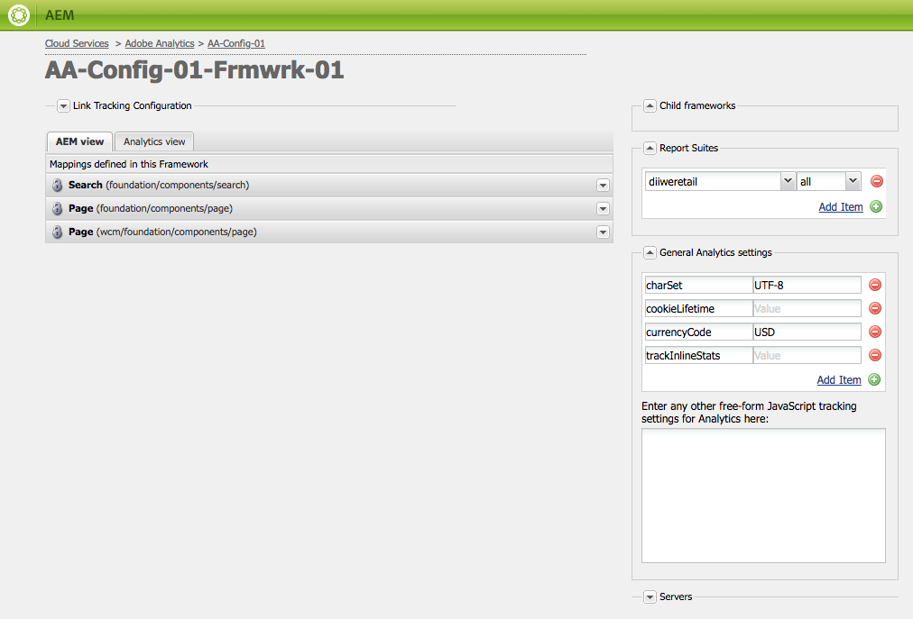

# 自訂Adobe Analytics框架{#customizing-the-adobe-analytics-framework}

Adobe Analytics架構會決定使用Adobe Analytics追蹤的資訊。 若要自訂預設架構，請使用JavaScript新增自訂追蹤、整合Adobe Analytics外掛程式，以及變更用於追蹤之架構內的一般設定。

## 關於為框架產生的JavaScript {#about-the-generated-javascript-for-frameworks}

當頁面與Adobe Analytics架構相關聯，且頁面包含[對Analytics模組](/help/sites-administering/adobeanalytics.md)的參考時，系統會自動為頁面產生analytics.sitecatalyst.js檔案。

頁面中的JavaScript會建立`s_gi`物件(s_code.js Adobe Analytics程式庫所定義)並指派值給其屬性。 物件執行個體的名稱為`s`。 本節中顯示的程式碼範例會對此`s`變數提供數個參考。

以下範常式式碼類似於analytics.sitecatalyst.js檔案中的程式碼：

```
var s_account = "my_sitecatalyst_account";
var s = s_gi(s_account);
s.fpCookieDomainPeriods = "3";
s.currencyCode= 'USD';
s.trackInlineStats= true;
s.linkTrackVars= 'None';
s.charSet= 'UTF-8';
s.linkLeaveQueryString= false;
s.linkExternalFilters= '';
s.linkTrackEvents= 'None';
s.trackExternalLinks= true;
s.linkDownloadFileTypes= 'exe,zip,wav,mp3,mov,mpg,avi,wmv,doc,pdf,xls';
s.linkInternalFilters= 'javascript:,'+window.location.hostname;
s.trackDownloadLinks= true;

s.visitorNamespace = "mynamespace";
s.trackingServer = "xxxxxxx.net";
s.trackingServerSecure = "xxxxxxx.net";

/* Plugin Config */
/*
s.usePlugins=false;
function s_doPlugins(s) {
    //add your custom plugin code here
}
s.doPlugins=s_doPlugins;
*/
```

當您使用自訂JavaScript程式碼來自訂架構時，就會變更此檔案的內容。

## 設定Adobe Analytics屬性 {#configuring-adobe-analytics-properties}

Adobe Analytics中有數個預先定義的變數，可在架構上設定。 **charset**、**cookieLifetime**、**currencyCode**&#x200B;和&#x200B;**trackInlineStats**&#x200B;變數預設包含在&#x200B;**一般Analytics設定**&#x200B;清單中。



您可以將變數名稱和值新增至清單。 這些預先定義的變數以及您新增的任何變數，可用來設定analytics.sitecatalyst.js檔案中`s`物件的屬性。 下列範例顯示新增的值`CONSTANT`的`prop10`屬性在JavaScript程式碼中的表示方式：

```
var s_account = "my_sitecatalyst_account";
var s = s_gi(s_account);
s.fpCookieDomainPeriods = "3";
s.currencyCode= 'USD';
s.trackInlineStats= true;
s.linkTrackVars= 'None';
s.charSet= 'UTF-8';
s.linkLeaveQueryString= false;
s.linkExternalFilters= '';
s.linkTrackEvents= 'None';
s.trackExternalLinks= true;
s.linkDownloadFileTypes= 'exe,zip,wav,mp3,mov,mpg,avi,wmv,doc,pdf,xls';
s.prop10= 'CONSTANT';
s.linkInternalFilters= 'javascript:,'+window.location.hostname;
s.trackDownloadLinks= true;

s.visitorNamespace = "mynamespace";
s.trackingServer = "xxxxxxx.net";
s.trackingServerSecure = "xxxxxxx.net";
```

請使用下列程式將變數新增至清單：

1. 在您的Adobe Analytics架構頁面上，展開&#x200B;**一般Analytics設定**&#x200B;區域。
1. 在變數清單底下，按一下「新增專案」以新增變數至清單。
1. 在左側儲存格中輸入變數的名稱，例如`prop10`。

1. 在右側欄中，輸入變數的值，例如`CONSTANT`。

1. 若要移除變數，請按一下變數旁的(-)按鈕。

>[!NOTE]
>
>輸入變數和值時，請確定它們的格式和拼字正確，否則將不會傳送具有正確值/變陣列的&#x200B;**呼叫**。 拼錯的變數和值甚至可以防止呼叫發生。
>
>請洽詢您的Adobe Analytics代表，確保已正確設定這些變數。

>[!CAUTION]
>
>此清單中的部分變數是Adobe Analytics呼叫正常運作的&#x200B;**必要** （例如&#x200B;**currencyCode**、**charSet**）。
>
>因此，即使將它們從框架本身移除，當進行Adobe Analytics呼叫時，它們仍會附加預設值。

### 將自訂JavaScript新增至Adobe Analytics架構 {#adding-custom-javascript-to-an-adobe-analytics-framework}

**一般JavaScript設定**&#x200B;區域中的免費Analytics方塊可讓您將自訂程式碼新增到Adobe Analytics架構。


您新增的程式碼會附加至analytics.sitecatalyst.js檔案。 因此，您可以存取`s`變數，此變數是在`s_code.js`中定義的`s_gi` JavaScript物件的執行個體。 例如，新增下列程式碼等同於新增值為`CONSTANT`且名為`prop10`的變數，這是上一節的範例：

`s.prop10= 'CONSTANT';`

[analytics.sitecatalyst.js](/help/sites-developing/extending-analytics-components.md)檔案中的程式碼(包含Adobe Analytics `s-code.js`檔案的內容)包含下列程式碼：

`if (s.usePlugins) s.doPlugins(s)`

下列程式示範如何使用JavaScript方塊來自訂Adobe Analytics追蹤。 如果您的JavaScript需要使用Adobe Analytics外掛程式，請[將外掛程式](/help/sites-administering/adobeanalytics.md)整合至AEM。

1. 將下列JavaScript程式碼新增至方塊，以執行`s.doPlugins`：

   ```
   s.usePlugins=true;
   function s_doPlugins(s) {
       //add your custom code here
   }
   s.doPlugins=s_doPlugins;
   ```

   >[!CAUTION]
   >
   >如果您想要在Adobe Analytics呼叫中傳送已自訂的變數，而這些變數無法透過基本拖放介面或透過Adobe Analytics檢視中的內嵌JavaScript完成，則需要此程式碼。
   >
   >如果自訂變數在s_doPlugins函式之外，則在Adobe Analytics呼叫中會以*undefined*的形式傳送

1. 在&#x200B;**s_doPlugins**&#x200B;函式中新增您的JavaScript程式碼。

下列範例會使用「|」這個通用分隔符號，以階層順序串連頁面上擷取的資料。

Adobe Analytics架構的設定如下：

* `prop2` Adobe Analytics變數已對應至`pagedata.sitesection`網站屬性。

* `prop3` Adobe Analytics變數已對應至`pagedata.subsection`網站屬性。

* 下列程式碼已新增至免費JavaScript方塊：

  ```
  s.usePlugins=true;
   function s_doPlugins(s) {
   s.prop1 = s.prop2+'|'+s.prop3;
   }
   s.doPlugins=s_doPlugins;
  ```

* 瀏覽使用框架的網頁時（或在編輯模式中重新載入或預覽頁面），會執行對Adobe Analytics的呼叫。

例如，Adobe Analytics會產生下列值：


### 為所有Adobe Analytics架構新增全域自訂程式碼 {#adding-global-custom-code-for-all-adobe-analytics-frameworks}

提供整合至所有Adobe Analytics架構的自訂JavaScript程式碼。 當頁面的Adobe Analytics架構不含自訂[自由格式的JavaScript](/help/sites-administering/adobeanalytics.md)時，/libs/cq/analytics/components/sitecatalyst/config.js.jsp指令碼產生的JavaScript會附加至[analytics.sitecatalyst.js](/help/sites-administering/adobeanalytics.md)檔案。 根據預設，指令碼沒有任何效果，因為它會被標籤為註解。 程式碼也會將`s.usePlugins`設為`false`：

```
/* Plugin Config */
/*
s.usePlugins=false;
function s_doPlugins(s) {
    //add your custom plugin code here
}
s.doPlugins=s_doPlugins;
*/
```

analytics.sitecatalyst.js檔案中的程式碼(包括Adobe Analytics s_code.js檔案的內容)包含下列程式碼：

若為(s.usePlugins) s.doPlugins(s)

因此，您的JavaScript應將`s.usePlugins`設為`true`，以便執行`s_doPlugins`函式中的任何程式碼。 若要自訂程式碼，請以使用您自己JavaScript的檔案覆蓋config.js.jsp檔案。 如果您的JavaScript需要使用Adobe Analytics外掛程式，請[將外掛程式](/help/sites-administering/adobeanalytics.md)整合至AEM。

>[!NOTE]
>
>請勿編輯/libs/cq/analytics/components/sitecatalyst/config.js.jsp檔案。 某些AEM升級或維護工作可以重新安裝原始檔案，移除您的變更。

1. 在CRXDE Lite中，建立/apps/cq/analytics/components資料夾結構：

   1. 以滑鼠右鍵按一下/apps資料夾，然後按一下「建立>建立資料夾」。
   1. 指定`cq`做為資料夾名稱，然後按一下[確定]。
   1. 同樣地，建立`analytics`和`components`資料夾。

1. 用滑鼠右鍵按一下您建立的`components`資料夾，然後按一下「建立>建立元件」。 指定下列屬性值：

   * 標籤： `sitecatalyst`
   * 標題： `sitecatalyst`
   * 超級型別： `/libs/cq/analytics/components/sitecatalyst`
   * 群組： `hidden`

1. 重複按「下一步」，直到啟用「確定」按鈕，然後按一下「確定」。

   sitecatalyst元件包含自動建立的sitecatalyst.jsp檔案。

1. 以滑鼠右鍵按一下sitecatalyst.jsp檔案，然後按一下刪除。

1. 以滑鼠右鍵按一下sitecatalyst元件，然後按一下「建立>建立檔案」。 指定名稱`config.js.jsp`，然後按一下[確定]。

   config.js.jsp檔案會自動開啟以進行編輯。

1. 將下列文字新增至檔案，然後按一下「儲存全部」：

   ```java
   <%@page session="true"%>
   /* Plugin Config */
   s.usePlugins=true;
   function s_doPlugins(s) {
       //add your custom plugin code here
   }
   s.doPlugins=s_doPlugins;
   ```

   /apps/cq/analytics/components/sitecatalyst/config.js.jsp指令碼產生的JavaScript程式碼現在會插入到使用Adobe Analytics架構之所有頁面的analytics.sitecatalyst.js檔案中。

1. 新增您要在`s_doPlugins`函式中執行的JavaScript程式碼，然後按一下「儲存全部」。

>[!CAUTION]
>
>如果頁面框架的自由格式JavaScript中出現任何文字（甚至只有空白），則會忽略config.js.jsp。

### 在AEM中使用Adobe Analytics外掛程式 {#using-adobe-analytics-plugins-in-aem}

取得適用於Adobe Analytics外掛程式的JavaScript程式碼，並將其整合至AEM中的Adobe Analytics架構。 將程式碼新增至類別`sitecatalyst.plugins`的使用者端程式庫資料夾，以便您的自訂JavaScript程式碼可以使用該程式碼。

例如，如果您整合`getQueryParams`外掛程式，您可以從自訂JavaScript的`s_doPlugins`函式呼叫外掛程式。 下列範常式式碼在觸發Adobe Analytics呼叫時，會從反向連結的URL傳送&#x200B;**&quot;pid&quot;**&#x200B;中的查詢字串做為&#x200B;**eVar1**。

```
s.usePlugins=true;
function s_doPlugins(s) {
   // take the query string from the referrer
   s.eVar1=s.getQueryParam('pid','',document.referrer);
}
s.doPlugins=s_doPlugins;
```

AEM會安裝下列Adobe Analytics外掛程式，以便依預設提供：

* getQueryParam()
* getPreviousValue()
* split()

/libs/cq/analytics/clientlibs/sitecatalyst/plugins使用者端程式庫資料夾的sitecatalyst.plugins類別中包含這些外掛程式。

>[!NOTE]
>
>為外掛程式建立使用者端程式庫資料夾。 請勿將外掛程式新增至`/libs/cq/analytics/clientlibs/sitecatalyst/plugins`資料夾。 此作法可確保在AEM重新安裝或升級工作期間，不會覆寫您對`sitecatalyst.plugins`類別的貢獻。

使用以下程式，為您的外掛程式建立使用者端程式庫資料夾。 您只需要執行一次此程式。 若要將外掛程式新增至使用者端程式庫資料夾，請使用後續程式。

1. 在網頁瀏覽器中，開啟「CRXDE Lite」。 ([http://localhost:4502/crx/de](http://localhost:4502/crx/de))

1. 以滑鼠右鍵按一下/apps/my-app/clientlibs資料夾，然後按一下「建立>建立節點」。 輸入下列屬性值，然後按一下「確定」：

   * 名稱：使用者端程式庫資料夾的名稱，例如my-plugins

   * 型別： cq：ClientLibraryFolder

1. 選取您建立的使用者端程式庫資料夾，並使用右下方的屬性列來新增下列屬性：

   * 名稱：類別
   * 型別：字串
   * 值： sitecatalyst.plugins
   * 多個：已選取

   在「編輯」視窗中按一下「確定」以確認屬性值。

1. 以滑鼠右鍵按一下您建立的使用者端資料庫資料夾，然後按一下「建立>建立檔案」。 檔案名稱請鍵入js.txt，然後按一下「確定」。

1. 按一下「儲存全部」。

使用以下程式來取得外掛程式程式碼、將程式碼儲存在AEM存放庫中，並將程式碼新增至您的使用者端程式庫資料夾。

1. 使用您的Adobe Analytics帳戶登入[sc.omniture.com](https://sc.omniture.com/login/)。
1. 在登陸頁面上，前往「說明>說明首頁」。
1. 在左側的目錄下，按一下「實施外掛程式」 。
1. 按一下您要新增外掛程式的連結，然後在頁面開啟時，找出外掛程式的JavaScript原始碼，然後選取程式碼並複製。

1. 以滑鼠右鍵按一下您的使用者端資料庫資料夾，然後按一下「建立>建立檔案」。 在檔案名稱中，輸入要整合的外掛程式名稱，後面接著.js，然後按一下「確定」。 例如，如果您整合getQueryParam外掛程式，請將檔案命名為getQueryParam.js。

   當您建立檔案時，檔案會開啟以進行編輯。

1. 將外掛程式JavaScript程式碼貼入檔案中，按一下「儲存全部」 ，然後關閉檔案。

1. 從使用者端程式庫資料夾開啟js.txt檔案。

1. 在新行中，新增包含外掛程式的檔案名稱，例如getQueryParam.js。 然後，按一下「儲存全部」並關閉檔案。

>[!NOTE]
>
>使用外掛程式時，請務必整合任何支援的外掛程式，否則外掛程式JavaScript將無法辨識它對支援外掛程式中的函式發出的呼叫。 例如，getPreviousValue()外掛程式需要split()外掛程式才能正常運作。
>
>支援外掛程式的名稱也需要新增到&#x200B;**js.txt**。
