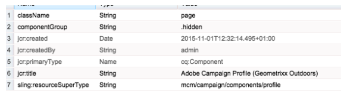

# 使用Adobe Campaign表單元件建立自訂AEM頁面範本{#creating-custom-aem-page-template-with-adobe-campaign-form-components}

本頁說明如何透過檢查Geometrixx-outdoors範本( [)的實作方式，建立使用](/help/sites-authoring/adobe-campaign-components.md) Adobe Campaign Form `/apps/geometrixx-outdoors/components/page_campaign_profile`Components的自訂頁面範本，並指出建立自訂範本時可能需要的重要資訊。

>[!NOTE]
>
>[電子郵件和表單範例僅在Geometrixx中提供](/help/sites-developing/we-retail.md)。 請從Package Share下載範例Geometrixx內容。

若要使用Adobe Campaign Form元件建立自訂AEM頁面範本，請確定您有下列項目：

1. **正確的resourceSuperType**

   請確定page-component繼承自 `mcm/campaign/components/profile`。

   Servlet必須具備此功能，才能取得和儲存資訊

   * `com.day.cq.mcm.campaign.servlets.TemplateListServlet`
   * `com.day.cq.mcm.campaign.servlets.SaveProfileServlet`
   

1. **ClientContext設定**

   當您查看clientcontext設定( `/etc/designs/geometrixx-outdoors/jcr:content/page_campaign_profile`)時，會看到下列設定：

   * ClientContext指向 `/etc/clientcontext/campaign`
   * 此外，還有額外的 *config節* 點。
   

1. **head.jsp(/apps/geometrixx-outdoors/components/page_campaign_profile/head.jsp)**

   在 **head.jsp**，您會看到下列使用clientcontext-config和cloudservice-hook的行 ********:

   ```
   <cq:include path="config" resourceType="cq/personalization/components/clientcontext_optimized/config"/>
   <sling:include path="contexthub" resourceType="granite/contexthub/components/contexthub"/>
   <cq:include script="/libs/cq/cloudserviceconfigs/components/servicelibs/servicelibs.jsp"/>
   ```

1. **body.jsp(/apps/geometrixx-outdoors/components/page_campaign_profile/body.jsp)**

   在 **body.jsp**&#x200B;中，雲端服務會載入至頁面底部：

   ```
   <cq:include path="cloudservices" resourceType="cq/cloudserviceconfigs/components/servicecomponents"/>
   ```

1. **促銷活動頁面屬性**

   若要能夠選取Adobe Campaign範本，頁面屬性會隨「促銷活動」索引標籤 **加以擴** 充：

   `/apps/geometrixx-outdoors/components/page_campaign_profile/dialog/items/tabs/items/campaign`

   

1. **範本設定**。

   在範本( `/apps/geometrixx-outdoors/templates/campaign_profile/jcr:content`)中，您會看到下列預設值：

   | **acMapping** | mapRecipient（適用於Adobe Campaign 6.1）、設定檔（適用於Adobe Campaign Standard） |
   |---|---|
   | **acTemplateId** | 郵件 |

   

