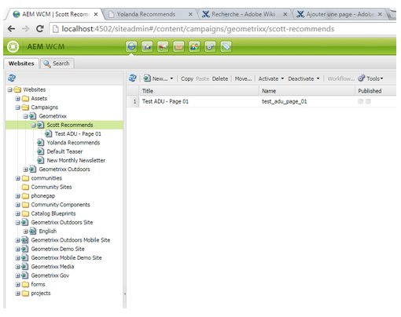

# 建立自訂擴充功能{#creating-custom-extensions}

一般而言，實作專案時，您在AEM和Adobe Campaign中都有自訂程式碼。 使用現有API，您可以在Adobe Campaign中從AEM或從AEM呼叫Adobe Campaign的自訂程式碼。 本檔案將說明如何執行此操作。

## 先決條件 {#prerequisites}

您必須安裝下列專案：

* Adobe Experience Manager
* Adobe Campaign 6.1

如需詳細資訊，請參閱[整合AEM與Adobe Campaign 6.1](/help/sites-administering/campaignonpremise.md)。

## 範例1：AEM至Adobe Campaign {#example-aem-to-adobe-campaign}

AEM與Campaign之間的標準整合是以JSON和JSSP (JavaScript伺服器頁面)為基礎。 這些JSSP檔案可在Campaign主控台中找到，且全部以&#x200B;**aec** (Adobe Experience Cloud)開頭。


>[!NOTE]
>
>[如需此範例，請參閱[封裝共用]中的Geometrixx](/help/sites-developing/we-retail.md)。

在此範例中，已建立新的自訂JSSP檔案，並從AEM端呼叫該檔案來擷取結果。 例如，它可用來從Adobe Campaign擷取資料，或將資料儲存至Adobe Campaign。

1. 若要在Adobe Campaign中建立JSSP檔案，請按一下&#x200B;**新增**&#x200B;圖示。

   

1. 輸入此JSSP檔案的名稱。 在此範例中，使用了&#x200B;**cus：custom.jssp** （表示它位於&#x200B;**cus**&#x200B;名稱空間）。

   

1. 將下列程式碼放入jssp-file中：

   ```
   <%
   var origin = request.getParameter("origin");
   document.write("Hello from Adobe Campaign, origin : " + origin);
   %>
   ```

1. 儲存您的工作。 其餘的工作在AEM中。
1. 在AEM端建立簡單的servlet，以便呼叫此JSSP。 在此範例中，您可以假設以下情況：

   * 您的連線在AEM和Campaign之間正常運作
   * 已在&#x200B;**/content/geometrixx-outdoors**&#x200B;上設定Campaign雲端服務

   此範例中最重要的物件是&#x200B;**GenericCampaignConnector**，其可讓您在Adobe Campaign端呼叫（取得和發佈） jssp檔案。

   以下是一個小的程式碼片段：

   ```
   @Reference
   private GenericCampaignConnector campaignConnector;
   ...
   Map<String, String> params = new HashMap<String, String>();
   params.put("origin", "AEM");
   CallResults results = campaignConnector.callGeneric("/jssp/cus/custom.jssp", params, credentials);
   return results.bodyAsString();
   ```

1. 在此範例中，您必須將憑證傳遞至呼叫。 您可以透過getCredentials()方法取得，您可在其中傳入已設定Campaign雲端服務的頁面。

   ```xml
   // page containing the cloudservice for Adobe Campaign
   Configuration config = campaignConnector.getWebserviceConfig(page.getContentResource().getParent());
   CampaignCredentials credentials = campaignConnector.retrieveCredentials(config);
   ```

完整的程式碼如下：

```java
import java.io.IOException;
import java.io.PrintWriter;
import java.util.HashMap;
import java.util.Map;

import javax.servlet.ServletException;

import org.apache.felix.scr.annotations.Reference;
import org.apache.felix.scr.annotations.sling.SlingServlet;
import org.apache.sling.api.SlingHttpServletRequest;
import org.apache.sling.api.SlingHttpServletResponse;
import org.apache.sling.api.servlets.SlingSafeMethodsServlet;
import org.slf4j.Logger;
import org.slf4j.LoggerFactory;

import com.day.cq.mcm.campaign.CallResults;
import com.day.cq.mcm.campaign.CampaignCredentials;
import com.day.cq.mcm.campaign.GenericCampaignConnector;
import com.day.cq.wcm.api.Page;
import com.day.cq.wcm.api.PageManager;
import com.day.cq.wcm.api.PageManagerFactory;
import com.day.cq.wcm.webservicesupport.Configuration;

@SlingServlet(paths="/bin/campaign", methods="GET")
public class CustomServlet extends SlingSafeMethodsServlet {

 private final Logger log = LoggerFactory.getLogger(this.getClass());

 @Reference
 private GenericCampaignConnector campaignConnector;

 @Reference
 private PageManagerFactory pageManagerFactory;

 @Override
 protected void doGet(SlingHttpServletRequest request,
   SlingHttpServletResponse response) throws ServletException,
   IOException {

  PageManager pm = pageManagerFactory.getPageManager(request.getResourceResolver());

  Page page = pm.getPage("/content/geometrixx-outdoors");

  String result = null;
  if ( page != null) {
   result = callCustomFunction(page);
  }
  if ( result != null ) {
   PrintWriter pw = response.getWriter();
   pw.print(result);
  }
 }

 private String callCustomFunction(Page page ) {
  try {
   Configuration config = campaignConnector.getWebserviceConfig(page.getContentResource().getParent());
   CampaignCredentials credentials = campaignConnector.retrieveCredentials(config);

   Map<String, String> params = new HashMap<String, String>();
   params.put("origin", "AEM");
   CallResults results = campaignConnector.callGeneric("/jssp/cus/custom.jssp", params, credentials);
   return results.bodyAsString();
  } catch (Exception e ) {
   log.error("Something went wrong during the connection", e);
  }
  return null;

 }

}
```

## 範例2：從Adobe Campaign到AEM {#example-adobe-campaign-to-aem}

AEM提供立即可用的API，可擷取Siteadmin Explorer檢視中任何位置可用的物件。



>[!NOTE]
>
>[如需此範例，請參閱[封裝共用]中的Geometrixx](/help/sites-developing/we-retail.md)。

對於總管中的每個節點，都有一個API連結至該節點。 例如，對於節點：

* [http://localhost:4502/siteadmin#/content/campaigns/geometrixx/scott-recommends](http://localhost:4502/siteadmin#/content/campaigns/geometrixx/scott-recommends)

API是：

* [http://localhost:4502/content/campaigns/geometrixx/scott-recommends.1.json](http://localhost:4502/content/campaigns/geometrixx/scott-recommends.2.json)

URL **.1.json**&#x200B;的結尾可以根據您想要取得的子層級數目由&#x200B;**.2.json**、**.3.json**&#x200B;取代。 若要取得所有關鍵字，可使用&#x200B;**無限**：

* [http://localhost:4502/content/campaigns/geometrixx/scott-recommends.infinity.json](http://localhost:4502/content/campaigns/geometrixx/scott-recommends.2.json)

為了使用API，AEM預設會使用基本驗證。

名為&#x200B;**amcIntegration.js**&#x200B;的JS程式庫可在6.1.1 （build 8624及更新版本）中使用，該程式庫會在其他數個程式庫中實作該邏輯。

### AEM API呼叫 {#aem-api-call}

```java
loadLibrary("nms:amcIntegration.js");

var cmsAccountId = sqlGetInt("select iExtAccountId from NmsExtAccount where sName=$(sz)","aemInstance")
var cmsAccount = nms.extAccount.load(String(cmsAccountId));
var cmsServer = cmsAccount.server;

var request = new HttpClientRequest(cmsServer+"/content/campaigns/geometrixx.infinity.json")
aemAddBasicAuthentication(cmsAccount, request);
request.method = "GET"
request.header["Content-Type"] = "application/json; charset=UTF-8";
request.execute();
var response = request.response;
```
