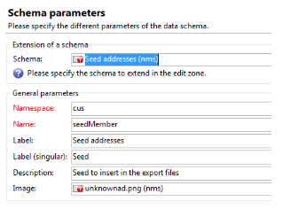

# 建立自訂表單對應{#creating-custom-form-mappings}

當您在Adobe Campaign中建立自訂表格時，可能會想要在AEM中建立對應至該自訂表格的表單。

本檔案說明如何建立自訂表單對應。 當您完成本檔案中的步驟時，將為使用者提供事件頁面，讓他們註冊即將舉行的事件。 然後您透過Adobe Campaign跟進這些使用者。

## 先決條件 {#prerequisites}

您必須安裝下列專案：

* Adobe Experience Manager
* Adobe Campaign Classic

如需詳細資訊，請參閱[整合AEM與Adobe Campaign Classic](/help/sites-administering/campaignonpremise.md)。

## 建立自訂表單對應 {#creating-custom-form-mappings-2}

若要建立自訂表單對應，您必須依照以下各節中詳細說明的這些高階步驟操作：

1. 建立自訂表格。
1. 擴充&#x200B;**seed**&#x200B;資料表。
1. 建立自訂對應。
1. 根據自訂對應建立傳遞。
1. 在AEM中建立表單，此表單將使用建立的傳遞。
1. 提交表單以進行測試。

### 在Adobe Campaign中建立自訂表格 {#creating-the-custom-table-in-adobe-campaign}

首先，在Adobe Campaign中建立自訂表格。 在此範例中，我們使用以下定義來建立事件表格：

```xml
<element autopk="true" label="Event" labelSingular="Event" name="event">
 <attribute label="Event Date" name="eventdate" type="date"/>
 <attribute label="Event Name" name="eventname" type="string"/>
 <attribute label="Email" name="email" type="string"/>
 <attribute label="Number of Seats" name="seats" type="long"/>
</element>
```

建立事件資料表之後，請執行&#x200B;**更新資料庫結構精靈**&#x200B;以建立資料表。

### 擴充種子表格 {#extending-the-seed-table}

在Adobe Campaign中，選取「**新增**」以建立&#x200B;**種子地址(nms)**&#x200B;表格的延伸模組。



現在，請使用&#x200B;**event**&#x200B;資料表中的欄位來擴充&#x200B;**seed**&#x200B;資料表：

```xml
<element label="Event" name="custom_cus_event">
 <attribute name="eventname" template="cus:event:event/@eventname"/>
 <attribute name="eventdate" template="cus:event:event/@eventdate"/>
 <attribute name="email" template="cus:event:event/@email"/>
 <attribute name="seats" template="cus:event:event/@seats"/>
 </element>
```

之後，執行&#x200B;**更新資料庫精靈**&#x200B;以套用變更。

### 建立自訂目標對應 {#creating-custom-target-mapping}

在&#x200B;**管理/行銷活動管理** t中，移至&#x200B;**目標對應**&#x200B;並新增新的T **目標對應。**

>[!NOTE]
>
>請確定您對&#x200B;**內部名稱**&#x200B;使用有意義的名稱。


### 建立自訂傳遞範本 {#creating-a-custom-delivery-template}

在此步驟中，您正在新增使用已建立&#x200B;**目標對應**&#x200B;的傳遞範本。

在&#x200B;**資源/範本**&#x200B;中，導覽至傳遞範本並複製現有的AEM傳遞。 當您按一下&#x200B;**到**，選取建立事件&#x200B;**目標對應**。


### 在AEM中建立表單 {#building-the-form-in-aem}

在AEM中，確定您已在&#x200B;**頁面屬性**&#x200B;中設定Cloud Service。

然後，在&#x200B;**Adobe Campaign**&#x200B;索引標籤中，選取在[建立自訂傳遞範本](#creating-a-custom-delivery-template)中建立的傳遞。


設定欄位時，請務必為表單欄位指定唯一的元素名稱。

設定欄位後，您需要手動變更對應。

在CRXDE-LITE中，移至&#x200B;**jcr：content** （頁面的）節點，並將&#x200B;**acMapping**&#x200B;值變更為&#x200B;**目標對應**&#x200B;的內部名稱。


在表單的設定中，如果不存在要建立的核取方塊，請務必勾選


### 提交表單 {#submitting-the-form}

您現在可以提交表單，並在Adobe Campaign端驗證值是否已儲存。


## 疑難排解 {#troubleshooting}

**「元素&#39;@eventdate&#39;的值&#39;02/02/2015&#39;的型別無效(型別為&#39;Event ([adb：event])&#39;的檔案)」**

提交表單時，此錯誤記錄在AEM的&#x200B;**error.log**&#x200B;中。

這是由於日期欄位的格式無效。 因應措施是提供&#x200B;**yyyy-mm-dd**&#x200B;作為值。
