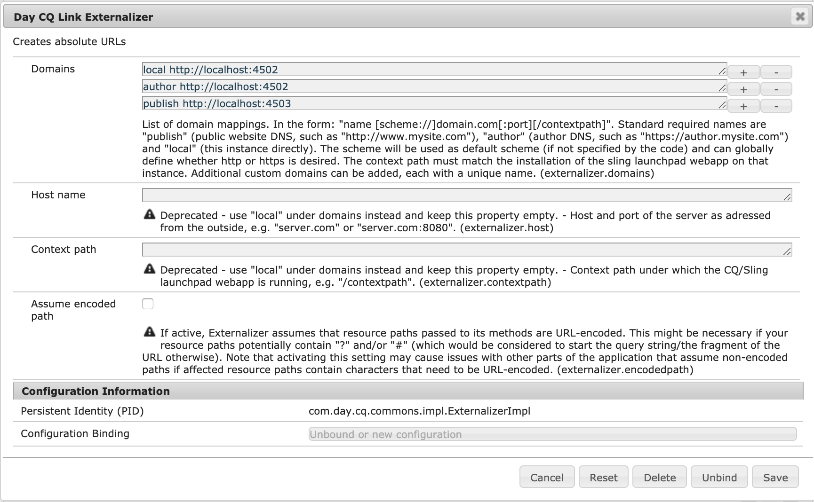

# 將URL外部化{#externalizing-urls}

在AEM中，**Externalizer**&#x200B;是OSGI服務，可讓您以程式設計方式轉換資源路徑(例如，`/path/to/my/page`)，以預先設定的DNS來預先固定路徑，以匯入外部和絕對URL（例如`https://www.mycompany.com/path/to/my/page`）。

由於例項在Web層後面執行時無法知道其外部可見的URL，而且有時必須在請求範圍外建立連結，因此此服務提供一個集中位置來設定這些外部URL並建立它們。

本頁說明如何配置&#x200B;**Externalizer**&#x200B;服務以及如何使用它。 有關詳細資訊，請參閱[Javadocs](https://helpx.adobe.com/experience-manager/6-5/sites/developing/using/reference-materials/javadoc/com/day/cq/commons/Externalizer.html)。

## 配置Externalizer服務{#configuring-the-externalizer-service}

**Externalizer**&#x200B;服務可讓您集中定義多個網域，這些網域可用來以程式設計方式為資源路徑加上前置詞。 每個網域都由唯一名稱來識別，該名稱用於以程式設計方式參考網域。

要定義&#x200B;**Externalizer**&#x200B;服務的域映射：

1. 通過&#x200B;**工具**&#x200B;導航到配置管理器，然後通過&#x200B;**Web控制台**&#x200B;導航到配置管理器，或輸入：

   `https://<host>:<port>/system/console/configMgr`

1. 按一下&#x200B;**Day CQ Link Externalizer**&#x200B;開啟配置對話框。

   >[!NOTE]
   >
   >配置的直接連結為`https://<host>:<port>/system/console/configMgr/com.day.cq.commons.impl.ExternalizerImpl`

   

1. 定義&#x200B;**域**&#x200B;映射：映射由唯一名稱組成，可用於代碼中以引用域、空間和域：

   `<unique-name> [scheme://]server[:port][/contextpath]`

   其中：

   * **計** 划通常是http或https，但也可以是ftp等。

      * 視需要使用https來強制https連結
      * 當用戶端程式碼要求將URL外部化時，不會覆寫配置時，就會使用它。
   * **服** 務器是主機名（可以是域名或IP地址）。
   * **port** （可選）是埠號。
   * **contextpath** （可選）只有在AEM安裝為位於不同內容路徑下的網頁應用程式時才會設定。

   例如：`production https://my.production.instance`

   下列對應名稱是預先定義的，必須一律設定，因為AEM需仰賴這些名稱：

   * `local` -本機例項
   * `author` -編寫系統DNS
   * `publish` -公眾對應網站DNS

   >[!NOTE]
   >
   >自訂設定可讓您新增新類別，例如`production`、`staging`，甚至外部非AEM系統，例如`my-internal-webservice`。 避免在專案程式碼基底的不同位置硬式編碼此類URL，會很有用。

1. 按一下&#x200B;**保存**&#x200B;保存更改。

>[!NOTE]
>
>Adobe建議您[將配置添加到儲存庫](/help/sites-deploying/configuring.md#addinganewconfigurationtotherepository)。

### 使用Externalizer服務{#using-the-externalizer-service}

本節顯示如何使用&#x200B;**Externalizer**&#x200B;服務的一些示例：

1. **要在JSP中獲取Externalizer服務，請執行以下操作：**

   ```java
   Externalizer externalizer = resourceResolver.adaptTo(Externalizer.class);
   ```

1. **若要將路徑外部化為具有「發佈」網域：**

   ```java
   String myExternalizedUrl = externalizer.publishLink(resolver, "/my/page") + ".html";
   ```

   假設域映射：

   * `publish https://www.website.com`

   `myExternalizedUrl` 最後是值：

   * `https://www.website.com/contextpath/my/page.html`


1. **要將具有「author」域的路徑外部化：**

   ```java
   String myExternalizedUrl = externalizer.authorLink(resolver, "/my/page") + ".html";
   ```

   假設域映射：

   * `author https://author.website.com`

   `myExternalizedUrl` 最後是值：

   * `https://author.website.com/contextpath/my/page.html`


1. **要將具有「本地」域的路徑外部化：**

   ```java
   String myExternalizedUrl = externalizer.externalLink(resolver, Externalizer.LOCAL, "/my/page") + ".html";
   ```

   假設域映射：

   * `local https://publish-3.internal`

   `myExternalizedUrl` 最後是值：

   * `https://publish-3.internal/contextpath/my/page.html`


1. 您可以在[Javadocs](https://helpx.adobe.com/experience-manager/6-5/sites/developing/using/reference-materials/javadoc/com/day/cq/commons/Externalizer.html)中找到更多示例。
