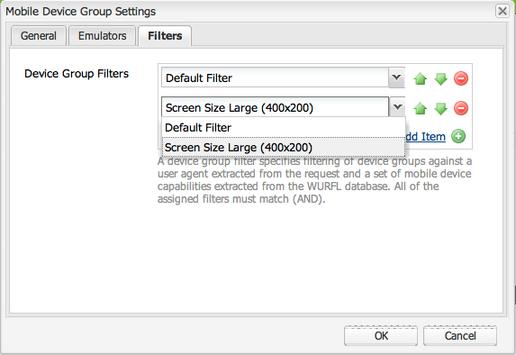
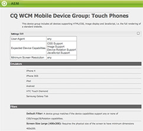

# 建立裝置群組篩選器{#creating-device-group-filters}

>[!NOTE]
>
>Adobe建議針對需要單頁應用程式架構用戶端轉換的專案使用SPA編輯器（例如React）。 [了解更多](/help/sites-developing/spa-overview.md).

建立裝置群組篩選以定義一組裝置功能需求。 根據您的需求建立任意數量的篩選器，以鎖定所需的裝置功能群組。

設計您的篩選器，以便使用其組合來定義功能群組。 通常，不同裝置群組的功能會重疊。 因此，您可能會針對多個裝置群組定義使用某些篩選器。

建立篩選器後，您可在群組設定中 [使用。](/help/sites-developing/mobile.md#creating-a-device-group)

## 篩選Java類 {#the-filter-java-class}

裝置群組篩選器是實作 [com.day.cq.wcm.mobile.api.device.DeviceGroupFilter](https://helpx.adobe.com/experience-manager/6-5/sites/developing/using/reference-materials/javadoc/index.html?com/day/cq/wcm/mobile/api/device/DeviceGroupFilter.html) 介面的OSGi元件。 部署後，實作類別會提供可用於裝置群組設定的篩選服務。

本文介紹的解決方案採用Apache Felix Maven SCR插件，方便了元件和服務的開發。 因此，示例Java類使用 `@Component`和注 `@Service` 釋。 該類具有以下結構：

```java
package com.adobe.example.myapp;

import java.util.Map;

import com.day.cq.wcm.mobile.api.device.DeviceGroup;
import com.day.cq.wcm.mobile.api.device.DeviceGroupFilter;

import org.apache.felix.scr.annotations.Component;
import org.apache.felix.scr.annotations.Service;

@Component(metatype = false)
@Service
public class myDeviceGroupFilter implements DeviceGroupFilter {

       public String getDescription() {
  return null;
 }

 public String getTitle() {
  return null;
 }

 public boolean matches(DeviceGroup arg0, String arg1, Map arg2) {
  return false;
 }

}
```

您需要提供下列方法的程式碼：

* `getDescription`:傳回篩選描述。 說明會顯示在「裝置群組設定」對話方塊中。
* `getTitle`:傳回篩選器的名稱。 為設備組選擇篩選器時，將顯示該名稱。
* `matches`:確定設備是否具有所需的功能。

### 提供篩選器名稱和說明 {#providing-the-filter-name-and-description}

和方 `getTitle` 法 `getDescription` 會分別傳回篩選名稱和說明。 下列程式碼說明最簡單的實作：

```java
public String getDescription() {
    return "An example device group filter";
}

public String getTitle() {
 return "myFilter";
}
```

硬式編碼名稱和說明文字，就足以在單語言編寫環境中使用。 請考慮將字串外部化以用於多語言使用，或啟用字串變更，而不需重新編譯原始碼。

### 根據篩選條件評估 {#evaluating-against-filter-criteria}

如果 `matches` 設備功能 `true` 滿足所有篩選條件，則返回函式。 評估方法參數中提供的資訊，以確定設備是否屬於組。 以下值作為參數提供：

* DeviceGroup物件
* 用戶代理的名稱
* 包含設備功能的Map對象。 Map鍵是WURFL™功能名稱，值是WURFL™資料庫的對應值。

com.day.cq.wc [m.mobile.api.devicespecs.DeviceSpecsConstants](https://helpx.adobe.com/experience-manager/6-5/sites/developing/using/reference-materials/javadoc/index.html?com/day/cq/wcm/mobile/api/device/DeviceGroupFilter.html) 介麵包含靜態欄位中WURFL™功能名稱的子集。 從設備功能映射中檢索值時，請使用這些欄位常數作為鍵。

例如，下列程式碼範例會決定裝置是否支援CSS:

```xml
boolean cssSupport = true;
cssSupport = NumberUtils.toInt(capabilities.get(DeviceSpecsConstants.DSPEC_XHTML_SUPPORT_LEVEL)) > 1;
```

包 `org.apache.commons.lang.math` 提供類 `NumberUtils` 別。

>[!NOTE]
>
>確保部署至AEM的WURFL™資料庫包含您用作篩選條件的功能。 (請參閱 [裝置偵測](/help/sites-developing/mobile.md#server-side-device-detection)。)

### 螢幕大小的範例篩選 {#example-filter-for-screen-size}

下面的示例DeviceGroupFilter實現確定設備的物理大小是否滿足最低要求。 此篩選器的用途是為觸控裝置群組增加精細度。 不論實際螢幕大小，應用程式UI中的按鈕大小都應相同。 其他項目（例如文字）的大小可能有所不同。 此篩選器可讓您動態選取控制UI元素大小的特定CSS。

此篩選器將大小標準應 `physical_screen_height` 用於 `physical_screen_width` 和WURFL™屬性名稱。

```java
package com.adobe.example.myapp;

import java.util.Map;

import com.day.cq.wcm.mobile.api.device.DeviceGroup;
import com.day.cq.wcm.mobile.api.device.DeviceGroupFilter;

import org.apache.commons.lang.math.NumberUtils;
import org.apache.felix.scr.annotations.Component;
import org.apache.felix.scr.annotations.Service;

@Component(metatype = false)
@Service
@SuppressWarnings("unused")
public class ScreenSizeLarge implements DeviceGroupFilter {
    private int len=400;
    private int wid=200;
    public String getDescription() {

        return "Requires the physical size of the screen to have minimum dimensions " + len + "x" + wid+".";
    }

    public String getTitle() {
        return "Screen Size Large ("+len + "x" + wid+")";
    }

    public boolean matches(DeviceGroup deviceGroup, String userAgent,
            Map<String, String> deviceCapabilities) {

        boolean longEnough=true;
        boolean wideEnough=false;
        int dimension1=NumberUtils.toInt(deviceCapabilities.get("physical_screen_height"));
        int dimension2=NumberUtils.toInt(deviceCapabilities.get("physical_screen_width"));
        if(dimension1>dimension2){
            longEnough=dimension1>=len;
            wideEnough=dimension2>=wid;
        }else{
            longEnough=dimension2>=len;
            wideEnough=dimension1>=wid;
        }

        return longEnough && wideEnough;
    }
}
```

getTitle方法傳回的字串值會出現在裝置群組屬性的下拉式清單中。



getTitle和getDescription方法傳回的字串值會包含在裝置群組摘要頁面的底部。



### Maven POM檔案 {#the-maven-pom-file}

如果您使用Maven來建立應用程式，下列POM程式碼會很有用。 POM引用了幾個必需的插件和從屬關係。

**外掛程式:**

* Apache Maven Compiler Plugin:從原始碼編譯Java類。
* Apache Felix Maven Bundle Plugin:建立整合與資訊清單
* Apache Felix Maven SCR Plugin:建立元件描述符檔案並配置service-component manifest標題。

**相依關係:**

* `cq-wcm-mobile-api-5.5.2.jar`:提供DeviceGroup和DeviceGroupFilter介面。

* `org.apache.felix.scr.annotations.jar`:提供元件和服務注釋。

DeviceGroup和DeviceGroupFilter介面包含在Day Commute 5 WCM Mobile API套件中。 Felix註解包含在Apache Felix Departative services套件中。 您可以從公用Adobe儲存庫取得此JAR檔案。

在製作時，5.5.2是AEM最新版本中的WCM Mobile API套件版本。 使用Adobe Web Console([https://localhost:4502/system/console/bundles](https://localhost:4502/system/console/bundles))確保這是您環境中部署的套件版本。

**** POM:（您的POM將使用不同的groupId和版本。）

```xml
<project xmlns="https://maven.apache.org/POM/4.0.0"
        xmlns:xsi="https://www.w3.org/2001/XMLSchema-instance"
        xsi:schemaLocation="https://maven.apache.org/POM/4.0.0 https://maven.apache.org/xsd/maven-4.0.0.xsd">
      <modelVersion>4.0.0</modelVersion>
      <groupId>com.adobe.example.myapp</groupId>
      <artifactId>devicefilter</artifactId>
      <version>0.0.1-SNAPSHOT</version>
      <name>my app device filter</name>
      <url>https://dev.day.com/docs/en/cq/current.html</url>
  <packaging>bundle</packaging>
<build>
    <plugins>
        <plugin>
            <groupId>org.apache.maven.plugins</groupId>
            <artifactId>maven-compiler-plugin</artifactId>
            <configuration>
                <source>1.5</source>
                <target>1.5</target>
            </configuration>
        </plugin>
        <plugin>
            <groupId>org.apache.felix</groupId>
            <artifactId>maven-scr-plugin</artifactId>
            <executions>
                  <execution>
                    <id>generate-scr-scrdescriptor</id>
                    <goals>
                          <goal>scr</goal>
                    </goals>
                  </execution>
            </executions>
          </plugin>
        <plugin>
            <groupId>org.apache.felix</groupId>
            <artifactId>maven-bundle-plugin</artifactId>
            <version>1.4.3</version>
            <extensions>true</extensions>
            <configuration>
                <instructions>
                    <Export-Package>com.adobe.example.myapp.*;version=${project.version}</Export-Package>
                </instructions>
            </configuration>
        </plugin>
    </plugins>
</build>
<dependencies>
     <dependency>
         <groupId>com.day.cq.wcm</groupId>
         <artifactId>cq-wcm-mobile-api</artifactId>
         <version>5.5.2</version>
         <scope>provided</scope>
     </dependency>
     <dependency>
        <groupId>org.apache.felix</groupId>
        <artifactId>org.apache.felix.scr.annotations</artifactId>
        <version>1.6.0</version>
        <scope>compile</scope>
    </dependency>
</dependencies>
</project>
```

將「取得內容套 [](/help/sites-developing/vlt-mavenplugin.md) 件Maven外掛程式」區段提供的描述檔新增至您的maven設定檔，以使用公用Adobe儲存庫。
