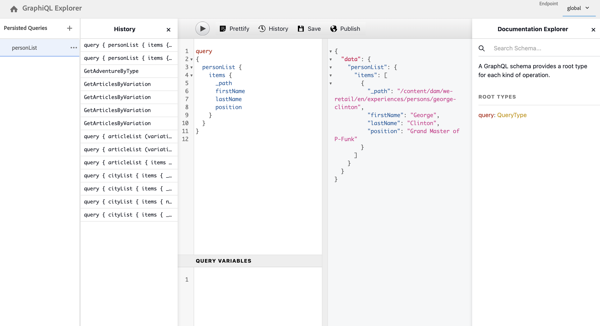

# 存取及傳遞內容片段Headless快速入門手冊 {#accessing-delivering-content-fragments}

瞭解如何使用AEM Assets REST API來管理內容片段，以及如何使用GraphQL API無周邊方式傳送內容片段內容。

## 什麼是 GraphQL 和 Assets REST API？ {#what-are-the-apis}

[現在您已經建立一些內容片段，](create-content-fragment.md)您可以使用 AEM 的 API Headless 傳遞內容片段。

* [GraphQL API](/help/sites-developing/headless/graphql-api/graphql-api-content-fragments.md)可讓您建立存取及傳遞內容片段的請求。
   * 若要使用這個功能，必須在AEM[中定義並啟用](/help/sites-developing/headless/graphql-api/graphql-endpoint.md#enabling-graphql-endpoint)端點，而且如有需要，必須安裝[GraphiQL介面](/help/sites-developing/headless/graphql-api/graphql-api-content-fragments.md#installing-graphiql-interface)。
* [Assets REST API](/help/assets/assets-api-content-fragments.md) 可讓您建立及修改內容片段 (和其他資產)。

本指南的其餘部分著重在 GraphQL 存取和內容片段傳遞。

## 如何使用GraphQL傳遞內容片段 {#how-to-deliver-a-content-fragment}

資訊架構師必須為其通道端點設計查詢才能傳送內容。 每個端點、每個模型只考慮這些查詢一次。 對於此快速入門手冊，請僅建立一個快速入門手冊。

1. 登入AEM並存取[GraphiQL介面](/help/sites-developing/headless/graphql-api/graphiql-ide.md)：
   * 例如：`http://<host>:<port>/aem/graphiql.html`。

1. GraphiQL是GraphQL的瀏覽器內查詢編輯器。 您可以使用它來建置查詢，以擷取內容片段，並以JSON格式輕鬆傳送。
   * 左側面板可讓您建置查詢。
   * 右側面板會顯示結果。
   * 查詢編輯器具有程式碼完成和快速鍵功能，可輕鬆執行查詢。
     

1. 假設您建立的模型名為 `person`，其中包含欄位 `firstName`、`lastName` 和 `position`，您可以建立一個簡單的查詢來擷取內容片段的內容。

   ```text
   query 
   {
     personList {
       items {
         _path
         firstName
         lastName
         position
       }
     }
   }
   ```

1. 在左側面板中輸入查詢。
<!--
   
-->

1. 按一下&#x200B;**執行查詢** （向右鍵）圖示或使用`Ctrl-Enter`快速鍵，結果會在右側面板中以JSON格式顯示。
   

1. 按一下：
   * 頁面右上方的&#x200B;**檔案**&#x200B;會顯示內文中檔案，協助您建立適合您自己模型的查詢。
   * 在頂端工具列中的&#x200B;**History**&#x200B;顯示先前的查詢。
   * **另存新檔**&#x200B;和&#x200B;**儲存**&#x200B;以儲存您的查詢，之後您可以從&#x200B;**持續查詢**&#x200B;面板和&#x200B;**發佈**中列出並擷取查詢。
     

GraphQL 支援結構化查詢，這些查詢不僅可以針對特定資料集或個別資料物件，還可以傳遞物件的特定元素、巢狀結果、支援查詢變數等等。

GraphQL可避免反複的API請求和過度傳送。 相反地，它允許作為對單一API查詢的回應，大量傳送精確呈現所需的內容。 產生的 JSON 可用於將資料傳遞到其他網站或應用程式。

## 後續步驟 {#next-steps}

就是這樣！您現在對 AEM Headless 內容管理有基本的了解。還有更多資源可供您深入研究以全面了解可用的功能。

* **[設定瀏覽器](create-configuration.md)** — 如需有關AEM設定瀏覽器的詳細資訊
* **[內容片段](/help/assets/content-fragments/content-fragments.md)** - 詳細說明如何建立和管理內容片段
* **[GraphiQL IDE](/help/sites-developing/headless/graphql-api/graphiql-ide.md)**，瞭解使用GraphiQL IDE的詳細資訊
* **[持續查詢](/help/sites-developing/headless/graphql-api/persisted-queries.md)**，以取得持續查詢的詳細資料
* **[AEM Assets HTTP API 支援內容片段](/help/assets/assets-api-content-fragments.md)** - 詳細說明如何運用 CRUD 操作 (建立、讀取、更新、刪除) 透過 HTTP API 直接存取 AEM 內容。
* **[GraphQL API](/help/sites-developing/headless/graphql-api/graphql-api-content-fragments.md)** - 詳細說明如何以 Headless 方式傳遞內容片段
