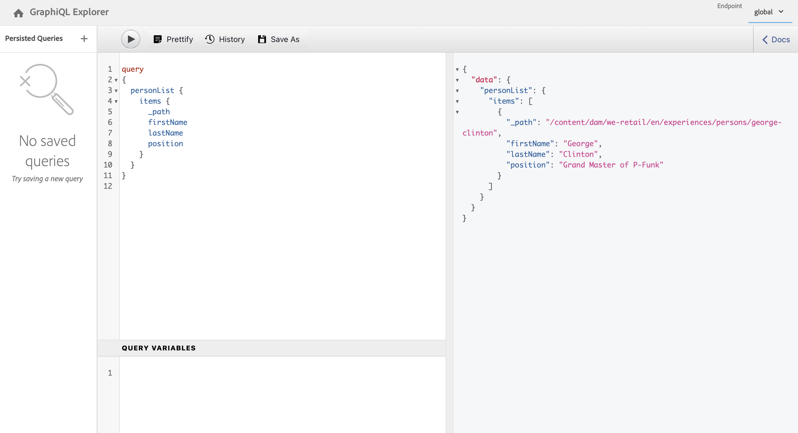

# 存取及傳遞內容片段Headless快速入門手冊 {#accessing-delivering-content-fragments}

瞭解如何使用AEM Assets REST API來管理內容片段，以及如何使用GraphQL API無周邊式傳送內容片段內容。

## 什麼是 GraphQL 和 Assets REST API？ {#what-are-the-apis}

[現在您已經建立一些內容片段，](create-content-fragment.md)您可以使用 AEM 的 API Headless 傳遞內容片段。

* [GraphQL API](/help/sites-developing/headless/graphql-api/graphql-api-content-fragments.md) 可讓您建立存取和傳遞內容片段的要求。
   * 若要使用此， [端點必須在AEM中定義和啟用](/help/sites-developing/headless/graphql-api/graphql-endpoint.md#enabling-graphql-endpoint)，如有必要， [已安裝GraphiQL介面](/help/sites-developing/headless/graphql-api/graphql-api-content-fragments.md#installing-graphiql-interface).
* [Assets REST API](/help/assets/assets-api-content-fragments.md) 可讓您建立和修改內容片段（和其他資產）。

本指南的其餘部分著重在 GraphQL 存取和內容片段傳遞。

## 如何使用GraphQL傳遞內容片段 {#how-to-deliver-a-content-fragment}

資訊架構師必須為其通道端點設計查詢才能傳送內容。 每個模型的每個端點只需考慮一次這些查詢。 出於本快速入門指南的目的，您只需要建立一個。

1. 登入AEM並存取 [GraphiQL介面](/help/sites-developing/headless/graphql-api/graphiql-ide.md)：
   * 例如：`http://<host>:<port>/aem/graphiql.html`。

1. GraphiQL 是 GraphQL 的瀏覽器內查詢編輯器。您可以使用它來建置查詢，以擷取內容片段，並以JSON格式輕鬆傳送。
   * 左側面板可讓您建置查詢。
   * 右側面板會顯示結果。
   * 查詢編輯器具有程式碼完成和快速鍵功能，可輕鬆執行查詢。
     

1. 假設您建立的模型名為 `person`，其中包含欄位 `firstName`、`lastName` 和 `position`，您可以建立一個簡單的查詢來擷取內容片段的內容。

   ```text
   query 
   {
     personList {
       items {
         _path
         firstName
         lastName
         position
       }
     }
   }
   ```

1. 在左側面板中輸入查詢。
<!--
   
-->

1. 按一下 **執行查詢** （向右鍵）圖示或使用 `Ctrl-Enter` 快速鍵和結果會在右側面板中顯示為JSON。
   

1. 按一下:
   * **檔案** 在頁面的右上方，顯示快顯檔案，協助您建立適合您自己模型的查詢。
   * **歷史記錄** 頂端工具列以顯示先前的查詢。
   * **另存為** 和 **儲存** 以儲存查詢，之後您可從 **持久查詢** 面板和 **發佈**.
     

GraphQL 支援結構化查詢，這些查詢不僅可以針對特定資料集或個別資料物件，還可以傳遞物件的特定元素、巢狀結果、支援查詢變數等等。

GraphQL可避免反複的API請求和過度傳送。 相反地，它允許作為對單一API查詢的回應，大量傳送精確呈現所需的內容。 產生的 JSON 可用於將資料傳遞到其他網站或應用程式。

## 後續步驟 {#next-steps}

就是這樣！您現在對 AEM Headless 內容管理有基本的了解。還有更多資源可供您深入研究以全面了解可用的功能。

* **[設定瀏覽器](create-configuration.md)**  — 瞭解AEM設定瀏覽器的詳細資訊
* **[內容片段](/help/assets/content-fragments/content-fragments.md)** - 詳細說明如何建立和管理內容片段
* **[GraphiQL IDE](/help/sites-developing/headless/graphql-api/graphiql-ide.md)** 有關使用GraphiQL IDE的更多詳細資訊
* **[持久查詢](/help/sites-developing/headless/graphql-api/persisted-queries.md)** 有關持續查詢的更多詳細資料
* **[AEM Assets HTTP API 支援內容片段](/help/assets/assets-api-content-fragments.md)** - 詳細說明如何運用 CRUD 操作 (建立、讀取、更新、刪除) 透過 HTTP API 直接存取 AEM 內容。
* **[GraphQL API](/help/sites-developing/headless/graphql-api/graphql-api-content-fragments.md)** - 詳細說明如何以 Headless 方式傳遞內容片段
