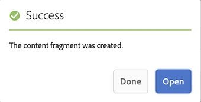
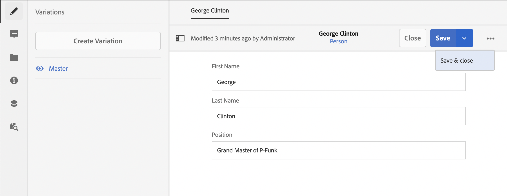

# 建立內容片段Headless快速入門手冊 {#creating-content-fragments}

了解如何使用 AEM 的內容片段來設計、建立、規劃和使用每頁自主的內容以進行 Headless 傳遞。

## 什麼是內容片段？ {#what-are-content-fragments}

[您已經建立資產資料夾](create-assets-folder.md)，其中可以儲存內容片段，現在您可以建立片段了！

內容片段可讓您設計、建立、策劃和發佈不受頁面影響的內容。 可讓您準備內容以用於多個位置和多個管道。

內容片段包含結構化內容，能以 JSON 格式傳遞。

## 如何建立內容片段 {#how-to-create-a-content-fragment}

內容作者將建立任意數量的內容片段來表示他們建立的內容。這將是他們在 AEM 中的主要任務。出於本快速入門指南的目的，我們只需要建立一個。

1. 登入AEM，從主功能表選取&#x200B;**導覽> Assets**。
1. 導覽至您先前建立的[資料夾。](create-assets-folder.md)
1. 按一下&#x200B;**建立>內容片段**。
1. 內容片段的建立以兩步驟的精靈呈現。 請先選取您要使用哪個模式來建立內容片段，然後按一下[下一步]。**&#x200B;**
   * 可用模型取決於您為內容片段建立所在資產資料夾所定義的&#x200B;[**雲端設定**](create-assets-folder.md)。
   * 如果您收到訊息`We could not find any models`，請檢查資產資料夾的設定。

   
1. 視需要提供&#x200B;**標題**、**描述**&#x200B;和&#x200B;**標籤**，然後按一下&#x200B;**建立**。

   
1. 在確認視窗中按一下&#x200B;**開啟**。

   
1. 在內容片段編輯器中提供內容片段的詳細資訊。

   
1. 按一下&#x200B;**儲存**&#x200B;或&#x200B;**儲存並關閉**。

內容片段可以參考其他內容片段，必要時允許巢狀內容結構。

內容片段也可以參考 AEM 中的其他資產。在建立參考的內容片段之前，[這些資產需要儲存在 AEM](/help/assets/manage-assets.md)。

## 後續步驟 {#next-steps}

現在您已經建立了一個內容片段，您可以繼續閱讀快速入門指南的最後一部分，[建立 API 要求以存取和傳遞內容片段。](create-api-request.md)

>[!TIP]
>
>如需有關管理內容片段的完整詳細資訊，請參閱[內容片段文件](/help/assets/content-fragments/content-fragments.md)
