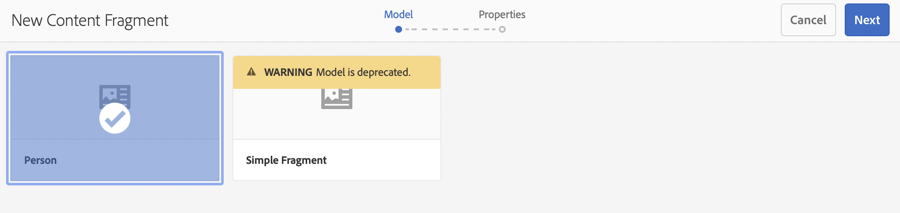

# 建立內容片段無頭快速入門手冊 {#creating-content-fragments}

了解如何使用 AEM 的內容片段來設計、建立、規劃和使用每頁自主的內容以進行無周邊傳遞。

## 什麼是內容片段？ {#what-are-content-fragments}

[您已經建立資產資料夾](create-assets-folder.md)，其中可以儲存內容片段，現在您可以建立片段了！

內容片段允許您設計、建立、規劃和發佈每頁自主的內容。它們可讓您將內容準備就緒用於多個位置和多個管道。

內容片段包含結構化內容，能以 JSON 格式傳遞。

## 如何建立內容片段 {#how-to-create-a-content-fragment}

內容作者將建立任意數量的內容片段來表示他們建立的內容。這將是他們在 AEM 中的主要任務。出於本快速入門指南的目的，我們只需要建立一個。

1. 登入AEM並從主功能表選取 **導覽 — >資產**.
1. 導覽至 [檔案夾。](create-assets-folder.md)
1. 點選或按一下 **建立 — >內容片段**.
1. 建立內容片段會以精靈的形式呈現，分為兩個步驟。 首先，選取您要使用哪個模型來建立內容片段，然後點選或按一下 **下一個**.
   * 可用模型取決於您為內容片段建立所在資產資料夾所定義的&#x200B;[**雲端設定**](create-assets-folder.md)。
   * 如果您收到訊息 `We could not find any models`，檢查資產資料夾的設定。

   
1. 提供 **標題**, **說明**，和 **標籤** 視需要，點選或按一下 **建立**.

   
1. 點選或按一下 **開啟** 在確認窗口中。

   
1. 在內容片段編輯器中提供內容片段的詳細資訊。

   
1. 點選或按一下 **儲存** 或  **儲存並關閉**.

內容片段可以參考其他內容片段，必要時允許巢狀內容結構。

內容片段也可以參考 AEM 中的其他資產。在建立參考的內容片段之前，[這些資產需要儲存在 AEM](/help/assets/manage-assets.md)。

## 後續步驟 {#next-steps}

現在您已經建立了一個內容片段，您可以繼續閱讀快速入門指南的最後一部分，[建立 API 要求以存取和傳遞內容片段。](create-api-request.md)

>[!TIP]
>
>有關管理內容片段的完整詳細資訊，請參閱[內容片段文件](/help/assets/content-fragments/content-fragments.md)
