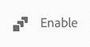

# 建立內容片段模型Headless快速入門手冊 {#creating-content-fragment-models}

定義您建立的內容結構，並使用內容片段模型透過Adobe Experience Manager (AEM) Headless功能提供。

## 什麼是內容片段模型？ {#what-are-content-fragment-models}

[現在您已經建立設定，](create-configuration.md)您可以使用它來建立內容片段模型。

內容片段模型定義您在 AEM 中建和管理之資料和內容的結構。它們做為您內容的支架。選擇建立內容時，您的作者會從您定義的內容片段模型中進行選擇，這會指引他們建立內容。

## 如何建立內容片段模型 {#how-to-create-a-content-fragment-model}

資訊架構師只會在需要新模型時偶爾執行這些任務。就本快速入門手冊而言，您只會建立一個模型。

1. 登入AEM，從主功能表選取 **工具 — >資產 — >內容片段模型**.
1. 點選或按一下透過建立設定所建立的資料夾。

   
1. 點選或按一下&#x200B;**建立**。
1. 提供 **模型標題**， **標籤**、和 **說明**. 您也可以選擇/取消選擇&#x200B;**啟用模型** 以控制模型是否在建立時立即啟用。

   
1. 在確認視窗中，點選或按一下&#x200B;**開啟**&#x200B;以設定您的模型。

   
1. 使用&#x200B;**內容片段模型編輯器**，從&#x200B;**資料類型**&#x200B;欄拖放欄位，來建立您的內容片段模型。

   

1. 放入欄位後，您必須設定其屬性。編輯器會自動切換為 **屬性** 用於新增欄位的標籤，您可以在其中提供必填欄位。

   
1. 建立好模型後，點選或按一下&#x200B;**儲存**。

1. 新建立之模型的模式取決於在建立模型時是否選取&#x200B;**啟用模型**：
   * 已選取 — 新模型已選取 **已啟用**
   * 未選取 - 新模型會以&#x200B;**草稿**&#x200B;模式建立

1. 如果尚未啟用，模型必須&#x200B;**啟用**&#x200B;才能使用。
   1. 選取您建立的模型，然後點選或按一下 **啟用**.

      
   1. 點選或按一下確認對話框中的&#x200B;**啟用**&#x200B;以確認要啟用模型。

      
1. 該模型現已啟用並可以使用。

   

此 **內容片段模型編輯器** 支援許多不同的資料型別，例如簡單文字欄位、資產參考、其他模型的參考和JSON資料。

您可以建立多個模型。模型可以參考其他內容片段。使用[設定](create-configuration.md)來組織您的模型。

## 後續步驟 {#next-steps}

現在您已透過建立模型來定義內容片段的結構，您可以移至快速入門手冊的第三部分並 [建立用來儲存片段的資料夾。](create-assets-folder.md)

>[!TIP]
>
>如需內容片段模型的完整詳細資訊，請參閱 [內容片段模型檔案](/help/assets/content-fragments/content-fragments-models.md)
