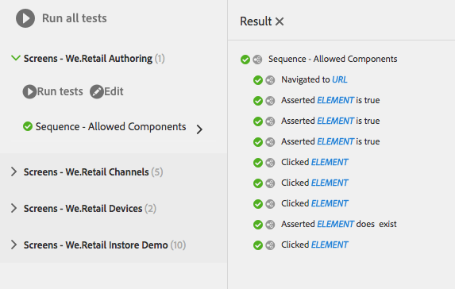

# 測試您的UI{#testing-your-ui}

>[!NOTE]
>
>從AEM 6.5開始，hobbes.js UI測試架構已過時。 Adobe不打算對它做進一步的增強，並建議客戶使用Selenium自動化。
>
>請參 [閱過時和移除的功能](/help/release-notes/deprecated-removed-features.md)。

AEM提供自動化AEM UI測試的架構。 使用架構，您可直接在網頁瀏覽器中編寫並執行UI測試。 架構提供建立測試的javascript API。

AEM測試架構使用Hobbes.js，此為以Javascript撰寫的測試程式庫。 Hobbes.js架構是做為開發程式的一部份，用於測試AEM。 此架構現已可供公開使用，以測試您的AEM應用程式。

>[!NOTE]
>
>如需API的完整詳細資 [訊](https://helpx.adobe.com/experience-manager/6-5/sites/developing/using/reference-materials/test-api/index.html) ，請參閱Hobbes.js檔案。

## 測試結構 {#structure-of-tests}

在AEM中使用自動測試時，下列術語很重要，請務必瞭解：

| 動作 | 「 **動作** 」是網頁上的特定活動，例如按一下連結或按鈕。 |
|---|---|
| 測試案例 | 「測 **試案例** 」是由一或多個「動作」組成的特定 **情況**。 |
| 測試套件 | 測 **試套裝** (Test Suite **** )是一組相關測試案例，可搭配測試特定使用案例。 |

## 執行測試 {#executing-tests}

### 檢視測試套裝 {#viewing-test-suites}

開啟測試主控台，以查看已註冊的測試套裝。 「測試」面板包含測試套裝及其測試案例的清單。

透過全域導覽->工 **具>作業->測試導覽至工具主控台**。


當開啟主控台時，測試套裝會列在左側，並提供依序執行所有測試套裝的選項。 右方空格以方格背景顯示，是在測試執行時顯示頁面內容的預留位置。


### 執行單一測試套裝 {#running-a-single-test-suite}

測試套裝可個別執行。 當您執行測試套裝時，頁面會隨著測試案例及其動作的執行而變更，結果會在測試完成後顯示。 圖示表示結果。

複選標籤圖示表示通過的測試：


「X」圖示表示測試失敗：


若要執行測試套裝：

1. 在「測試」面板中，按一下或點選您要執行的測試案例名稱，以展開動作的詳細資訊。

   

1. 按一下或點選「執 **行測試** 」按鈕。

   

1. 測試執行時，預留位置會以頁面內容取代。

   

1. 點選或按一下說明以開啟「結果」面板，以檢視「測試案例」 **結果** 。 點選或按一下「結果」面板中的「測試案例」 **名稱** ，會顯示所有詳細資訊。

   

### 執行多個測試 {#running-multiple-tests}

測試套裝會依其顯示在主控台中的順序執行。 您可以深入探究測試，以檢視詳細結果。


1. 在「測試」面板上，點選或按一下您要執行之「測試套裝」標題下方的「 **Run all tests** 」按鈕或「 **Run tests** 」按鈕。

   

1. 若要檢視每個測試案例的結果，請點選或按一下測試案例的標題。 點選或按一下「結果」面板中測試的名 **稱** ，會顯示所有詳細資訊。

   

## 建立和使用簡單的測試套裝 {#creating-and-using-a-simple-test-suite}

下列程式會逐步引導您使用 [We.Retail內容建立和執行測試套裝](/help/sites-developing/we-retail.md)，但您可輕鬆修改測試以使用不同的網頁。

如需建立您自己測試套裝的完整詳細資訊，請參 [閱Hobbes.js API檔案](https://helpx.adobe.com/experience-manager/6-5/sites/developing/using/reference-materials/test-api/index.html)。

1. 開啟CRXDE Lite。 ([https://localhost:4502/crx/de](https://localhost:4502/crx/de))
1. 在資料夾上按一 `/etc/clientlibs` 下滑鼠右鍵， **然後按一下「建立>建立資料夾**」。 鍵入 `myTests` 名稱，然後按一下「 **確定」**。
1. 按一下右鍵該檔案 `/etc/clientlibs/myTests` 夾，然後按一下 **建立>建立節點**。 使用下列屬性值，然後按一下「 **確定**」:

   * 名稱: `myFirstTest`
   * 類型: `cq:ClientLibraryFolder`

1. 將下列屬性新增至myFirstTest節點：

   | 名稱 | 類型 | 值 |
   |---|---|---|
   | `categories` | String[] | `granite.testing.hobbes.tests` |
   | `dependencies` | String[] | `granite.testing.hobbes.testrunner` |

   >[!NOTE]
   >
   >**僅限AEM Forms**
   >
   >
   >若要測試最適化表單，請將下列值新增至類別和相依性。 例如：
   >
   >
   >**類別**: `granite.testing.hobbes.tests, granite.testing.hobbes.af.commons`
   >
   >
   >**相依性**: `granite.testing.hobbes.testrunner, granite.testing.hobbes.af`

1. 按一下「 **全部儲存**」。
1. 按一下右鍵該節 `myFirstTest` 點，然後按一下 **建立>建立檔案**。 命名檔案，然 `js.txt` 後按一下 **確定**。
1. 在檔案 `js.txt` 中，輸入以下文本：

   ```
   #base=.
   myTestSuite.js
   ```

1. 按一 **下「全部儲存** 」，然後關閉 `js.txt` 檔案。
1. 按一下右鍵該節 `myFirstTest` 點，然後按一下 **建立>建立檔案**。 命名檔案，然 `myTestSuite.js` 後按一下 **確定**。
1. 將下列程式碼複製至 `myTestSuite.js` 檔案，然後儲存檔案：

   ```
   new hobs.TestSuite("Experience Content Test Suite", {path:"/etc/clientlibs/myTests/myFirstTest/myTestSuite.js"})
      .addTestCase(new hobs.TestCase("Navigate to Experience Content")
         .navigateTo("/content/we-retail/us/en/experience/arctic-surfing-in-lofoten.html")
      )
      .addTestCase(new hobs.TestCase("Hover Over Topnav")
         .mouseover("li.visible-xs")
      )
      .addTestCase(new hobs.TestCase("Click Topnav Link")
         .click("li.active a")
   );
   ```

1. 導覽至測 **試主控台** ，以試用您的測試套件。
