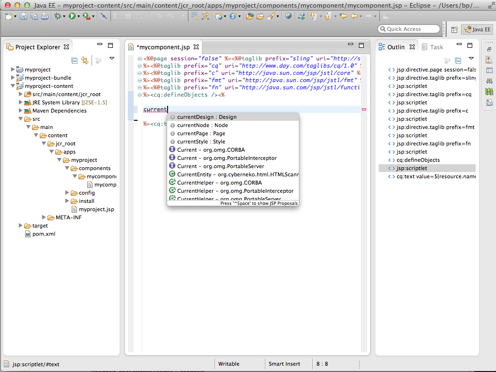

# 如何使用Eclipse開發AEM專案{#how-to-develop-aem-projects-using-eclipse}

本指南說明如何使用Eclipse開發以AEM為基礎的專案。

>[!NOTE]
>
>Adobe現在提供Eclipse適用的[AEM開發工具](/help/sites-developing/aem-eclipse.md)，可協助您使用Eclipse開發AEM解決方案。

## 概觀 {#overview}

若要開始在Eclipse上進行AEM開發，必須執行下列步驟。

在本How-To的其餘部分中會更詳細地說明其中每一項。

* 安裝Eclipse 4.3 (Kepler)
* 根據Maven設定您的AEM專案
* 在Maven POM中為Eclipse準備JSP支援
* 將Maven專案匯入Eclipse

>[!NOTE]
>
>本指南內容以Eclipse 4.3 (Kepler)和AEM 5.6.1為基礎。

## 安裝Eclipse {#install-eclipse}

從[Eclipse下載頁面](https://www.eclipse.org/downloads/)下載「適用於Java EE開發人員的Eclipse IDE」。

依照[安裝指示](https://wiki.eclipse.org/Eclipse/Installation)安裝Eclipse。

## 根據Maven設定您的AEM專案 {#set-up-your-aem-project-based-on-maven}

接下來，使用Maven設定您的專案，如[使用Apache Maven建置AEM專案的方法](/help/sites-developing/ht-projects-maven.md)中所述。

## 為Eclipse準備JSP支援 {#prepare-jsp-support-for-eclipse}

Eclipse也可支援使用JSP，例如

* 自動完成標籤程式庫
* 由&lt;cq：defineObjects />和&lt;sling：defineObjects />定義的物件的Eclipse感知

為了讓此功能發揮作用：

1. 遵循[使用Apache Maven建置AEM專案的方法](/help/sites-developing/ht-projects-maven.md)中[如何使用JSP](/help/sites-developing/ht-projects-maven.md#how-to-work-with-jsps)的指示。
1. 將下列專案新增至內容模組POM中的&lt;build />區段。

   Eclipse的Maven支援外掛程式m2e不提供maven-jspc-plugin的支援，此設定會告知m2e忽略外掛程式和清理暫時編譯結果的相關任務。

   這不是問題：如[如何使用JSP](/help/sites-developing/ht-projects-maven.md#how-to-work-with-jsps)中所述，此設定中的maven-jspc-plugin僅用於驗證JSP是否編譯為建置流程的一部分。 Eclipse已回報JSP中的任何問題，且不依賴此Maven外掛程式來完成。

   **myproject/content/pom.xml**

   ```xml
   <build>
     <!-- ... -->
     <pluginManagement>
       <plugins>
         <!--This plugin's configuration is used to store Eclipse m2e settings only. It has no influence on the Maven build itself.-->
         <plugin>
           <groupId>org.eclipse.m2e</groupId>
           <artifactId>lifecycle-mapping</artifactId>
           <version>1.0.0</version>
           <configuration>
             <lifecycleMappingMetadata>
               <pluginExecutions>
                 <pluginExecution>
                   <pluginExecutionFilter>
                     <groupId>org.apache.sling</groupId>
                     <artifactId>maven-jspc-plugin</artifactId>
                     <versionRange>[2.0.6,)</versionRange>
                     <goals>
                       <goal>jspc</goal>
                     </goals>
                   </pluginExecutionFilter>
                   <action>
                     <ignore/>
                   </action>
                 </pluginExecution>
                 <pluginExecution>
                   <pluginExecutionFilter>
                     <groupId>org.apache.maven.plugins</groupId>
                     <artifactId>maven-clean-plugin</artifactId>
                     <versionRange>[2.4.1,)</versionRange>
                     <goals>
                       <goal>clean</goal>
                     </goals>
                   </pluginExecutionFilter>
                   <action>
                     <ignore/>
                   </action>
                 </pluginExecution>
               </pluginExecutions>
             </lifecycleMappingMetadata>
           </configuration>
         </plugin>
       </plugins>
     </pluginManagement>
   </build>
   ```

### 將Maven專案匯入Eclipse {#import-the-maven-project-into-eclipse}

1. 在Eclipse中，選擇「檔案>匯入……」
1. 在「匯入」對話方塊中，選擇「Maven >現有Maven專案」，然後按一下「下一步」。

   

1. 輸入專案最上層資料夾的路徑，然後按一下「全選」和「完成」。

   

1. 現在您已準備好使用Eclipse來開發您的AEM專案，包括JSP自動完成。

   

   >[!NOTE]
   >
   >如果您在`/libs`中包含`/libs/foundation/global.jsp`或其他JSP，則必須將其複製到專案，讓Eclipse可以解析包含。 同時，您需要確保它沒有被Maven捆綁到您的內容套件中。 如何達成此目標在[如何使用Apache Maven建置AEM專案](/help/sites-developing/ht-projects-maven.md)中說明。
