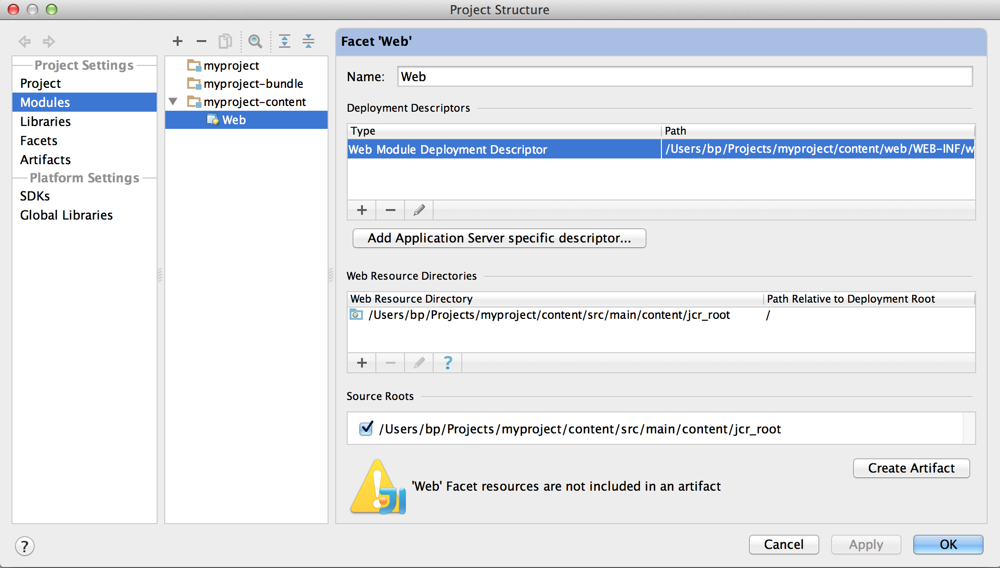

# 如何使用IntelliJ IDEA開發AEM專案{#how-to-develop-aem-projects-using-intellij-idea}

## 概覽 {#overview}

若要開始使用IntelliJ上的AEM開發，必須執行下列步驟。

在本「操作說明」的其餘章節中，將詳細說明每項說明。

* 安裝IntelliJ
* 根據Maven設定您的AEM專案
* 在Maven POM中準備IntelliJ的JSP支援
* 將Maven專案匯入IntelliJ

>[!NOTE]
>
>本指南以IntelliJ IDEA Ultimate Edition 12.1.4和AEM 5.6.1為基礎。

### 安裝IntelliJ IDEA {#install-intellij-idea}

從JetBrains的「下載」 [頁面下載IntelliJ IDEA](https://www.jetbrains.com/idea/download/index.html)。

然後，請依照該頁上的安裝指示進行。

### 根據Maven設定您的AEM專案 {#set-up-your-aem-project-based-on-maven}

接著，使用Maven來設定您的專案，如 [How-To Build AEM Projects using Apache Maven中所述](/help/sites-developing/ht-projects-maven.md)。

若要開始在IntelliJ IDEA中使用AEM專案，「5分鐘快速入 [門」中的基本設定就足夠](https://maven.apache.org/guides/getting-started/maven-in-five-minutes.html) 。

### 準備IntelliJ IDEA的JSP支援 {#prepare-jsp-support-for-intellij-idea}

此外，IntelliJ IDEA也可提供使用JSP的支援，例如

* 自動完成標籤庫
* 對以及 `<cq:defineObjects />``<sling:defineObjects />`

為了讓AEM發揮作用，請依照 [How-To Work with JSPs](/help/sites-developing/ht-projects-maven.md#how-to-work-with-jsps) [How-To Build AEM Projects using Apache Maven中的指示進行](/help/sites-developing/ht-projects-maven.md)。

### 匯入Maven專案 {#import-the-maven-project}

1. 在IntelliJ IDEA中 **開啟** 「匯入」對話方塊，方法為

   * 如果您 **尚未開啟任何專案** ，請在歡迎畫面上選取「匯入專案」
   * 從主 **菜單中選擇「檔案」->「導入項目** 」

1. 在「導入」對話框中，選擇項目的POM檔案。

   

1. 繼續使用下列對話方塊中顯示的預設設定。

   

1. 按一下「下一步」和「完成」，繼 **續進行** 下列 **對話方塊**。
1. 您現在已設定使用IntelliJ IDEA進行AEM開發

   

### 使用IntelliJ IDEA除錯JSP {#debugging-jsps-with-intellij-idea}

使用IntelliJ IDEA除錯JSP時，必須執行下列步驟

* 在專案中設定Web Facet
* 安裝JSR45支援外掛程式
* 設定除錯設定檔
* 設定AEM的除錯模式

#### 在專案中設定Web Facet {#set-up-a-web-facet-in-the-project}

IntelliJ IDEA需要瞭解在何處尋找JSP以進行除錯。 由於IDEA無法解 `content-package-maven-plugin` 譯設定，因此必須手動設定。

1. 轉至「 **檔案」->「項目結構」**
1. 選取「內 **容** 」模組
1. 按一下 **模組清單** 上方的+並選擇 **Web**
1. 作為Web資源目錄，選擇項 `content/src/main/content/jcr_root subdirectory` 目的，如下面螢幕抓圖所示。



#### 安裝JSR45支援外掛程式 {#install-the-jsr-support-plugin}

1. 前往IntelliJ IDEA **設定** 中的「外掛程式」窗格
1. 導覽至 **JSR45 Integration** Plugin，並選取其旁的核取方塊
1. 按一下「套 **用」**
1. 當要求重新啟動IntelliJ IDEA時，請


#### 設定除錯設定檔 {#configure-a-debug-profile}

1. 前往「執 **行->編輯設定」**
1. 按一下 **+** 並選擇 **JSR45 Remote**
1. 在「配置」對話框中，選 **擇「應用程式伺服器** 」旁 **的「配置** 」，並配置「一般」伺服器
1. 如果您想在開始除錯時開啟瀏覽器，請將開始頁面設為適當的URL
1. 如果您使 **用vlt autosync** ，請移除所有啟動前任務，如果您不使用vlt autosync，請移除適當的Maven任務
1. 在「啟 **動／連接** 」窗格上，根據需要調整埠
1. 複製IntelliJ IDEA所建議的命令行參數

 

#### 設定AEM的除錯模式 {#configure-aem-for-debug-mode}

最後一個必要步驟是使用IntelliJ IDEA建議的JVM選項來啟動AEM。

您可以直接啟動AEM jar檔案並新增這些選項，例如使用下列命令列：

`java -Xdebug -Xrunjdwp:transport=dt_socket,address=58242,suspend=n,server=y -Xmx1024m -XX:MaxPermSize=256M -jar cq-quickstart-5.6.1.jar`

您也可以將這些選項新增至您的開始指令碼，如 `crx-quickstart/bin/start` 下所示。

```shell
# ...

# default JVM options
if [ -z "$CQ_JVM_OPTS" ]; then
 CQ_JVM_OPTS='-server -Xmx1024m -XX:MaxPermSize=256M -Djava.awt.headless=true'
fi

CQ_JVM_OPTS="$CQ_JVM_OPTS -Xdebug -Xrunjdwp:transport=dt_socket,address=58242,suspend=n,server=y"

# ...
```

#### 開始除錯 {#start-debugging}

您現在都已設定好在AEM中除錯JSP。

1. 選擇 **運行->調試->調試配置檔案**
1. 在元件程式碼中設定中斷點
1. 在瀏覽器中存取頁面


### 使用IntelliJ IDEA除錯套件 {#debugging-bundles-with-intellij-idea}

使用標準的一般遠端除錯連線，可除錯組合中的程式碼。 您可依照 [Jetbrain說明檔案進行遠端除錯](https://www.jetbrains.com/idea/webhelp/run-debug-configuration-remote.html)。
